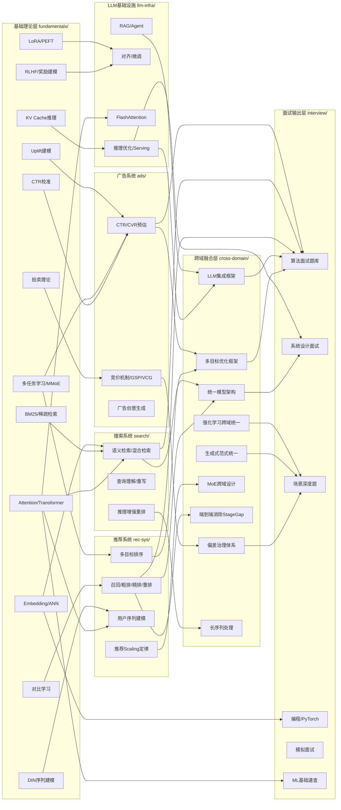

# 🎯 搜广推 & AI 算法工程师知识库

> 面向搜索、广告、推荐系统算法工程师的系统化学习知识库。
> 涵盖论文精读、工业实践、面试准备、项目案例。

## 📊 知识库统计

| 领域 | Papers | Practices | Synthesis | 合计 |
|------|--------|-----------|-----------|------|
| 🔍 搜索系统 | 63 | — | 12 | 75 |
| 📢 广告系统 | 76 | 2 | 15 | 93 |
| 🎯 推荐系统 | 64 | — | 26 | 90 |
| 🤖 LLM 基础设施 | — | — | 14 | 14 |
| 🔗 跨域综合 | — | — | 11 | 11 |
| **合计** | **203** | **2** | **78** | **283** |

**其他模块：**
- 🎤 面试准备：28 篇（题库 + 卡片 + 策略）
- 📝 简历项目：11 篇（35 个详细项目 + 30 个概要项目）
- 📈 技术演进：6 篇（召回→排序→多任务→LLM 全链路）
- 📚 开源项目：147 篇（GitHub 热门项目笔记）
- 🤖 Agent 研究：4 篇（上下文管理）

**总计：589 篇 Markdown 文档**（不含归档）

## 📁 目录结构

```
ai-kb/
│
├── 🔎 rec-search-ads/          搜广推大域（搜索 + 广告 + 推荐）
│   ├── ads/                    广告系统
│   │   ├── papers/             论文精读笔记（76 篇）
│   │   ├── practices/          工业实践案例（2 篇）
│   │   ├── synthesis/          总结框架（15 篇，含引用+公式+≥10 Q&A）
│   │   └── INDEX.md            领域导航
│   │
│   ├── rec-sys/                推荐系统
│   │   ├── papers/             论文精读笔记（64 篇）
│   │   ├── synthesis/          总结框架（26 篇）
│   │   └── INDEX.md
│   │
│   ├── search/                 搜索系统
│   │   ├── papers/             论文精读笔记（63 篇）
│   │   ├── synthesis/          总结框架（12 篇）
│   │   └── INDEX.md
│   │
│   ├── interview/              面试准备（题库 + 卡片 + 策略，28 篇）
│   │   ├── cards/              分层卡片库（L1-L5）
│   │   ├── synthesis/          面试策略总结
│   │   └── qa-bank.md          3000+ 行面试题库
│   │
│   └── resume/                 简历项目库（11 篇）
│       ├── 30_projects_portfolio.md
│       ├── project_1_*.md ~ project_5_*.md
│       └── daily_projects_*.md
│
├── 🤖 llm-agent/               LLM + Agent 大域
│   ├── llm-infra/              LLM 基础设施
│   │   ├── synthesis/          总结框架（14 篇）
│   │   └── INDEX.md
│   │
│   └── agent-context-management/  Agent 上下文管理研究（4 篇）
│
├── 🔗 cross-domain/            跨域综合（不动）
│   ├── synthesis/              总结框架（11 篇）
│   └── INDEX.md
│
├── 📚 unified/                 统一知识框架（不动）
│
├── 📐 fundamentals/            基础知识（不动）
│
├── 📈 tech-evolution/          技术演进脉络（6 篇，暂不移动）
│
├── 📚 repos/                   GitHub 项目笔记（147 篇）
│   └── notes/                  日期前缀项目笔记（55 篇）
│
├── 🔧 运维（不纳入版本控制）
│   ├── scripts/                重构脚本 + 自动学习脚本
│   ├── _data/                  运营数据（papers_queue、processed_log 等）
│   └── weekly/                 每日/周学习日报
│
├── 📋 _meta/                   内部元数据
│   └── _config/                分类规则 + 结构说明 + 学习配置
│
└── README.md                   本文件
```

## 🏗️ 两大域说明

### 搜广推大域 `rec-search-ads/`
搜索（search）、广告（ads）、推荐（rec-sys）三个核心业务方向，
加上面试准备（interview）和项目案例（resume）。
这三个方向在工业界高度耦合，共享召回→粗排→精排→重排的通用架构范式。

### LLM + Agent 大域 `llm-agent/`
LLM 基础设施（llm-infra）和 Agent 研究（agent-context-management）。
专注 LLM 推理优化、微调、部署，以及 Agent 系统设计与上下文管理。

## 🗺️ 知识图谱



## 🏗️ 知识架构

每个核心领域采用 **三层架构**：

```
Papers（学术论文笔记）
  │  记录单篇论文的核心方法、实验结论、工程要点
  ▼
Practices（工业实践案例）
  │  大厂落地经验：Google、Meta、字节、阿里
  ▼
Synthesis（提炼总结）
  │  多篇论文对比 + 演进脉络 + 公式推导
  │  📚 参考文献（可跳转链接到 papers/）
  │  📐 核心公式与原理（≥3 个）
  │  🎓 面试考点（≥10 个 Q&A）
  ▼
面试 & 项目
```

## 🔍 快速入门

### 按面试方向查找
- **CTR 预估** → `rec-search-ads/ads/synthesis/广告CTR_CVR预估与校准.md`
- **推荐排序** → `rec-search-ads/rec-sys/synthesis/推荐排序模型演进.md`
- **语义检索** → `rec-search-ads/search/synthesis/混合检索技术演进.md`
- **LLM 推理** → `llm-agent/llm-infra/synthesis/LLM推理优化完整版.md`
- **Agent 系统** → `llm-agent/agent-context-management/01-foundations.md`

### 按学习阶段使用
1. **速览全貌** → 各领域 `INDEX.md` + `_meta/_config/KNOWLEDGE_BASE_STRUCTURE.md`
2. **深入学习** → `synthesis/` 提炼总结（含公式推导）
3. **论文细节** → `papers/` 原始笔记
4. **面试冲刺** → `rec-search-ads/interview/qa-bank.md` + `rec-search-ads/interview/cards/`
5. **项目准备** → `rec-search-ads/resume/30_projects_portfolio.md`

## 📅 自动化

知识库由 [MelonEggLearn](https://github.com/BoyuXu) Agent 自动维护：

| 时间 | 任务 | 产出 |
|------|------|------|
| 08:45 | 队列构建 | papers_queue.jsonl |
| 09:00 | 并行学习（5 领域 ≥30 篇/天） | {domain}/papers/*.md |
| 14:00 | 深度整合 | {domain}/synthesis/*.md |
| 15:00 | 项目案例生成（10 个/天） | resume/daily_projects_*.md |
| 20:00 | 模拟面试（5 题/天） | interview/qa-bank.md |
| 22:00 | 周日知识地图 | weekly/ |
| 23:00 | 自动 git push | main branch |

## 📏 文档规范

详见 [CLASSIFICATION_RULES.md](_meta/_config/CLASSIFICATION_RULES.md)

- **Papers 文件名**：论文名英文 snake_case（`DIN_deep_interest_network.md`）
- **Synthesis 文件名**：中文标题（`广告CTR_CVR预估与校准.md`）
- **Synthesis 内容**：参考文献 + 公式≥3 + Q&A≥10
- **每次新增**：自动分类 + 更新 INDEX.md

## 📜 License

Private knowledge base. For personal study use only.
