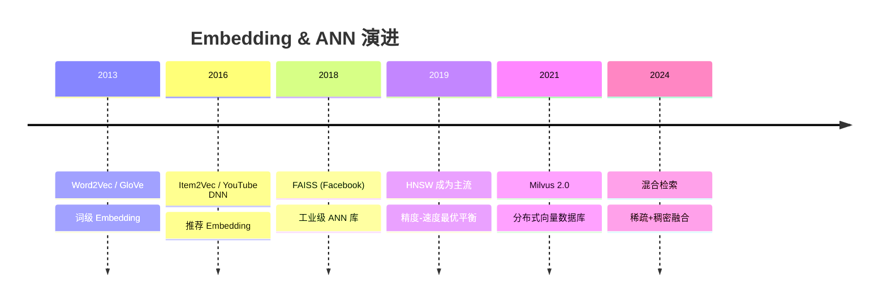

# Embedding 与近似最近邻检索：从向量化到工业级 ANN

> 标签：#embedding #ANN #HNSW #FAISS #双塔模型 #向量检索 #召回 #Milvus

---

## 🆚 检索方案创新对比

| 维度 | 倒排索引(BM25) | ANN 向量检索（创新） |
|------|--------------|-------------------|
| 表示方式 | 稀疏词袋 | **稠密 Embedding 向量** |
| 相似度 | 词频 TF-IDF | **余弦/内积 语义相似** |
| 语义理解 | 无（词级匹配） | **深度语义匹配** |
| 索引结构 | 倒排表 | **HNSW / IVF / PQ** |
| 检索复杂度 | O(查询词数) | **O(log N) 近似** |

---

## 📈 向量检索技术演进



---

## 1. Embedding 的数学基础

### 1.1 词嵌入：Word2Vec Skip-gram

**目标**：给定中心词 $w$，预测上下文词 $c$。

优化目标函数（负采样版本）：

$$
J = -\sum_{(w,c) \in D} \left[\log \sigma(v_w \cdot u_c) + k \cdot \mathbb{E}_{w' \sim P_n}[\log \sigma(-v_{w'} \cdot u_c)]\right]
$$

其中：
- $v_w \in \mathbb{R}^d$：中心词 $w$ 的嵌入向量
- $u_c \in \mathbb{R}^d$：上下文词 $c$ 的嵌入向量
- $\sigma(\cdot)$：sigmoid 函数
- $k$：负样本数（通常 5-20）
- $P_n(w) \propto f(w)^{3/4}$：负样本采样分布（频率的 3/4 次方，平衡高频低频词）

**梯度推导**：

$$
\frac{\partial J}{\partial v_w} = u_c(\sigma(v_w \cdot u_c) - 1) + k \sum_{w'} \sigma(v_{w'} \cdot u_c) \cdot u_{w'}
$$

第一项：正样本梯度，使 $v_w$ 与 $u_c$ 内积趋向 1（sigmoid 值为 1）
第二项：负样本梯度，使 $v_w$ 与负样本内积趋向 -∞（sigmoid 值为 0）

**为什么有效**：词语的语义相似性反映在共现统计中，相似语境的词映射到相近向量空间位置。"国王 - 男人 + 女人 ≈ 女王"这类线性关系是向量空间语义的体现。

### 1.2 对比学习 InfoNCE

InfoNCE Loss 是现代 Embedding 训练的核心目标：

$$
\mathcal{L}_{\text{InfoNCE}} = -\log \frac{\exp(q \cdot k^+ / \tau)}{\exp(q \cdot k^+ / \tau) + \sum_{i=1}^{N-1} \exp(q \cdot k_i^- / \tau)}
$$

- $q$：查询向量（如用户）
- $k^+$：正样本键向量（用户实际点击的物品）
- $k_i^-$：负样本键向量（未点击的物品）
- $\tau$：温度参数，控制分布的平滑程度

**与交叉熵的关系**：InfoNCE 可以理解为 1 个正类、N-1 个负类的多分类交叉熵损失。

**温度参数 $\tau$ 的影响**：
- $\tau \to 0$：损失变为 hard max，只关注最难的负样本
- $\tau \to \infty$：所有样本等权，失去区分能力
- 实践通常 $\tau = 0.05 \sim 0.1$

### 1.3 Embedding 质量评估

```python
# 评估 Embedding 质量的常用指标

def evaluate_embedding(embeddings, labels):
    """
    embeddings: (N, d) 所有样本的向量
    labels: (N,) 类别标签
    """
    from sklearn.metrics import pairwise_distances
    import numpy as np
    
    # 1. 类内距离（越小越好）
    intra_class_dist = []
    for label in np.unique(labels):
        mask = labels == label
        if mask.sum() > 1:
            dists = pairwise_distances(embeddings[mask])
            intra_class_dist.append(np.mean(dists[np.triu_indices_from(dists, k=1)]))
    
    # 2. 类间距离（越大越好）
    inter_class_dist = pairwise_distances(
        [embeddings[labels == l].mean(0) for l in np.unique(labels)]
    ).mean()
    
    # 3. 分离性：类间距 / 类内距
    separability = inter_class_dist / np.mean(intra_class_dist)
    return separability
```

---

## 2. 双塔模型（广告/推荐标配）

### 2.1 模型结构

双塔（Two-Tower）模型是召回阶段的工业标配，分别为用户和物品建立独立的编码器：

```
用户侧特征 → 用户塔（多层MLP）→ 用户向量 u ∈ R^d
                                              ↘
                                            相似度计算 → 排序
                                              ↗
物品侧特征 → 物品塔（多层MLP）→ 物品向量 v ∈ R^d
```

**关键约束**：用户侧和物品侧必须**独立编码**（不能有 Cross Attention），这样物品 embedding 可以预先计算并索引，在线只需要实时计算用户 embedding，然后做 ANN 检索。

### 2.2 训练目标对比

**BPR Loss（Bayesian Personalized Ranking）**：

$$
\mathcal{L}_{BPR} = -\sum_{(u,i,j)} \log \sigma(s_{ui} - s_{uj})
$$

- $s_{ui}$：用户 u 与正样本 i 的相似度
- $s_{uj}$：用户 u 与负样本 j 的相似度
- 只关注相对顺序，不限制绝对值

**Sampled Softmax（大规模推荐标配）**：

$$
\mathcal{L}_{SS} = -\log \frac{\exp(u \cdot v^+ / \tau)}{\sum_{v' \in \mathcal{V}'} \exp(u \cdot v' / \tau)}
$$

- $\mathcal{V}'$：采样的负样本集合（子集，而非全量物品库）
- 支持大规模训练，通过调整采样数量控制训练速度

**InfoNCE（对比学习版 Sampled Softmax）**：
- 与 Sampled Softmax 相同，但明确了温度参数的含义
- 理论联系：InfoNCE 是互信息的下界，最大化 InfoNCE 相当于最大化用户-物品之间的互信息

### 2.3 负样本采样策略

| 策略 | 描述 | 优点 | 缺点 |
|------|------|------|------|
| 随机负样本 | 从全量物品库随机采样 | 简单高效 | 大量简单负样本，训练效果有限 |
| In-batch 负样本 | 同 batch 内其他用户的正样本 | 零额外开销 | 存在假负样本（热门物品）|
| 难负样本（Hard Negative）| 用户不点击但高度相关的物品 | 显著提升 Embedding 质量 | 需要额外检索步骤 |
| 混合策略 | 随机 + 难负样本 | 平衡效率与效果 | 需要调比例 |

**难负样本构建**：
```python
def mine_hard_negatives(user_emb, item_embs, positive_idx, top_k=100, hard_k=10):
    """
    user_emb: 用户向量 (d,)
    item_embs: 物品向量矩阵 (N, d)
    positive_idx: 正样本索引
    返回：hard negative 索引列表
    """
    # 计算相似度，找 Top-K
    scores = item_embs @ user_emb
    top_k_idx = scores.argsort()[-top_k-1:][::-1]
    
    # 排除正样本，取前 hard_k 个作为难负样本
    hard_negatives = [idx for idx in top_k_idx if idx != positive_idx][:hard_k]
    return hard_negatives
```

---

## 3. HNSW 算法详解

### 3.1 跳表的层次结构

HNSW（Hierarchical Navigable Small World）是目前最常用的 ANN 算法，基于两个核心思想：

1. **NSW（可导航小世界图）**：在图中加长距离边，使平均路径长度为 $O(\log n)$
2. **层次化（Hierarchical）**：构建多层图，高层稀疏（用于快速定位），低层密集（用于精确搜索）

```
层 3（最稀疏）：  A ———————————— D
层 2：           A — B ————— D
层 1：           A — B — C — D  
层 0（最密集）：  A - B - C - D - E - F（及其所有近邻连接）
```

### 3.2 构建过程

```python
def hnsw_insert(graph, new_point, M=16, ef_construction=200):
    """
    M: 每个节点最多连接数（层0为2M）
    ef_construction: 构建时的候选集大小
    """
    # 1. 随机决定该点出现在哪些层
    max_layer = int(-math.log(random.uniform(0, 1)) * (1.0 / math.log(M)))
    
    # 2. 从最高层开始，贪心搜索到每层的入口点
    entry_point = graph.entry_point
    for layer in range(graph.max_layer, max_layer + 1, -1):
        entry_point = graph.greedy_search(new_point, entry_point, layer, ef=1)
    
    # 3. 从 max_layer 到层0，在每层做精确搜索并建立连接
    for layer in range(min(max_layer, graph.max_layer), -1, -1):
        candidates = graph.search_layer(new_point, entry_point, ef=ef_construction, layer=layer)
        # 选择 M 个最近邻建立双向连接
        neighbors = select_neighbors(candidates, M=M)
        graph.connect(new_point, neighbors, layer)
        # 更新入口点
        entry_point = neighbors[0]
```

### 3.3 检索过程

```python
def hnsw_search(graph, query, k=10, ef_search=50):
    """
    ef_search: 搜索候选集大小（越大精度越高但越慢）
    """
    entry_point = graph.entry_point
    
    # 高层：贪心搜索，快速定位
    for layer in range(graph.max_layer, 0, -1):
        entry_point = graph.greedy_search(query, entry_point, layer, ef=1)
    
    # 第0层：精确候选搜索
    candidates = graph.search_layer(query, entry_point, ef=ef_search, layer=0)
    
    # 返回 Top-k
    return sorted(candidates, key=lambda x: distance(query, x))[:k]
```

### 3.4 参数选择与精度-速度权衡

| 参数 | 含义 | 推荐范围 | 影响 |
|------|------|---------|------|
| M | 每节点连接数 | 16-48 | M 大→精度高，内存多，构建慢 |
| ef_construction | 构建时候选集 | 100-500 | 越大→构建质量高，构建慢 |
| ef_search | 搜索时候选集 | 50-200 | 越大→召回高，搜索慢 |

**典型配置**（针对百万量级，目标 recall@10 > 95%）：
```python
import faiss

d = 128  # 向量维度
M = 32
ef_construction = 200

index = faiss.IndexHNSWFlat(d, M)
index.hnsw.efConstruction = ef_construction
index.add(data)  # 构建索引

index.hnsw.efSearch = 100  # 查询时设置
D, I = index.search(queries, k=10)  # recall 约 97%
```

---

## 4. IVF（倒排文件）索引

### 4.1 构建原理

**核心思想**：用 k-means 将向量空间划分为 $n_{list}$ 个 Voronoi 单元（cluster），检索时只搜索查询最近的几个 cluster。

**构建步骤**：
1. 对所有向量运行 k-means，得到 $n_{list}$ 个聚类中心
2. 将每个向量分配到最近的聚类中心，建立倒排列表

**构建参数建议**：$n_{list} \approx 4\sqrt{N}$（N 为向量总数）

### 4.2 检索过程

```python
# 检索时只访问最近的 nprobe 个 cluster
index.nprobe = 32  # 默认 1，建议设为 sqrt(n_list)
D, I = index.search(queries, k=10)
```

**recall vs nprobe**：

| nprobe | Recall@10 | QPS |
|--------|-----------|-----|
| 1 | ~60% | 最高 |
| 8 | ~85% | 高 |
| 32 | ~95% | 中 |
| 128 | ~99% | 低 |

### 4.3 IVF_PQ：乘积量化压缩内存

**问题**：亿级向量，每个 float32 维度为 128，总内存 = 1亿 × 128 × 4 bytes = 51GB，难以放入 GPU 内存。

**乘积量化（Product Quantization）**：
1. 将 128 维向量分成 $M$ 个子向量（如 8 个 16 维子向量）
2. 对每个子空间独立训练 $k=256$ 个聚类中心（共 $M \times k$ 个中心）
3. 每个子向量用聚类索引（1 byte）表示

**压缩效果**：128 dim × 4 bytes = 512 bytes → 8 bytes（压缩 64×），损失约 2-3% 召回。

```python
# IVF_PQ 示例
d, n_list, M, nbits = 128, 1024, 8, 8
index = faiss.IndexIVFPQ(quantizer, d, n_list, M, nbits)
index.train(train_data)
index.add(data)
```

---

## 5. 工业规模 ANN 系统设计

### 5.1 规模分级方案

**百万级（<500万向量）**：
- 单机 HNSW（Faiss）
- 内存：500万 × 128 × 4 = 2.5GB，单机可承受
- 查询延迟：< 5ms，QPS > 5000

**千万级（500万-1亿）**：
- 分片 + Milvus 集群（每分片约 500 万）
- 每分片独立 HNSW 索引
- 聚合层合并各分片 Top-K 结果
- 总 QPS：分片数 × 单分片 QPS

**亿级（> 1亿）**：
- IVF_PQ + GPU（Faiss GPU 版本）
- A100 GPU 上 IVF_PQ 可处理 10亿向量，QPS > 10万
- 精度损失约 2-5%，可用 Re-ranking 补偿

### 5.2 Milvus 集群架构

```
                    ┌─────────────┐
Client ──────────── │ Load Balancer │
                    └──────┬──────┘
                           │
              ┌────────────┼────────────┐
              ▼            ▼            ▼
         Proxy 1       Proxy 2       Proxy 3
              │            │            │
         ┌────┴────────────┴────────────┴────┐
         │              MQ (Pulsar)           │
         └────────────────┬───────────────────┘
                          │
         ┌────────────────┼───────────────┐
         ▼                ▼               ▼
    QueryNode 1      QueryNode 2     QueryNode 3
    (Shard 1/3)      (Shard 2/3)     (Shard 3/3)
```

### 5.3 在线服务的工程要点

```python
class ANNService:
    def __init__(self):
        self.index = self.load_index()  # 预加载索引到内存
        self.item_cache = {}  # 索引ID -> 物品信息映射
    
    def search(self, user_embedding, k=200, ef_search=100):
        # 1. 粗召回：ANN 检索
        self.index.hnsw.efSearch = ef_search
        distances, indices = self.index.search(
            user_embedding.reshape(1, -1), k
        )
        
        # 2. 过滤（已曝光、下架等业务逻辑）
        valid_items = [
            self.item_cache[idx] for idx in indices[0]
            if idx in self.item_cache and self.item_cache[idx].is_valid()
        ]
        
        # 3. 返回召回结果供精排
        return valid_items[:100]
```

---

## 6. 面试考点

### Q1：HNSW 为什么比 KD-Tree 更适合高维向量？

KD-Tree 在高维空间（>20维）遭受"维度诅咒"：查询时需要回溯大量节点，时间复杂度退化到近似线性。HNSW 通过图结构的局部性原理，在高维空间仍能保持 $O(\log n)$ 的搜索复杂度，且召回率稳定在 95%+ 以上。实测 128 维向量，HNSW 比 KD-Tree 快 10-100×。

### Q2：IVF 索引的 nprobe 如何设置？

理论上，nprobe = $n_{list}$（检索所有 cluster）等价于暴力搜索，召回 100%。实践中 nprobe 是精度与速度的权衡旋钮：先确定业务对召回率的要求（如 recall@10 > 95%），然后在验证集上搜索最小的 nprobe 值满足该要求。一般 nprobe = 10% 的 $n_{list}$ 可以达到 90%+ 召回。

### Q3：双塔模型为什么不能在用户塔和物品塔之间加交叉注意力？

如果有 Cross Attention，则物品的表示依赖于具体的用户输入，无法预计算物品 embedding，每次请求都需要对全量物品库重新计算（不可行）。双塔模型的核心设计原则是"离线计算物品 embedding → ANN 索引 → 在线只算用户 embedding"，Cross Attention 打破了这个前提。需要精细交互时，可以在召回后的精排阶段使用 Cross Attention。

### Q4：负样本采样偏差（Sampling Bias）如何修正？

In-batch 负采样会产生流行度偏差：热门物品作为负样本的概率更高，模型会倾向于压制热门物品得分，导致推荐多样性下降。修正方法：对负样本得分减去其采样概率的对数：$s_{neg} = s_{neg} - \log p(item)$。这等价于对 softmax 分母中的每个负样本除以其采样概率，修正了采样不均匀导致的偏差（Sampled Softmax Correction）。

### Q5：乘积量化（PQ）如何在压缩精度间权衡？

控制 M（子空间数量）和 nbits（每子空间的 bit 数）：M 越大或 nbits 越大，精度越高但压缩率越低。表中心数 = $2^{nbits}$，常用 nbits=8（256个中心）。典型配置：d=128，M=8，nbits=8 → 压缩 64×，召回损失约 2-3%。精度损失可以通过后处理（Re-ranking：用精确距离对 Top-K 重排）弥补。

### Q6：向量数据库和传统数据库有什么本质区别？

传统数据库（MySQL等）基于精确匹配和范围查询，$O(\log n)$ B-Tree 索引，不支持语义相似性搜索。向量数据库（Milvus、Pinecone等）基于近似最近邻，核心是 ANN 索引，牺牲精确性换取速度，支持在高维空间中的语义检索。两者互补：向量数据库提供召回候选，传统数据库提供元数据过滤（如只检索某类目的商品）。

### Q7：Embedding 维度怎么选？（另见 contrastive_learning.md Q4）

维度是表达能力与计算开销的权衡。经验规律：词量/物品量的对数值。如 100 万物品推荐 embedding 维度通常 64-256；BERT 类语言模型 768 维；图像 CLIP embedding 512-1024 维。维度太小：表达能力不足，召回精度低；维度太大：ANN 索引内存爆炸，且高维向量距离集中化现象更严重。实践建议 128-256 维作为起点。

### Q8：HNSW 构建时间和搜索时间如何分析？

构建时间：$O(n \log n)$，因为每个点插入需要搜索 $O(\log n)$ 层，每层搜索 $O(\log n)$。实测每秒约可插入 5-10 万个 128 维向量。搜索时间：$O(\log n)$ 理论复杂度，实测在 M=32，ef_search=100 时，百万向量单次查询约 0.1-1ms。预热很重要：HNSW 对缓存敏感，冷启动时每次查询需大量随机内存访问，延迟可能高 10×。

---

## 参考资料

- Mikolov et al. "Distributed Representations of Words and Phrases" (Word2Vec, 2013)
- Malkov & Yashunin. "Efficient and Robust Approximate Nearest Neighbor Search Using HNSW" (2018)
- Johnson et al. "Billion-scale similarity search with GPUs" (Faiss, 2017)
- Yi et al. "Sampling-Bias-Corrected Neural Modeling for Large Corpus Item Recommendations" (2019)
- Jégou et al. "Product Quantization for Nearest Neighbor Search" (2011)

## 🃏 面试速查卡

**记忆法**：ANN 检索像"在巨大图书馆找书"——HNSW 是"多层楼梯导航"（高层看大方向，底层精确找），IVF 是"先按区域分类再区域内搜索"（k-means 聚类），PQ 是"把长编码拆成短片段压缩"（乘积量化）。双塔模型就是"用户和物品各写一份简历，简历相似就匹配"。

**核心考点**：
1. HNSW 为什么比 KD-Tree 适合高维向量？（图结构克服维度诅咒，O(log n) 稳定搜索）
2. 双塔模型为什么不能加 Cross Attention？（物品 embedding 需预计算+索引，交叉注意力破坏独立编码前提）
3. IVF 的 nprobe 如何影响召回率？（nprobe 越大召回越高但越慢，通常设为 10% × n_list）
4. 乘积量化 PQ 的压缩原理和参数选择？（分子空间独立量化，M=8 nbits=8 压缩 64 倍）
5. In-batch 负采样的流行度偏差如何修正？（减去 log p(item) 修正采样不均匀）

**代码片段**：
```python
import numpy as np

# 简易 HNSW 检索演示 (使用 faiss)
try:
    import faiss
    d, n = 64, 10000
    data = np.random.randn(n, d).astype('float32')
    index = faiss.IndexHNSWFlat(d, 32)  # M=32
    index.hnsw.efConstruction = 200
    index.add(data)
    index.hnsw.efSearch = 64
    query = np.random.randn(1, d).astype('float32')
    distances, indices = index.search(query, k=5)
    print(f"Top-5 neighbors: {indices[0]}, distances: {distances[0].round(2)}")
except ImportError:
    print("Install faiss-cpu: pip install faiss-cpu")
```

**常见踩坑**：
1. 混淆 ef_construction 和 ef_search——前者影响构建质量，后者影响查询精度，调错方向不起效
2. 忘记 HNSW 的冷启动延迟问题——首次查询需大量随机内存访问，预热后才能达到标称性能
3. 认为向量维度越高越好——高维距离集中化使区分性下降，128-256 维通常是最优区间
