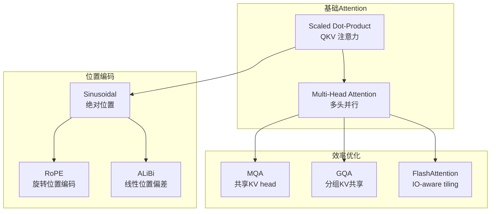

# Attention 与 Transformer：从 Query-Key-Value 到多头注意力

> 标签：#attention #transformer #self-attention #multi-head #positional-encoding #flash-attention #搜广推

---

## 🆚 创新点 vs 之前方案

| 维度 | RNN/LSTM | Transformer（创新） |
|------|---------|-------------------|
| 并行性 | 串行计算，无法并行 | **Self-Attention 完全并行** |
| 长距离依赖 | 梯度消失/爆炸 | **O(1) 直接连接任意位置** |
| 计算复杂度 | $O(n \cdot d^2)$ | $O(n^2 \cdot d)$（可优化） |
| 位置信息 | 隐式（序列顺序） | **显式位置编码**（Sinusoidal/RoPE） |
| 多层堆叠 | 梯度传播困难 | **残差连接 + LayerNorm** |

---

## 📈 Attention 架构演进



---

## 1. Scaled Dot-Product Attention 完整推导

### 1.1 基本形式

给定查询矩阵 $Q \in \mathbb{R}^{n \times d_k}$，键矩阵 $K \in \mathbb{R}^{m \times d_k}$，值矩阵 $V \in \mathbb{R}^{m \times d_v}$，注意力输出为：

$$
\text{Attention}(Q, K, V) = \text{softmax}\left(\frac{QK^T}{\sqrt{d_k}}\right)V
$$

### 1.2 为什么除以 $\sqrt{d_k}$：点积方差分析

**问题起源**：若 Q、K 的每个分量均服从均值 0、方差 1 的独立分布，则点积 $q \cdot k = \sum_{i=1}^{d_k} q_i k_i$ 满足：

$$
\mathbb{E}[q \cdot k] = \sum_i \mathbb{E}[q_i]\mathbb{E}[k_i] = 0, \quad
\text{Var}[q \cdot k] = \sum_i \text{Var}[q_i]\text{Var}[k_i] = d_k
$$

因此标准差为 $\sqrt{d_k}$，当 $d_k$ 较大（如 512），点积值域会很大。

**Softmax 饱和问题**：若点积值过大，softmax 会将大部分概率集中在最大值上：

$$
\text{softmax}(x_i) = \frac{e^{x_i}}{\sum_j e^{x_j}} \approx
\begin{cases}
1 & x_i \gg x_j \\
0 & \text{otherwise}
\end{cases}
$$

这导致梯度趋近于 0，训练困难。

**解决方案**：除以 $\sqrt{d_k}$ 将点积方差归一化为 1，避免 softmax 饱和：

$$
\text{Var}\left[\frac{q \cdot k}{\sqrt{d_k}}\right] = \frac{d_k}{d_k} = 1
$$

### 1.3 Q、K、V 的几何含义

- **Query（查询）**：当前位置"想问什么"，代表当前 token 的查询需求
- **Key（键）**：每个位置"我是什么"，代表该 token 对外展示的索引特征
- **Value（值）**：每个位置"我有什么内容"，实际被聚合的信息

直觉：$QK^T$ 计算查询与每个键的相似度（注意力分数），softmax 归一化后作为权重，对 V 做加权求和。

### 1.4 逐步计算过程

```python
import torch
import torch.nn.functional as F
import math

def scaled_dot_product_attention(Q, K, V, mask=None):
    """
    Q: (batch, heads, seq_q, d_k)
    K: (batch, heads, seq_k, d_k)
    V: (batch, heads, seq_k, d_v)
    """
    d_k = Q.size(-1)
    
    # Step 1: 计算注意力分数 (batch, heads, seq_q, seq_k)
    scores = torch.matmul(Q, K.transpose(-2, -1)) / math.sqrt(d_k)
    
    # Step 2: 可选 mask（decoder 中防止看到未来信息）
    if mask is not None:
        scores = scores.masked_fill(mask == 0, float('-inf'))
    
    # Step 3: softmax 归一化
    attn_weights = F.softmax(scores, dim=-1)
    
    # Step 4: 加权求和得到输出
    output = torch.matmul(attn_weights, V)
    
    return output, attn_weights
```

### 1.5 计算复杂度分析

- $QK^T$：$O(n^2 d_k)$（n 为序列长度）
- Softmax：$O(n^2)$
- 与 V 相乘：$O(n^2 d_v)$
- **总体**：$O(n^2 d)$，序列越长，开销呈平方增长

这是 Transformer 在长序列场景的核心瓶颈，也是 Flash Attention 和稀疏注意力要解决的问题。

---

## 2. Multi-Head Attention

### 2.1 核心公式

$$
\text{MultiHead}(Q,K,V) = \text{Concat}(\text{head}}_{\text{1, \ldots, \text{head}}_h) W^O
$$

$$
\text{head}}_{\text{i = \text{Attention}}(QW_i^Q,\ KW_i^K,\ VW_i^V)
$$

其中：
- $W_i^Q \in \mathbb{R}^{d_{model} \times d_k}$，将 Q 投影到第 i 个子空间
- $W_i^K \in \mathbb{R}^{d_{model} \times d_k}$，将 K 投影到第 i 个子空间
- $W_i^V \in \mathbb{R}^{d_{model} \times d_v}$，将 V 投影到第 i 个子空间
- $W^O \in \mathbb{R}^{hd_v \times d_{model}}$，将拼接结果投影回原维度

通常 $d_k = d_v = d_{model}/h$，保持总计算量不变。

### 2.2 为什么需要多头

**直觉**：单头注意力将所有信息压缩在一个子空间，不同头可以学习捕获不同类型的关系：

- Head 1：可能学习语法依存关系（主语-谓语）
- Head 2：可能学习长距离指代关系（it → 前文名词）
- Head 3：可能学习局部语义关系（形容词-名词）
- Head 4：可能学习位置关系（相邻词的交互）

多头相当于在不同表示子空间中并行执行注意力，然后合并结果，增强了模型的表达能力。

### 2.3 h=8 时参数量计算

以 $d_{model} = 512$，$h = 8$ 为例：

- $d_k = d_v = 512/8 = 64$
- 每个头的投影矩阵：$W_i^Q, W_i^K, W_i^V$ 各 $512 \times 64 = 32768$ 参数
- 8 个头共：$8 \times 3 \times 32768 = 786432$ 参数
- 输出投影 $W^O$：$512 \times 512 = 262144$ 参数
- **Multi-Head Attention 总参数**：$786432 + 262144 = 1048576 \approx 1M$

```python
class MultiHeadAttention(torch.nn.Module):
    def __init__(self, d_model, num_heads):
        super().__init__()
        assert d_model % num_heads == 0
        self.d_k = d_model // num_heads
        self.num_heads = num_heads
        
        self.W_q = torch.nn.Linear(d_model, d_model)
        self.W_k = torch.nn.Linear(d_model, d_model)
        self.W_v = torch.nn.Linear(d_model, d_model)
        self.W_o = torch.nn.Linear(d_model, d_model)
    
    def forward(self, Q, K, V, mask=None):
        batch = Q.size(0)
        
        # 线性投影并分头 (batch, seq, d_model) -> (batch, heads, seq, d_k)
        Q = self.W_q(Q).view(batch, -1, self.num_heads, self.d_k).transpose(1, 2)
        K = self.W_k(K).view(batch, -1, self.num_heads, self.d_k).transpose(1, 2)
        V = self.W_v(V).view(batch, -1, self.num_heads, self.d_k).transpose(1, 2)
        
        # 计算注意力
        x, attn = scaled_dot_product_attention(Q, K, V, mask)
        
        # 拼接并输出投影 (batch, seq, d_model)
        x = x.transpose(1, 2).contiguous().view(batch, -1, self.num_heads * self.d_k)
        return self.W_o(x)
```

### 2.4 MHA vs MQA vs GQA 对比

| 方案 | 描述 | KV Cache 大小 | 效果 | 代表模型 |
|------|------|--------------|------|---------|
| MHA | 每头独立 Q/K/V | $h \times d_{kv}$ | 最好 | BERT, GPT-2 |
| MQA | 所有头共享一组 K/V | $1 \times d_{kv}$ | 稍差 | PaLM, Falcon |
| GQA | G 组共享 K/V，G < h | $G \times d_{kv}$ | 接近 MHA | LLaMA-2, Mistral |

**GQA 原理**：将 h 个头分成 G 组，每组内的头共享同一组 K/V 投影。既减少 KV Cache 内存，又保留较好的表达能力。

---

## 3. 位置编码

### 3.1 为什么需要位置编码

Attention 是集合操作，对顺序无感知：将输入序列任意打乱，得到相同输出。位置编码将位置信息注入 token 表示中。

### 3.2 正弦位置编码

原始 Transformer 使用固定正弦位置编码：

$$
PE_{(pos, 2i)} = \sin\left(\frac{pos}{10000^{2i/d_{model}}}\right)
$$

$$
PE_{(pos, 2i+1)} = \cos\left(\frac{pos}{10000^{2i/d_{model}}}\right)
$$

其中 $pos$ 是位置，$i$ 是维度索引。

**为什么能表示相对位置**：由三角函数积化和差公式，任意固定偏移量 $k$ 的位置编码可以表示为当前位置编码的线性变换：

$$
\begin{pmatrix} \sin(pos+k) \\ \cos(pos+k) \end{pmatrix} = \begin{pmatrix} \cos k & \sin k \\ -\sin k & \cos k \end{pmatrix} \begin{pmatrix} \sin(pos) \\ \cos(pos) \end{pmatrix}
$$

这意味着相对位置关系被编码在了旋转矩阵中，模型可以通过点积学习到相对位置。

### 3.3 RoPE（旋转位置编码）

RoPE 是现代 LLM（LLaMA、GPT-NeoX）的主流方案：

**核心思想**：不是把位置编码加到 token embedding 上，而是直接旋转 Q、K 向量：

$$
\mathbf{q}_m = R_{\Theta, m} \mathbf{q}
$$

$$
\mathbf{k}_n = R_{\Theta, n} \mathbf{k}
$$

其中 $R_{\Theta, m}$ 是位置 $m$ 对应的旋转矩阵（块对角矩阵，每对维度旋转 $m\theta_i$）。

**优势**：内积 $\mathbf{q}_m^T \mathbf{k}_n$ 只依赖相对位置 $(m-n)$，天然支持任意长度推理，外推性好。

```python
def apply_rope(x, cos, sin, position_ids):
    """
    x: (batch, seq, heads, d_head)
    cos, sin: (seq, d_head/2) 预计算的旋转系数
    """
    # 将向量分成两半，分别作为旋转的实部和虚部
    x1, x2 = x[..., :x.shape[-1]//2], x[..., x.shape[-1]//2:]
    # 旋转操作：等价于复数乘法
    rotated = torch.cat([-x2, x1], dim=-1)
    return x * cos + rotated * sin
```

---

## 4. Flash Attention 原理

### 4.1 标准注意力的 IO 瓶颈

GPU 的内存层次：
- HBM（高带宽内存，~80GB）：带宽约 2TB/s，但延迟高
- SRAM（片上缓存，~20MB）：带宽约 20TB/s，延迟极低

标准注意力需要将 $n \times n$ 的注意力矩阵写回 HBM，对于序列长 n=4096，该矩阵大小为 $4096^2 \times 4$ bytes = 64MB，反复读写 HBM 成为瓶颈。

### 4.2 Tiling 分块计算方案

Flash Attention 的核心思想：**不物化完整的注意力矩阵，在 SRAM 内完成分块计算**。

算法步骤：

1. 将 Q 分成 $T_r$ 块，K/V 分成 $T_c$ 块，每块大小适合放入 SRAM
2. 外层循环遍历 K/V 块，内层遍历 Q 块
3. 对每对 (Q 块, K/V 块) 在 SRAM 中计算局部注意力
4. 使用在线 softmax（online softmax）技巧，增量更新全局 softmax 归一化因子

**在线 softmax 技巧**：维护当前最大值 $m$ 和归一化因子 $l$，每次处理新块时更新：

$$
m_{new} = \max(m_{old}, \text{rowmax}(\text{new block}))
$$

$$
l_{new} = e^{m_{old} - m_{new}} l_{old} + \text{rowsum}(e^{S - m_{new}})
$$

### 4.3 内存从 $O(n^2)$ 降至 $O(n)$

- **标准注意力**：需要存储 $n \times n$ 注意力矩阵，内存 $O(n^2)$
- **Flash Attention**：只在 SRAM 中处理分块，HBM 只存储输出 $O(n)$
- **速度提升**：减少 HBM 读写次数，实测 2-4× 加速

| 版本 | 特性 | 相对加速 |
|------|------|---------|
| Flash Attention v1 | 基础分块 | 2-4× |
| Flash Attention v2 | 减少非矩阵乘法运算，更好并行 | 4-8× |
| Flash Attention v3 | 利用 H100 异步特性 | 8-16× |

---

## 5. 在搜广推中的应用

### 5.1 DIN 中的注意力机制

DIN（Deep Interest Network，阿里巴巴 2018）的核心是：**用目标广告的 embedding 对用户历史行为序列做注意力加权**。

传统做法（Pooling）：$e_u = \frac{1}{L}\sum_{i=1}^L e_i$，所有历史行为等权，无法区分相关性。

DIN 做法：

$$
e_u = \sum_{i=1}^L a(e_i, e_{ad}) \cdot e_i
$$

注意力权重通过一个小 MLP 计算：

$$
a(e_i, e_{ad}) = \text{MLP}([e_i, e_{ad}, e_i - e_{ad}, e_i \odot e_{ad}])
$$

- $e_i - e_{ad}$：差异向量，捕获不同点
- $e_i \odot e_{ad}$：Hadamard 积，捕获共同点

**与 Transformer 注意力的区别**：DIN 的 Q 是目标广告（单一向量），K/V 是历史行为序列，且不使用 softmax（不要求权重和为 1），权重直接由 sigmoid 输出。

### 5.2 与传统 MLP 的对比

| 方案 | 用户历史表示 | 参数量 | 效果 |
|------|------------|--------|------|
| Sum Pooling | 均匀求和，忽略相关性 | 少 | 差 |
| Attention Pooling（DIN）| 目标广告加权，关注相关历史 | 中 | 好 |
| Self-Attention | 全序列交互 | 多 | 更好 |

### 5.3 Cross Attention 在多模态广告中的应用

在图文广告质量评估中，Cross Attention 用于对齐图像和文本：

- Q：来自文本 encoder 的 token 表示
- K、V：来自图像 encoder 的 patch 表示
- 输出：每个文字 token 对应的图像区域信息

这使模型能理解"广告文案中的'红色'与图像中的红色区域是否一致"等跨模态语义。

---

## 6. 面试考点

### Q1：为什么用 softmax 而不是其他归一化？

Softmax 有几个关键性质：(1) 输出值在 (0,1) 之间，可解释为概率；(2) 指数函数对大值有放大效果，更容易学习到"稀疏注意力"；(3) 梯度计算方便（Jacobian 有闭合解）。理论上也可以用 sparsemax（产生真正的稀疏分布）或 sigmoid（独立归一化），但 softmax 实践效果最好。

### Q2：KV Cache 怎么工作？（详见 kv_cache_inference.md）

自回归生成中，每生成一个 token，需要将所有历史 token 的 K/V 重新计算一遍，开销是 $O(nL)$（n 层，L 为当前长度）。KV Cache 将每层的 K/V 矩阵缓存起来，新 token 只需计算自己的 K/V，然后 append 到缓存，整体计算降为 $O(n)$ per token。代价是内存随序列长度线性增长。

### Q3：MHA vs MQA vs GQA 怎么选？（另见 kv_cache_inference.md Q2）

MHA 效果最好，但 KV Cache 大、推理慢；MQA KV Cache 最小（仅 1/h），但效果损失明显；GQA 是折中，4-8 个 KV 组可在接近 MHA 效果的同时减少 75%+ KV Cache。LLaMA-3、Mistral 均使用 GQA，是当前工业部署的主流选择。

### Q4：Self-Attention 和 Cross-Attention 的区别？

Self-Attention：Q、K、V 来自同一序列，捕获序列内部的依赖关系。Cross-Attention：Q 来自一个序列（如 decoder），K/V 来自另一个序列（如 encoder 输出），用于对齐两个序列，是 encoder-decoder 结构的核心。

### Q5：Attention mask 有几种类型？

(1) Padding mask：忽略填充位，防止 PAD token 影响注意力；(2) Causal mask（因果掩码）：上三角矩阵，确保 decoder 只看到历史 token，实现自回归生成；(3) 自定义 mask：如 prefix LM 中部分 token 双向注意力，部分因果注意力。

### Q6：Transformer 中残差连接的作用？

残差连接 $x \leftarrow x + \text{SubLayer}(x)$ 确保梯度可以直接流过，缓解深度网络的梯度消失问题。同时 Layer Norm 配合残差可以稳定训练，允许堆叠很深的层。Pre-Norm（LN 在 attention 前）相比 Post-Norm 训练更稳定，现代 LLM 普遍使用 Pre-Norm。

### Q7：Attention 的计算瓶颈在哪，有哪些优化方案？

瓶颈在 $O(n^2)$ 的注意力矩阵，对长序列（n>2048）非常昂贵。优化方向：(1) IO 优化：Flash Attention，减少 HBM 读写；(2) 稀疏化：Longformer、BigBird，只计算局部+全局 token 的注意力；(3) 线性化：Performer、Linear Transformer，用核函数近似；(4) 状态空间：Mamba，用 SSM 替代注意力，$O(n)$ 复杂度。

### Q8：位置编码 RoPE 相比绝对位置编码的优势？

RoPE 将位置信息编码为旋转变换，使得内积 $q_m^T k_n$ 只依赖相对位置 $(m-n)$。优势：(1) 天然捕获相对位置关系；(2) 对超出训练长度的序列有更好的外推能力（通过 scaling 方案如 YaRN 可扩展到 2× 训练长度）；(3) 不需要额外学习位置参数，减少参数量。

---

## 参考资料

- Vaswani et al. "Attention Is All You Need" (2017)
- Dao et al. "FlashAttention: Fast and Memory-Efficient Exact Attention" (2022)
- Zhou et al. "DIN: Deep Interest Network for Click-Through Rate Prediction" (2018)
- Su et al. "RoFormer: Enhanced Transformer with Rotary Position Embedding" (2022)
- Ainslie et al. "GQA: Training Generalized Multi-Query Transformer Models from Multi-Head Checkpoints" (2023)

## 🃏 面试速查卡

**记忆法**：把 Attention 想象成"考试查资料"——Query 是你的问题，Key 是每本书的目录，Value 是书的内容。你根据问题和目录的匹配度（QK^T）决定翻哪本书（softmax），然后摘抄内容（加权V）。除以 √d_k 就像"调低音量避免只听最大声的那本书"。

**核心考点**：
1. 为什么 Scaled Dot-Product Attention 要除以 √d_k？（点积方差=d_k，softmax 饱和导致梯度消失）
2. Multi-Head Attention 的参数量如何计算？多头的意义是什么？（不同子空间捕获不同关系模式）
3. MHA/MQA/GQA 三者的 KV Cache 大小对比和适用场景？
4. RoPE 相比绝对位置编码的优势？（天然相对位置、外推性好、无需额外参数）
5. Flash Attention 如何将内存从 O(n²) 降到 O(n)？（分块 tiling + 在线 softmax，避免物化完整注意力矩阵）

**代码片段**：
```python
import torch, torch.nn.functional as F, math

def scaled_dot_product_attention(Q, K, V):
    # Q,K,V: (batch, heads, seq, d_k)
    d_k = Q.size(-1)
    scores = torch.matmul(Q, K.transpose(-2, -1)) / math.sqrt(d_k)
    weights = F.softmax(scores, dim=-1)
    return torch.matmul(weights, V)

# 演示：batch=1, heads=2, seq=4, d_k=8
Q = torch.randn(1, 2, 4, 8)
K = torch.randn(1, 2, 4, 8)
V = torch.randn(1, 2, 4, 8)
out = scaled_dot_product_attention(Q, K, V)
print(f"Output shape: {out.shape}")  # (1, 2, 4, 8)
```

**常见踩坑**：
1. 忘记除以 √d_k 导致 softmax 饱和，面试时推导方差分析是关键考点
2. 混淆 Self-Attention 和 Cross-Attention——前者 QKV 同源，后者 Q 来自 decoder、KV 来自 encoder
3. 认为多头的参数量是单头的 h 倍——实际上 d_k=d_model/h，总参数量不变


---
### Attention 公式的直觉解释

$$\text{Attention}(Q, K, V) = \text{softmax}\left(\frac{QK^T}{\sqrt{d_k}}\right) V$$

**每个符号是什么**：
- $Q$（Query）：我想找什么 → 当前 token 在问"谁和我相关"
- $K$（Key）：我有什么 → 每个 token 在说"我的特征是这些"
- $V$（Value）：我给什么 → 每个 token 在说"如果你选我，我提供这个信息"

**为什么除以 $\sqrt{d_k}$**：
$QK^T$ 的点积值随维度 $d_k$ 增大而增大（$E[QK^T] \propto d_k$），维度高时 softmax 输入过大 → 梯度消失（softmax 饱和）。除以 $\sqrt{d_k}$ 使方差归一化。

具体数字：$d_k=64$ 时不除的点积方差=64，除以 8 后方差=1，softmax 梯度正常。

**Self-Attention vs Cross-Attention**：
- Self-Attention：$Q, K, V$ 都来自同一个序列 → 序列内部建立依赖关系（Transformer Encoder）
- Cross-Attention：$Q$ 来自 Decoder，$K, V$ 来自 Encoder 输出 → 翻译任务中"当前生成词参考源文"

**Multi-Head 的必要性**：
单头 Attention 只能学一种"注意力模式"（比如语法关系）；多头允许不同头学不同模式（句法/语义/位置）。合并时用拼接而非加法，保留各头的独立性。
