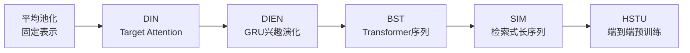

# 用户行为序列建模：从 DIN 到 SIM 到长序列

> 标签：#DIN #DIEN #SIM #ETA #序列建模 #用户兴趣 #长序列 #Mamba #阿里巴巴 #CTR

---

## 🆚 创新点 vs 之前方案

| 方案 | 之前方案 | 创新 | 核心突破 |
|------|---------|------|---------|
| DIN | 平均池化（fixed representation） | **Target Attention** | 候选相关的动态兴趣 |
| DIEN | DIN（无时序建模） | **GRU + AUGRU 兴趣演化** | 捕获兴趣变化趋势 |
| BST | DIEN（RNN 串行） | **Transformer 并行** | 更长序列更快 |
| SIM | BST（全序列 O(n²)） | **检索式两阶段** | 万级序列可行 |

---

## 📈 序列建模演进



---

## 1. DIN（Deep Interest Network）

### 1.1 背景：用户兴趣的多样性

传统 CTR 预估模型（如 Wide & Deep）对用户历史行为序列的处理方式：

$$
e_u = \text{Pooling}(\{e_i\}_{i=1}^L) = \frac{1}{L}\sum_{i=1}^L e_i
$$

**问题**：用户历史行为多样（买过手机壳、买过书、看过运动视频...），当前广告可能只与部分历史相关。均匀 Pooling 会稀释相关历史的信号。

**直觉**：预测用户是否点击"iPhone 手机壳"广告，历史中"买手机壳"的记录应该比"买书"贡献更大权重。

### 1.2 DIN 核心公式

DIN 用**目标广告**对历史行为做软注意力加权：

$$
e_u = \sum_{i=1}^L a(e_i, e_{ad}) \cdot e_i
$$

注意力权重：

$$
a(e_i, e_{ad}) = \text{MLP}\left([e_i,\ e_{ad},\ e_i - e_{ad},\ e_i \odot e_{ad}]\right)
$$

其中：
- $e_i \in \mathbb{R}^d$：用户历史行为 $i$ 的 embedding
- $e_{ad} \in \mathbb{R}^d$：目标广告的 embedding
- $e_i - e_{ad}$：差异向量（捕获两者的不同之处）
- $e_i \odot e_{ad}$：Hadamard 积（捕获两者的共同维度激活）
- $\text{MLP}(\cdot) \in \mathbb{R}$：输出标量权重（不通过 softmax 归一化）

**为什么用差和积**：
- $e_i - e_{ad}$ 在两者相似时趋近于 0，差异大时值大，提供"有多不同"的信号
- $e_i \odot e_{ad}$ 在两者同一维度都有激活时值大，提供"哪些方面有共鸣"的信号
- 两者拼接后，MLP 可以学习"相似且相关"的复杂交互模式

### 1.3 与 Transformer 注意力的对比

| 维度 | Transformer MHA | DIN |
|------|----------------|-----|
| Q | 线性投影后的所有 token | 只有目标广告（单一 Q）|
| K | 线性投影后的历史序列 | 历史行为 embedding（无投影）|
| 注意力计算 | $QK^T / \sqrt{d_k}$ | MLP(差、积特征) |
| 归一化 | softmax（权重和=1）| 无 softmax（权重可>1）|
| 位置编码 | 需要 | 通常不用（或加时间 embedding）|
| 多头 | 是 | 否 |

**为什么 DIN 不用 softmax**：softmax 强制权重和为 1，当用户历史中有多个高相关行为时，softmax 会将权重分散，稀释每个行为的贡献。DIN 允许权重 > 1，多个相关行为可以叠加增强信号。

### 1.4 DIN 的完整实现

```python
import torch
import torch.nn as nn
import torch.nn.functional as F

class DINAttention(nn.Module):
    def __init__(self, embed_dim, hidden_dim=64):
        super().__init__()
        # 输入：[e_i, e_ad, e_i - e_ad, e_i * e_ad] = 4 * embed_dim
        self.attention_mlp = nn.Sequential(
            nn.Linear(4 * embed_dim, hidden_dim),
            nn.ReLU(),
            nn.Linear(hidden_dim, 1)
        )
    
    def forward(self, behavior_embs, target_ad_emb, behavior_mask):
        """
        behavior_embs: (batch, seq_len, embed_dim) 历史行为序列
        target_ad_emb: (batch, embed_dim) 目标广告 embedding
        behavior_mask: (batch, seq_len) 有效位置 mask（padding 为 0）
        """
        batch_size, seq_len, embed_dim = behavior_embs.shape
        
        # 扩展目标广告以匹配序列长度
        target_expanded = target_ad_emb.unsqueeze(1).expand(-1, seq_len, -1)
        # (batch, seq_len, embed_dim)
        
        # 构造交互特征
        diff = behavior_embs - target_expanded                      # 差
        hadamard = behavior_embs * target_expanded                  # Hadamard 积
        interaction = torch.cat([
            behavior_embs,    # e_i
            target_expanded,  # e_ad
            diff,             # e_i - e_ad
            hadamard          # e_i ⊙ e_ad
        ], dim=-1)  # (batch, seq_len, 4*embed_dim)
        
        # 注意力分数
        scores = self.attention_mlp(interaction).squeeze(-1)  # (batch, seq_len)
        
        # mask 无效位置（用极大负数，使后续乘以 0）
        scores = scores.masked_fill(behavior_mask == 0, -1e9)
        
        # 注意力权重（DIN 不用 softmax，直接 sigmoid 或不归一化）
        weights = torch.sigmoid(scores)  # (batch, seq_len)
        
        # 加权聚合
        weighted = weights.unsqueeze(-1) * behavior_embs  # (batch, seq_len, embed_dim)
        user_emb = weighted.sum(dim=1)  # (batch, embed_dim)
        
        return user_emb, weights
```

### 1.5 DIN 的训练技巧

**GAUC（Group AUC）**：DIN 论文提出用 GAUC 替代全局 AUC 评估 CTR 模型：

$$
\text{GAUC} = \frac{\sum_u \text{impression}}_{\text{u \times \text{AUC}}_u}{\sum_u \text{impression}}_{\text{u}}
$$

动机：全局 AUC 会被高活跃用户主导（他们的样本多），GAUC 对每个用户独立计算 AUC 后加权平均，更能反映对每个用户的个性化排序能力。

---

## 2. DIEN（Deep Interest Evolution Network）

### 2.1 问题：用户兴趣随时间演变

DIN 将所有历史行为视为无序集合，忽略了兴趣的时间演化：
- 用户 3 个月前喜欢游戏，上个月喜欢健身，最近关注美食
- 当前最可能点击美食相关广告，而非游戏广告
- 序列顺序信息很重要！

### 2.2 DIEN 的两阶段结构

**阶段1：兴趣提取层（Interest Extractor Layer）**：

用 GRU 捕获行为序列的时序信息：

$$
h_t = \text{GRU}(h_{t-1}, e_t)
$$

**辅助损失（Auxiliary Loss）**：每个时间步 $t$ 的隐状态 $h_t$ 应该能预测下一个行为（监督每个时间步的兴趣质量）：

$$
L_{aux} = -\sum_t \left[\log \sigma(h_t \cdot e_{t+1}^+) + \log(1 - \sigma(h_t \cdot e_{t+1}^-))\right]
$$

其中 $e_{t+1}^+$ 是用户实际的下一个行为，$e_{t+1}^-$ 是随机采样的负样本。

**阶段2：兴趣进化层（Interest Evolving Layer）**：

AUGRU（Attention Update GRU）：在 GRU 的更新门上加入注意力权重，使与目标广告相关度高的历史时刻有更强的状态更新：

$$
\tilde{u}_t = a_t \cdot u_t
$$

$$
h_t' = (1 - \tilde{u}_t) \odot h_{t-1}' + \tilde{u}_t \odot \tilde{h}_t
$$

其中 $a_t = a(h_t, e_{ad})$ 是当前时刻的注意力权重，$u_t$ 是原始 GRU 的更新门。

---

## 3. SIM（Search-based Interest Model）长序列

### 3.1 背景：DIN/DIEN 在长序列上的瓶颈

DIN 的注意力计算复杂度：$O(L \cdot d)$（L 为序列长度，d 为 embedding 维度）

在阿里巴巴的工业场景中：
- 用户生命周期行为序列可达 **10000+** 条
- 在线推理时间预算：< 50ms（不含网络）
- DIN 对 L=10000 的序列单用户推理需要 > 200ms

**不可接受**，需要长序列处理方案。

### 3.2 SIM 两阶段方案

**第一阶段：快速检索（General Search Unit, GSU）**

从长序列 $B = \{b_1, b_2, \ldots, b_L\}$（$L \sim 10000$）中快速检索与目标广告相关的 Top-K 行为：

方案1：**Hard Search**（基于类目的精确检索）
- 用目标广告的类目，从倒排索引中检索同类目的历史行为
- 时间复杂度：$O(df_{cat})$（该类目的行为数量），通常远小于 $L$

方案2：**Soft Search**（基于向量相似度的 ANN 检索）
- 为每个历史行为建 HNSW 索引
- 用目标广告向量查询最近的 Top-K 个历史行为

**第二阶段：精排注意力（Exact Search Unit, ESU）**

对第一阶段返回的 Top-K（如 K=50）行为做 DIN 风格的精确注意力：

$$
e_u = \text{DIN}(\{b_{i_1}, b_{i_2}, \ldots, b_{i_K}\}, e_{ad})
$$

### 3.3 复杂度对比

| 方法 | 在线时间复杂度 | 适用序列长度 | 召回质量 |
|------|--------------|------------|---------|
| DIN（全序列）| $O(L \cdot d)$ | < 500 | 最好 |
| SIM Hard Search | $O(\text{df}}_{\text{{cat}} + K \cdot d)$ | 10000+ | 好 |
| SIM Soft Search | $O(\log L + K \cdot d)$ | 10000+ | 更好 |

**SIM Soft Search 的索引维护**：用户的历史行为 embedding 需要实时更新索引（用户每次交互后 append），工业实现通常用 FAISS 的动态索引支持。

### 3.4 SIM 实现示意

```python
class SIM(nn.Module):
    def __init__(self, embed_dim, K=50):
        super().__init__()
        self.K = K
        self.din = DINAttention(embed_dim)
    
    def forward(self, long_behavior_seq, long_behavior_embs, target_ad_emb, target_cat):
        """
        long_behavior_seq: 用户长序列（类目 ID 列表）
        long_behavior_embs: 对应的 embedding (L, embed_dim)
        target_ad_emb: 目标广告 embedding (embed_dim,)
        target_cat: 目标广告类目
        """
        # 第一阶段：Hard Search（按类目过滤）
        relevant_mask = long_behavior_seq[:, 'category'] == target_cat
        relevant_indices = relevant_mask.nonzero().flatten()
        
        if len(relevant_indices) > self.K:
            # 若过滤后还是太多，取最近的 K 个（时序上最近）
            relevant_indices = relevant_indices[-self.K:]
        
        relevant_embs = long_behavior_embs[relevant_indices]  # (K', embed_dim)
        
        # 第二阶段：DIN 精确注意力
        relevant_embs = relevant_embs.unsqueeze(0)  # (1, K', embed_dim)
        mask = torch.ones(1, len(relevant_indices))
        
        user_emb, _ = self.din(relevant_embs, target_ad_emb.unsqueeze(0), mask)
        
        return user_emb.squeeze(0)  # (embed_dim,)
```

---

## 4. ETA（End-to-end Target Attention）

### 4.1 SIM 的限制

SIM Hard Search 基于类目匹配，无法处理跨类目的兴趣迁移（如买了"手机"再买"手机壳"）。SIM Soft Search 需要维护独立的 ANN 索引，工程复杂度高。

**ETA 的方案**：用 **SimHash** 将行为向量映射到低维二进制码，用 Hamming 距离近似向量相似度，无需外部 ANN 索引。

### 4.2 SimHash 近似注意力

```python
def sim_hash(embedding, num_bits=32):
    """
    将 embedding 映射为 num_bits 位二进制哈希码
    利用随机投影（Locality Sensitive Hashing 的一种）
    """
    # 随机投影矩阵（固定，不训练）
    random_proj = torch.randn(embedding.shape[-1], num_bits)
    # 投影后取符号
    projected = embedding @ random_proj  # (..., num_bits)
    return (projected > 0).float()  # 二进制码

def hamming_distance(hash1, hash2):
    """Hamming 距离 = 不同 bit 的数量"""
    return (hash1 != hash2).sum(-1)

# 检索：计算目标广告 hash 与所有历史行为 hash 的 Hamming 距离
# 取距离最小的 Top-K 作为近邻
target_hash = sim_hash(target_ad_emb)  # (num_bits,)
behavior_hashes = sim_hash(long_behavior_embs)  # (L, num_bits)

# 向量化 Hamming 距离计算
distances = (behavior_hashes != target_hash.unsqueeze(0)).sum(-1)  # (L,)
top_k_indices = distances.argsort()[:K]
```

**ETA 的优点**：端到端训练（hash 近似可以融入整体模型），无需维护额外索引，工程简单。

---

## 5. 超长序列：Mamba 与线性注意力

### 5.1 Transformer 的 $O(n^2)$ 瓶颈

对于超长用户序列（如 100000 条历史行为），即使 SIM/ETA 也有工程限制。从模型架构层面，需要突破 $O(n^2)$ 的注意力复杂度。

### 5.2 线性注意力（Linear Attention）

将注意力核函数化：

$$
\text{Attention}(Q, K, V) = \text{softmax}(QK^T / \sqrt{d}) V \approx \phi(Q) (\phi(K)^T V)
$$

通过核函数 $\phi$（如 ELU 等）将 softmax 替换为可以改变矩阵乘法顺序的形式：

$$
\text{LinearAttn} = \phi(Q) \underbrace{(\phi(K)^T V)}_{\text{先算这个，}O(nd^2)}
$$

复杂度从 $O(n^2 d)$ 降至 $O(nd^2)$（d 固定时线性于 n）。

**缺点**：无法精确复现 softmax 注意力，效果通常略差。

### 5.3 Mamba 的选择性状态空间模型

Mamba 用状态空间模型（SSM）替代注意力，复杂度 $O(n)$：

```
状态方程：
  h_t = A h_{t-1} + B x_t     (状态更新)
  y_t = C h_t                  (输出)

Mamba 的创新（S6）：
  A, B, C, Δ 都依赖输入 x_t（选择性机制）
  Δ：时间步大小，控制当前输入对状态的影响程度
```

**Mamba 的优势**：
- 序列长度 n：$O(n)$ 计算，$O(1)$ 或 $O(d)$ 状态存储（不随 n 增长）
- 推理时可以维护单一状态向量（类比 RNN），而非完整的 KV Cache
- 实验上在长序列语言建模上接近 Transformer 效果

**在推荐系统中的应用**：MAMBA4Rec 等工作将 Mamba 用于序列推荐，在长序列场景（>1000 交互）上显著优于 SASRec（Transformer based）。

```python
# 简化版 Mamba SSM 概念实现
class SelectiveSSM(nn.Module):
    def __init__(self, d_model, d_state=16):
        super().__init__()
        self.d_state = d_state
        
        # 输入依赖的参数（选择性机制的核心）
        self.B_proj = nn.Linear(d_model, d_state)  # 输入矩阵
        self.C_proj = nn.Linear(d_model, d_state)  # 输出矩阵
        self.delta_proj = nn.Linear(d_model, d_model)  # 时间步
        
        # 固定的 A 矩阵（初始化为特定结构保证稳定性）
        self.A = nn.Parameter(-torch.exp(torch.randn(d_model, d_state)))
    
    def forward(self, x):
        """
        x: (batch, seq, d_model)
        """
        # 计算输入依赖的参数
        B = self.B_proj(x)     # (batch, seq, d_state)
        C = self.C_proj(x)     # (batch, seq, d_state)
        delta = F.softplus(self.delta_proj(x))  # (batch, seq, d_model)
        
        # 离散化 A（ZOH 方法）
        A_bar = torch.exp(delta.unsqueeze(-1) * self.A.unsqueeze(0).unsqueeze(0))
        # (batch, seq, d_model, d_state)
        
        # 递推（实际实现用 parallel scan 加速）
        h = torch.zeros(x.shape[0], x.shape[2], self.d_state, device=x.device)
        outputs = []
        for t in range(x.shape[1]):
            h = A_bar[:, t] * h + B[:, t].unsqueeze(1) * x[:, t].unsqueeze(-1)
            y_t = (C[:, t].unsqueeze(1) * h).sum(-1)  # (batch, d_model)
            outputs.append(y_t)
        
        return torch.stack(outputs, dim=1)  # (batch, seq, d_model)
```

---

## 6. 面试考点

### Q1：DIN 为什么不对注意力权重做 softmax？

DIN 认为用户的每次历史行为对当前广告的贡献是独立的，不应该相互竞争权重。Softmax 会使权重和始终为 1，若用户有 10 条高度相关的历史行为，每条权重约为 0.1；若只有 1 条相关，该条权重约为 1.0。但直觉上，10 条相关历史应该比 1 条提供更强的信号，不应该被 softmax 稀释。DIN 用 sigmoid 或直接不归一化，允许相关行为的权重叠加，更好地反映历史相关度的积累效果。

### Q2：DIN 中为什么要用 e_i - e_ad 和 e_i ⊙ e_ad 两种交互特征？

仅用两个向量的 concat（[e_i, e_ad]）时，MLP 需要自己学习两向量之间的关系，需要更多参数和数据。显式地构造差和积给了 MLP 更多关于两者关系的信息：差向量在两者相似时趋于 0（相似程度的信号），积向量高亮了两者都强激活的维度（共同兴趣的信号）。这是特征工程思想在深度学习中的应用——提供先验知识加速学习。

### Q3：SIM Hard Search 和 Soft Search 如何选择？

Hard Search（类目匹配）的优势：实现简单、速度极快（倒排索引 O(1) 到 O(df)）、无需向量索引维护。适合：业务上行为序列有清晰的类目结构，跨类目迁移不重要的场景。Soft Search 的优势：捕获语义相关性（如"手机"→"手机壳"这类跨类目关联），召回质量更高。适合：电商等跨品类购买行为多、用户行为复杂的场景。工业实践中通常先用 Hard Search 作为基线（快速上线），验证 ROI 后再升级到 Soft Search。

### Q4：DIEN 的辅助损失（Auxiliary Loss）有什么作用？

没有辅助损失时，GRU 只有来自最终预测（CTR）的梯度，序列中间时刻的兴趣状态缺乏直接监督信号，兴趣提取质量不高。辅助损失要求每个时刻的兴趣状态 $h_t$ 能预测下一个实际行为，为每个时间步提供直接的语义监督信号，使 GRU 学习有意义的兴趣状态（而不是随便的特征压缩）。这是一种多任务学习：主任务是 CTR 预估，辅助任务是行为序列的自监督预测。

### Q5：处理用户行为序列时间戳的方法有哪些？

(1) 时间位置编码：类似 Transformer 的绝对位置编码，用行为发生的时间（绝对时间戳或相对时间差）编码，如 $PE_{time} = \text{sin/cos}(t / 10000^{i/d})$；(2) 时间 embedding：学习可训练的时间桶 embedding（如"1小时内"、"1天内"、"1周内"、"1月内"4个时间桶）；(3) 时间衰减：对较久远的行为施加指数衰减权重 $w_t = e^{-\lambda(T - t_i)}$，在 SIM 等模型的注意力权重中直接调整；(4) Timestamp as Feature：将时间差（与当前时刻的差）作为独立特征输入 MLP。

### Q6：超长序列（10000+）的工程挑战有哪些？

(1) 存储挑战：每个用户维护 10000 条行为记录，1 亿用户 = 1 万亿条记录，需要 HBase/TiDB 等高性能 KV 存储；(2) 检索延迟：SIM Soft Search 需要 ANN 索引，索引需与用户最新行为保持近实时同步（latency < 秒级），Faiss 的增量索引支持（IVFPQ with add）有更新开销；(3) 特征准备：在线服务时，需要在毫秒内从 KV 存储检索到用户行为序列并做检索，需要高性能 IO 和预计算；(4) 训练效率：training batch 中用户序列长度不齐，需要 padding 或 pack（SIM 取 Top-K 后固定长度，简化了 training）。

### Q7：Mamba 相比 Transformer 在推荐系统的优劣势？

优势：(1) 推理时复杂度 O(1)（固定大小状态），序列更长时优势更大；(2) 对极长序列（>1000 items）的建模能力强；(3) 内存效率高，可以处理更大批量。劣势：(1) 并行训练能力弱于 Transformer（SSM 的递推难以完全并行化，虽然 parallel scan 有所改善）；(2) 对短序列（<100 items）效果与 Transformer 相当甚至略差；(3) 工程生态不如 Transformer 成熟，适配推荐特征（离散 ID 特征）的框架较少。当前最佳实践：Transformer（SASRec/BERT4Rec）用于中短序列（<500），Mamba 用于长序列（500-10000），SIM/ETA 用于超长序列（>10000）。

### Q8：如何从冷启动用户开始建立行为序列？

冷启动用户（新注册或行为极少）的序列建模挑战：没有历史行为，注意力无法加权，返回零向量或均值向量。策略：(1) 行为替代：用用户的注册信息（年龄、城市、设备类型）推断兴趣，构造"虚拟行为序列"；(2) 相似用户迁移：找到相似用户群体（如同年龄段、同城市）的热门行为序列作为代理；(3) 渐进式学习：前 3-5 次行为用简单统计特征，积累到 10+ 行为后切换到序列模型；(4) 对比预训练：用大量活跃用户数据预训练序列编码器，冷启动用户可以利用预训练的行为语义空间快速收敛。

---

## 参考资料

- Zhou et al. "Deep Interest Network for Click-Through Rate Prediction" (DIN, KDD 2018)
- Zhou et al. "Deep Interest Evolution Network for Click-Through Rate Prediction" (DIEN, AAAI 2019)
- Pi et al. "Search-based User Interest Modeling with Lifelong Sequential Behavior Data for Click-Through Rate Prediction" (SIM, CIKM 2020)
- Chen et al. "End-to-End User Behavior Retrieval in Click-Through Rate Prediction Model" (ETA, 2021)
- Gu et al. "MAMBA4Rec: Towards Efficient Sequential Recommendation with Selective State Space Models" (2024)
- Gu & Dao. "Mamba: Linear-Time Sequence Modeling with Selective State Spaces" (2023)
- Kang & McAuley. "Self-Attentive Sequential Recommendation" (SASRec, ICDM 2018)

## 🃏 面试速查卡

**记忆法**：DIN 像"逛超市时的眼神"——你看到 iPhone 手机壳广告时，大脑自动回忆"我之前买过手机壳"（高权重），而不是"我上周买的书"（低权重）。Target Attention 就是"用当前广告去翻用户的购物历史"。SIM 是"历史太长先用目录索引筛一遍再精读"。

**核心考点**：
1. DIN 为什么不用 softmax 归一化注意力权重？（避免多个相关行为被稀释，允许权重叠加）
2. DIN 注意力中为什么用 e_i-e_ad 和 e_i⊙e_ad？（差向量=相似度信号，积向量=共同兴趣信号）
3. SIM Hard Search vs Soft Search 的选择？（Hard=类目倒排快但无跨类目语义，Soft=ANN 召回质量高但工程复杂）
4. DIEN 辅助损失的作用？（为 GRU 每个时间步提供直接语义监督，防止兴趣表示退化）
5. 超长序列（10000+）的工程挑战和解决方案？（SIM 两阶段检索、ETA SimHash、Mamba O(n) 复杂度）

**代码片段**：
```python
import torch, torch.nn as nn

class DINAttention(nn.Module):
    def __init__(self, dim=32):
        super().__init__()
        self.mlp = nn.Sequential(nn.Linear(4*dim, 64), nn.ReLU(), nn.Linear(64, 1))

    def forward(self, hist, target):
        # hist: (B, L, D), target: (B, D)
        t = target.unsqueeze(1).expand_as(hist)
        feat = torch.cat([hist, t, hist - t, hist * t], dim=-1)
        w = torch.sigmoid(self.mlp(feat).squeeze(-1))  # (B, L)
        return (w.unsqueeze(-1) * hist).sum(dim=1)      # (B, D)

attn = DINAttention(dim=32)
user_emb = attn(torch.randn(4, 20, 32), torch.randn(4, 32))
print(f"User embedding: {user_emb.shape}")  # (4, 32)
```

**常见踩坑**：
1. 将 DIN 的注意力等同于 Transformer 注意力——DIN 是单 Query（目标广告）对序列，不做 softmax 归一化
2. SIM 中忘记考虑实时索引更新的工程开销——用户每次交互后需要 append 到 ANN 索引
3. 忽略 GAUC 和全局 AUC 的区别——GAUC 按用户分组计算更能反映个性化效果
