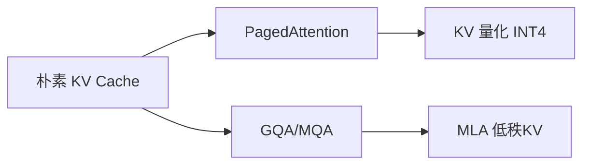

# KV Cache 与 LLM 推理优化：内存、延迟、吞吐的权衡

> 标签：#KVCache #推理优化 #vLLM #PagedAttention #量化 #连续批处理 #推测解码 #广告推理
> 关联：[[fundamentals/transformer_evolution]] | [[fundamentals/attention_transformer]]

---

## 🆚 KV Cache 优化方案对比

| 方案 | 之前方案 | 创新 | 效果 |
|------|---------|------|------|
| PagedAttention | 预分配 max_len | **分页按需分配** | 内存浪费 0% |
| GQA | MHA 全 KV head | **分组共享 KV** | 内存 4-32× 压缩 |
| MLA | GQA（共享 head） | **低秩 KV 投影** | 10×+ 压缩 |
| 量化 KV | FP16 KV | **INT4/2-bit KV** | 4-8× 压缩 |



---
---

## 1. 自回归生成的计算冗余

### 1.1 自回归生成过程

LLM 生成文本的方式是逐 token 的自回归过程：

$$
p(y_1, y_2, \ldots, y_T | x) = \prod_{t=1}^T p(y_t | x, y_1, \ldots, y_{t-1})
$$

每生成一个 token $y_t$，需要完整的上下文 $(x, y_1, \ldots, y_{t-1})$ 作为输入。

### 1.2 没有 KV Cache 时的计算冗余

对于 $L$ 层的 Transformer，生成第 $t$ 个 token 时：

- 需要重新计算所有历史 token 在每层的 K、V 矩阵
- 计算量：$O(t \cdot L \cdot d_{model}^2)$（t 为当前长度，每层包含 QKV 投影）
- 生成 T 个 token 的**总计算量**：$\sum_{t=1}^T O(t \cdot L \cdot d^2) = O(T^2 \cdot L \cdot d^2)$

这是极大的浪费：第 $t$ 步计算的 K/V 在第 $t+1$ 步又要重新计算一遍。

### 1.3 KV Cache 的核心思想

**缓存历史 K、V**：将每层每个注意力头计算出的 K、V 矩阵保存在显存中，生成新 token 时只需要：

1. 计算新 token 的 Q、K、V（$O(L \cdot d^2)$，常数时间）
2. 将新 K/V append 到 Cache
3. 用新 Q 和历史所有 K/V 做注意力计算（$O(t \cdot L \cdot d)$）

生成 T 个 token 的**总计算量**降为：$O(T \cdot L \cdot d^2 + T^2 \cdot L \cdot d)$，前者主导时节省 $O(T)$ 倍。

---

## 2. KV Cache 内存计算

### 2.1 单 token 的 KV Cache 大小

$$
\text{Memory per token} = 2 \times n_{layers} \times n_{heads} \times d_{head} \times \text{dtype}}_{\text{{\text{size}}}
$$

其中：
- 系数 2：K 和 V 各一份
- $n_{heads} \times d_{head} = d_{model}$

**以 LLaMA-2-70B 为例**（BF16 精度）：
- $n_{layers} = 80$，$n_{heads} = 64$，$d_{head} = 128$，dtype = BF16（2 bytes）
- KV Cache per token per layer：$2 \times 128 \times 2 = 512$ bytes
- **每个 token 的总 KV Cache**：$512 \times 80 = 40960$ bytes ≈ **40KB**

注意：使用 GQA（LLaMA-2 使用，8 个 KV 头对应 64 个 Q 头）：
- $n_{kv\_heads} = 8$（而非 64）
- 每个 token KV Cache = $2 \times 80 \times 8 \times 128 \times 2 = 5120$ bytes ≈ **5KB**

### 2.2 批量推理的内存挑战

假设 batch_size=32，最大序列长度=4096，LLaMA-2-70B（GQA）：

$$
\text{KV Cache} = 32 \times 4096 \times 5\text{KB} = 655\text{MB}
$$

A100（80GB）上：
- 模型权重（BF16）：70B × 2 bytes = 140GB → 需要 2 × A100 或量化
- 量化为 INT8（70GB）：剩余约 10GB 给 KV Cache
- 10GB / 5KB per token = 2M tokens 的 KV Cache 容量

### 2.3 KV Cache 与序列长度的关系

| 场景 | 序列长度 | 单 batch 需要 | 可并发请求数（80GB A100，INT8 70B）|
|------|---------|--------------|--------------------------------|
| 短对话 | 512 | 2.5MB | ~4000 |
| 中等对话 | 4096 | 20MB | ~500 |
| 长文档 | 32768 | 160MB | ~62 |
| 超长上下文 | 128K | 640MB | ~15 |

---

## 3. PagedAttention（vLLM 核心）

### 3.1 传统内存分配的碎片化问题

**静态分配**：预先为每个请求分配最大序列长度的连续内存块：
- 内部碎片：请求实际长度 << 最大长度，大量显存浪费
- 外部碎片：不同长度请求的内存块难以复用
- 实测：传统方案 GPU 利用率仅约 20-40%

### 3.2 分页思想

vLLM 借鉴操作系统虚拟内存的分页机制：

1. 将 KV Cache 切分成固定大小的 **Block**（如每块 16 个 token）
2. 维护 **Block Table**：每个请求的逻辑 Block → 物理 Block 的映射
3. 动态分配：请求只在需要时申请新的物理 Block

```
请求 A（已生成 40 tokens = 3 blocks）：
  逻辑 Block 0 → 物理 Block 7
  逻辑 Block 1 → 物理 Block 2
  逻辑 Block 2 → 物理 Block 15

请求 B（已生成 25 tokens = 2 blocks）：
  逻辑 Block 0 → 物理 Block 3
  逻辑 Block 1 → 物理 Block 11（部分填充：25 mod 16 = 9 tokens）
```

### 3.3 PagedAttention 的注意力计算

标准注意力（连续内存）：
```python
# Q: (batch, heads, seq, d_k)
# K, V: 连续存储的完整序列 KV Cache
output = attention(Q, K_cache[:, :, :seq_len], V_cache[:, :, :seq_len])
```

PagedAttention（分块内存）：
```python
# 根据 Block Table 找到当前请求的所有 Block，组装后计算
block_indices = block_table[request_id]  # 逻辑块 -> 物理块映射
K_blocks = [K_cache[block_idx] for block_idx in block_indices]
K = torch.cat(K_blocks, dim=0)  # 重新组装成连续 K
output = attention(Q, K, V)
```

### 3.4 Copy-on-Write（Prefix Caching / Beam Search）

**Beam Search**：多个 beam 共享相同的前缀 KV Cache，只在分叉点才复制。

**Prefix Caching**：相同 system prompt 的请求共享其 KV Cache Block，大幅减少重复计算。

**Copy-on-Write 机制**：共享的 Block 在需要修改（分叉）时才执行拷贝，否则只更新映射表，零拷贝代价共享。

### 3.5 吞吐提升效果

| 指标 | 静态分配 | PagedAttention | 提升 |
|------|---------|---------------|------|
| GPU 利用率 | ~20-40% | ~60-80% | 2-4× |
| 吞吐（token/s）| 基准 | 2-4× | 2-4× |
| 最大并发 | 低 | 高 | 3-5× |

---

## 4. 量化推理

### 4.1 INT8 量化原理

将 FP32/BF16 权重映射到 INT8（-128~127）：

$$
W_{int8} = \text{round}\left(\frac{W_{fp}}{s}\right), \quad s = \frac{\max(|W_{fp}|)}{127}
$$

**逆量化**：$W_{fp} \approx W_{int8} \times s$

**精度损失分析**：量化误差 $\epsilon = W_{fp} - W_{int8} \times s$，均值约为 0，标准差约为 $s/2$（均匀分布假设）。权重分布越均匀，量化误差越小。

### 4.2 AWQ（Activation-aware Weight Quantization）

**问题**：并非所有权重通道的重要性相同，少数通道的激活值特别大（outlier），这些通道对最终精度影响远大于其他通道。

**AWQ 方案**：
1. 在校准数据上，找出激活值较大（重要）的输入通道 $i^*$
2. 对重要通道的权重施加放大：$W_{i^*} \leftarrow W_{i^*} / s$，同时激活值收缩：$x_{i^*} \leftarrow x_{i^*} \times s$
3. 放大后的权重比例分配更多量化区间，减少精度损失

AWQ 相比 Round-to-Nearest INT4 减少约 50% 的量化误差。

### 4.3 GPTQ：逐层量化

**核心思想**：逐层量化，对每层使用 Hessian 信息最小化量化前后的输出差异：

$$
\min_{W_{int}} \|WX - W_{int}X\|_F^2
$$

**OBQ（Optimal Brain Quantization）**子程序：
- 逐列量化权重，每量化一列后更新剩余列（补偿量化误差）
- Hessian $H = 2XX^T$ 权重较大的行（对输出影响大）被优先量化精度

实践效果：GPTQ INT4 量化 LLaMA-65B，精度损失约 1-2%，内存降低 4×。

---

## 5. 推理框架对比

### 5.1 连续批处理（Continuous Batching）原理

**静态批处理的问题**：整个 batch 的所有请求必须等最长的请求完成才能释放显存，短请求完成后 GPU 资源空闲等待。

**Continuous Batching**：
- 每次迭代后，将完成的请求移出 batch
- 立即将等待队列中的新请求加入 batch
- GPU 利用率接近 100%（无等待时间）

```python
# 伪代码：Continuous Batching 调度器
class ContinuousBatchScheduler:
    def __init__(self, max_batch_tokens):
        self.running_requests = []
        self.waiting_queue = Queue()
        self.max_batch_tokens = max_batch_tokens
    
    def step(self):
        # 1. 移除已完成的请求
        completed = [r for r in self.running_requests if r.is_done]
        self.running_requests = [r for r in self.running_requests if not r.is_done]
        
        # 2. 计算当前批次剩余容量
        current_tokens = sum(r.current_len for r in self.running_requests)
        remaining = self.max_batch_tokens - current_tokens
        
        # 3. 从等待队列填充
        while not self.waiting_queue.empty():
            new_req = self.waiting_queue.peek()
            if new_req.prompt_len <= remaining:
                self.running_requests.append(self.waiting_queue.get())
                remaining -= new_req.prompt_len
            else:
                break
        
        return self.running_requests
```

### 5.2 推测解码（Speculative Decoding）

**核心思想**：用小模型（Draft Model）快速生成多个候选 token，再用大模型（Target Model）并行验证，大模型通过的 token 直接接受，不通过的从大模型分布中采样。

**加速原理**：
- Draft Model 生成速度极快（如 7B vs 70B）
- Target Model 可以一次前向计算并行验证 K 个 token
- 期望接受长度：$\mathbb{E}[K_{accept}] = \frac{1}{1-\alpha}$（$\alpha$ 为平均接受率）

**加速比计算**：若接受率 $\alpha = 0.8$，单步生成 K=5 个 draft token：
- 期望接受：$\frac{1}{1-0.8} = 5$ 个 token
- 一次 Target 前向：验证 5 个 draft + 生成 1 个校正 token
- 相当于 1 次前向生成了约 4-5 个 token，加速比约 3-4×

### 5.3 推理框架对比

| 框架 | 核心特性 | 适用场景 | 吞吐量 |
|------|---------|---------|--------|
| vLLM | PagedAttention + Continuous Batching | 通用在线服务 | 最高 |
| TensorRT-LLM | NVIDIA 深度优化，INT8/INT4 量化 | A100/H100 生产部署 | 极高 |
| TGI（HuggingFace）| 生态好，易集成 | 研究和中小规模 | 中 |
| llama.cpp | CPU 推理，4bit 量化 | 边缘设备 | 低 |

---

## 6. 广告推理延迟优化

### 6.1 动态长度 batch 的 padding 问题

广告文案生成场景中，不同请求的 prompt 长度差异极大（短到 100 tokens，长到 2000 tokens）。

**问题**：批处理时 padding 到最长长度，短请求浪费大量计算。

**解决方案**：
1. **按长度分桶**：相近长度的请求归入同一 batch，减少 padding 浪费
2. **Flash Attention with variable length**：Triton 实现支持 packed input（不同序列 concat 而非 pad，通过 attention mask 区分）
3. **动态分批**：根据实时队列选择最优 batch 组合（最大化有效 token 比例）

### 6.2 Prefix Caching 在广告场景的应用

广告系统中许多请求共享相同的 System Prompt（如品牌信息、格式要求、安全规范），长度可达 500-1000 tokens。

```
System Prompt（所有请求共享，1000 tokens）:
"你是一位广告文案专家，为[品牌X]创作广告文案...
[品牌信息]...[格式要求]...[安全规范]..."

用户请求（每次不同，100-200 tokens）:
"请为[商品Y]创作一条面向[用户群Z]的广告..."
```

**Prefix Caching 效果**：
- 共享部分的 KV Cache（1000 tokens）只计算一次
- 后续请求直接复用，节省约 80% 的 prefill 计算

### 6.3 实际部署：服务百万 QPS 的架构

```
                    ┌─────────────────┐
                    │   负载均衡器    │
                    └────────┬────────┘
                             │
              ┌──────────────┼──────────────┐
              ▼              ▼              ▼
        ┌──────────┐  ┌──────────┐  ┌──────────┐
        │  GPU 节点 │  │  GPU 节点 │  │  GPU 节点 │
        │ 4×A100   │  │ 4×A100   │  │ 4×A100   │
        │ vLLM     │  │ vLLM     │  │ vLLM     │
        └──────────┘  └──────────┘  └──────────┘
              ↑ 模型并行（Tensor Parallel）+ 流水线并行
```

**容量估算**（广告文案生成，平均输入 200 tokens，输出 50 tokens）：
- 单 4×A100 节点：吞吐约 2000 req/s（使用 Continuous Batching）
- 百万 QPS / 2000 = 500 个 4×A100 节点
- 通过流量削峰（批量预生成缓存）可将实时需求降低 80%
- 实际约需 100 个节点

---

## 7. 面试考点

### Q1：KV Cache 的内存开销如何估算？

公式：Memory = 2（K/V）× 层数 × KV头数 × 头维度 × 序列长度 × 数据类型字节数。以 LLaMA-3-70B（80层，8 KV头，128维头，BF16）为例，每 token 约 2×80×8×128×2 = 327680 bytes ≈ 320KB。batch=100，最长 4096 tokens：320KB × 100 × 4096 ≈ 131GB，已超出单卡容量，需要 Paged Memory 或序列长度限制。

### Q2：为什么 MQA/GQA 能减少 KV Cache？（另见 attention_transformer.md Q3）

MQA 所有 Q 头共享一组 K/V，KV Cache 大小从 n_heads 变为 1（减少 n_heads 倍）。GQA 按组共享，KV Cache 大小为 n_kv_heads（减少 n_heads/n_kv_heads 倍）。LLaMA-3-70B 使用 GQA 8 组，KV Cache 是 MHA 的 1/8，大幅提升可服务的并发数。推理速度也提升，因为 KV 矩阵更小，内存带宽消耗更少（LLM 推理通常是内存带宽瓶颈而非算力瓶颈）。

### Q3：PagedAttention 和 OS 虚拟内存有哪些相同点和不同点？

相同点：分页思想（逻辑地址→物理地址映射）、按需分配（不提前分配最大）、Copy-on-Write（共享页延迟复制）。不同点：(1) OS 使用磁盘作为 swap 空间，vLLM 中没有 swap（swap 到 CPU 内存代价高）；(2) OS 页大小通常 4KB，vLLM Block 大小 16-32 tokens（业务单元更合理）；(3) vLLM 的分配策略需考虑 GPU 内存带宽（Block 太小，管理开销大）。

### Q4：推测解码适合什么场景？不适合什么场景？

适合：(1) 输出长度较长（生成 100+ tokens，分摊 draft model 开销）；(2) 输出可预测性高（代码生成、格式化输出）；(3) Draft/Target 输出分布相近（接受率高）。不适合：(1) 输出长度短（<20 tokens）：分摊效果差；(2) 高创意性任务（开放式生成）：draft model 和 target 分布差异大，接受率低；(3) 严格等时延要求：引入了不确定的 draft 生成步骤。

### Q5：Continuous Batching 的核心实现挑战是什么？

主要挑战：(1) KV Cache 碎片化：不同长度请求进出 batch，连续内存管理复杂（PagedAttention 解决）；(2) CUDA kernel 兼容性：传统 batch attention kernel 假设等长序列，variable-length batch 需要重写 kernel（Flash Attention v2 支持）；(3) 调度策略：如何决定何时抢占长请求？如何预防 OOM？vLLM 使用 "swap to CPU" 或直接终止策略。

### Q6：INT8 量化可能在哪些层损失最大？如何缓解？

损失最大的层：(1) 第一层和最后一层：直接影响输入/输出分布；(2) 注意力机制中的 softmax 相关操作：量化误差放大；(3) 激活值有 outlier 的层（特别是 LLM 中某些隐层）。缓解方案：(1) 混合精度量化：关键层用 FP16，其余用 INT8；(2) AWQ/SmoothQuant：在量化前重新分配 outlier 影响；(3) 量化感知训练（QAT）：在训练中模拟量化，效果最好但需重训。

### Q7：prefill 和 decode 阶段的计算特性有何不同？

Prefill 阶段（处理整个 prompt）：计算密集型，大矩阵乘法，GPU 计算单元满载，类似训练。Decode 阶段（逐 token 生成）：内存密集型，每步只产生 1 个 token，矩阵乘法退化为矩阵-向量乘法，GPU 计算单元利用率低（<10%），瓶颈是 HBM 带宽（需要反复读取大矩阵）。这就是为什么增大 batch size 对 decode 阶段吞吐提升明显（分摊内存读取代价），而对 prefill 阶段提升有限（已经计算饱和）。

### Q8：如何设计面向广告的高效 LLM 推理架构？

分层设计：(1) 离线生成（80% 流量）：对高频商品预先批量生成多版本文案，缓存到 Redis，请求命中缓存直接返回；(2) 近实时（15% 流量）：对次热商品用 Message Queue 异步生成；(3) 实时推理（5% 流量）：vLLM 服务实时请求，使用 Prefix Caching 复用 System Prompt KV Cache，Continuous Batching 提升 GPU 利用率。总体 LLM 调用量减少 80%+，P99 延迟从 2s 降至 200ms。

---

## 参考资料

- Kwon et al. "Efficient Memory Management for Large Language Model Serving with PagedAttention" (vLLM, 2023)
- Lin et al. "AWQ: Activation-aware Weight Quantization for LLM Compression and Acceleration" (2023)
- Frantar et al. "GPTQ: Accurate Post-Training Quantization for Generative Pre-trained Transformers" (2022)
- Leviathan et al. "Fast Inference from Transformers via Speculative Decoding" (2023)
- Yu et al. "Orca: A Distributed Serving System for Transformer-Based Generative Models" (Continuous Batching, 2022)

## 🃏 面试速查卡

**记忆法**：KV Cache 像"考试时的草稿纸"——每算一步就把中间结果记下来，下一步直接查（而不是重新算）。PagedAttention 像"操作系统虚拟内存"——不预分配整本笔记本，用多少页撕多少页，用完的还能回收。GQA 像"几个人共用一本参考书"——减少副本数量省空间。

**核心考点**：
1. KV Cache 内存公式：2 × 层数 × KV头数 × 头维度 × 序列长度 × dtype字节数
2. PagedAttention 和 OS 虚拟内存的异同？（分页/按需分配/CoW 相同；无磁盘 swap/Block 大小不同）
3. Prefill vs Decode 阶段的计算特性差异？（Prefill=计算密集，Decode=内存带宽瓶颈）
4. 推测解码（Speculative Decoding）的加速原理和适用场景？（小模型 draft+大模型验证，适合长输出）
5. Continuous Batching 如何提升 GPU 利用率？（完成即释放+新请求即加入，消除等待浪费）

**代码片段**：
```python
def estimate_kv_cache_memory(n_layers, n_kv_heads, d_head, seq_len,
                              batch_size, dtype_bytes=2):
    """估算 KV Cache 显存占用 (bytes)"""
    per_token = 2 * n_layers * n_kv_heads * d_head * dtype_bytes
    total = per_token * seq_len * batch_size
    print(f"Per token: {per_token/1024:.1f} KB")
    print(f"Total: {total/1024**3:.2f} GB")
    return total

# LLaMA-3-70B (GQA 8 KV heads), BF16, batch=32, seq=4096
estimate_kv_cache_memory(n_layers=80, n_kv_heads=8, d_head=128,
                         seq_len=4096, batch_size=32, dtype_bytes=2)
```

**常见踩坑**：
1. 计算 KV Cache 时用了 Q 的头数而非 KV 的头数——GQA 下 KV 头数远小于 Q 头数
2. 忽略 Decode 阶段是内存带宽瓶颈而非算力瓶颈——增大 batch 对 decode 吞吐提升显著
3. 认为 PagedAttention 会降低精度——它只改变内存管理策略，计算结果与标准注意力完全一致
