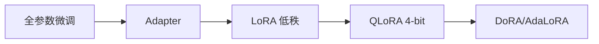

# LoRA 与参数高效微调：低秩分解的数学原理与工程实践

> 标签：#LoRA #PEFT #微调 #低秩分解 #QLoRA #AdaLoRA #大模型 #广告LLM

---

## 🆚 微调方案创新对比

| 方案 | 之前方案 | 创新 | 可训练参数 |
|------|---------|------|--------|
| 全参数微调 | — | baseline | 100% |
| Adapter | 全参数 | 插入小网络 | ~3% |
| LoRA | Adapter（有推理开销） | **低秩分解 ΔW=BA** | ~0.5-1% |
| QLoRA | LoRA（需 FP16 Base） | **4-bit NF4 量化 Base** | ~0.5% |



---
---

## 1. LoRA 核心公式推导

### 1.1 问题背景

全参数微调（Full Fine-tuning）需要更新所有 $\Theta$ 个参数，对 GPT-3（175B）来说需要 700GB 显存存储梯度，难以在普通硬件上完成。

LoRA 的出发点：**预训练模型权重在微调时的变化矩阵 $\Delta W$ 具有低内在秩（intrinsic rank）**。

### 1.2 LoRA 分解形式

对于预训练权重矩阵 $W_0 \in \mathbb{R}^{d \times k}$，修改后的权重为：

$$
W' = W_0 + \Delta W = W_0 + BA
$$

其中：
- $W_0 \in \mathbb{R}^{d \times k}$：**冻结**，不参与梯度更新
- $B \in \mathbb{R}^{d \times r}$：可训练，初始化为**全零**
- $A \in \mathbb{R}^{r \times k}$：可训练，初始化为**高斯随机**
- $r \ll \min(d, k)$：秩，如 r=4, 8, 16, 32

**初始化设计的关键**：B 初始化为零，确保训练开始时 $\Delta W = BA = 0$，即初始状态等价于原始预训练模型，训练稳定性好。

### 1.3 前向传播

原始前向：$h = W_0 x$

LoRA 前向：

$$
h = W_0 x + \Delta W x = W_0 x + B A x
$$

两路计算可以**并行**，推理时可以合并：$W' = W_0 + BA$，不增加推理延迟。

### 1.4 参数量对比

| 方案 | 参数量 | 示例（d=4096, k=4096） |
|------|--------|----------------------|
| 全参数微调 | $dk = 16.7M$ | 16.7M |
| LoRA r=4 | $(d+k)r = 32K$ | 32K（约原来的 0.2%）|
| LoRA r=16 | $(d+k)r = 131K$ | 131K（约原来的 0.8%）|
| LoRA r=64 | $(d+k)r = 524K$ | 524K（约原来的 3.1%）|

参数减少幅度：$\frac{(d+k)r}{dk} = \frac{r(d+k)}{dk} \approx \frac{2r}{\min(d,k)}$（当 d≈k 时）

---

## 2. 为什么低秩有效

### 2.1 预训练模型的内在维度假设

Aghajanyan et al. (2020) 提出"内在维度（intrinsic dimensionality）"概念：

对于一个 D 维优化问题，如果存在一个低维子空间（维度为 $d$），在该子空间内优化能达到与全参数优化相当的效果，则称该任务的内在维度为 $d$。

**关键实验发现**：
- RoBERTa-Large（355M参数）在 MRPC 任务上内在维度约 896
- GPT-2 在生成任务上内在维度约 200-500
- 更大的预训练模型通常有更低的内在维度（迁移能力更强）

### 2.2 微调变化矩阵的秩分析

直觉：预训练模型已经学习了丰富的通用特征，微调只需在已有表示上做"方向性调整"，而不需要学习全新的特征空间。这种方向性调整对应的矩阵变化是低秩的。

**实验验证**：对全参数微调得到的 $\Delta W$ 做 SVD 分解 $\Delta W = U \Sigma V^T$，发现奇异值快速衰减，前 8-16 个奇异值就捕获了大部分能量。

```python
import torch

# 假设我们已有全参数微调前后的权重
W_original = ...  # 预训练权重
W_finetuned = ...  # 微调后权重
delta_W = W_finetuned - W_original

# SVD 分析
U, S, Vt = torch.linalg.svd(delta_W)
# 查看奇异值分布
print(f"前10个奇异值占比: {S[:10].sum() / S.sum():.2%}")
# 通常前10个占比 > 90%，说明 delta_W 确实是低秩的
```

### 2.3 从矩阵近似角度理解

给定秩约束 $r$，最优的低秩近似由 SVD 截断给出（Eckart-Young 定理）：

$$
\Delta W \approx \sum_{i=1}^r \sigma_i u_i v_i^T = B_r A_r
$$

LoRA 通过梯度下降学习这个低秩近似，虽然不能保证找到全局最优，但实践效果接近理论上界。

---

## 3. Scaling 因子

### 3.1 带 Scaling 的完整公式

$$
h = W_0 x + \frac{\alpha}{r} B A x
$$

- $\alpha$：scaling 超参数（通常与 r 相关）
- $\frac{\alpha}{r}$：有效的学习率缩放因子

### 3.2 α 的作用分析

**等效学习率视角**：若固定其他超参数不变，只调整 r：
- $r$ 增大时，$BA$ 的参数增多，如果不调整 $\alpha$，等效学习率随 r 变化
- 设 $\alpha = r$（即 $\frac{\alpha}{r} = 1$），相当于无缩放，学习率对 r 不敏感

**常见配置**：
- $\alpha = r$：最常见，等价于不使用 scaling
- $\alpha = 2r$：对微调信号放大，适合训练数据较少时
- $\alpha = 16$（固定值）：在不同 r 间保持一致的更新幅度

### 3.3 梯度流分析

由于 B 初始化为零：
- 训练初期：$\nabla_B L = \nabla_h L \cdot (Ax)^T$，B 通过 A 的输出获得梯度
- 训练初期：$\nabla_A L = B^T \cdot \nabla_h L \cdot x^T$，A 的梯度依赖 B

这造成训练初期 A 的梯度也为零（因为 B=0），这是有意为之：先让 A 学习好的初始方向，B 再跟上调整幅度。

---

## 4. LoRA 变体详解

### 4.1 AdaLoRA（自适应秩分配）

**问题**：不同层、不同权重矩阵的重要性不同，固定秩 r 不是最优分配。

**方案**：对权重更新进行 SVD 参数化：

$$
\Delta W = P \Lambda Q
$$

其中 $P, Q$ 是正交矩阵，$\Lambda$ 是对角矩阵（奇异值）。

**训练过程**：
1. 正常反向传播更新 $P, \Lambda, Q$
2. 定期根据奇异值大小**剪枝**不重要的奇异值对（置为 0）
3. 将预算（总参数量）集中到重要的层和矩阵

**效果**：在相同参数预算下，AdaLoRA 比固定秩 LoRA 高约 0.5-1.0 个 BLEU 分。

### 4.2 DoRA（Weight-Decomposed Low-Rank Adaptation）

**创新点**：将权重分解为方向（direction）和幅度（magnitude）两个分量：

$$
W = m \cdot \frac{V}{\|V\|_c}
$$

其中 $m \in \mathbb{R}^{1 \times k}$ 是幅度（每列的 L2 范数），$\frac{V}{\|V\|_c}$ 是方向（列归一化）。

**DoRA 的微调方式**：

$$
W' = (m + \Delta m) \cdot \frac{V_0 + \Delta V}{\|V_0 + \Delta V\|_c}
$$

- $\Delta m$：直接学习幅度的变化
- $\Delta V$：用 LoRA 学习方向的变化

**效果**：DoRA 的学习动态更接近全参数微调，实验上超过 LoRA 约 1-2%。

### 4.3 QLoRA（量化 + LoRA）

**核心思想**：将基础模型用 4-bit NF4（Normal Float 4）量化加载，LoRA 参数保持 BF16 精度。

**NF4 量化**：基于正态分布设计的非均匀量化格点，比 INT4 精度损失更小：
- 量化格点按正态分布等面积划分，集中在均值附近
- 量化误差更小：对正态分布权重，NF4 接近理论最优量化

**Double Quantization**：对量化常数本身再量化，每个参数额外减少约 0.5 bit。

**内存计算**（以 LLaMA-65B 为例）：
- 全精度 BF16：65B × 2 bytes = 130GB
- QLoRA：65B × 0.5 bytes ≈ 33GB + LoRA 参数 ≈ 35GB

这使 65B 模型能在单张 48GB A40 上微调。

### 4.4 四种方法对比

| 方法 | 参数量 | 训练速度 | 推理开销 | 效果 | 适用场景 |
|------|--------|---------|---------|------|---------|
| LoRA | $(d+k)r$ | 快 | 零（可合并） | 好 | 通用首选 |
| AdaLoRA | 同 LoRA 但分配更优 | 中（需 SVD） | 零（可合并） | 更好 | 资源有限精度要求高 |
| DoRA | 略多于 LoRA | 慢（双路径） | 零（可合并） | 最好 | 追求极致效果 |
| QLoRA | LoRA 参数 | 最快（内存省） | 需 dequant | 接近 LoRA | 大模型低资源微调 |

---

## 5. PEFT 全家族对比

### 5.1 Prefix Tuning

**原理**：在每层 Transformer 的 K/V 前面拼接可学习的"软提示"向量：

$$
[P_K; K], \quad [P_V; V]
$$

其中 $P_K, P_V \in \mathbb{R}^{l \times d_{model}}$，$l$ 为 prefix 长度（通常 10-100）。

**参数量**：$2 \times n_{layers} \times l \times d_{model}$（约原模型的 0.1%）

**推理开销**：KV Cache 增加 $l$ 个 token，轻微增加延迟。

### 5.2 Adapter

**原理**：在每个 Transformer 层的 FFN 之后插入两层瓶颈网络：

$$
h \leftarrow h + W_{up} \cdot \text{ReLU}(W_{down} \cdot h)
$$

其中 $W_{down} \in \mathbb{R}^{d_{model} \times r}$，$W_{up} \in \mathbb{R}^{r \times d_{model}}$，$r \ll d_{model}$。

**参数量**：$2 \times n_{layers} \times 2 \times d_{model} \times r$（约原模型的 1-3%）

**推理开销**：新增两次矩阵乘法，推理延迟增加约 5-15%（不可并行）。

### 5.3 Prompt Tuning

**原理**：只在输入 embedding 层加可学习 token，不改变任何模型权重：

$$
\text{Input} = [\text{soft}}_{\text{{\text{tokens}}}; \text{actual}}_{\text{{\text{tokens}}}]
$$

**参数量**：$l \times d_{model}$（极少，约原模型的 0.01%）

**特点**：效果随模型规模增大而提升，大模型（>10B）上接近全参数微调。小模型（<1B）效果明显差。

### 5.4 PEFT 方法全面对比

| 方法 | 参数量 | 推理额外开销 | 效果（小模型）| 效果（大模型）| 支持合并权重 |
|------|--------|------------|-------------|-------------|------------|
| Full FT | 100% | 无 | 最好 | 最好 | - |
| LoRA | 0.1-1% | 无（合并后）| 好 | 好 | 是 |
| AdaLoRA | 0.1-1% | 无（合并后）| 更好 | 更好 | 是 |
| Prefix Tuning | 0.1% | 轻微（KV+） | 中 | 好 | 否 |
| Adapter | 1-3% | 中（串行）| 好 | 好 | 否 |
| Prompt Tuning | 0.01% | 无 | 差 | 好 | 否 |

---

## 6. 广告大模型微调实践

### 6.1 哪些层应该加 LoRA

Transformer 中每层包含的模块：
- Self-Attention：$W_q, W_k, W_v, W_o$
- FFN：$W_{gate}, W_{up}, W_{down}$

**经验准则**：
- 通常只对 `q_proj` 和 `v_proj` 加 LoRA（最省参数，效果 80%+）
- 加全部 Attention（`q/k/v/o_proj`）效果再提升 5-10%
- 加 FFN 层通常对 NLU 任务帮助大，对 NLG 任务帮助有限
- Embedding 层通常不加（语义空间不应大改）

```python
from peft import LoraConfig, get_peft_model

lora_config = LoraConfig(
    r=16,
    lora_alpha=32,
    target_modules=["q_proj", "v_proj"],  # 最基础配置
    # target_modules=["q_proj", "k_proj", "v_proj", "o_proj"],  # 更强
    lora_dropout=0.05,
    bias="none",
    task_type="CAUSAL_LM"
)

model = get_peft_model(base_model, lora_config)
model.print_trainable_parameters()
# trainable params: 4,194,304 || all params: 6,742,609,920 || trainable%: 0.0622%
```

### 6.2 r 值选择策略

| 任务复杂度 | 推荐 r | 说明 |
|-----------|--------|------|
| 简单任务（文本分类）| 4-8 | 任务与预训练接近，小 r 够用 |
| 中等任务（广告文案生成）| 8-16 | 需要风格迁移，适中 r |
| 复杂任务（多轮对话、推理）| 32-64 | 需要更多新知识，大 r |
| 跨域适配（代码/医疗等）| 64-128 | 差异显著，可能需要更大 r |

**自动选择**：AdaLoRA 可以根据任务自动分配不同层的 r，是大规模应用的更优选择。

### 6.3 权重合并方法

微调完成后，将 LoRA 参数合并到原始权重，消除推理额外开销：

$$
W' = W_0 + \frac{\alpha}{r} B A
$$

```python
# 方法1：使用 PEFT 内置合并
merged_model = peft_model.merge_and_unload()

# 方法2：手动合并
def merge_lora_weights(W0, B, A, alpha, r):
    """
    W0: 原始权重 (d, k)
    B: LoRA B 矩阵 (d, r)
    A: LoRA A 矩阵 (r, k)
    """
    scale = alpha / r
    return W0 + scale * (B @ A)
```

### 6.4 广告 LLM 微调的特殊考量

1. **数据格式**：广告文案具有特定模板（品牌名+卖点+CTA），微调数据需要覆盖目标格式
2. **多任务微调**：可以用一个 LoRA 同时微调多个广告任务，节省部署成本
3. **LoRA 热切换**：生产中为不同广告主维护不同 LoRA 权重，根据请求动态加载
4. **量化感知训练**：广告模型需要 INT8 部署时，QLoRA 微调的量化权重直接可用

---

## 7. 面试考点

### Q1：LoRA 为什么初始化 B=0、A 用高斯？

若 B 和 A 都随机初始化，则 $\Delta W = BA$ 在训练开始时是非零的，会破坏预训练模型的初始状态，导致训练不稳定。B 初始化为 0 确保 $\Delta W = 0$，等价于从预训练模型完全继承能力开始训练。A 用高斯初始化是为了给 B 提供多样的梯度方向，如果 A 也是 0，则初始梯度为 0，训练无法启动。

### Q2：LoRA 能用在哪些层，为什么不用在所有层？

可以用在 Linear 层：Attention 的 q/k/v/o 投影、FFN 的 gate/up/down 投影。一般不加在 Layer Norm（参数很少，全参数更新）、Embedding（语义空间变化太大容易灾难遗忘）。实践中，只加 q_proj 和 v_proj 是常见的"最小有效配置"，覆盖了注意力机制中最关键的输入-输出映射。

### Q3：LoRA 的 r 越大越好吗？

不是。r 越大，可训练参数越多，理论表达能力越强，但也越容易过拟合（特别是小数据集）。此外，r 太大时 LoRA 近似的秩约束不再起正则化作用，退化为普通微调。建议从小 r（如 8）开始，逐步增大并观察验证集效果，找到性价比最优点。

### Q4：LoRA 和 Adapter 的主要区别是什么？

LoRA 是矩阵乘法的低秩分解，合并后无额外推理开销，且权重更新可以叠加（支持多个 LoRA 混合）。Adapter 是串行插入的额外网络，必须在推理时执行额外计算，无法消除推理开销。LoRA 在工业部署中更常用，因为零推理额外开销是核心优势。

### Q5：多个 LoRA 如何合并（LoRA Mixing）？

可以做加权平均：$\Delta W = \sum_i w_i B_i A_i$，其中 $w_i$ 是每个 LoRA 的权重（通过 TIES-Merging、DARE 等方法确定）。这可用于：(1) 合并不同任务的 LoRA 获得多任务模型；(2) 合并不同 checkpoint 平滑优化路径。实践中，相同基础模型的 LoRA 合并效果较好，不同基础模型的 LoRA 无法合并。

### Q6：为什么 QLoRA 中基础模型用 4-bit，LoRA 参数用 BF16？

4-bit 量化不可直接更新梯度（量化操作不可微），且精度太低影响梯度质量。LoRA 参数量很少（<1% 总参数），用高精度 BF16 存储和更新代价不大。反向传播时先将 4-bit 基础权重反量化到 BF16 计算梯度，再更新 BF16 的 LoRA 参数。这实现了"低内存加载基础模型 + 高精度训练 LoRA"的组合。

### Q7：LoRA 在多任务场景如何使用？

方案一：每个任务独立 LoRA，推理时根据任务类型加载对应 LoRA（热切换）。方案二：MoLoRA，多个 LoRA 加 gating 网络混合，类似 MoE 思想。方案三：统一多任务微调，所有任务数据加任务描述 prompt 一起训练。方案一部署最灵活（每个 LoRA 仅需几十 MB），是广告系统中服务多个广告主定制需求的主流方案。

### Q8：如何判断 LoRA 的 r 是否足够？

训练后可以对 $\Delta W = BA$ 做 SVD，查看奇异值分布：若奇异值有明显的长尾（大奇异值少，小奇异值多），说明 r 设置合理；若奇异值分布较均匀，说明 r 可能不够大，增大 r 可能提升效果。也可以用 AdaLoRA 先运行，观察其自动分配的秩分布，以此作为固定 r 选择的参考。

---

## 参考资料

- Hu et al. "LoRA: Low-Rank Adaptation of Large Language Models" (2021)
- Zhang et al. "AdaLoRA: Adaptive Budget Allocation for Parameter-Efficient Fine-Tuning" (2023)
- Liu et al. "DoRA: Weight-Decomposed Low-Rank Adaptation" (2024)
- Dettmers et al. "QLoRA: Efficient Finetuning of Quantized LLMs" (2023)
- Li & Liang. "Prefix-Tuning: Optimizing Continuous Prompts for Generation" (2021)
- Aghajanyan et al. "Intrinsic Dimensionality Explains the Effectiveness of Language Model Fine-Tuning" (2020)

## 🃏 面试速查卡

**记忆法**：LoRA 像"在大师画作上贴便签纸"——原画（W₀）冻结不动，便签纸（BA）记录微调信息。便签很小（低秩 r），但能精准修改画作效果。合并时把便签内容直接画到原画上（W'=W₀+BA），以后看画就不用翻便签了（零推理开销）。B 初始为零=刚开始便签是空白的。

**核心考点**：
1. LoRA 为什么初始化 B=0、A 用高斯？（保证初始 ΔW=0 等于原模型，A 非零提供梯度方向）
2. LoRA 参数量计算：(d+k)×r，相比全参数 d×k 压缩了多少倍？
3. LoRA vs Adapter 的核心区别？（LoRA 可合并权重零推理开销，Adapter 串行执行有延迟）
4. r 越大越好吗？（不是，大 r 过拟合+失去正则化作用，从 r=8 开始实验）
5. QLoRA 中为什么基础模型 4-bit 但 LoRA 参数用 BF16？（4-bit 不可微，LoRA 参数少用高精度代价不大）

**代码片段**：
```python
import torch, torch.nn as nn

class LoRALinear(nn.Module):
    def __init__(self, in_dim, out_dim, r=8, alpha=16):
        super().__init__()
        self.W = nn.Linear(in_dim, out_dim, bias=False)
        self.W.weight.requires_grad = False  # 冻结原权重
        self.A = nn.Parameter(torch.randn(r, in_dim) * 0.01)
        self.B = nn.Parameter(torch.zeros(out_dim, r))
        self.scale = alpha / r

    def forward(self, x):
        return self.W(x) + (x @ self.A.T @ self.B.T) * self.scale

layer = LoRALinear(512, 512, r=8)
trainable = sum(p.numel() for p in layer.parameters() if p.requires_grad)
total = sum(p.numel() for p in layer.parameters())
print(f"Trainable: {trainable} / {total} = {trainable/total:.2%}")
```

**常见踩坑**：
1. 忘记 α/r 的 scaling——不加 scaling 时改变 r 会隐式改变学习率，对比实验不公平
2. 对 Embedding 层加 LoRA——语义空间大改容易灾难性遗忘，通常不推荐
3. 合并多个 LoRA 时忽略基础模型一致性——不同基础模型训练的 LoRA 无法合并
