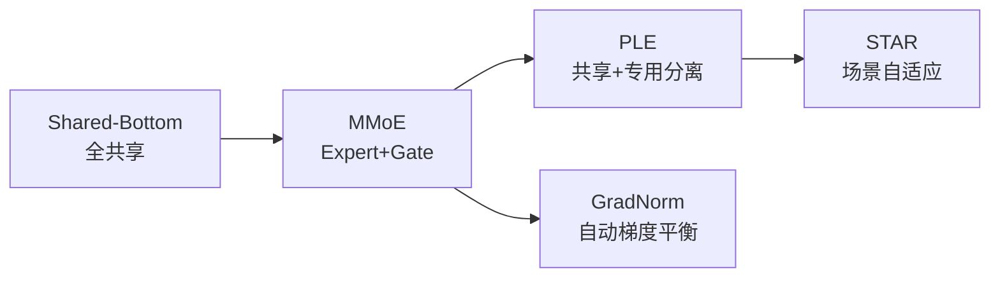

# 多任务学习与 MMOE：从共享底座到门控专家

> 标签：#MMOE #多任务学习 #梯度冲突 #PLE #GradNorm #CTR #CVR #推荐系统

---

## 🆚 多任务学习方案创新对比

| 方案 | 之前方案 | 创新 | 核心突破 |
|------|---------|------|---------|
| Shared-Bottom | 独立模型 | **共享底座** | 参数效率 |
| MMoE | Shared-Bottom（跷跷板） | **多 Expert + Gate 路由** | 自适应共享 |
| PLE | MMoE（Expert 全共享） | **共享 + 专用 Expert 分离** | 消除跷跷板效应 |
| GradNorm | 手动调多任务权重 | **自动梯度归一化** | 自动权重平衡 |

---

## 📈 多任务学习演进



---

## 1. 多任务学习的梯度冲突问题

### 1.1 为什么需要多任务学习

在广告/推荐系统中，业务目标是多维的：
- **CTR**（Click-Through Rate）：用户是否点击
- **CVR**（Conversion Rate）：点击后是否转化（购买/注册）
- **点赞率**、**收藏率**：用户满意度信号
- **时长**：视频播放时长

单独训练每个模型：浪费计算资源，且各模型无法共享通用特征。

**多任务学习的收益**：
1. 共享底层特征表示，减少参数量
2. 任务间的正向迁移（transfer）提升小样本任务效果
3. 统一服务框架，降低在线延迟

### 1.2 梯度冲突的数学证明

设两个任务 $T_1$、$T_2$ 的梯度分别为 $g_1 = \nabla_\theta L_1$、$g_2 = \nabla_\theta L_2$。

**梯度冲突条件**：两任务梯度的余弦相似度为负，即

$$
\cos\theta = \frac{g_1 \cdot g_2}{\|g_1\| \|g_2\|} < 0
$$

即夹角 $\theta > 90°$。

**为什么夹角 > 90° 时有问题**：

联合梯度 $g = g_1 + g_2$。对任务 1 的优化方向影响：

$$
\frac{dL_1}{d\text{update}} \propto g_1 \cdot g = g_1 \cdot (g_1 + g_2) = \|g_1\|^2 + g_1 \cdot g_2
$$

当 $g_1 \cdot g_2 < -\|g_1\|^2$ 时，更新方向实际上**增大** $L_1$，即优化 T2 反而伤害了 T1。

### 1.3 Hard Parameter Sharing 的局限

最简单的多任务架构：共享底层 MLP，各任务接独立的 Tower：

```
输入特征 → 共享 MLP（底座）→ Task1 Tower → CTR 输出
                           ↘ Task2 Tower → CVR 输出
```

**局限**：底座参数需要同时满足所有任务的梯度方向，当任务差异大时（如 CTR 偏娱乐，CVR 偏理性决策），底座成为瓶颈，强制共享反而导致负迁移（negative transfer）。

---

## 2. MMOE 核心公式推导

### 2.1 模型结构

MMOE（Multi-gate Mixture-of-Experts）引入 n 个专家网络，每个任务通过独立的门控网络对专家输出做软选择：

$$
y_k = h^k(f^k(x))
$$

$$
f^k(x) = \sum_{i=1}^n g^k_i(x) \cdot e_i(x)
$$

$$
g^k(x) = \text{softmax}(W_{gk} x)
$$

其中：
- $e_i(x)$：第 $i$ 个专家网络（独立的 MLP），$i = 1, \ldots, n$
- $g^k(x) \in \mathbb{R}^n$：任务 $k$ 的门控权重（每个专家的重要性）
- $W_{gk} \in \mathbb{R}^{n \times d_{input}}$：任务 $k$ 的门控矩阵
- $h^k$：任务 $k$ 的 Tower 网络（独立 MLP）

### 2.2 与 Hard Sharing 的对比

| 组件 | Hard Sharing | MMOE |
|------|-------------|------|
| 底座 | 1 个共享 MLP | n 个专家 MLP |
| 每任务输入 | 相同底座输出 | 专家的加权组合 |
| 参数灵活性 | 低 | 高（门控可学习） |
| 解释性 | 差 | 中（可看门控权重分布）|

**直觉**：不同任务可以"选择"不同的专家组合，CTR 任务可能更多使用学习了"用户兴趣"的专家，CVR 任务可能更多使用"转化意图"的专家。

### 2.3 参数量分析

设：$d_{input}=256$，$d_{expert}=128$，$n=8$ 个专家，$n_{layer}=2$（专家 MLP 层数），$K=2$（任务数）：

- 专家网络：$n \times (d_{input} \times d_{expert} + d_{expert}^2) = 8 \times (32768 + 16384) = 393216$
- 门控矩阵：$K \times n \times d_{input} = 2 \times 8 \times 256 = 4096$
- Tower 网络（每任务 2 层）：$K \times 2 \times d_{expert}^2 = 2 \times 2 \times 16384 = 65536$
- **总参数**：约 463K（相比 Hard Sharing 约 300K，多了约 50%，但效果提升显著）

### 2.4 MMOE 的 PyTorch 实现

```python
import torch
import torch.nn as nn
import torch.nn.functional as F

class MMOE(nn.Module):
    def __init__(self, input_dim, expert_dim, num_experts, num_tasks, tower_dims):
        super().__init__()
        
        # n 个专家网络（每个独立 MLP）
        self.experts = nn.ModuleList([
            nn.Sequential(
                nn.Linear(input_dim, expert_dim),
                nn.ReLU(),
                nn.Linear(expert_dim, expert_dim),
                nn.ReLU()
            ) for _ in range(num_experts)
        ])
        
        # K 个门控网络（每任务独立）
        self.gates = nn.ModuleList([
            nn.Linear(input_dim, num_experts)
            for _ in range(num_tasks)
        ])
        
        # K 个 Tower 网络
        self.towers = nn.ModuleList([
            nn.Sequential(
                nn.Linear(expert_dim, tower_dims[0]),
                nn.ReLU(),
                nn.Linear(tower_dims[0], 1),
                nn.Sigmoid()
            ) for _ in range(num_tasks)
        ])
    
    def forward(self, x):
        # 计算所有专家输出
        expert_outputs = torch.stack([e(x) for e in self.experts], dim=1)
        # expert_outputs: (batch, num_experts, expert_dim)
        
        task_outputs = []
        for k, (gate, tower) in enumerate(zip(self.gates, self.towers)):
            # 门控权重
            gate_weights = F.softmax(gate(x), dim=-1)  # (batch, num_experts)
            
            # 加权组合专家输出
            mixed = (gate_weights.unsqueeze(-1) * expert_outputs).sum(dim=1)
            # mixed: (batch, expert_dim)
            
            # Tower 输出
            task_outputs.append(tower(mixed))
        
        return task_outputs  # [CTR_pred, CVR_pred, ...]
```

---

## 3. PLE（Progressive Layered Extraction）改进

### 3.1 MMOE 的不足

MMOE 中所有专家都是共享的，理论上每个专家可以被任意任务使用。但实验发现：
- 专家倾向于"分工"，某些专家几乎只被一个任务使用
- 这种隐式分工不稳定，容易陷入"专家坍塌"（一个专家承担所有任务）

**PLE 的解决方案**：显式设计任务私有专家 + 共享专家。

### 3.2 PLE 核心设计

```
任务1私有专家: E1_1, E1_2
共享专家:      Es_1, Es_2, Es_3
任务2私有专家: E2_1, E2_2

任务1的门控 → [E1_1, E1_2, Es_1, Es_2, Es_3] 加权组合 → 任务1表示
任务2的门控 → [E2_1, E2_2, Es_1, Es_2, Es_3] 加权组合 → 任务2表示
```

### 3.3 PLE 多层 CGC（Customized Gate Control）

PLE 支持堆叠多个 Extraction Network 层：

$$
E^{(l,k)}(x) = \text{CGC}^{(l,k)}(x) \quad \text{（第 l 层，任务 k 的输出）}
$$

$$
\text{CGC}^{(l,k)} = \sum_{i} g^{(l,k)}_i \cdot e^{(l,k)}_i + \sum_j g^{(l,k)}_j \cdot e^{(l,s)}_j
$$

- $e^{(l,k)}_i$：任务 k 在第 l 层的私有专家输出
- $e^{(l,s)}_j$：第 l 层的共享专家输出
- 共享专家的输入是上一层所有任务表示的融合

**效果对比（腾讯视频实验）**：

| 模型 | AUC(CTR) | AUC(VCR) |
|------|----------|----------|
| 独立训练 | 0.7185 | 0.7052 |
| Hard Sharing | 0.7192 | 0.7038 |
| MMOE | 0.7198 | 0.7065 |
| PLE | 0.7210 | 0.7080 |

---

## 4. 训练技巧

### 4.1 GradNorm：动态平衡各任务损失权重

**问题**：朴素多任务 $L = \sum_k w_k L_k$ 中，$w_k$ 固定时，不同任务的梯度量级可能差异极大，学习不均衡。

**GradNorm 的思路**：动态调整 $w_k$，使每个任务的梯度范数保持在期望水平。

损失函数：

$$
L_{GradNorm} = \sum_i \left| G_W^i(t) - \bar{G}_W(t) \cdot r_i(t) \right|_1
$$

其中：
- $G_W^i(t) = \|\nabla_W (w_i L_i)\|_2$：任务 i 的加权梯度范数
- $\bar{G}_W(t) = \frac{1}{K}\sum_i G_W^i(t)$：所有任务梯度范数的均值
- $r_i(t) = \frac{\tilde{L}_i(t)}{\mathbb{E}[\tilde{L}_i]}$：任务 i 的相对训练速度（$\tilde{L}_i$ 为相对损失）
- $\alpha$：超参数，控制平衡强度（通常 0.12-1.5）

```python
def grad_norm_loss(task_losses, weights, shared_params, alpha=0.12):
    """
    task_losses: [L1, L2, ...]
    weights: 可学习的任务权重 [w1, w2, ...]
    """
    # 计算每个任务的加权梯度范数
    grad_norms = []
    for i, (loss, w) in enumerate(zip(task_losses, weights)):
        weighted_loss = w * loss
        grads = torch.autograd.grad(weighted_loss, shared_params, retain_graph=True)
        grad_norms.append(torch.stack([g.norm() for g in grads]).mean())
    
    # 计算目标梯度范数（均值 × 相对训练速度）
    mean_norm = torch.stack(grad_norms).mean().detach()
    # ... 计算 r_i(t) 并更新 weights
    
    return grad_norm_loss
```

### 4.2 Uncertainty Weighting

另一种自动平衡方案，基于同方差不确定性（homoscedastic uncertainty）：

$$
L = \sum_{i=1}^K \frac{1}{2\sigma_i^2} L_i + \log \sigma_i
$$

- $\sigma_i$：任务 i 的不确定性（可学习参数）
- 不确定性高的任务自动获得较小权重（$\frac{1}{\sigma_i^2}$ 小）
- $\log \sigma_i$ 防止 $\sigma_i \to \infty$（正则项）

**优势**：不需要手动设置任务权重，完全自动平衡。

### 4.3 任务采样比例

当不同任务的训练数据量差异巨大时，需要设置采样比例：

$$
p_k \propto (N_k)^\beta, \quad \beta \in [0, 1]
$$

- $\beta = 0$：均匀采样，小数据任务过采样
- $\beta = 1$：按数据量采样，小数据任务欠采样
- 通常 $\beta = 0.7$ 是较好的折中

---

## 5. 在广告/推荐中的应用

### 5.1 典型多目标配置

以电商广告为例：

| 任务 | 标签定义 | 数据量 | 任务相关性 |
|------|---------|--------|-----------|
| CTR | 广告曝光→点击 | 大（亿级）| - |
| CTCVR | 广告曝光→转化 | 中（千万级）| 与 CTR 高 |
| 点赞 | 内容好感度 | 小（百万级）| 与 CTR 中 |
| 收藏 | 购买意愿 | 小（百万级）| 与 CTCVR 高 |

**ESMM（Entire Space Multi-task Model）**：解决 CVR 样本选择偏差问题：

$$
P(\text{CVR}) = P(\text{CTR}) \cdot P(\text{CTCVR}) / P(\text{CTR})
$$

在全空间（曝光）上训练 CTR 和 CTCVR，然后用 $\text{CVR} = \text{CTCVR} / \text{CTR}$ 推导。

### 5.2 哪些任务适合共享，哪些适合分离

**适合共享（强正相关）**：
- CTR 和 CTCVR：都依赖用户兴趣特征
- 点击和收藏：都反映用户对内容的偏好

**适合分离（弱相关或负相关）**：
- CTR 和视频时长：点击率高不代表用户会看完
- 购买转化和点赞：转化需要理性决策，点赞更情感化

### 5.3 线上部署延迟分析

MMOE 的多个 Expert 可以**并行计算**（没有依赖关系），GPU 上实际延迟增加很小：

```
朴素 MLP 延迟：5ms
MMOE（8 Expert，GPU 并行）：6-7ms（仅增加 20-40%）
```

若 Expert 串行计算（CPU 或不支持并行的场景）：
```
MMOE（8 Expert，CPU 串行）：40ms（增加 8×，不可接受）
```

因此 MMOE 在 GPU 服务场景下性价比很高，CPU 服务场景需谨慎评估延迟。

---

## 6. 面试考点

### Q1：MMOE 和 Mixture of Experts (MoE) LLM 有什么关系？

二者都使用 "Expert + Gating" 思想，但场景不同。MMOE 是多任务场景：每个任务有独立门控，所有专家都激活（soft gating）。LLM 中的 MoE（如 Mixtral）是模型扩容场景：稀疏门控（每次只激活 Top-2 专家），减少每次 forward 的计算量。二者的门控机制类似，但 LLM MoE 是 sparse 的，MMOE 是 dense 的。

### Q2：梯度冲突如何检测？

在训练过程中监控各任务梯度的余弦相似度：若多数 step 中相似度 < -0.2，说明存在显著冲突，需要考虑分离共享层或使用 MMOE/PLE。也可以监控各任务的训练损失曲线：若某任务在多任务训练时损失下降明显慢于单任务训练，说明正在受到负迁移影响。

### Q3：MMOE 中专家数量怎么选？

经验规律：专家数 = 任务数 × 2-4。太少（专家数 = 任务数）：专家分工过于明确，失去共享的意义。太多（专家数 >> 任务数）：参数浪费，训练中门控容易产生专家坍塌（大多数专家几乎不被使用）。PLE 的私有+共享设计部分解决了专家坍塌问题。

### Q4：PLE 和 MMOE 的主要差异是什么？

MMOE 所有专家都是共享的，任务通过门控隐式分工。PLE 显式设计任务私有专家和共享专家，结构更清晰。实验上 PLE 在高度异构任务（如 CTR+时长）上效果更好，MMOE 在高度同质任务（如 CTR+CTCVR）上足够。PLE 也支持多层堆叠（Multi-layer），逐层提炼任务特定表示，类似 ResNet 的思想。

### Q5：Uncertainty Weighting 和 GradNorm 哪个更实用？

Uncertainty Weighting 实现简单（只需在损失函数中加可学习的 $\sigma_i$），计算开销小，适合快速原型。GradNorm 效果更可控（可以指定每个任务的训练速度），但需要计算各任务梯度范数，额外开销约 20-30%。实践中 Uncertainty Weighting 是首选，当任务间差异极大导致训练不稳定时再考虑 GradNorm。

### Q6：多任务学习什么时候不如分开训练？

(1) 任务之间负相关（梯度高度冲突）：强制共享反而损害性能；(2) 数据量极不均衡（一个任务是另一个的 1000 倍以上）：小数据任务被大数据任务淹没；(3) 任务特征空间差异很大（如文本 CTR 预估 + 图像质量评分）：共享底层特征本身就不合理。检验标准：各任务在多任务训练下的 AUC 不低于独立训练。

### Q7：在线部署时如何服务多个目标？

最终排序时，多个任务的预测分数需要组合成单一排序得分：$\text{score} = \text{CTR} \times (\text{价值系数}}_{\text{1 \times \text{CVR}} + \text{价值系数}}_{\text{2 \times \text{收藏率}} + \ldots)$。各任务权重通过业务实验确定，不同业务场景（GMV 优化/用户体验优化）权重不同。MMOE 的输出维度是各任务独立的 sigmoid 输出，每个分数的绝对值有意义（需要 CTR 校准保证概率准确性）。

---

## 参考资料

- Ma et al. "Modeling Task Relationships in Multi-task Learning with Multi-gate Mixture-of-Experts" (MMOE, KDD 2018)
- Tang et al. "Progressive Layered Extraction (PLE): A Novel Multi-Task Learning (MTL) Model for Personalized Recommendations" (RecSys 2020)
- Ma et al. "Entire Space Multi-Task Model: An Effective Approach for Estimating Post-Click Conversion Rate" (ESMM, SIGIR 2018)
- Chen et al. "GradNorm: Gradient Normalization for Adaptive Loss Balancing in Deep Multitask Networks" (ICML 2018)
- Kendall et al. "Multi-Task Learning Using Uncertainty to Weigh Losses for Scene Geometry and Semantics" (CVPR 2018)
