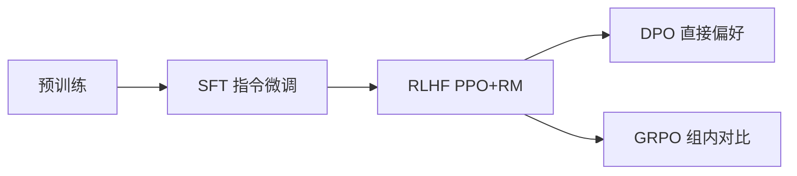

# RLHF 与奖励建模：从人类反馈到强化学习对齐

> 标签：#RLHF #PPO #奖励模型 #对齐 #SFT #DeepSeekR1 #GRPO #广告RL

---

## 🆚 对齐方案创新对比

| 方案 | 之前方案 | 创新 | 核心突破 |
|------|---------|------|--------|
| SFT | 预训练（无对齐） | 指令数据微调 | 遵循指令 |
| RLHF | SFT（无偏好） | **Reward Model + PPO** | 人类偏好对齐 |
| DPO | RLHF（需 RM） | **直接偏好优化** | 省去 RM 训练 |
| GRPO | PPO（需 Critic） | **组内相对奖励** | 显存减半 |



---
---

## 1. RLHF 三阶段完整流程

### 1.1 总览

RLHF（Reinforcement Learning from Human Feedback）是使 LLM 与人类意图对齐的核心技术，由三个阶段组成：

```
阶段1: SFT（监督微调）
  人工标注的高质量回答 → 微调预训练模型 → SFT 模型

阶段2: Reward Model 训练
  人类偏好比较数据（y_w > y_l）→ 训练奖励模型 → RM 模型

阶段3: PPO 强化学习微调
  SFT 模型（策略初始化）+ RM（奖励信号）→ PPO 训练 → 对齐模型
```

### 1.2 阶段 1：SFT

目标：让模型学会"按指令格式回答"，建立基础的遵循指令能力。

训练方式：标准的监督学习，最大化示范回答的对数似然：

$$
L_{SFT} = -\mathbb{E}_{(x, y) \sim D_{SFT}} \sum_t \log p_\theta(y_t | x, y_{<t})
$$

- $D_{SFT}$：人工标注的指令-回答对数据集
- 通常需要数万到数十万条高质量示范数据

### 1.3 阶段 2：Reward Model 训练

**数据收集**：给定 prompt $x$，SFT 模型生成多个候选回答，由人工标注者比较偏好，给出排序（$y_w \succ y_l$，表示 $y_w$ 比 $y_l$ 更好）。

**Bradley-Terry 偏好模型**：

$$
P(y_w \succ y_l | x) = \sigma(r(x, y_w) - r(x, y_l))
$$

其中 $r(x, y)$ 是奖励函数，$\sigma$ 是 sigmoid 函数。

**推导**：BT 模型假设每个回答有潜在的"质量分数"$s$，$y_w$ 胜过 $y_l$ 的概率由二者得分差的 sigmoid 决定，类似 Elo 评分系统。

**训练损失**（最大似然估计 BT 参数）：

$$
L_{RM} = -\mathbb{E}_{(x, y_w, y_l) \sim D_{pref}} \left[\log \sigma(r_\phi(x, y_w) - r_\phi(x, y_l))\right]
$$

等价形式：

$$
L_{RM} = \mathbb{E}\left[\log(1 + e^{-(r_\phi(x, y_w) - r_\phi(x, y_l))})\right]
$$

**实现细节**：
```python
class RewardModel(nn.Module):
    def __init__(self, base_model):
        super().__init__()
        self.base = base_model  # 预训练 LLM
        self.value_head = nn.Linear(self.base.config.hidden_size, 1)
    
    def forward(self, input_ids, attention_mask):
        outputs = self.base(input_ids, attention_mask=attention_mask)
        # 用最后一个 token 的 hidden state 作为奖励
        last_hidden = outputs.last_hidden_state[:, -1, :]
        reward = self.value_head(last_hidden).squeeze(-1)
        return reward

def rm_loss(reward_model, x_chosen, x_rejected):
    r_chosen = reward_model(*x_chosen)     # r(x, y_w)
    r_rejected = reward_model(*x_rejected) # r(x, y_l)
    loss = -F.logsigmoid(r_chosen - r_rejected).mean()
    return loss
```

---

## 2. Reward Hacking 问题

### 2.1 什么是 Reward Hacking

奖励模型是人类偏好的近似，不是完美代理。策略模型（LLM）在 PPO 训练中倾向于寻找并利用奖励模型的弱点（adversarial examples），导致：
- 回答变得很长（奖励模型偏爱冗长回答）
- 充斥各种肯定性语言（"当然！"、"好的！"）但内容空洞
- 生成满足奖励模型但不满足人类真实意图的回答

### 2.2 KL 散度惩罚

核心防御机制：在 PPO 优化时，对偏离 SFT 模型的程度施加惩罚：

$$
r_{total}(x, y) = r_{RM}(x, y) - \beta \log \frac{\pi_\theta(y | x)}{\pi_{SFT}(y | x)}
$$

- $r_{RM}$：奖励模型分数
- $\beta \log \frac{\pi_\theta}{\pi_{SFT}}$：KL 惩罚项，约束策略不偏离 SFT 模型太远
- $\beta$：惩罚系数（通常 0.01-0.1）

**KL 散度展开**：

$$
\mathbb{E}_y \left[\log \frac{\pi_\theta(y|x)}{\pi_{SFT}(y|x)}\right] = D_{KL}(\pi_\theta || \pi_{SFT})
$$

$\beta$ 越大，策略越保守（接近 SFT 模型）；$\beta$ 越小，策略可以更自由地优化奖励。

---

## 3. PPO 算法原理

### 3.1 强化学习基础

将语言生成视为 MDP（马尔可夫决策过程）：
- **状态** $s_t = (x, y_{<t})$：prompt + 已生成的 token
- **动作** $a_t = y_t$：生成下一个 token（|V| 维离散动作空间）
- **奖励** $r_t$：仅在序列末尾给出（稀疏奖励）

### 3.2 PPO-Clip 目标

$$
L^{CLIP}(\theta) = \mathbb{E}_t \left[\min\left(r_t(\theta) \hat{A}_t,\ \text{clip}(r_t(\theta), 1-\epsilon, 1+\epsilon) \hat{A}_t\right)\right]
$$

其中：
- $r_t(\theta) = \frac{\pi_\theta(a_t | s_t)}{\pi_{\theta_{old}}(a_t | s_t)}$：新旧策略的重要性权重
- $\hat{A}_t$：优势函数估计（当前动作比平均好多少）
- $\epsilon$：裁剪范围（通常 0.2），限制每次更新幅度

**为什么需要 Clip**：PPO 是信任域方法，每次更新不能太大（太大导致训练不稳定）。Clip 直接限制了重要性权重的范围，等价于限制策略更新幅度，简单有效。

### 3.3 优势函数 GAE（Generalized Advantage Estimation）

$$
\hat{A}_t = \sum_{l=0}^{T-t} (\gamma \lambda)^l \delta_{t+l}
$$

$$
\delta_t = r_t + \gamma V(s_{t+1}) - V(s_t)
$$

- $V(s_t)$：价值网络对状态 $s_t$ 的估计（基线）
- $\gamma$：折扣因子（通常 1.0，因为语言生成是短 episode）
- $\lambda$：GAE 参数（通常 0.95），控制偏差-方差权衡

### 3.4 RLHF 中 PPO 的特殊之处

```python
def compute_rlhf_reward(prompt, response, reward_model, ref_model, policy_model, beta=0.1):
    """
    组合奖励：RM 分数 - KL 惩罚
    """
    # 奖励模型分数
    rm_score = reward_model(prompt + response)
    
    # KL 惩罚（token 级别）
    log_prob_policy = policy_model.log_prob(response, prompt)  # 当前策略
    log_prob_ref = ref_model.log_prob(response, prompt)        # SFT 参考策略
    kl_penalty = log_prob_policy - log_prob_ref  # 每个 token 的 KL
    
    # 只在最后一个 token 加 RM 奖励，其余位置加 KL 惩罚
    rewards = -beta * kl_penalty
    rewards[-1] += rm_score
    
    return rewards
```

---

## 4. RLVR：强化学习 + 可验证奖励

### 4.1 DeepSeek R1 的方案

**核心区别**：RLHF 需要人工标注偏好数据来训练奖励模型；RLVR 使用**可自动验证**的客观奖励，不需要人工偏好标注。

适用场景：
- **数学推理**：答案对/错可自动验证
- **代码生成**：代码能否通过测试用例
- **逻辑推理**：结构化问题有唯一正确答案

**DeepSeek-R1 奖励设计**：
```python
def compute_r1_reward(model_output, ground_truth):
    rewards = []
    
    for output, answer in zip(model_output, ground_truth):
        reward = 0.0
        
        # 1. 正确性奖励（主要奖励）
        if extract_answer(output) == answer:
            reward += 1.0
        
        # 2. 格式奖励（鼓励 <think>...</think> 结构）
        if has_thinking_format(output):
            reward += 0.1
        
        # 3. 不给过程分（只评估最终答案）
        rewards.append(reward)
    
    return rewards
```

### 4.2 GRPO 算法（Group Relative Policy Optimization）

DeepSeek-R1 使用 GRPO 替代 PPO，简化了训练：

**核心思想**：对同一 prompt 采样一组（Group）回答，计算相对奖励，省去价值网络（Value Network）。

$$
\hat{A}_i = \frac{r_i - \text{mean}(\{r_1, \ldots, r_G\})}{\text{std}(\{r_1, \ldots, r_G\})}
$$

GRPO 目标：

$$
L_{GRPO} = \mathbb{E}_{q, \{o_i\}}\left[\frac{1}{G}\sum_{i=1}^G \min\left(\frac{\pi_\theta(o_i|q)}{\pi_{old}(o_i|q)} \hat{A}_i,\ \text{clip}(\ldots) \hat{A}_i\right) - \beta D_{KL}(\pi_\theta || \pi_{ref})\right]
$$

**GRPO vs PPO**：
- PPO 需要价值网络（参数量与策略网络相当），内存需求 2×
- GRPO 用组内均值作基线，无需价值网络，内存节省约 50%
- GRPO 在可验证奖励场景下效果与 PPO 相当甚至更好

---

## 5. 奖励机制在广告系统的应用

### 5.1 广告文案生成的奖励设计

用 LLM 生成广告创意时，奖励信号可以来自：

```python
def ad_creative_reward(generated_ad, context):
    reward = 0.0
    
    # 1. 在线 CTR 预估（主要奖励）
    ctr_model_score = ctr_model.predict(
        ad_text=generated_ad,
        user_context=context['user'],
        placement=context['placement']
    )
    reward += 2.0 * ctr_model_score
    
    # 2. 质量规则约束（负奖励）
    if violates_ad_policy(generated_ad):
        reward -= 5.0  # 违规惩罚
    
    if not contains_cta(generated_ad):  # 无行动号召
        reward -= 0.5
    
    # 3. 多样性奖励（防止模型输出单一）
    reward += 0.1 * novelty_score(generated_ad, context['history_ads'])
    
    return reward
```

### 5.2 在线学习中的 Bandit 框架

广告系统中最常用的是简化版 RL——上下文 Bandit（Contextual Bandit）：

- **状态/上下文 $x$**：用户特征 + 广告特征
- **动作 $a$**：选择展示哪个广告（有限离散动作）
- **奖励 $r$**：点击（+1）或不点击（0），即时观测
- **无状态转移**（区别于完整 RL）

**UCB（Upper Confidence Bound）策略**：

$$
a_t = \arg\max_a \left[\hat{r}(x_t, a) + \alpha \sqrt{\frac{\log t}{n_a}}\right]
$$

- $\hat{r}(x_t, a)$：CTR 模型预估的期望奖励
- $\sqrt{\frac{\log t}{n_a}}$：探索项（展示次数少的广告给予探索奖励）

### 5.3 多臂老虎机 vs 完整 RL

| 维度 | Bandit | 完整 RL |
|------|--------|---------|
| 奖励 | 即时，无延迟 | 可延迟（如 LTV）|
| 状态转移 | 无（每次独立） | 有（用户历史状态改变）|
| 决策序列 | 单步 | 多步（session 级别）|
| 实现复杂度 | 低 | 高 |
| 广告场景适用 | 单次曝光优化 | Session 级别长期价值优化 |

---

## 6. 面试考点

### Q1：RLHF 相比 SFT 的优势是什么？

SFT 只能学习"示范者给的答案"，受限于标注数据质量。RLHF 可以从比较中学习，人类更容易比较两个回答的好坏（相对评分）而非给出绝对评分，标注更高效也更一致。此外，RLHF 可以优化人类偏好的多个维度（有用、无害、诚实），SFT 难以同时优化多目标。

### Q2：Reward Hacking 的根本原因和解决方案？

根本原因：奖励模型是人类偏好的不完美代理，存在"漏洞"可被策略利用。主要解决方案：(1) KL 惩罚（防止偏离 SFT 太远）；(2) 奖励模型集成（训练多个 RM，取最小奖励）；(3) 宪法 AI（用 LLM 辅助奖励打分，减少人工标注偏差）；(4) RLVR（使用可验证奖励，绕过奖励模型不完美的问题）。

### Q3：PPO 中为什么需要 Clip？不用行不行？

Clip 是 PPO 对 TRPO 的简化替代。TRPO 直接约束 KL 散度（$D_{KL}(\pi_{new}||\pi_{old}) \leq \delta$），但计算二阶导数代价极高。PPO-Clip 通过限制重要性权重 $r_t(\theta) \in [1-\epsilon, 1+\epsilon]$ 间接约束更新幅度，近似实现 TRPO 的效果。不 Clip 的后果：单步更新过大，策略崩溃（policy collapse），表现为生成退化到重复 token 或固定模式。

### Q4：GRPO 和 PPO 的核心区别？

PPO 需要额外的价值网络（Critic）来估计状态价值，用于计算优势函数 $\hat{A}_t = r_t - V(s_t)$，内存是策略网络的 2 倍。GRPO 通过对同一 prompt 采样多个回答，用组内奖励的相对值（归一化）作为优势估计，无需价值网络，内存节省约 50%。对于有明确答案的任务（数学、代码），GRPO 效果与 PPO 相当，是 DeepSeek 系列模型训练推理能力的核心方法。

### Q5：RLHF 数据的标注质量如何保证？

(1) 标注者培训：明确评价维度（有用性、安全性、真实性）及评分标准；(2) 标注者一致性检验：定期测试集检验，一致性 <80% 的标注者需重新培训；(3) 多标注者冗余：每对样本至少 3 名标注者，取多数意见；(4) 标注界面设计：呈现两个回答时随机打乱顺序，避免位置偏差；(5) 持续审计：监测奖励模型表现，如果验证集准确率下降，需补充标注数据。

### Q6：广告系统为什么通常用 Bandit 而不是完整 RL？

广告系统的主要目标是即时 CTR/CVR，奖励是即时可观测的，不需要考虑长期状态转移，Bandit 框架就够用。完整 RL 适合 Session 级别的长期优化（如最大化用户 7 日 LTV），但实现复杂，线上环境的状态转移难以建模，样本效率低。只有在明确有长期效益（如 App 留存）且短期信号与长期目标不一致时，才需要引入完整 RL。

### Q7：奖励模型为什么要与策略模型大小相当？

奖励模型太小（如用 1B 模型评估 70B 策略的输出）：(1) RM 无法理解复杂推理过程，只能评估表面形式；(2) RM 更容易被利用（adversarial）。使用与策略同等大小甚至更大的 RM 能提供更准确的奖励信号，降低 Reward Hacking 风险。实践中常见配置：7B/13B 策略模型配 7B RM，70B 策略配 13-34B RM（考虑成本）。

### Q8：如何评估 RLHF 模型的对齐程度？

(1) 奖励模型分数：在保留的偏好测试集上计算准确率（RM 偏好与人类标注一致的比例）；(2) 人工评估：对比 SFT 模型和 RLHF 模型的输出，由人工评估哪个更好（胜率）；(3) 自动基准：MT-Bench（多轮对话质量）、Alpaca Eval（指令遵循）、TruthfulQA（真实性）；(4) 安全性测试：红队测试（red teaming），评估模型在对抗性 prompt 下的安全边界；(5) KL 散度监控：确保策略不偏离 SFT 过远（过度对齐可能损害能力）。

---

## 参考资料

- Ouyang et al. "Training language models to follow instructions with human feedback" (InstructGPT, 2022)
- Christiano et al. "Deep Reinforcement Learning from Human Preferences" (2017)
- Schulman et al. "Proximal Policy Optimization Algorithms" (PPO, 2017)
- DeepSeek-AI. "DeepSeek-R1: Incentivizing Reasoning Capability in LLMs via Reinforcement Learning" (2025)
- Shao et al. "DeepSeekMath: Pushing the Limits of Mathematical Reasoning in Open Language Models" (GRPO, 2024)
- Bai et al. "Constitutional AI: Harmlessness from AI Feedback" (2022)
