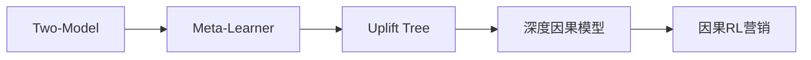

# Uplift 建模：从因果效应到营销增益

> 标签：#Uplift #因果推断 #ITE #CATE #元学习器 #Qini #广告定向 #营销优化

---

## 🆚 增益建模方案对比

| 方案 | 之前方案 | 创新 | 适用场景 |
|------|---------|------|--------|
| Two-Model | 无因果考虑 | **Treatment/Control 分别建模** | 简单 |
| Meta-Learner | Two-Model（偏差大） | **S/T/X-Learner 框架** | 通用 |
| Tree-Based | 传统 CART | **Uplift Tree 最大化异质性** | 可解释 |
| CEVAE | 观测数据（无反事实） | **变分自编码因果推断** | 深度学习 |
| CFRNet/TARNet | T-Learner（表示无约束） | **IPM 正则平衡分布** | 深度通用 |
| DragonNet | 独立 propensity | **共享表示+三头+靶向正则** | 深度通用 |
| GANITE | 单点预测 | **GAN 生成反事实** | 深度学习 |
| Contextual Bandits | 静态 Uplift | **在线探索-利用** | 动态决策 |



---
---

## 1. Uplift 的本质：反事实推断

### 1.1 基本问题设定

**核心悖论**：同一个用户不能同时处于"接受广告"和"不接受广告"两种状态，我们永远无法同时观测到两个潜在结果。

**潜在结果框架（Potential Outcomes / Rubin Causal Model）**：

$$
\tau_i = Y_i(1) - Y_i(0)
$$

- $Y_i(1)$：用户 $i$ 接受广告（treatment=1）后的结果（如是否转化）
- $Y_i(0)$：用户 $i$ 不接受广告（treatment=0）后的结果
- $\tau_i$：个体处理效应（Individual Treatment Effect, ITE）
- 由于"基本因果推断问题"，$\tau_i$ 对单个用户永远不可直接观测

### 1.2 三种因果效应估计

**ATE（平均处理效应）**：

$$
\text{ATE} = \tau = \mathbb{E}[Y(1) - Y(0)] = \mathbb{E}[Y(1)] - \mathbb{E}[Y(0)]
$$

在随机对照实验（RCT）中，ATE 可以直接通过处理组均值 - 对照组均值估计。

**ATT（处理组的平均处理效应）**：

$$
\text{ATT} = \mathbb{E}[Y(1) - Y(0) | T = 1]
$$

只关心实际接收广告的用户中，广告的平均效果。

**CATE（条件平均处理效应）**：

$$
\text{CATE} = \tau(x) = \mathbb{E}[Y(1) - Y(0) | X = x]
$$

在具有特征 $x$ 的用户群体中，广告的平均效果。**Uplift 建模的核心目标就是估计 CATE**。

### 1.3 随机化假设

CATE 可估计需要以下假设：

1. **SUTVA**（稳定单位处理值假设）：用户 A 是否接受广告不影响用户 B 的结果
2. **无混淆性**（Unconfoundedness）：$\{Y(0), Y(1)\} \perp T | X$，即给定特征 $X$ 后，处理分配独立于潜在结果（随机实验天然满足）
3. **重叠性**（Overlap）：$0 < P(T=1|X) < 1$，即每个特征值的用户都有机会出现在处理组和对照组

---

## 2. 三大元学习器

### 2.1 S-Learner（Single Learner，单模型）

**思路**：将 treatment $T$ 作为一个普通特征，训练单一预测模型：

$$
\hat{\mu}(x, t) = \mathbb{E}[Y | X=x, T=t]
$$

**Uplift 估计**：

$$
\hat{\tau}(x) = \hat{\mu}(x, 1) - \hat{\mu}(x, 0)
$$

**训练过程**：

```python
from sklearn.ensemble import GradientBoostingClassifier
import numpy as np

class SLearner:
    def __init__(self, base_learner=None):
        self.model = base_learner or GradientBoostingClassifier()
    
    def fit(self, X, T, Y):
        # 将 T 拼接到 X 中作为特征
        X_with_t = np.column_stack([X, T])
        self.model.fit(X_with_t, Y)
    
    def predict_uplift(self, X):
        n = len(X)
        # 预测处理组结果
        X_treat = np.column_stack([X, np.ones(n)])
        y_treat = self.model.predict_proba(X_treat)[:, 1]
        
        # 预测对照组结果
        X_ctrl = np.column_stack([X, np.zeros(n)])
        y_ctrl = self.model.predict_proba(X_ctrl)[:, 1]
        
        return y_treat - y_ctrl  # CATE 估计
```

**优点**：实现简单，利用所有数据。

**缺点**：Treatment 信号可能被其他特征淹没（稀释），导致估计偏向 0。树类模型尤其明显，因为 T 只有 0/1 两个取值。

### 2.2 T-Learner（Two Learner，双模型）

**思路**：分别在处理组和对照组数据上训练两个独立模型：

$$
\hat{\mu}_1(x) = \mathbb{E}[Y | X=x, T=1]
$$

$$
\hat{\mu}_0(x) = \mathbb{E}[Y | X=x, T=0]
$$

**Uplift 估计**：

$$
\hat{\tau}(x) = \hat{\mu}_1(x) - \hat{\mu}_0(x)
$$

```python
class TLearner:
    def __init__(self, learner_t=None, learner_c=None):
        self.model_t = learner_t or GradientBoostingClassifier()
        self.model_c = learner_c or GradientBoostingClassifier()
    
    def fit(self, X, T, Y):
        # 分处理组/对照组训练
        self.model_t.fit(X[T == 1], Y[T == 1])
        self.model_c.fit(X[T == 0], Y[T == 0])
    
    def predict_uplift(self, X):
        y_treat = self.model_t.predict_proba(X)[:, 1]
        y_ctrl = self.model_c.predict_proba(X)[:, 1]
        return y_treat - y_ctrl
```

**优点**：Treatment 信号直接体现在数据分割，不会被稀释。

**缺点**：两个模型的估计误差会叠加（variance 增大）；当处理组/对照组样本量极不均衡时，少数组的模型精度差。

### 2.3 X-Learner（Cross Learner，交叉学习器）

**思路**：通过交叉预测来估计个体处理效应，解决 T-Learner 在样本不均衡时的问题。

**第一阶段**：训练 T-Learner，得到 $\hat{\mu}_0$、$\hat{\mu}_1$

**第二阶段**：构造伪处理效应标签（pseudo treatment effect）：

对处理组用户（$T=1$）：

$$
\tilde{\tau}_i^1 = Y_i - \hat{\mu}_0(X_i)
$$

即：实际观测结果 - 如果没有处理的预期结果

对对照组用户（$T=0$）：

$$
\tilde{\tau}_i^0 = \hat{\mu}_1(X_i) - Y_i
$$

即：如果有处理的预期结果 - 实际观测结果

**第三阶段**：分别在处理组和对照组上训练 Uplift 预测模型：

$$
\hat{\tau}_1(x) = \mathbb{E}[\tilde{\tau}^1 | X=x] \quad \text{（在处理组上训练）}
$$

$$
\hat{\tau}_0(x) = \mathbb{E}[\tilde{\tau}^0 | X=x] \quad \text{（在对照组上训练）}
$$

**第四阶段**：加权融合：

$$
\hat{\tau}(x) = g(x) \hat{\tau}_0(x) + (1 - g(x)) \hat{\tau}_1(x)
$$

- $g(x) = P(T=1|X=x)$：倾向得分（propensity score）
- 用处理组比例大的地方更信任 $\hat{\tau}_1$，对照组比例大的地方更信任 $\hat{\tau}_0$

**X-Learner 的优势**：当处理组样本量远大于对照组时（常见广告场景：处理组 90%，对照组 10%），$\hat{\tau}_1$ 能利用更多处理组数据，减少对照组稀少导致的 $\hat{\tau}_0$ 估计偏差。

---

## 3. Uplift 树和随机森林

### 3.1 节点分裂准则

普通决策树的分裂准则：最小化 Gini 不纯度或最大化信息增益。

**Uplift 树的分裂准则**：最大化处理组和对照组之间的结果分布差异（即最大化 Uplift）。

**KL 散度分裂准则**：

$$
\text{Gain}_{	ext{KL}}(T) = D_{KL}(P^T || P^C)
$$

其中：
- $P^T$：处理组的结果分布 $P(Y|T=1)$
- $P^C$：对照组的结果分布 $P(Y|T=0)$
- $D_{KL}(P||Q) = \sum_y P(y) \log \frac{P(y)}{Q(y)}$

**Euclidean Distance 分裂**（二元结果）：

$$
\text{Gain}_{	ext{ED}} = 2 \left[p_t \log \frac{p_t}{p_c} + (1-p_t) \log \frac{1-p_t}{1-p_c}\right]
$$

其中 $p_t = P(Y=1|T=1)$，$p_c = P(Y=1|T=0)$。

### 3.2 与普通树的区别

| 组件 | 普通决策树 | Uplift 树 |
|------|-----------|----------|
| 分裂准则 | 最大化 purity（Y 的纯度）| 最大化处理效应异质性 |
| 叶节点值 | Y 的均值/众数 | $\bar{Y}_T - \bar{Y}_C$（Uplift 估计）|
| 训练目标 | 预测 Y | 预测 $\tau(x)$ |

### 3.3 Uplift 随机森林

```python
from causalml.inference.tree import UpliftRandomForestClassifier

uplift_rf = UpliftRandomForestClassifier(
    n_estimators=100,
    evaluationFunction='KL',  # KL 散度分裂
    max_features='sqrt',
    random_state=42
)
uplift_rf.fit(X_train, treatment=T_train, y=Y_train)
uplift_pred = uplift_rf.predict(X_test)
```

---

## 4. 工业应用：广告定向优化

### 4.1 四象限用户分类

这是 Uplift 建模最直观的应用框架：

```
                  有广告时
                 转化  不转化
无广告时  转化  |  ①  |  ②  |
          不转化|  ③  |  ④  |
```

- ①：**Sure Things（必然转化）**：无论有无广告都会转化，广告浪费投入
- ②：**Sleeping Dogs（沉睡狗）**：无广告时转化，有广告时反而不转化（广告打扰或过度推销）
- ③：**Persuadables（说服型）**：无广告不转化，有广告才转化 → **目标用户！**
- ④：**Lost Causes（永久流失）**：无论如何都不转化，广告无效

**广告定向策略**：
- 只对 Persuadables 投放广告
- 避免对 Sleeping Dogs 投放（可能产生负效果）
- Sure Things 和 Lost Causes 可以节省预算

### 4.2 预算分配优化

给定预算 $B$，目标是最大化转化增量：

$$
\max \sum_i \hat{\tau}_i \cdot z_i \quad \text{s.t.} \sum_i c_i z_i \leq B,\ z_i \in \{0, 1\}
$$

**贪心解**：按 $\hat{\tau}_i / c_i$（单位成本 Uplift）排序，从高到低选取直到预算耗尽。

```python
def optimize_targeting(uplift_scores, costs, budget):
    """
    按单位成本 Uplift 排序，贪心分配预算
    """
    roi = uplift_scores / costs  # 每元成本带来的增量转化
    sorted_indices = np.argsort(roi)[::-1]
    
    selected = []
    remaining_budget = budget
    
    for idx in sorted_indices:
        if costs[idx] <= remaining_budget:
            selected.append(idx)
            remaining_budget -= costs[idx]
    
    return selected
```

### 4.3 常见陷阱：选择偏差（Selection Bias）

在非随机数据中（如历史广告投放数据），已有投放策略导致处理组和对照组系统性不同（如高价值用户更可能被投放广告），直接用 T-Learner 会产生有偏估计。

**解决方案**：倾向得分加权（IPW）：

$$
\hat{\tau}_{IPW} = \mathbb{E}\left[\frac{TY}{e(X)} - \frac{(1-T)Y}{1-e(X)}\right]
$$

其中 $e(X) = P(T=1|X)$ 是倾向得分。IPW 通过给少数组样本更高权重来修正选择偏差。

---

## 5. 评估指标

### 5.1 Uplift 曲线和 AUUC

**Uplift 曲线**：将用户按预测 Uplift 从高到低排序，计算累积增量转化（处理组转化 - 对照组转化）。

```python
def uplift_curve(y_true, treatment, uplift_pred):
    """计算 Uplift 曲线"""
    df = pd.DataFrame({
        'y': y_true, 'T': treatment, 'uplift': uplift_pred
    }).sort_values('uplift', ascending=False)
    
    n = len(df)
    cumulative_treat = (df['T'] * df['y']).cumsum() / (df['T'].cumsum() + 1e-10)
    cumulative_ctrl = ((1-df['T']) * df['y']).cumsum() / ((1-df['T']).cumsum() + 1e-10)
    
    return cumulative_treat - cumulative_ctrl  # Uplift 曲线
```

**AUUC（Area Under Uplift Curve）**：Uplift 曲线下面积，类比 ROC 曲线的 AUC。值越高，模型对 Persuadables 的识别能力越强。

### 5.2 Qini 曲线和 Qini 系数

**Qini 曲线（Radcliffe, 2007）**：横轴为按 Uplift 排序后的人群比例（0到1），纵轴为累积增量转化人数：

$$
Q(t) = \left(\frac{n_{t,1}}{n_1} - \frac{n_{t,0}}{n_0}\right) \cdot (n_1 + n_0) \cdot t
$$

- $n_{t,1}$：前 $t$ 比例人群中处理组的转化人数
- $n_{t,0}$：前 $t$ 比例人群中对照组的转化人数

**Qini 系数**：Qini 曲线与随机基线（对角线）之间的面积之比：

$$
\text{Qini} = \frac{\text{Qini 曲线下面积} - \text{随机基线面积}}{\text{理想曲线面积} - \text{随机基线面积}}
$$

### 5.3 与 ROC AUC 的类比

| 概念 | 分类模型 | Uplift 模型 |
|------|---------|-----------|
| 预测目标 | P(Y=1) | τ(x) = E[Y(1)-Y(0)\|X=x] |
| 排序曲线 | ROC（TPR vs FPR）| Uplift 曲线 / Qini 曲线 |
| 面积指标 | AUC | AUUC / Qini 系数 |
| 随机基线 | 对角线（AUC=0.5）| 对角线（AUUC=0）|
| 完美模型 | AUC=1.0 | 完美区分四象限 |

---

## 6. 面试考点

### Q1：为什么 S-Learner 的 Uplift 估计会偏向 0？

S-Learner 将 T 作为普通特征，与 X 中的其他特征（如年龄、性别等）共同决定预测。若 X 维度远大于 1（T 的维度），模型在分裂/训练时可能认为 T 不如其他特征重要，导致 T 的影响被压缩。尤其是正则化较强的树模型（如 Random Forest 的 max_features）可能根本不选择 T 特征分裂，得到的 Uplift 估计几乎为 0。

### Q2：Uplift 建模和 CTR 预估有什么本质区别？

CTR 预估估计的是 P(转化 | 用户特征, 广告特征)，包含了"不投广告也会转化"的部分（即 Sure Things 的贡献）。Uplift 建模估计的是"因广告带来的增量转化"，排除了自然转化。对 Sure Things 用 CTR 选广告会浪费预算；用 Uplift 选广告只对边际用户（Persuadables）投放，ROI 更高。

### Q3：如何在没有随机实验的情况下估计 Uplift？

需要用观测数据（历史数据）进行因果推断，常用方法：(1) 倾向得分匹配（PSM）：为每个处理组用户找倾向得分接近的对照组用户配对；(2) 逆概率加权（IPW）：用倾向得分加权修正选择偏差；(3) 双重机器学习（DML）：同时控制混淆变量和高维特征；(4) 工具变量（IV）：找到只影响处理（广告投放）而不直接影响结果（转化）的变量。关键前提：满足无混淆性假设，即所有影响处理分配的变量都被观测到。

### Q4：倾向得分（Propensity Score）是什么，X-Learner 为什么用它加权？

倾向得分 $e(x) = P(T=1|X=x)$ 是在给定特征 $x$ 下，用户被分配到处理组的概率。X-Learner 中，当处理组样本多（$e(x)$ 大）时，应更信任基于处理组估计的 $\hat{\tau}_1(x)$；当对照组样本多（$e(x)$ 小）时，应更信任 $\hat{\tau}_0(x)$。加权 $g(x) = e(x)$ 实现了这一平衡，等价于根据数据丰富度自动分配模型权重。

### Q5：Qini 系数为负意味着什么？

Qini 系数为负意味着模型的排序比随机排序还差，即将"Sleeping Dogs"和"Lost Causes"排在了高 Uplift 位置，将真正的"Persuadables"排在了低位。这往往是因为：(1) 训练数据中 Sure Things 的正标签占多数，模型混淆了"高转化率"和"高增量转化率"；(2) 特征工程不当，没有包含能区分因果效应的特征。

### Q6：在广告系统中，A/B 测试和 Uplift 建模如何配合？

A/B 测试是 Uplift 建模的数据基础：随机实验保证了无混淆性假设，使 CATE 估计是无偏的。流程：(1) 随机实验收集数据（处理组 / 对照组）；(2) 训练 Uplift 模型，估计每个用户的 $\hat{\tau}(x)$；(3) 按 $\hat{\tau}$ 分层，验证不同 Uplift 分层中的实际增量转化与预测一致；(4) 上线时，对 $\hat{\tau}$ 高的用户投放广告，对低 Uplift 用户节省预算。

### Q7：如何处理 Uplift 建模中的假负样本问题？

假负样本（False Negative）：本应是"Persuadable"的用户在历史数据中没有被投放广告（被错误地放入对照组），观测结果 $Y(0)=0$，但真实的 $Y(1)=1$。这导致 CATE 被低估。解决方案：(1) 尽量使用随机实验数据而非历史数据；(2) 如果必须用历史数据，用倾向得分加权减少系统性偏差；(3) 设置保留样本（holdout set）纯随机分配，定期更新 Uplift 模型。

### Q8：CFRNet 的 IPM 正则为什么有效？它的理论依据是什么？

CFRNet 的 generalization bound 表明：CATE 估计误差（PEHE）被三项上界约束——事实预测误差、表示空间中处理/对照组的分布距离（IPM）、以及一个与模型复杂度相关的常数。IPM 正则通过最小化 MMD 或 Wasserstein 距离，直接压缩第二项，使得处理组和对照组在表示空间中的分布更接近。这样即使某个用户只在处理组中出现，模型也能利用对照组中表示空间邻近的用户来估计反事实结果。但 IPM 正则过强可能损失信息——如果处理效应本身依赖于处理组/对照组的分布差异（如效应修饰因子），强制对齐会抹除有用信号。

### Q9：DragonNet 为什么加一个 propensity head 就能提升 CATE 估计？

propensity head 的作用不是直接参与 CATE 计算，而是通过多任务学习引导共享表示 $\Phi(X)$ 编码与处理分配相关的信息。根据充分性原理（sufficiency principle），如果 $\Phi(X)$ 能准确预测 propensity score $e(X)$，那么 $\Phi(X)$ 就包含了所有与处理分配相关的混淆信息。再加上 Targeted Regularization 基于 TMLE 理论，使 ATE 估计在半参数效率界附近，即在给定模型的条件下方差最小。

### Q10：Doubly Robust 估计器为什么比 IPS 更好？"双重鲁棒"的含义是什么？

IPS 估计器依赖倾向得分 $e(X)$ 的准确性，如果 $e$ 估计有偏，则 IPS 也有偏。DR 估计器同时使用结果模型 $\hat{Q}(X, A)$ 和倾向得分 $e(X)$，只要两者之一正确，估计就是一致的（consistent）。数学上，DR 可以分解为：$\hat{V}_{DR} = \hat{V}_{\text{DM}} + \text{IPS 修正项}$。当 $\hat{Q}$ 正确时，IPS 修正项期望为 0；当 $e$ 正确时，IPS 修正项补偿 $\hat{Q}$ 的偏差。实践中，通常用交叉拟合（cross-fitting）同时估计 $\hat{Q}$ 和 $e$ 以避免过拟合。

### Q11：在线 Uplift 场景中，Contextual Bandit 比离线 Uplift 模型好在哪里？

离线 Uplift 模型用历史数据训练一次后固定策略，无法适应用户行为的漂移（concept drift），也无法主动收集信息来减少估计不确定性。Contextual Bandit 的优势在于：(1) 在线更新：每次观测到新反馈就更新 uplift 估计；(2) 主动探索：对 uplift 估计不确定的用户子群，有意分配到处理组/对照组以减少不确定性（UCB 的乐观探索或 Thompson Sampling 的后验采样）；(3) 自然处理非平稳性：可以引入衰减因子或滑动窗口适应用户行为变化。代价是需要在线推理和实时更新的基础设施支持。

---

## 7. 深度学习 Uplift 模型

传统 Meta-Learner 和 Uplift Tree 依赖手工特征和浅层模型，在高维、非线性场景下表达能力受限。深度学习方法通过端到端学习因果表示，显著提升了 CATE 估计精度。

### 7.1 TARNet / CFRNet（Shalit et al. 2017）

**核心思想**：学习一个平衡的特征表示 $\Phi(X)$，使处理组和对照组在表示空间中的分布尽可能接近，同时保持对结果的预测能力。

**网络结构**：

```
X → [共享表示网络 Φ] → Φ(X)
                          ├─→ [头 μ₀] → Ŷ(0)   （对照组预测）
                          └─→ [头 μ₁] → Ŷ(1)   （处理组预测）
```

- TARNet（Treatment-Agnostic Representation Network）：只有上述预测损失
- CFRNet（Counterfactual Regression Network）：在 TARNet 基础上加 IPM 正则

**损失函数**：

$$
\mathcal{L} = \frac{1}{n} \sum_{i=1}^{n} \left[ T_i \ell(Y_i, \hat{\mu}_1(\Phi(X_i))) + (1-T_i) \ell(Y_i, \hat{\mu}_0(\Phi(X_i))) \right] + \alpha \cdot \text{IPM}({\Phi(X_i)}_{T_i=1}, {\Phi(X_i)}_{T_i=0})
$$

其中 IPM（Integral Probability Metric）可以选择：
- **MMD**（Maximum Mean Discrepancy）：$\text{MMD}^2 = \| \mathbb{E}[\phi(\Phi_T)] - \mathbb{E}[\phi(\Phi_C)] \|^2_{\mathcal{H}}$
- **Wasserstein 距离**：$W_1(P_T, P_C) = \inf_{\gamma \in \Pi(P_T, P_C)} \mathbb{E}_{(x,y) \sim \gamma}[\|x - y\|]$

**理论保证（Generalization Bound）**：

$$
\epsilon_{\text{PEHE}} \leq \epsilon_{\text{factual}} + \text{IPM}(\hat{P}_T^{\Phi}, \hat{P}_C^{\Phi}) + C
$$

即：CATE 估计误差（PEHE）被事实预测误差 + 表示空间中处理/对照分布差异 + 常数项上界约束。这为 IPM 正则提供了理论依据。

**与 T-Learner 的对比**：

| 维度 | T-Learner | CFRNet |
|------|-----------|--------|
| 表示学习 | 无共享表示 | 共享 Φ(X) 提取公共特征 |
| 分布对齐 | 无约束 | IPM 正则强制分布平衡 |
| 理论保证 | 无 | Generalization bound |
| 适用场景 | 低维特征 | 高维、非线性特征 |

### 7.2 DragonNet（Shi et al. 2019）

**核心思想**：在共享表示中同时预测处理效应和倾向得分，利用倾向得分的辅助任务帮助学习更好的因果表示。

**三头架构**：

```
X → [共享表示网络 Φ] → Φ(X)
                          ├─→ [头 μ₀] → Ŷ(0)
                          ├─→ [头 μ₁] → Ŷ(1)
                          └─→ [头 π]  → ê(X)  （propensity score）
```

**损失函数**：

$$
\mathcal{L}_{\text{Dragon}} = \frac{1}{n} \sum_{i=1}^{n} \left[ T_i \ell(Y_i, \hat{\mu}_1(X_i)) + (1-T_i) \ell(Y_i, \hat{\mu}_0(X_i)) \right] + \beta \cdot \frac{1}{n} \sum_{i=1}^{n} \text{BCE}(T_i, \hat{e}(X_i))
$$

其中 BCE 是二元交叉熵，$\hat{e}(X_i)$ 是 propensity head 的输出。

**Targeted Regularization**：

DragonNet 的关键创新是在标准损失之上增加一个基于 TMLE（Targeted Maximum Likelihood Estimation）的正则项：

$$
\mathcal{L}_{\text{targeted}} = \mathcal{L}_{\text{Dragon}} + \gamma \cdot \frac{1}{n} \sum_{i=1}^{n} \left( Y_i - \hat{Q}(X_i, T_i) - \epsilon \hat{H}(T_i, \hat{e}(X_i)) \right)^2
$$

其中 $\hat{H}$ 是 clever covariate：$\hat{H}(T, e) = \frac{T}{e} - \frac{1-T}{1-e}$。Targeted Regularization 使得模型不仅优化预测精度，还使 ATE 估计在半参数效率界附近。

**与 CFRNet 的对比优势**：
- CFRNet 用 IPM 正则对齐分布，可能损失预测信息
- DragonNet 用 propensity head 隐式编码处理分配信息，不需要显式对齐
- Targeted Regularization 有半参数理论支撑

### 7.3 CEVAE（Louizos et al. 2017）

**核心思想**：用变分自编码器（VAE）建模隐变量（未观测混淆因子 $Z$），通过推断后验 $q(Z|X, T, Y)$ 来恢复因果效应。

**图模型**：

```
Z（隐混淆因子）
├─→ X（观测特征）
├─→ T（处理分配）
└─→ Y（结果）
```

假设存在未观测混淆因子 $Z$ 同时影响 $X$、$T$、$Y$，但我们只观测到 $(X, T, Y)$。

**生成模型**：

$$
p_\theta(X, T, Y, Z) = p(Z) \cdot p_\theta(X|Z) \cdot p_\theta(T|Z) \cdot p_\theta(Y|Z, T)
$$

**推断模型（Encoder）**：

$$
q_\phi(Z|X, T, Y) \approx p(Z|X, T, Y)
$$

**ELBO 损失**：

$$
\mathcal{L}_{\text{ELBO}} = \mathbb{E}_{q_\phi(Z|X,T,Y)} \left[ \log p_\theta(X|Z) + \log p_\theta(T|Z) + \log p_\theta(Y|Z,T) \right] - D_{KL}(q_\phi(Z|X,T,Y) \| p(Z))
$$

**CATE 估计**：推断 $Z$ 后，通过 $p_\theta(Y|Z, T=1) - p_\theta(Y|Z, T=0)$ 计算个体处理效应。

**与经典方法的对比**：

| 维度 | IPW / 倾向得分 | CEVAE |
|------|---------------|-------|
| 混淆因子处理 | 假设所有混淆因子已观测 | 可建模未观测混淆因子 |
| 模型能力 | 参数化模型 | 深度生成模型 |
| 理论假设 | 无混淆性（strong ignorability）| 允许隐混淆（需 proxy 变量） |
| 局限 | 违反假设时有偏 | VAE 后验近似误差 |

### 7.4 GANITE（Yoon et al. 2018）

**核心思想**：用 GAN 的对抗训练生成反事实结果，解决"我们永远只能观测到一个潜在结果"的问题。

**两阶段架构**：

**第一阶段：Counterfactual Generator**

$$
G_{CF}: (X, T, Y_{\text{factual}}) \to \hat{Y}_{\text{counterfactual}}
$$

- Generator 生成未观测到的反事实结果
- Discriminator 判断 $(X, T, Y_0, Y_1)$ 是真实的还是生成的

$$
\min_G \max_D \; \mathbb{E}[\log D(X, T, Y_f, Y_{cf})] + \mathbb{E}[\log(1 - D(X, T, Y_f, \hat{Y}_{cf}))]
$$

**第二阶段：ITE Generator**

- 用第一阶段的 "完整" 数据 $(X, \hat{Y}(0), \hat{Y}(1))$ 训练 ITE 预测器
- 第二个 GAN 进一步精炼 ITE 估计

$$
G_{ITE}: X \to (\hat{\tau}(X)) \quad \text{其中} \quad \hat{\tau} = \hat{Y}(1) - \hat{Y}(0)
$$

**与其他深度方法的对比优势**：
- 不需要 IPM 正则等显式分布约束
- 对抗训练天然适合生成分布匹配的反事实
- 缺点：GAN 训练不稳定，模式坍缩风险

### 7.5 SNet / FlexTENet（Curth & van der Schaar 2021）

**核心思想**：将特征表示分解为多个子空间，灵活控制哪些特征在处理组和对照组之间共享、哪些独立。

**SNet 的表示分解**：

$$
\Phi(X) = [\Phi_{\text{shared}}(X), \Phi_{\text{treat}}(X), \Phi_{\text{ctrl}}(X), \Phi_{\text{prop}}(X)]
$$

- $\Phi_{\text{shared}}$：影响两组结果的共享表示（预后因子 prognostic）
- $\Phi_{\text{treat}}$：只影响处理组结果的表示（处理效应修饰因子）
- $\Phi_{\text{ctrl}}$：只影响对照组结果的表示
- $\Phi_{\text{prop}}$：只影响处理分配的表示（工具变量类）

**FlexTENet**：
- 引入"软共享"机制，通过正则化系数控制子网络之间的参数共享程度
- 在完全共享（S-Learner 风格）和完全独立（T-Learner 风格）之间自动寻找最优平衡点
- 损失函数中加入 $\ell_1$ 正则鼓励稀疏的组特异性参数

**与 CFRNet 的对比**：

| 维度 | CFRNet | SNet |
|------|--------|------|
| 表示结构 | 统一共享 + 两头 | 四类子空间精细分解 |
| 灵活性 | 所有特征强制共享 | 区分预后因子/效应修饰因子 |
| 理论 | IPM bound | 基于因果效应分解理论 |

### 7.6 DESCN（Disentangled Estimation of Causal Effect）

**核心思想**：将因果效应估计解耦为三个独立部分——基准效应（base effect）、处理效应（treatment effect）和倾向得分（propensity），用正交约束确保解耦。

**网络结构**：

$$
\hat{Y}(T, X) = \underbrace{\hat{y}_{\text{base}}(X)}_{\text{base effect}} + T \cdot \underbrace{\hat{\tau}(X)}_{\text{treatment effect}}
$$

其中 CATE 直接由 $\hat{\tau}(X)$ 给出。

**损失函数**：

$$
\mathcal{L} = \underbrace{\sum_i (Y_i - \hat{Y}(T_i, X_i))^2}_{\text{预测损失}} + \lambda_1 \underbrace{\text{BCE}(T, \hat{e}(X))}_{\text{propensity 损失}} + \lambda_2 \underbrace{\|\nabla_\Phi \hat{y}_{\text{base}} \cdot \nabla_\Phi \hat{\tau}\|^2}_{\text{正交正则}}
$$

正交正则强制基准效应和处理效应在梯度空间中正交，确保两个部分不互相泄漏信息。

**优势**：
- 直接输出 CATE，无需像 T-Learner 那样做差
- 正交约束提高了效应估计的鲁棒性
- 在实际广告 uplift 任务中性能优于 CFRNet 和 DragonNet

### 深度 Uplift 模型总结对比

| 模型 | 核心机制 | 表示学习 | 理论保证 | 训练难度 |
|------|---------|---------|---------|---------|
| TARNet/CFRNet | IPM 正则对齐分布 | 共享+两头 | Generalization bound | 中等 |
| DragonNet | Propensity 辅助+靶向正则 | 共享+三头 | 半参数效率 | 中等 |
| CEVAE | VAE 推断隐混淆因子 | 编码器-解码器 | ELBO bound | 较高 |
| GANITE | GAN 生成反事实 | 两阶段 GAN | 无显式理论 | 高（GAN 不稳定） |
| SNet | 表示子空间分解 | 四类子空间 | 因果分解理论 | 中等 |
| DESCN | 正交解耦 base/treatment | 共享+正交约束 | 正交性保证 | 中等 |

---

## 8. 强化学习与 Uplift 结合

单次 Uplift 建模回答的是"给不给这个用户发广告"，但实际营销场景往往涉及多次干预、序列决策和在线学习，这正是 RL 的用武之地。

### 8.1 动态处理策略（Dynamic Treatment Regime, DTR）

**问题设定**：用户在多个时间步接受不同干预（如第1天发优惠券、第3天发 push、第7天发短信），每次干预的效果取决于之前的干预历史和用户响应。

**与单次 Uplift 的区别**：

| 维度 | 单次 Uplift | DTR |
|------|-----------|-----|
| 决策次数 | 1 次 | T 次序列决策 |
| 状态依赖 | 仅当前特征 X | 历史特征+历史干预+历史响应 |
| 优化目标 | 最大化即时增量 τ(x) | 最大化长期累积增量 |
| 方法 | Meta-Learner | Q-Learning / G-estimation |

**DTR 的优化目标**：

$$
\pi^* = \arg\max_\pi \mathbb{E}\left[\sum_{t=1}^{T} \gamma^{t-1} R_t \mid \pi \right]
$$

其中 $\pi = (d_1, d_2, \ldots, d_T)$ 是一系列决策规则，$d_t: \mathcal{H}_t \to \{0, 1\}$ 根据历史信息 $\mathcal{H}_t$ 决定是否干预。

**常用方法**：
- **Q-Learning for DTR**：从最后一个时间步反向递推最优策略
- **G-estimation**：直接估计 blip function $\gamma_t(H_t, A_t) = E[Y^*|H_t, A_t] - E[Y^*|H_t, A_t=0]$

### 8.2 Contextual Bandits + Uplift

**场景**：在线广告/推荐系统中，需要边投放边学习每个用户的 uplift，平衡"精确估计 uplift"和"最大化即时收益"。

**标准框架**：
- 上下文 $X_t$：用户特征
- 臂（arm）$A_t \in \{0, 1\}$：是否干预
- 奖励 $R_t$：转化与否
- 目标：最大化累积增量奖励

**UCB 策略在 Uplift 中的应用**：

$$
A_t = \arg\max_a \left[ \hat{\tau}_a(X_t) + \alpha \sqrt{\frac{\log t}{N_a(t)}} \right]
$$

对每个臂维护 uplift 估计的置信上界，选择上界最大的臂。探索不足的臂有更大的置信区间，鼓励探索。

**Thompson Sampling for Uplift**：
- 为每个用户的 $\tau(X)$ 维护后验分布
- 每次决策时从后验中采样 $\tilde{\tau} \sim P(\tau|X, \text{data})$
- 如果 $\tilde{\tau} > 0$，执行干预

**探索-利用权衡的特殊性**：
- 标准 bandit 只需估计 $E[R|A, X]$
- Uplift bandit 需要估计 $E[R|A=1, X] - E[R|A=0, X]$，即差值
- 这意味着两个臂都需要足够的探索来精确估计差值，比标准 bandit 更需要探索

### 8.3 Off-Policy Evaluation（OPE）

Uplift 模型上线前，需要用历史数据评估新策略的效果（不能每次都做 A/B 测试）。

**IPS（Inverse Propensity Scoring）估计器**：

$$
\hat{V}_{\text{IPS}}(\pi) = \frac{1}{n} \sum_{i=1}^{n} \frac{\pi(A_i|X_i)}{e(A_i|X_i)} R_i
$$

- $\pi(A|X)$：新策略选择动作 $A$ 的概率
- $e(A|X)$：历史策略（行为策略）选择动作 $A$ 的概率
- 无偏，但当 $\pi$ 和 $e$ 差异大时方差极高

**SNIPS（Self-Normalized IPS）**：

$$
\hat{V}_{\text{SNIPS}}(\pi) = \frac{\sum_{i=1}^{n} w_i R_i}{\sum_{i=1}^{n} w_i}, \quad w_i = \frac{\pi(A_i|X_i)}{e(A_i|X_i)}
$$

自归一化降低方差，代价是引入少量偏差。

**DR（Doubly Robust）估计器**：

$$
\hat{V}_{\text{DR}}(\pi) = \frac{1}{n} \sum_{i=1}^{n} \left[ \hat{Q}(X_i, \pi) + \frac{\pi(A_i|X_i)}{e(A_i|X_i)} (R_i - \hat{Q}(X_i, A_i)) \right]
$$

其中 $\hat{Q}(X, A)$ 是结果模型的预测。DR 的优势是"双重鲁棒"：只要 $\hat{Q}$ 或 $e$ 之一正确，估计就是一致的。

**三种 OPE 估计器对比**：

| 估计器 | 偏差 | 方差 | 鲁棒性 |
|--------|------|------|--------|
| IPS | 无偏 | 高（重要性权重方差） | 需要 $e$ 准确 |
| SNIPS | 有偏（渐近无偏） | 中等 | 归一化稳定权重 |
| DR | 双重鲁棒 | 低 | $\hat{Q}$ 或 $e$ 之一正确即可 |

### 8.4 Deep RL for Personalized Treatment

将个性化干预建模为完整的强化学习问题。

**MDP 建模**：
- **状态** $S_t$：用户特征序列（历史行为、过去干预响应、实时上下文）
- **动作** $A_t$：是否干预（二元），或干预类型/强度（多选/连续）
- **奖励** $R_t$：增量转化（需要反事实估计）
- **转移** $P(S_{t+1}|S_t, A_t)$：用户状态随干预变化

**DQN 在个性化干预中的应用**：

$$
Q^*(s, a) = \mathbb{E}\left[R_t + \gamma \max_{a'} Q^*(S_{t+1}, a') \mid S_t = s, A_t = a\right]
$$

策略：$\pi^*(s) = \arg\max_a Q^*(s, a)$

**Policy Gradient 方法**：

$$
\nabla_\theta J(\theta) = \mathbb{E}_{\pi_\theta}\left[\sum_{t=0}^{T} \nabla_\theta \log \pi_\theta(A_t|S_t) \cdot \hat{A}_t \right]
$$

其中 $\hat{A}_t$ 是优势函数估计。Policy Gradient 可以直接优化参数化策略，适合连续动作空间（如优惠券金额）。

**挑战与解决方案**：
- **奖励稀疏**：转化事件稀少 → 使用 reward shaping 或中间奖励（点击、加购等）
- **反事实奖励**：无法观测不执行动作时的结果 → 结合 OPE 估计器
- **安全性**：RL 策略可能过度激进 → 使用 constrained RL 或安全基线策略

---

## 9. 前沿方向

### 9.1 Continuous Treatment Uplift

传统 Uplift 假设处理变量是二元的（投放/不投放），但实际场景中处理往往是连续的。

**场景**：优惠券金额（0-50元）、广告出价（连续值）、推荐曝光频次

**问题设定**：

$$
\tau(x, t) = \mathbb{E}[Y|X=x, T=t] - \mathbb{E}[Y|X=x, T=0]
$$

其中 $t \in \mathbb{R}^+$ 是连续处理变量。

**主要方法**：
- **GPS（Generalized Propensity Score）**：将 IPW 扩展到连续处理，$\text{GPS}(t, x) = f_{T|X}(t|x)$
- **DRNet（Dose-Response Network）**：将连续处理值离散化为多个区间，每个区间一个预测头
- **VCNet（Varying Coefficient Network）**：用变系数模型 $Y = g(X, T) = \alpha(T)^\top h(X)$，系数随处理值平滑变化

### 9.2 Multi-Treatment Uplift

多种处理选项的异质效应估计。

**场景**：多种广告创意、多种优惠券类型、多渠道触达（push/短信/邮件）

**问题设定**：$K$ 种处理 $T \in \{0, 1, \ldots, K\}$，需要估计：

$$
\tau_k(x) = \mathbb{E}[Y(k) - Y(0)|X=x], \quad k = 1, \ldots, K
$$

**方法扩展**：
- **Multi-head T-Learner**：$K+1$ 个独立模型
- **Multi-head CFRNet**：共享表示 + $K+1$ 个预测头 + 多组分布对齐
- **Causal Forest for Multiple Treatments**：每个叶节点估计 K 维 CATE 向量

**最优策略选择**：

$$
\pi^*(x) = \arg\max_{k \in \{0, 1, \ldots, K\}} \hat{\tau}_k(x)
$$

### 9.3 Uplift + 结构因果模型（SCM）

用 SCM 的图模型视角统一 Uplift 建模的各种假设和方法。

**SCM 形式化**：

$$
X := f_X(U_X), \quad T := f_T(X, U_T), \quad Y := f_Y(X, T, U_Y)
$$

**do-calculus 与 Uplift**：

$$
\tau(x) = \mathbb{E}[Y|do(T=1), X=x] - \mathbb{E}[Y|do(T=0), X=x]
$$

$do(T=t)$ 表示外部干预，切断 $T$ 的所有父节点对 $T$ 的影响。与条件概率 $P(Y|T=t, X=x)$ 的区别在于是否消除了混淆路径。

**实际价值**：
- 因果图可以明确哪些变量是混淆因子、中介变量、碰撞变量
- 指导特征选择：不应控制碰撞变量（collider bias）和中介变量（mediation bias）
- 帮助判断在给定观测变量下，因果效应是否可识别（identification）

---

## 参考资料

- Rubin. "Estimating causal effects of treatments in randomized and nonrandomized studies" (Potential Outcomes, 1974)
- Radcliffe & Surry. "Real-World Uplift Modelling with Significance-Based Uplift Trees" (Qini, 2011)
- Künzel et al. "Metalearners for estimating heterogeneous treatment effects using machine learning" (X-Learner, 2019)
- Athey & Imbens. "Recursive partitioning for heterogeneous causal effects" (Causal Trees, 2016)
- Wager & Athey. "Estimation and Inference of Heterogeneous Treatment Effects using Random Forests" (Causal Forest, 2018)
- Chen et al. "Causalml: Python package for causal machine learning" (2020)
- Shalit et al. "Estimating individual treatment effect: generalization bounds and algorithms" (CFRNet, ICML 2017)
- Shi et al. "Adapting neural networks for the estimation of treatment effects" (DragonNet, NeurIPS 2019)
- Louizos et al. "Causal effect inference with deep latent-variable models" (CEVAE, NeurIPS 2017)
- Yoon et al. "GANITE: Estimation of individualized treatment effects using generative adversarial nets" (ICLR 2018)
- Curth & van der Schaar. "Nonparametric estimation of heterogeneous treatment effects: From theory to learning algorithms" (SNet/FlexTENet, AISTATS 2021)
- Murphy. "Optimal dynamic treatment regimes" (DTR, JRSS-B 2003)
- Dudik et al. "Doubly robust policy evaluation and optimization" (DR estimator, 2014)

## 🃏 面试速查卡

**记忆法**：Uplift 建模像"药物临床试验"——不是问"吃药后病好了吗"（CTR 预估），而是问"因为吃药才好的比例是多少"（因果增量）。四象限用户就像：必然痊愈（Sure Things）、吃药反而过敏（Sleeping Dogs）、吃药才好（Persuadables=目标用户）、无药可救（Lost Causes）。S-Learner=一个医生看所有人，T-Learner=两个医生分开看。深度模型=让 AI 自动发现哪些特征影响药效（CFRNet/DragonNet），RL=让 AI 决定什么时候吃哪种药（DTR/Bandit）。

**核心考点**：
1. CATE 的定义：τ(x) = E[Y(1)-Y(0)|X=x]，为什么单个用户的 ITE 不可观测？（基本因果推断问题）
2. S-Learner vs T-Learner 的优缺点？（S 简单但 treatment 信号被稀释；T 信号清晰但方差叠加）
3. X-Learner 为什么用倾向得分加权？（处理组样本多时信任 τ̂₁，对照组多时信任 τ̂₀，自动平衡）
4. Uplift 建模和 CTR 预估的本质区别？（CTR 含自然转化，Uplift 只估计广告带来的增量）
5. Qini 系数为负意味着什么？（模型排序比随机差，把 Sleeping Dogs 排在了高位）
6. CFRNet 的 IPM 正则的理论依据？（PEHE bound = 事实误差 + IPM + C，正则压缩分布距离项）
7. DragonNet propensity head 的作用？（多任务学习引导表示编码混淆信息 + Targeted Reg 逼近半参数效率界）
8. DR 估计器为什么叫"双重鲁棒"？（结果模型 Q 或倾向得分 e 之一正确即可一致估计）
9. Contextual Bandit vs 离线 Uplift？（在线更新 + 主动探索 + 适应非平稳性，代价是工程复杂度）

**代码片段**：
```python
import numpy as np
from sklearn.ensemble import GradientBoostingClassifier

class TLearner:
    def __init__(self):
        self.m1 = GradientBoostingClassifier(n_estimators=100)
        self.m0 = GradientBoostingClassifier(n_estimators=100)

    def fit(self, X, T, Y):
        self.m1.fit(X[T == 1], Y[T == 1])  # 处理组模型
        self.m0.fit(X[T == 0], Y[T == 0])  # 对照组模型

    def predict_uplift(self, X):
        return self.m1.predict_proba(X)[:, 1] - self.m0.predict_proba(X)[:, 1]

# 模拟数据
np.random.seed(42)
X = np.random.randn(2000, 5)
T = np.random.binomial(1, 0.5, 2000)
Y = ((X[:, 0] * T + X[:, 1] + np.random.randn(2000) * 0.5) > 0).astype(int)
model = TLearner()
model.fit(X, T, Y)
uplift = model.predict_uplift(X[:5])
print(f"Uplift scores: {uplift.round(3)}")
```

**常见踩坑**：
1. 用 CTR 模型代替 Uplift 模型——CTR 高的用户可能是 Sure Things（无需投广告），浪费预算
2. 在非随机数据上直接训练 T-Learner——选择偏差导致 CATE 有偏，需要 IPW 或倾向得分匹配
3. 忘记 Uplift 模型无法在个体层面验证——只能在群体（分桶）层面通过 Qini 曲线评估排序质量

---
## Uplift Modeling 的工业落地案例

### 案例1：电商优惠券发放策略

**场景**：100万用户，要发总额 100万元的优惠券（平均每人 1 元），目标最大化新增 GMV。

**传统做法（CVR 排序）**：按 CVR 高的用户发券 → 但 CVR 高的用户本来就会买，优惠券是白送的。

**Uplift 做法**：发券给"有券才买、没券不买"的用户（Persuadables）

**四象限分析**：

| | 有券会买 | 有券不买 |
|---|---------|---------|
| **没券也会买** | 白送钱的用户（Sure Things）| 顽固不买（Lost Causes）|
| **没券不会买** | ✅ 目标用户（Persuadables）| 无关（Lost Causes）|

**Uplift 模型预测**：$\tau(x) = E[Y|T=1, X=x] - E[Y|T=0, X=x]$（有券 vs 无券的购买概率差）

**实际效果**：相同优惠券预算，Uplift-based 策略比 CVR-based 新增 GMV 提升 15-30%。

### 案例2：广告精准触达（Incremental ROAS）

**问题**：广告主关心的不是"有多少人购买"，而是"广告带来了多少额外购买"（Incremental Conversions）

传统 ROAS = 总转化价值 / 广告花费（包含了没广告也会购买的部分）
真实 Incremental ROAS = 广告导致的额外转化价值 / 广告花费

**Uplift 在广告中的用途**：
- 识别 Persuadables → 只对这部分用户投广告，不浪费预算
- Meta 的 "Conversion Lift" 产品就是用 Geo Experiment 测量 Incremental ROAS

### Uplift 模型评估：Qini Curve

标准准确率无法评估 Uplift（没有 counterfactual ground truth）。

Qini Curve：按预测 uplift 从高到低排序用户，计算"如果只对 Top K% 用户处理，能获得多少增量转化"。

$$
\text{Qini Coefficient} = \frac{\text{曲线面积} - \text{随机策略面积}}{\text{理想策略面积} - \text{随机策略面积}}
$$

Qini > 0.2 通常认为有显著效果。
