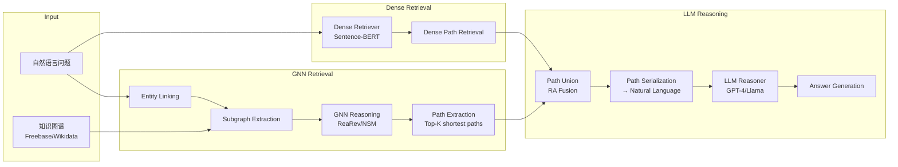

# GNN-RAG: Graph Neural Retrieval for LLM Reasoning on Knowledge Graphs

> 来源：https://arxiv.org/abs/2401.14560 | 领域：llm-infra | 学习日期：20260403

## 问题定义

知识图谱问答（KGQA）是连接结构化知识与自然语言理解的关键任务。现有方法分为两大流派：一方面，GNN-based 方法擅长在图结构上进行多跳推理，能精准定位答案实体，但缺乏自然语言的理解和生成能力；另一方面，LLM-based 方法具有强大的语言理解能力，但在处理大规模知识图谱时面临上下文窗口限制和幻觉问题。

具体而言，将完整的知识图谱子图直接输入 LLM 会导致两个问题：（1）Token 数量爆炸——一个 2-hop 子图可能包含数千条三元组，远超上下文窗口；（2）噪声干扰——大量无关三元组会分散 LLM 的注意力，降低推理准确率。因此，如何高效地从知识图谱中检索最相关的子图信息，并以 LLM 友好的方式呈现，成为核心挑战。

GNN-RAG 提出了一种将 GNN 作为知识图谱检索器、LLM 作为推理器的协同框架，结合了两者的优势：GNN 负责在图结构上进行高效的候选路径检索，LLM 负责基于检索到的路径进行自然语言推理和答案生成。

## 核心方法与创新点

GNN-RAG 的核心流程分为三个阶段：

**阶段一：GNN 推理与候选路径提取。** 使用 GNN（如 ReaRev）在知识图谱上进行推理，为每个候选答案实体计算得分。对于得分排名前 $K$ 的候选实体，提取从问题实体到候选答案实体的最短路径作为推理证据。GNN 的消息传递机制为：

$$h_v^{(l+1)} = \text{AGG}\left(\left\{ \text{MSG}\left(h_v^{(l)}, h_u^{(l)}, e_{uv}\right) : u \in \mathcal{N}(v) \right\}\right)$$

其中 $h_v^{(l)}$ 为节点 $v$ 在第 $l$ 层的表示，$e_{uv}$ 为边的关系嵌入，$\mathcal{N}(v)$ 为节点 $v$ 的邻居集合。

**阶段二：路径序列化与 LLM 推理。** 将提取的知识图谱路径转化为自然语言文本，作为 LLM 的 RAG 上下文。例如，路径 `(Barack Obama, born_in, Honolulu) -> (Honolulu, located_in, Hawaii)` 被序列化为自然语言句子。

**阶段三：Retrieval Augmentation (RA) 融合。** 创新性地提出将 GNN-based 检索路径与标准的稠密向量检索路径进行并集融合，提升召回率：

$$\mathcal{P}_{\text{final}} = \mathcal{P}_{\text{GNN}} \cup \mathcal{P}_{\text{dense}}$$

其中 $\mathcal{P}_{\text{GNN}}$ 为 GNN 提取的路径集合，$\mathcal{P}_{\text{dense}}$ 为稠密检索器返回的路径。这种融合策略简单但非常有效，因为两种检索方式具有互补性。

## 系统架构

## 实验结论

在 WebQSP 和 CWQ（ComplexWebQuestions）两个主流 KGQA 基准上的实验结果：

- **WebQSP (Hits@1)**：GNN-RAG + GPT-4 达到 **85.7%**，超过纯 GNN 方法 ReaRev（76.2%）和纯 LLM 方法 ToG-GPT4（82.6%）
- **CWQ (Hits@1)**：GNN-RAG + GPT-4 达到 **76.1%**，显著超过所有基线方法
- **检索效率**：相比直接将完整子图输入 LLM，GNN-RAG 的路径检索将平均输入 Token 从 12,000+ 减少到约 800，降低 93%
- **RA 融合效果**：GNN + Dense 的路径融合比单独使用 GNN 路径提升 3-5 个百分点，证实了两种检索方式的互补性
- **小模型适用性**：GNN-RAG + Llama2-13B 在 WebQSP 上达到 78.9%，超过纯 GPT-4 的 ToG 方法，说明高质量检索可以弥补模型能力差距

## 工程落地要点

1. **知识图谱预处理**：需要离线构建实体到子图的索引，推荐使用 Neo4j 或 DGL 进行图存储和查询。对于 Freebase 级别（~88M 实体）的图谱，子图提取需要控制 hop 数（通常 2-3 hop）
2. **GNN 模型选择**：论文验证了 ReaRev 和 NSM 两种 GNN 架构，ReaRev 效果更好但推理更慢；工程中可根据延迟要求选择
3. **Entity Linking 质量**：整个流程的瓶颈往往在 Entity Linking 环节，推荐使用 ELQ 或 BLINK，并加入拼写纠错和别名扩展
4. **路径缓存**：对于高频问题模式（如 "谁是 X 的 Y"），可以预计算和缓存常见实体的路径，降低在线推理延迟
5. **Prompt 工程**：路径序列化的格式对 LLM 推理效果影响显著，推荐使用结构化的"因为...所以..."模板而非简单的三元组罗列
6. **在线服务架构**：GNN 推理（~50ms）和 LLM 推理（~500ms）可以流水线化，GNN 部分用 GPU 加速，LLM 部分异步调用

## 面试考点

1. **Q: GNN-RAG 为什么不直接把知识图谱子图喂给 LLM？** A: 完整子图含大量无关三元组，导致 Token 爆炸（平均 12K+ tokens）和注意力分散，GNN 先过滤出 Top-K 相关路径可将输入减少 93% 且提升准确率。
2. **Q: GNN 和 Dense Retrieval 的互补性体现在哪里？** A: GNN 擅长多跳结构化推理（如"A 的 B 的 C"），Dense Retrieval 擅长语义匹配（如同义表述），两者的路径并集能显著提升召回率（+3-5%）。
3. **Q: GNN-RAG 中的路径序列化为什么重要？** A: 知识图谱三元组是结构化数据，LLM 需要自然语言输入；好的序列化模板能保留推理链条的逻辑关系，差的模板会丢失多跳推理的因果结构。
4. **Q: 这种方法的主要瓶颈在哪里？** A: Entity Linking 是最大瓶颈——如果问题中的实体无法正确链接到知识图谱，后续的 GNN 推理和路径提取将完全失效，实际部署中需要高质量的 EL 模块。
5. **Q: 对比纯 RAG 和 GNN-RAG 的本质区别是什么？** A: 纯 RAG 将知识图谱扁平化为文本后用向量检索，丢失了图结构信息；GNN-RAG 通过 GNN 在原始图结构上推理，保留了实体间的关系和多跳路径信息。
