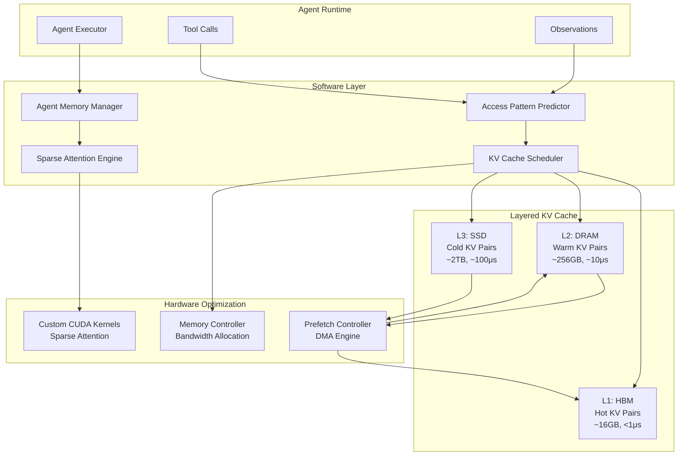

# PLENA: Hardware-Software Co-Design for Long-Context Agentic LLM Inference

> 来源：https://arxiv.org/abs/2509.09505 | 领域：llm-infra | 学习日期：20260403

## 问题定义

Agentic LLM 应用（如 AutoGPT、Agent Chain-of-Thought）具有与传统对话式 LLM 截然不同的推理特征：它们需要处理极长的上下文（工具调用历史、环境观测、多轮思维链），且推理过程涉及频繁的上下文切换和增量 KV Cache 更新。现有的 LLM 推理基础设施（如 vLLM、TensorRT-LLM）主要针对短上下文、高吞吐的对话场景优化，在 Agentic 场景下面临严重的性能瓶颈。

核心问题在于 **KV Cache 的内存墙**：一个 70B 参数模型在 128K 上下文长度下，KV Cache 占用约 160GB 显存，远超单张 GPU 的容量。现有的 KV Cache 压缩方法（如量化、稀疏化）虽然能降低内存占用，但在 Agentic 场景下的频繁随机访问模式中效率低下。此外，Attention 计算在长上下文下的时间复杂度为 $O(n^2)$，成为推理延迟的主导因素。

PLENA 从硬件-软件协同设计的角度出发，同时优化 KV Cache 管理策略和底层硬件访存模式，针对 Agentic 推理的独特访问特征提供端到端的加速方案。

## 核心方法与创新点

PLENA 的核心贡献包括三个协同设计模块：

**1. Predictive KV Cache Scheduling（预测性 KV Cache 调度）。** 利用 Agent 执行的可预测性（工具调用序列通常遵循 DAG 模式），提前预取即将需要的 KV Cache 分片。调度决策基于一个轻量级的访问模式预测模型：

$$P(\text{access}_{t+1} = k \mid \mathcal{H}_t) = \text{softmax}\left(\frac{W_q h_t \cdot W_k e_k}{\sqrt{d}}\right)$$

其中 $\mathcal{H}_t$ 为到时刻 $t$ 的 Agent 执行历史，$h_t$ 为历史编码向量，$e_k$ 为第 $k$ 个 KV Cache 分片的嵌入。

**2. Layered KV Cache Architecture（分层 KV Cache 架构）。** 将 KV Cache 分为三层存储层级：HBM（热数据）、DRAM（温数据）、SSD（冷数据），根据 Attention Score 的时间衰减特性进行动态分层。Attention Score 的衰减可建模为：

$$\text{Score}(q, k_i) \propto \exp\left(-\lambda \cdot (t - t_i)\right) \cdot \text{softmax}\left(\frac{q \cdot k_i^T}{\sqrt{d_k}}\right)$$

其中 $\lambda$ 为时间衰减系数，$t_i$ 为 token $i$ 的生成时间。高衰减分数的 KV 对驻留 HBM，低衰减分数的逐步淘汰到 DRAM 和 SSD。

**3. Sparse Attention Kernel for Agent Patterns。** 针对 Agentic 推理中 Attention 的稀疏性（系统 prompt + 最近工具输出通常占据 80%+ 的 Attention 权重），设计了专用的稀疏 Attention CUDA Kernel，跳过低 Attention 区域的计算。

## 系统架构

## 实验结论

实验在 Llama-2-70B 和 Llama-3-70B 上进行，测试了 32K-256K 上下文长度的 Agentic 工作负载：

- **推理吞吐量**：在 128K 上下文长度下，PLENA 相比 vLLM 提升 **3.2x** 吞吐量（tokens/s），相比 FlashAttention-2 提升 **1.8x**
- **KV Cache 内存占用**：通过分层存储，HBM 占用降低 **72%**（从 160GB 降至 45GB），使得单张 H100-80GB 可服务 128K 上下文
- **首 Token 延迟（TTFT）**：在 256K 上下文下，TTFT 从 12.3s 降至 4.1s（降低 67%）
- **预取命中率**：Access Pattern Predictor 在 WebArena 和 SWE-Bench Agent 工作负载上的预取命中率达到 **89%** 和 **83%**
- **稀疏 Attention 精度损失**：在保留 Top-20% Attention 区域的情况下，任务完成率下降 < 1%，证实了 Agentic 推理中 Attention 的高度稀疏性
- **端到端 Agent 任务**：在 SWE-Bench 上，PLENA 使得相同硬件下可并发服务的 Agent 数量提升 2.5x

## 工程落地要点

1. **硬件要求**：PLENA 的分层 KV Cache 最适配 H100/H200 + 大容量 DRAM 的服务器配置。SSD 层需要 NVMe SSD（PCIe 5.0），确保足够的随机读带宽（>7GB/s）
2. **与现有框架集成**：PLENA 以插件形式集成到 vLLM 的 PagedAttention 框架中，替换其 KV Cache 管理模块，迁移成本较低
3. **预测器训练**：Access Pattern Predictor 需要用目标 Agent 框架的执行 trace 进行微调（约 1000 条 trace 即可收敛），不同 Agent 框架需要不同的预测器
4. **Attention 稀疏度调优**：Top-K% 保留率需要根据任务类型调优——代码生成类 Agent 通常可以更激进（Top-15%），而多跳推理类 Agent 需要保守（Top-30%）
5. **故障恢复**：分层存储增加了故障面，需要为 DRAM/SSD 层的 KV Cache 实现 checkpointing，避免 Agent 长时间任务因硬件故障从头重跑
6. **批处理优化**：Agentic 工作负载的请求长度方差大，推荐使用 continuous batching + 按上下文长度分桶的策略

## 面试考点

1. **Q: 为什么 Agentic LLM 推理比普通对话推理更难优化？** A: Agentic 推理有三个独特特征：超长上下文（工具历史累积）、频繁的 KV Cache 随机访问（回看历史工具输出）、以及不可预测的生成长度，这些都打破了传统推理优化的假设。
2. **Q: PLENA 的分层 KV Cache 如何决定数据放置？** A: 基于 Attention Score 的时间衰减模型，高频访问的 KV 对（通常是系统 prompt 和最近的工具输出）驻留 HBM，较少访问的逐步淘汰到 DRAM 和 SSD，类似 CPU 缓存的 LRU 策略但结合了 Attention 语义。
3. **Q: 预测性 KV Cache 预取的核心假设是什么？** A: 假设 Agent 的工具调用序列具有可预测的模式（如 search->read->analyze），通过轻量级预测模型提前将即将访问的 KV Cache 从低层存储预取到 HBM，将随机访问转化为顺序预取。
4. **Q: 稀疏 Attention 在 Agentic 场景下为什么有效？** A: 实证发现 Agentic 推理中 80%+ 的 Attention 权重集中在系统 prompt 和最近的 3-5 次工具输出上，中间的大量历史上下文 Attention 权重极低，可以安全跳过。
5. **Q: PLENA 与 FlashAttention 的关系是什么？** A: FlashAttention 优化的是 Attention 计算的 IO 效率（分块计算避免 HBM 读写），PLENA 在此基础上增加了跨存储层级的 KV Cache 管理和稀疏性利用，两者是互补关系而非替代关系。
