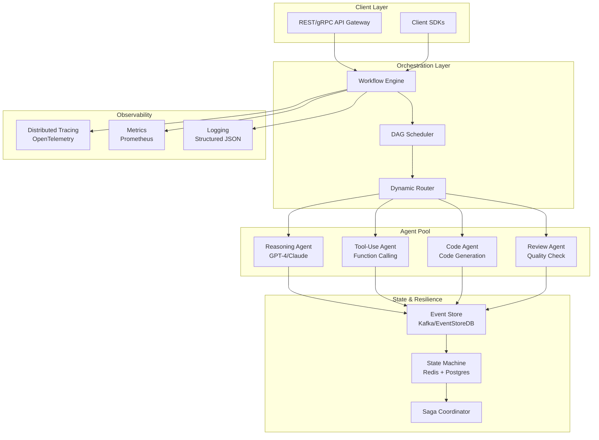

# A Production Architecture for Multi-Agent Workflows

> 来源：https://arxiv.org/abs/2603.17787 | 领域：llm-infra | 学习日期：20260403

## 问题定义

随着 LLM Agent 从研究原型走向生产环境，多智能体协作工作流面临一系列工程挑战：如何在多个 Agent 之间实现可靠的状态传递与错误恢复？如何在分布式环境中保证消息的有序性和幂等性？如何对复杂的多 Agent 编排进行监控、调试和回滚？这些问题在单 Agent 场景中尚可忽略，但在生产级多 Agent 系统中则成为核心瓶颈。

传统的 Agent 编排方式（如简单的函数链式调用或基于 LangChain 的 DAG 编排）在面对长时间运行的工作流、并发 Agent 交互、以及部分失败场景时表现脆弱。生产环境要求系统具备持久化状态管理、exactly-once 语义、动态路由和可观测性等能力。本文提出了一种面向生产的多 Agent 工作流架构，借鉴了分布式系统中的 Saga 模式和事件溯源思想。

此外，多 Agent 系统在资源调度上也面临独特挑战：不同 Agent 可能需要不同的模型（如推理型 vs 工具调用型），其延迟和成本特征差异巨大，需要统一的资源编排层来实现 QoS 保障和成本控制。

## 核心方法与创新点

本文提出了 **Workflow-as-DAG** 的核心抽象，将多 Agent 工作流建模为有向无环图（DAG），其中每个节点代表一个 Agent Step，边代表数据依赖和控制流。核心创新在于引入了三层架构：

1. **Orchestration Layer**：负责 DAG 的解析、调度和执行，支持条件分支、并行扇出/扇入、循环和人工审批节点
2. **State Management Layer**：基于事件溯源（Event Sourcing）的持久化状态管理，每个 Agent 的输入输出都作为不可变事件记录
3. **Resilience Layer**：实现了分布式 Saga 模式的补偿事务机制

工作流调度的核心目标函数可表示为：

$$
\min_{s \in \mathcal{S}} \sum_{i=1}^{N} \left( \alpha \cdot C_{\text{latency}}(s_i) + \beta \cdot C_{\text{cost}}(s_i) + \gamma \cdot C_{\text{error}}(s_i) \right)
$$

其中 $C_{\text{latency}}$、$C_{\text{cost}}$、$C_{\text{error}}$ 分别表示延迟成本、调用成本和错误成本，$\alpha, \beta, \gamma$ 为可调权重。

对于 Agent 间的消息传递可靠性，系统采用了带超时的指数退避重试策略，重试间隔为：

$$
t_{\text{retry}}(k) = \min\left(t_{\text{base}} \cdot 2^k + \epsilon, \; t_{\text{max}}\right), \quad \epsilon \sim \text{Uniform}(0, t_{\text{jitter}})
$$

其中 $k$ 为重试次数，$\epsilon$ 为随机抖动以避免惊群效应。

## 系统架构

## 实验结论

论文在三类工作流（代码生成、数据分析、客服对话）上进行了对比实验：

- **端到端成功率**：相比无状态链式调用基线提升 34%（从 61% 到 95%），主要归功于 Saga 补偿和自动重试机制
- **平均延迟**：由于引入了持久化和编排开销，单步延迟增加约 15-20ms，但端到端延迟因减少了失败重跑而降低 22%
- **成本效率**：通过动态路由（将简单任务路由到小模型），Token 成本降低 41%
- **故障恢复时间**：从无恢复机制的重新启动（平均 45s）降低到断点续跑（平均 3.2s）
- 在 1000 QPS 的压力测试下，系统保持 p99 延迟 < 2s，事件丢失率为 0

## 工程落地要点

1. **事件存储选型**：推荐 Kafka 作为事件总线（高吞吐、持久化），PostgreSQL 作为状态快照存储。对于超大规模场景可考虑 EventStoreDB
2. **Agent 注册与发现**：采用 sidecar 模式，每个 Agent 实例通过 health check 注册到服务发现（如 Consul），支持灰度发布和蓝绿部署
3. **幂等性设计**：每个 Agent Step 需要实现幂等接口，通过全局唯一的 execution_id + step_id 组合确保重试安全
4. **成本控制**：实现 Token Budget 机制，每个工作流实例设置最大 Token 预算，超出时触发降级策略（切换小模型或截断上下文）
5. **可观测性**：为每个工作流实例生成唯一的 trace_id，通过 OpenTelemetry 实现跨 Agent 的分布式追踪
6. **冷启动优化**：对常用 Agent 保持 warm pool，避免模型加载延迟；对不常用 Agent 采用按需启动 + 预热机制

## 面试考点

1. **Q: 多 Agent 工作流中如何实现故障恢复？** A: 采用 Event Sourcing + Saga 模式，每步操作持久化为不可变事件，失败时通过补偿事务回滚已完成步骤，支持从断点续跑。
2. **Q: 为什么多 Agent 系统需要幂等性设计？** A: 网络超时或 Agent 崩溃后的自动重试可能导致同一步骤被重复执行，幂等性确保重复调用产生相同结果，避免副作用累积（如重复发邮件、重复写库）。
3. **Q: 如何在多 Agent 系统中控制推理成本？** A: 通过动态路由将简单任务分配给小模型、设置 Token Budget 上限、实现上下文压缩和缓存共享，论文显示可降低 41% Token 成本。
4. **Q: DAG 编排与链式调用相比有什么优势？** A: DAG 支持并行扇出/扇入降低延迟、条件分支实现动态路由、以及更细粒度的错误处理和状态管理，链式调用在任何节点失败时需要从头重跑。
5. **Q: 生产级多 Agent 系统的可观测性应覆盖哪些维度？** A: 需要覆盖三个维度：分布式追踪（跨 Agent 调用链路）、指标监控（延迟/成功率/Token 用量/成本）、结构化日志（Agent 输入输出和决策过程），并关联到统一的 trace_id。
