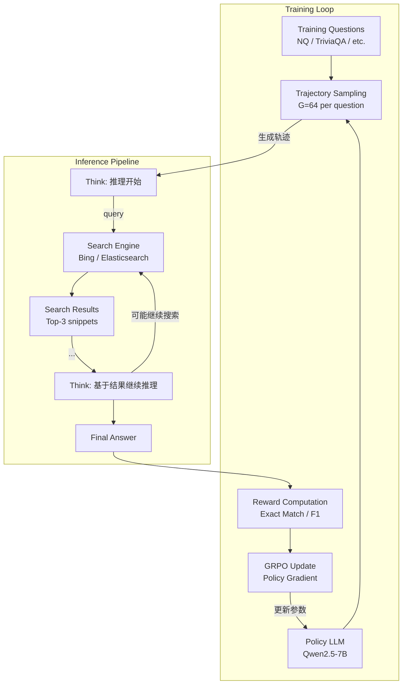

# Search-R1: Training LLMs to Reason and Leverage Search Engines with RL

> 来源：https://arxiv.org/abs/2503.09516 | 领域：llm-infra | 学习日期：20260403

## 问题定义

LLM 在知识密集型任务中常受制于训练数据的截止日期和参数记忆的不完整性，导致事实性错误（幻觉）频发。虽然 RAG（Retrieval-Augmented Generation）可以在推理时引入外部知识，但传统 RAG 的检索查询通常由用户问题直接驱动，缺乏主动的推理和查询优化能力——模型不知道 **何时搜索、搜索什么、如何利用搜索结果进行多步推理**。

DeepSeek-R1 展示了通过强化学习（RL）可以激发 LLM 的推理能力（Chain-of-Thought），但其推理过程完全依赖内部知识，无法访问外部信息。Search-R1 将这一范式扩展到 **带搜索工具的推理**：训练 LLM 在推理过程中学会主动调用搜索引擎，并基于搜索结果继续推理，形成交织的"思考-搜索-思考"模式。

核心挑战在于：搜索引擎是一个不可微的外部模块，其返回结果是离散的文本，传统的监督学习无法为"何时搜索、搜索什么"提供有效梯度信号。RL 通过奖励信号（最终答案是否正确）来端到端优化整个"推理+搜索"过程，无需人工标注搜索时机和查询。

## 核心方法与创新点

Search-R1 基于 GRPO（Group Relative Policy Optimization）算法，将搜索引擎作为 LLM 推理过程中的一个特殊 action。训练框架的核心设计如下：

**Action Space 设计：** LLM 在生成过程中可以输出两类特殊 token：`<search>query</search>` 触发搜索引擎调用，搜索结果以 `<result>...</result>` 格式插入到上下文中，LLM 继续生成推理过程。

**RL 训练目标：** 使用 GRPO 优化策略，对于每个问题采样 $G$ 个推理轨迹，根据最终答案的正确性计算奖励，策略梯度为：

$$
\nabla_\theta J(\theta) = \mathbb{E}_{q \sim \mathcal{D}} \left[ \frac{1}{G} \sum_{i=1}^{G} \sum_{t=1}^{T_i} \nabla_\theta \log \pi_\theta(a_t^i | s_t^i) \cdot \hat{A}_i \right]
$$

其中 $\hat{A}_i = \frac{r_i - \text{mean}(\{r_j\}_{j=1}^G)}{\text{std}(\{r_j\}_{j=1}^G)}$ 为组内标准化的优势函数，$r_i$ 为第 $i$ 条轨迹的奖励（答案正确为 1，错误为 0）。

**奖励设计：** 采用 Outcome-based Reward（结果奖励），仅在推理轨迹结束时根据最终答案的正确性给予 0/1 奖励，不对中间的搜索行为进行单独奖励或惩罚。这一设计的优势在于：

$$
R(\tau) = \mathbb{1}[\text{extract}_{	ext{answer}}(\tau) = a^*]
$$

模型自主学习何时搜索最有利于最终答案的正确性，避免了人工设计搜索时机奖励的困难。

**搜索结果截断：** 为防止搜索结果过长占据上下文，对每条搜索结果截断到固定长度（如 300 tokens），并限制每次推理的最大搜索次数。

## 系统架构

## 实验结论

实验使用 Qwen2.5-7B 和 Qwen2.5-3B 作为基础模型，在多个知识密集型 QA 数据集上测试：

- **NQ (Natural Questions)**：Search-R1-7B 达到 **51.3%** EM，相比无搜索的 R1 风格推理（38.2%）提升 +13.1%，相比标准 RAG（44.7%）提升 +6.6%
- **TriviaQA**：Search-R1-7B 达到 **68.2%** EM，超过标准 RAG +5.8%
- **HotpotQA（多跳）**：Search-R1-7B 达到 **42.1%** EM，显著超过单次搜索 RAG（31.5%），因为模型学会了多次搜索分解多跳问题
- **搜索行为分析**：训练后模型平均每个问题搜索 1.8 次，对简单问题倾向于 0-1 次搜索，对复杂多跳问题倾向于 2-4 次搜索，展现出自适应的搜索策略
- **查询质量**：RL 训练后的搜索查询比直接使用原始问题作为查询的检索 F1 提升 12%，模型学会了查询改写和分解
- **3B 模型**：Search-R1-3B 在大多数数据集上超过标准 RAG-7B，说明搜索推理能力可以弥补模型规模差距

## 工程落地要点

1. **搜索引擎选型**：训练和推理可以使用不同的搜索后端——训练时推荐用本地 Elasticsearch（低延迟、可控），推理时可切换到 Bing/Google API。关键是训练时的检索质量不能太高（否则模型学不到搜索策略）
2. **训练效率**：GRPO 需要每个问题采样 64 条轨迹，每条轨迹可能触发 1-4 次搜索调用，因此训练过程中搜索引擎的吞吐量是关键瓶颈。推荐使用异步批量搜索 + 缓存
3. **推理延迟**：每次搜索引擎调用增加 100-500ms 延迟，多次搜索会累积。可以通过搜索结果缓存、预计算常见查询索引来优化
4. **安全与过滤**：模型生成的搜索查询可能包含不当内容，需要在搜索引擎前添加内容过滤层
5. **与现有 RAG 的集成**：Search-R1 可以作为 RAG 系统的升级路径——将固定的"问题->检索->生成"流程替换为模型自主决定的"推理->搜索->推理"流程
6. **Reward Hacking 防范**：注意模型可能学会通过搜索结果中的特定模式来"作弊"，需要在奖励函数中加入多样性约束

## 面试考点

1. **Q: Search-R1 与标准 RAG 的核心区别是什么？** A: 标准 RAG 是"先检索再生成"的固定流程，Search-R1 通过 RL 训练让模型自主决定何时搜索、搜索什么，支持多轮交织的"推理-搜索-推理"，在多跳问题上优势显著（+10.6%）。
2. **Q: 为什么用 RL 而不是 SFT 来训练搜索能力？** A: SFT 需要人工标注"何时搜索、搜索什么"的标签，这类标注成本高且主观性强；RL 仅需最终答案的正确性作为奖励，让模型自主探索最优搜索策略，更具泛化性。
3. **Q: GRPO 相比 PPO 在这个场景下有什么优势？** A: GRPO 不需要训练单独的 Value Model（Critic），通过组内相对比较来估计优势函数，减少了训练开销和超参敏感性，特别适合奖励稀疏（仅结果奖励）的场景。
4. **Q: 搜索结果截断长度如何选择？** A: 过长会占据上下文窗口挤压推理空间，过短会丢失关键信息；论文发现 300 tokens 是较好的平衡点，实际部署中应根据搜索引擎的 snippet 质量和模型的上下文长度调整。
5. **Q: Search-R1 的 Reward Shaping 有哪些注意事项？** A: 论文采用纯 Outcome Reward（0/1），避免了对搜索行为的 Process Reward 设计；实践中可以加入长度惩罚（避免过多无用搜索）和格式奖励（确保输出格式正确），但不宜过度设计中间奖励以免限制模型的探索空间。
