# TongsearchQR: Reinforced Query Reasoning for Retrieval

> 来源：https://arxiv.org/abs/2506.11603 | 领域：llm-infra | 学习日期：20260403

## 问题定义

在信息检索系统中，用户查询（query）的质量直接决定了检索结果的相关性。然而，用户提交的原始查询往往存在多种问题：表述模糊、缺乏关键信息、使用口语化表达、或者将复杂需求压缩为简短的几个词。传统的查询改写（Query Rewriting）方法通常基于规则或简单的 seq2seq 模型，缺乏深层次的语义推理能力。

近年来，LLM 展现了强大的推理能力，但直接用 LLM 进行查询改写面临两个问题：（1）LLM 的改写目标与检索系统的排序目标不一致——LLM 倾向于生成流畅的自然语言，但检索系统需要的是关键词丰富、语义精准的查询；（2）缺乏来自检索系统的反馈信号——LLM 不知道改写后的查询在实际检索中的效果如何。

TongsearchQR 提出使用强化学习来训练 LLM 进行查询推理（Query Reasoning），核心思想是：让 LLM 先对用户意图进行推理分析，然后生成优化的检索查询，并以实际的检索效果（如 NDCG、MRR）作为 RL 奖励信号，实现查询改写与检索系统的端到端对齐。

## 核心方法与创新点

TongsearchQR 的方法论包括三个核心创新：

**1. Query Reasoning Chain。** 不同于直接改写查询，TongsearchQR 要求模型生成一个推理链（reasoning chain），分析用户的真实意图、识别关键实体和约束、扩展相关概念，最后生成优化查询。这一过程类似于 Chain-of-Thought，但目标是查询优化而非问题求解。

**2. Retrieval-Grounded Reward。** 使用实际检索系统的指标作为 RL 奖励。对于生成的查询 $q'$，通过检索系统获取 Top-K 文档，计算与标注相关文档的 NDCG 作为奖励：

$$
R(q') = \text{NDCG}@K\left(\text{Retrieve}(q'), \mathcal{D}^+\right) = \frac{\text{DCG}@K}{\text{IDCG}@K} = \frac{\sum_{i=1}^{K} \frac{2^{rel_i} - 1}{\log_2(i+1)}}{\sum_{i=1}^{K} \frac{2^{rel_i^*} - 1}{\log_2(i+1)}}
$$

其中 $\mathcal{D}^+$ 为标注的相关文档集合，$rel_i$ 为检索到的第 $i$ 个文档的相关性标签。

**3. Multi-Granularity Query Generation。** 模型学习生成多粒度的查询变体：keyword query（关键词组合）、natural query（自然语言问句）、expanded query（带同义词和相关概念的扩展查询），并通过检索结果的融合（reciprocal rank fusion）来提升召回率。融合公式为：

$$
\text{RRF}(d) = \sum_{q' \in \mathcal{Q}} \frac{1}{k + \text{rank}}_{\text{{q'}}(d)}
$$

其中 $\mathcal{Q}$ 为多粒度查询集合，$\text{rank}}_{\text{{q'}}(d)$ 为文档 $d$ 在查询 $q'$ 下的排名，$k$ 为平滑常数（通常取 60）。

训练采用 PPO 算法，状态为用户原始查询 + 推理历史，动作为生成下一个 token，奖励在生成完整查询后一次性给出。

## 系统架构

```mermaid
graph TB
    subgraph Training Phase
        UQ[User Query Dataset]
        LLM[Policy LLM<br/>Qwen2.5-7B]
        RC[Reasoning Chain<br/>意图分析→概念扩展→查询生成]
        MQ[Multi-Granularity Queries<br/>keyword / natural / expanded]
        RS[Retrieval System<br/>BM25 + Dense Retriever]
        RW[Reward: NDCG@10]
        PPO[PPO Update]
    end

    subgraph Inference Phase
        IQ[Incoming Query]
        QR[Query Reasoning<br/>Trained LLM]
        GQ[Generated Queries ×3]
        RET[Parallel Retrieval]
        RRF[Reciprocal Rank Fusion]
        TOP[Final Top-K Results]
    end

    UQ --> LLM --> RC --> MQ --> RS --> RW --> PPO --> LLM
    IQ --> QR --> GQ --> RET --> RRF --> TOP
```

## 实验结论

在多个检索基准上的实验结果：

- **MS MARCO Passage Ranking**：TongsearchQR 使 BM25 的 MRR@10 从 18.7 提升到 **27.3**（+46%），使 E5-large 的 MRR@10 从 33.1 提升到 **38.6**（+16.6%）
- **BEIR Benchmark（零样本迁移）**：在 13 个 BEIR 数据集上平均 NDCG@10 提升 **+8.2%**，在 Arguana（反驳检索）和 SCIDOCS（科学文献）上提升最为显著（+15% 和 +12%）
- **对比 Query Rewriting 基线**：相比 T5-based query rewriting（+3.1%）和 LLM zero-shot rewriting（+5.4%），TongsearchQR 的 RL 训练带来额外 +3-5% 的提升
- **多粒度查询的贡献**：消融实验显示，单独使用 keyword query 最好（+6.1%），但三种粒度的 RRF 融合效果最佳（+8.2%），说明多粒度查询具有互补性
- **推理链的作用**：去除推理链（直接生成查询）导致性能下降 2.8%，证明推理过程有助于生成更高质量的查询
- **Query 长度分析**：RL 训练后的查询平均长度从原始的 5.2 词增加到 12.7 词，但并非越长越好，模型学会了添加有信息量的关键词而非冗余表述

## 工程落地要点

1. **与现有搜索系统的集成**：TongsearchQR 作为搜索系统的前端查询处理模块，部署在用户查询和检索引擎之间，不需要修改底层索引和排序逻辑，是一个低侵入的升级方案
2. **延迟控制**：Query Reasoning 引入了额外的 LLM 推理延迟（~200ms for 7B model with vLLM），对于延迟敏感的场景可以：（a）使用蒸馏后的小模型（1.5B）；（b）对高频查询做缓存；（c）仅对长尾查询启用 Query Reasoning
3. **训练数据构建**：需要有查询-文档相关性标注的数据集。可以利用现有的搜索日志（点击数据作为隐式相关性标注）来构建训练数据
4. **检索系统反馈延迟**：RL 训练中每个 action 都需要调用检索系统计算奖励，成为训练瓶颈。推荐使用快速的 BM25 检索器计算训练奖励，推理时切换到更准确的 Dense Retriever
5. **A/B 测试建议**：上线前建议进行分流 A/B 测试，重点关注：（a）检索相关性指标（NDCG、MRR）；（b）用户行为指标（点击率、停留时间）；（c）尾部查询的改善效果
6. **多语言支持**：模型的推理链和查询改写能力可以迁移到多语言场景，但需要对应语言的检索系统和标注数据进行微调

## 面试考点

1. **Q: TongsearchQR 为什么用 RL 而不是 SFT 训练查询改写？** A: SFT 的训练目标（生成与标注查询相似的文本）与最终目标（检索效果好）不一致，RL 直接用检索指标（NDCG）作为奖励，实现了查询生成与检索系统的端到端对齐。
2. **Q: 多粒度查询生成的动机是什么？** A: 不同类型的检索器对查询形式有不同偏好——BM25 偏好关键词查询，Dense Retriever 偏好自然语言查询——多粒度查询通过 RRF 融合可以同时利用多种检索器的优势。
3. **Q: Query Reasoning Chain 与直接查询改写相比有什么优势？** A: 推理链通过显式的意图分析和概念扩展，帮助模型理解用户的深层需求（如"苹果手机便宜"→意图是性价比对比→需要搜索价格和配置参数），消融实验显示推理链贡献 +2.8% 的检索效果提升。
4. **Q: Retrieval-Grounded Reward 在训练中可能遇到什么问题？** A: 主要问题是奖励信号的噪声和延迟：（1）检索系统本身可能不完美，返回的排名有噪声；（2）NDCG 对标注质量敏感，稀疏标注会导致假阴性；（3）每步 RL 都需要调用检索系统，训练速度受限于检索延迟。
5. **Q: 在生产环境中如何控制 Query Reasoning 的额外延迟？** A: 三种策略组合使用：对高频查询预计算并缓存改写结果；对延迟不敏感的场景（如推荐系统离线召回）全量启用；对延迟敏感场景使用蒸馏后的小模型（1.5B，推理延迟 < 50ms）。
