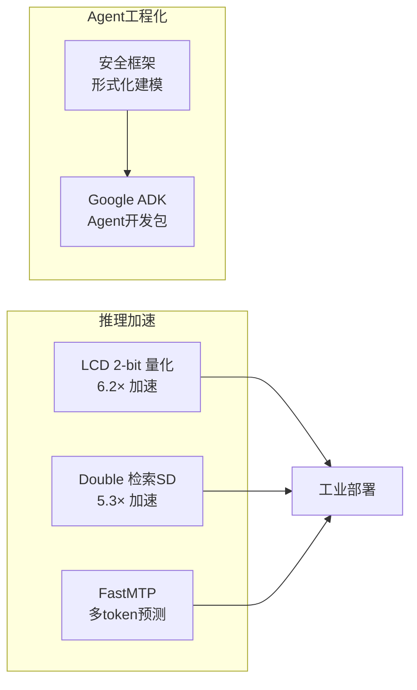

# LLM基础设施前沿综合：推理加速与Agent工程化

> 综合日期：20260331 | 领域：LLM基础设施 | 覆盖论文：5篇

---

## 🆚 创新点 vs 之前方案

| 技术 | 之前方案 | 创新 | 效果 |
|------|---------|------|------|
| LCD (2-bit 量化) | GPTQ/AWQ (4-bit) | **聚类量化 + KD** | 2-bit 下超越所有方法，6.2× 加速 |
| Double (投机解码) | EAGLE（需训练 draft） | **检索式 SD（免训练）** | 5.3× 加速，突破理论上限 |
| FastMTP | Meta MTP（需训练多头） | **仅推理阶段多头** | 即插即用，无需重训 |
| Agent 安全框架 | Ad-hoc 安全检查 | **形式化安全建模** | 系统化威胁分类 |
| Google ADK | LangChain/AutoGen | **Google 原生 Agent SDK** | 与 Gemini 深度集成 |

---

## 📈 技术关联图

---

## 主题概述

本批次5篇论文覆盖LLM基础设施的两大方向：**推理加速**（LCD量化、Double投机解码、FastMTP多token预测）和**Agent工程化**（安全框架、开发工具包）。

## 核心技术脉络

### 1. 极端量化：2-bit LLM

LCD通过聚类量化+知识蒸馏实现2-bit量化：

$$
\mathcal{L} = \alpha \mathcal{L}_{task} + (1-\alpha) \text{KL}(P_{student} || P_{teacher})
$$

关键创新：层自适应比特分配（敏感层高比特，非敏感层极端压缩），在16倍压缩下保持90%性能。

### 2. 投机解码的双源革新

Double的核心insight是两个独立draft源互补：

$$
\text{Accept}(t) = \min(1, \frac{P_{target}(t)}{\max(P_{draft_1}(t), P_{draft_2}(t))})
$$

小模型draft擅长通用pattern，检索缓存擅长重复pattern，组合后接受率从~60%提升到~80%。

### 3. Multi-Token Prediction

FastMTP通过并行预测头实现单步多token生成：

$$
P(t_{i+k} | t_{\leq i}) = \text{Head}}_{\text{k(h}}_{\text{i + \text{PE}}(k))
$$

与Speculative Decoding互补：MTP是同一模型内部的并行化，SD是不同模型间的流水线化。

### 4. Agent安全与工程化

Agent安全形式化框架定义了三个安全维度（CIA），Google ADK提供了声明式Agent开发标准化方案。两者共同推动Agent从实验走向生产。

## 关键公式汇总

**LCD蒸馏损失**：

$$
\mathcal{L} = \alpha \mathcal{L}_{task} + (1-\alpha) \text{KL}(P_{student} || P_{teacher})
$$

**Double双源投机接受率**：

$$
\text{Accept}(t) = \min(1, \frac{P_{target}(t)}{\max(P_{draft_1}(t), P_{draft_2}(t))})
$$

**FastMTP多头预测**：

$$
P(t_{i+k} | t_{\leq i}) = \text{Head}}_{\text{k(h}}_{\text{i + \text{PE}}(k))
$$

## Q&A 面试精选

**Q1: 聚类量化vs均匀量化的核心区别？**
A: 均匀量化假设权重均匀分布（实际不是），聚类量化根据实际分布找最优离散点，减少量化误差。

**Q2: 投机解码为什么能保证输出质量不降？**
A: 接受-拒绝采样保证最终分布与target模型完全一致。只加速不改变质量。

**Q3: MTP的验证机制如何工作？**
A: 用原始自回归模型的logits计算每个MTP token的概率，低于阈值则回退到自回归。

**Q4: Agent安全中最难防范的攻击是什么？**
A: 间接Prompt注入——恶意指令隐藏在检索到的文档中，Agent在处理时被诱导执行。

**Q5: Google ADK相比LangChain的优势？**
A: ADK更偏向声明式配置和生产级可靠性（状态机、重试、trace），LangChain更灵活但更底层。

**Q6: 2-bit量化的实际应用场景？**
A: 边缘设备部署（手机、IoT）、消费级GPU运行大模型、降低推理成本。

**Q7: Double的检索缓存何时效果好？**
A: 重复性高的任务：代码补全（大量boilerplate）、模板化文本、对话中的常见回复。

**Q8: FastMTP适合什么部署场景？**
A: batch=1的低延迟在线服务。大batch场景GPU已被充分利用，MTP的加速效果减弱。

**Q9: Agent安全框架的"形式化"指什么？**
A: 用数学方法（模型检验）证明Agent在所有可达状态下都满足安全策略，而非经验测试。

**Q10: 状态机在Agent中为什么重要？**
A: 限制Agent的行为空间（防止无限循环）、支持断点恢复（出错后从上个状态重试）、提供可审计的执行记录。

## 参考文献

1. LCD: Extreme Low-Bit Clustering for LLMs (arXiv:2506.12038)
2. Double: Double Retrieval Speculative Parallelism (arXiv:2601.05524)
3. FastMTP: Enhanced Multi-Token Prediction (arXiv:2509.18362)
4. A Framework for Formalizing LLM Agent Security (arXiv:2603.19469)
5. Google Agent Development Kit (github.com/google/adk-docs)

## 📐 核心公式直观理解

### 公式 1：KV Cache 显存占用

$$
M_{\text{KV}} = 2 \times L \times n_h \times d_h \times s \times b \times \text{sizeof}(\text{dtype})
$$

- $L$：Transformer 层数
- $n_h$：注意力头数
- $d_h$：每个头的维度
- $s$：序列长度
- $b$：batch size
- 系数 2：K 和 V 各一份

**直观理解**：KV Cache 是"用空间换时间"的典型——把每一层每个位置的 Key/Value 缓存下来，避免每生成一个 token 都重算整个序列的注意力。代价是显存和序列长度线性增长，长文本场景下 KV Cache 往往比模型参数本身还占空间。

### 公式 2：Speculative Decoding 加速比

$$
\text{Speedup} = \frac{\mathbb{E}[\text{accepted tokens}] + 1}{1 + \frac{T_{\text{draft}} \times \gamma}{T_{\text{verify}}}}
$$

- $\gamma$：每轮草稿 token 数量
- $T_{\text{draft}}$：草稿模型生成一个 token 的耗时
- $T_{\text{verify}}$：大模型验证一批 token 的耗时（并行前向）

**直观理解**：小模型快速"打草稿"，大模型一次"审批"。如果草稿质量高（接受率>70%），相当于大模型一次前向生成了多个 token，总吞吐提升 2-4 倍。草稿质量越高、小模型越快，加速比越大。

### 公式 3：量化误差与精度权衡

$$
\text{MSE}_{\text{quant}} = \mathbb{E}\left[(W - Q(W))^2\right] \approx \frac{\Delta^2}{12}
$$

- $W$：原始权重
- $Q(W)$：量化后的权重
- $\Delta = \frac{\max(W) - \min(W)}{2^b - 1}$：量化步长（$b$ 为比特数）

**直观理解**：量化的本质是用更少的比特数表示浮点权重，引入的误差和量化步长的平方成正比。从 FP16 到 INT8 步长翻倍，误差放大 4 倍，但推理速度可提升 2 倍——这就是精度和效率的权衡核心。

