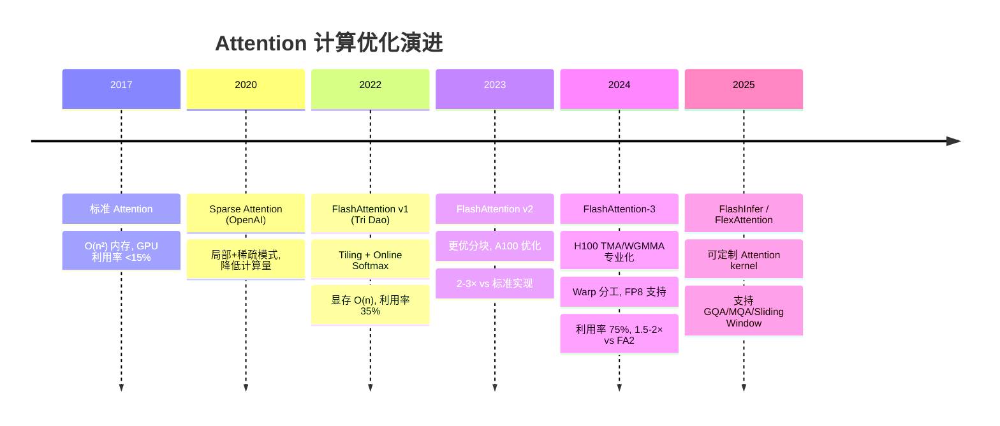

# FlashAttention-3 + LLM 推理基础设施：榨干 H100 的每一个 TFLOP

> 📚 参考文献
> - [Efficient Long Context Llm Survey](../papers/daily/20260322_efficient_long_context_llm_survey.md) — Efficient Long-Context LLMs: Survey and Benchmark 2025-2026
> - [Moe-Llama-Mixture-Of-Experts-Efficient-Llm-Serving](../papers/daily/20260321_moe-llama-mixture-of-experts-efficient-llm-serving.md) — MoE-LLaMA: Mixture-of-Experts for Efficient Large Languag...
> - [Kvcache Compression For Long-Context Llm Infere...](../papers/daily/20260323_kvcache_compression_for_long-context_llm_inference_.md) — KVCache Compression for Long-Context LLM Inference: Metho...
> - [Efficient-Long-Context-Llms-Survey-Benchmark-20...](../papers/daily/20260321_efficient-long-context-llms-survey-benchmark-2025-2026.md) — Efficient Long-Context LLMs: Survey and Benchmark 2025-2026
> - [Efficient-Long-Context-Llms-Survey-And-Benchmar...](../papers/daily/20260321_efficient-long-context-llms-survey-and-benchmark-2025-2026.md) — Efficient Long-Context LLMs: Survey and Benchmark 2025-2026
> - [Moe-Llama-Mixture-Of-Experts-For-Efficient-Larg...](../papers/daily/20260321_moe-llama-mixture-of-experts-for-efficient-large-language-model-serving.md) — MoE-LLaMA: Mixture-of-Experts for Efficient Large Languag...
> - [Speculative Decoding Draft Alignment](../papers/daily/20260322_speculative_decoding_draft_alignment.md) — Efficiently Aligning Draft Models for Speculative Decoding
> - [Recurrent-Drafter-Speculative-Decoding](../papers/daily/20260319_recurrent-drafter-speculative-decoding.md) — Recurrent Drafter for Fast Speculative Decoding

**一句话**：FlashAttention-3 通过让 GPU 的"搬运工"和"计算员"同时干活（不互相等待），把 H100 的注意力计算效率从 35% 提升到 75%。

**类比**：老工厂（FA2）：搬运工把材料搬过来，计算员才开始干活，干完了搬运工再搬下一批——互相等待浪费时间。新工厂（FA3）：搬运工搬第二批时，计算员同时处理第一批，流水线作业，吞吐翻倍。

**核心机制（3项创新）**：
1. **Warp 专业化**：把 GPU 的并行线程（warp）分工——Producer warp 专门加载数据（TMA 指令），Consumer warp 专门做矩阵乘法（WGMMA 指令），通过共享显存异步协作，真正重叠 compute/memory
2. **Softmax 延迟隐藏**：Softmax 的 max-reduction 操作穿插在 WGMMA 等待期执行，不占用额外时间
3. **FP8 精度支持**：Q/K 用 E4M3（精度高），V/Output 用 E5M2（范围大），Softmax 在 FP32 做，per-tile scale 校正 → 精度损失极小但吞吐接近 FP8 峰值

**性能数字（H100, BF16, seq_len=8K）**：
- FA2 → FA3：**1.5-2x 加速**；峰值利用率 35% → 75%
- FA3 (FP8)：~120 TFLOP/s（H100 峰值 FP8 ~200 TFLOP/s，61% 利用率）
- 端到端 LLaMA-3-8B 训练：step time 降低 **~25%**

---

## 🆚 创新点 vs 之前方案

| 维度 | 标准 Attention | FlashAttention v1/v2 | FlashAttention-3（创新） |
|------|---------------|---------------------|------------------------|
| IO 复杂度 | $O(n^2)$（写完整注意力矩阵） | $O(n^2d^2/M)$（分块 tiling） | 同 FA2，但**重叠计算与IO** |
| GPU 利用率 | ~10-15% | ~35% | **~75%**（H100 BF16） |
| 线程分工 | 无分工 | 统一 warp | **Producer/Consumer warp 专业化** |
| Softmax | 两遍扫描（先求 max 再归一化） | Online softmax（一遍） | **延迟隐藏**（插入 WGMMA 等待期） |
| FP8 支持 | ❌ | ❌ | ✅ Q/K=E4M3, V=E5M2, softmax=FP32 |
| 核心硬件 | 通用 | A100 CUDA Core | **H100 TMA + WGMMA** |
| 加速幅度 | baseline | 2-3× vs 标准 | **1.5-2× vs FA2** |

---

## 📈 Attention 优化技术演进



---

**和今日其他 LLM Infra 论文的连接**：
- **FlashAttention-3**：解决 Attention 计算瓶颈（硬件榨汁）
- **MoE-LLaMA**：解决 MoE 模型的 Expert Dispatch 开销（架构优化）
- **Speculative Decoding（草稿模型对齐）**：解决自回归生成延迟（算法优化）
- **Long-Context LLM Survey**：这三种优化在长上下文下效果更显著（长序列 O(n²) 的压力让 FA3 收益更大）

**三种提速方向的互补性**：
```
计算效率（FlashAttention-3）× 架构效率（MoE 解耦）× 解码效率（Speculative Decoding）
                    ↓
工业 LLM serving 的三叉优化
```

**工业常见做法**：
- H100 推理服务：FA3（BF16）是标配；FP8 用于吞吐要求极高、精度要求略低的场景（如广告 CTR 粗排 LLM）
- 集成入 vLLM/TRT-LLM：无需手写 CUDA，直接 pip install flash-attn==3.x
- 显存节省：FA3 的 IO-aware 算法使 Attention 显存 O(n) 而非 O(n²)，8K 序列下节省约 10GB
- 与 GQA/MQA 协同：FA3 对 GQA 原生支持，head_dim 灵活

**常见考点**：
- Q: FlashAttention 为什么能省显存？ → Fused kernel：不把完整注意力矩阵 (n×n) 写入 HBM，分块计算 + online softmax，只存 O(n) 的输出
- Q: H100 Hopper 架构带来了哪些对 LLM 重要的新特性？ → ① TMA（硬件级异步内存传输）；② WGMMA（新矩阵乘指令，吞吐远超 Ampere）；③ FP8 原生支持；④ NVLink 4.0（MoE 通信加速）
- Q: Speculative Decoding 的基本原理？ → 小草稿模型先快速生成多个 token，大模型一次验证（并行前向）；验证通过的 token 直接接受，不通过的回退重生成。等效推理速度提升 2-4x

## 📐 核心公式与原理

### 📐 FlashAttention IO 复杂度推导

**标准 Attention 的 IO 代价（朴素实现）：**

$$
\text{Attention}(Q,K,V) = \text{softmax}\!\left(\frac{QK^T}{\sqrt{d_k}}\right)V
$$

朴素实现需要将完整的 $n \times n$ 注意力矩阵 $S = QK^T / \sqrt{d_k}$ 写入 HBM：

$$
\text{IO}_{naive} = O(n^2 d + n^2) = O(n^2) \text{ HBM 访问}
$$

其中 $Q, K, V \in \mathbb{R}^{n \times d}$，$n$ 是序列长度，$d$ 是 head dim（通常 128）。

**FlashAttention 分块（Tiling）算法的 IO 分析：**

FA 的核心思路：将 $Q, K, V$ 分成大小为 $B_r \times d$（Q）和 $B_c \times d$（K,V）的块，每次只加载一个块做局部计算，维护 running softmax 统计量 $(m, \ell)$ 避免重新读取：

$$
m_{\text{new}} = \max(m_{\text{old}},\ \max_j S_{ij}), \qquad \ell_{\text{new}} = e^{m_{\text{old}} - m_{\text{new}}} \ell_{\text{old}} + \sum_j e^{S_{ij} - m_{\text{new}}}
$$

$$
O_{\text{new}} = \frac{e^{m_{\text{old}} - m_{\text{new}}} \ell_{\text{old}} \cdot O_{\text{old}} + \sum_j e^{S_{ij} - m_{\text{new}}} V_j}{\ell_{\text{new}}}
$$

最终 IO 代价：

$$
\text{IO}_{FA} = O\!\left(\frac{n^2 d}{M}\right) \times \text{SRAM 大小} = \Theta\!\left(\frac{n^2 d^2}{M}\right)
$$

其中 $M$ 为 SRAM（共享内存）大小。当 $M \gg d^2$ 时，IO 降至 $O(n)$ 量级（只需各读写一次 $Q, K, V, O$），省去了 $O(n^2)$ 的中间矩阵写入。

**推导步骤总结：**

1. **为何要分块**：$n=8192$ 时 $n^2 = 67M$ 个元素，BF16 约 **134MB**，无法放入 SRAM（通常 20-40MB），必须反复读写 HBM
2. **Online Softmax 技巧**：Flashattention 利用 $\text{softmax}(x) = \text{softmax}(x - m)$（数值等价），只需维护 running max $m$ 和 running sum $\ell$，不需要全局归一化后再回来重读
3. **FA3 的改进**：在 Hopper GPU 上用 WGMMA 异步矩阵乘 + TMA 数据搬运，使块加载和计算真正 **overlap**，将算术强度从 $O(n)$ 提升到接近硬件峰值 FLOP/s

**符号说明：**

| 符号 | 含义 |
|------|------|
| $n$ | 序列长度（如 4096, 8192）|
| $d$ | head dimension（通常 64 或 128）|
| $M$ | SRAM 容量（A100=192KB/SM, H100=256KB/SM）|
| $B_r, B_c$ | Q 块行数、KV 块行数（tile size）|
| $m$ | Running max（online softmax 的数值稳定项）|
| $\ell$ | Running sum of exp（归一化分母）|
| $O$ | 输出矩阵，同步维护的局部加权和 |

**直观理解：**
FA 的本质是把"先算完整矩阵、再 softmax"改成"边算边 softmax、只过一遍数据"——就像流式处理替代批量处理。代价是需要额外维护两个标量 $(m, \ell)$，但省掉了整个 $n \times n$ 矩阵的 HBM 往返，序列越长收益越大。

---

### 📐 KV Cache 内存占用公式

$$
\text{KV}_{Mem} = 2 \times L \times H \times d_h \times N \times s
$$

**推导步骤：**

1. 每个 token 在每一层需要保存 Key 和 Value 各一份（系数 2）
2. 每层有 $H$ 个注意力头，每头维度 $d_h$（总 head dim = $H \times d_h = d_{\text{model}}$）
3. 共 $L$ 层，序列长度 $N$，每个元素占 $s$ 字节（BF16 → $s=2$, FP8 → $s=1$）

**示例**：LLaMA-3-70B，$L=80, H=64, d_h=128, s=2$（BF16），$N=8192$：

$$
\text{KV}_{Mem} = 2 \times 80 \times 64 \times 128 \times 8192 \times 2 = 2 \times 80 \times 8192 \times 16384\text{ B} \approx 167\text{ GB}
$$

这解释了为何长序列推理是内存瓶颈，GQA（$H_{\text{KV}} \ll H_Q$）将 KV 头数从 64 减到 8，节省 8× 内存。

**符号说明：**
- $L$：Transformer 层数
- $H$：KV 注意力头数（GQA/MQA 中此值远小于 Q 头数）
- $d_h$：每个注意力头的维度
- $N$：当前序列的 token 数
- $s$：每个元素字节数（BF16=2, INT8=1, FP8=1）

### Q1: KV Cache 为什么是推理瓶颈？
**30秒答案**：KV Cache 大小 = 2×layers×heads×dim×seq_len×dtype_size。长序列时内存爆炸。优化：①Multi-Query Attention；②量化（FP8/INT4）；③页注意力（vLLM PagedAttention）；④压缩（H2O/SnapKV）。

### Q2: RLHF 和 DPO 的区别？
**30秒答案**：RLHF：训练 reward model + PPO 优化，需要在线采样。DPO：直接用偏好数据优化策略，跳过 reward model，更简单稳定。效果接近但 DPO 训练成本更低。

### Q3: 模型量化的原理和影响？
**30秒答案**：FP32→FP16→INT8→INT4：每次减半存储和计算。①Post-training Quantization：训练后量化，简单但可能损失精度；②Quantization-Aware Training：训练中模拟量化，精度损失更小。

### Q4: Speculative Decoding 是什么？
**30秒答案**：用小模型（draft model）快速生成多个候选 token，大模型一次性验证。如果小模型猜对 n 个，等于大模型「跳过」了 n 步推理。加速比取决于小模型的准确率。

### Q5: MoE 的优势和挑战？
**30秒答案**：优势：同参数量下推理更快（只激活部分 Expert），或同计算量下容量更大。挑战：①负载均衡（部分 Expert 过热/闲置）；②通信开销（分布式 Expert 选择）；③训练不稳定。

### Q6: PagedAttention（vLLM）的核心思想？
**30秒答案**：借鉴操作系统虚拟内存分页，将 KV Cache 切分为固定大小的「页」，按需分配。解决传统方式预分配最大序列长度导致的内存浪费（平均浪费 60-80%）。

### Q7: Continuous Batching 是什么？
**30秒答案**：传统 Static Batching 等最长序列完成才处理下一批。Continuous Batching 每个 token step 都可以加入新请求，序列完成立即释放。将 GPU 利用率从 ~30% 提升到 ~80%。

### Q8: GRPO 和 PPO 的核心区别？
**30秒答案**：PPO 需要 value network 估计 advantage；GRPO 用 group 内的相对奖励替代 value network：采样 G 个输出，用组内排名作为 baseline。更简单、更稳定、不需要额外模型。

### Q9: RAG vs Fine-tuning 怎么选？
**30秒答案**：RAG：知识频繁更新、需要引用来源、不想改模型。Fine-tuning：任务固定、需要特定风格/格式、追求最低延迟。两者可结合：fine-tune 后的模型 + RAG 检索。

### Q10: LLM 推理的三大瓶颈？
**30秒答案**：①Prefill 阶段：计算密集（大量矩阵乘）；②Decode 阶段：内存密集（KV Cache 读写）；③通信：多卡推理时的 AllReduce。优化方向：FlashAttention（①）、PagedAttention（②）、TP/PP 并行（③）。

---

## 相关概念

- [[attention_in_recsys|Attention 在搜广推中的演进]]

---

## 记忆助手 💡

### 类比法

- **标准 Attention = 笨工厂**：先把所有材料搬到车间（全部写入 HBM），再开始加工，材料太多车间放不下就溢出
- **FlashAttention = 分批生产**：材料分小批搬进车间（tiling），加工完一批再搬下一批，车间永远不溢出
- **FlashAttention-3 = 流水线工厂**：搬运工（Producer warp）搬第二批时，加工员（Consumer warp）同时处理第一批，互不等待
- **FP8 量化 = 速写 vs 精画**：Q/K 用高精度（E4M3，精画轮廓），V 用大范围（E5M2，速写色彩），Softmax 用 FP32（精确计算）
- **Speculative Decoding = 先写草稿再审核**：小模型（草稿）快速生成 N 个 token，大模型（审核）一次性验证，接受正确的部分

### 对比表

| 技术 | 优化维度 | 加速倍数 | 核心原理 |
|------|---------|---------|---------|
| FlashAttention-1 | IO复杂度 | 2-3× | Tiling + Online Softmax |
| FlashAttention-3 | 计算/IO重叠 | 1.5-2× (vs FA2) | Warp专业化 + 延迟隐藏 |
| PagedAttention | 内存碎片 | 吞吐2-3× | OS分页思想管理KV Cache |
| Speculative Dec. | 自回归延迟 | 2-5× | Draft模型并行+验证 |
| Continuous Batching | 吞吐量 | 2-3× | 请求级动态调度 |

### 口诀/助记

- **FA3 三大创新**："Warp 专业化（搬运/计算分工）、Softmax 延迟隐藏（见缝插针）、FP8 混合精度（Q/K 高精度 V 大范围）"
- **GPU 利用率记忆**："标准 10% → FA2 35% → FA3 75%"
- **推理三大瓶颈**："Prefill 算力密集，Decode 内存密集，多卡通信密集"

### 面试一句话

- **FlashAttention 核心**："通过 Tiling 将 Attention 计算分块，每块在 SRAM 中完成避免频繁 HBM 读写，IO 复杂度从 O(n²) 降到 O(n²d²/M)，FA3 进一步让计算和 IO 流水线重叠，H100 利用率从 35% 提升到 75%"
- **Speculative Decoding**："小 draft 模型快速生成候选 token，大 target 模型一次性并行验证，数学上保证输出分布与大模型完全一致，加速 2-5 倍"
