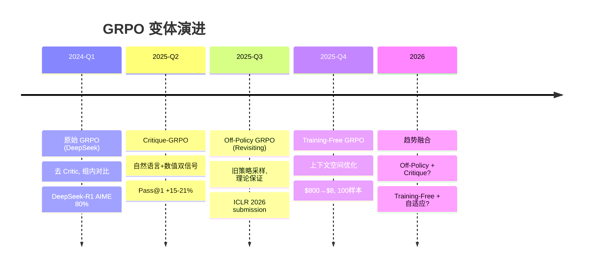

# GRPO 变体演进：从 On-Policy 到 Training-Free 到 Critique-GRPO

> 📚 参考文献
> - GRPO 原始论文 (DeepSeek, 2024) — Group Relative Policy Optimization
> - [Revisiting GRPO](https://arxiv.org/abs/2505.22257) — Off-Policy GRPO 扩展 (ICLR 2026 submission)
> - [Training-Free GRPO](https://arxiv.org/abs/2510.08191) — 上下文空间策略优化，无需训练
> - [Critique-GRPO](https://arxiv.org/abs/2506.03106) — 自然语言+数值反馈联合优化
> - [[GRPO大模型推理RL算法]] — GRPO 基础知识

> 知识卡片 | 创建：2026-04-20 | 领域：llm-infra / alignment

---

## 技术演进总览

```
原始 GRPO (DeepSeek 2024)
  │  组内相对 reward，去 Critic，显存减半
  │
  ├──→ Off-Policy GRPO (2025)
  │     用旧策略采样，提升采样效率 + 训练稳定性
  │
  ├──→ Training-Free GRPO (2025.10)
  │     冻结模型参数，在上下文空间优化，$800→$8
  │
  └──→ Critique-GRPO (2025.06)
        自然语言 critique 反馈 + 数值 reward 联合
        Pass@1 +15-21%
```

---

## 1. 原始 GRPO（基线）

**核心公式**：

$$
\mathcal{L}_{\text{GRPO}}(\theta) = \frac{1}{G}\sum_{i=1}^{G} \left[\min\!\left(r_i(\theta)\hat{A}_i,\ \text{clip}(r_i(\theta), 1{-}\epsilon, 1{+}\epsilon)\hat{A}_i\right) - \beta\, D_{\text{KL}}[\pi_\theta \| \pi_{\text{ref}}]\right]
$$

其中 Advantage 用组内归一化替代 Critic：

$$
\hat{A}_i = \frac{r_i - \mu_r}{\sigma_r}, \quad \mu_r = \frac{1}{G}\sum_j r_j, \quad \sigma_r = \text{std}(\{r_j\})
$$

**关键设计**：
- 去 Critic → 显存从 4x 降到 2x
- 组内对比 → advantage 方差低、梯度稳定
- 规则 reward（答对=1, 答错=0）→ 适合可验证任务
- 代表成果：DeepSeek-R1，AIME 9%→80%

---

## 2. Off-Policy GRPO（Revisiting GRPO）

> 论文：Revisiting Group Relative Policy Optimization: Insights into On-Policy and Off-Policy Training (2025)

### 动机

原始 GRPO 是 **on-policy** 的：每步更新都需要当前策略重新采样 G 个回答，采样开销大。Off-policy PPO 已证明可以提升训练稳定性和采样效率，能否将同样思路用到 GRPO？

### 核心贡献

1. **理论推导**：证明 GRPO 的 clipping 目标可以从 first principles 推导为 reward improvement 的下界，这一性质在 off-policy 设置下依然成立
2. **Off-Policy 扩展**：用旧策略 $\pi_{\text{old}}$ 的采样结果来估计 advantage，不需要每步重新采样
3. **Zero-Variance Masking**：为 DAPO 提出的零方差样本掩码提供了理论基础——当一组采样全对或全错时（$\sigma_r = 0$），梯度为零，应跳过

### Off-Policy GRPO 目标函数

$$
\mathcal{L}_{\text{off-GRPO}}(\theta) = \frac{1}{G}\sum_{i=1}^{G} \left[\min\!\left(\frac{\pi_\theta(o_i|q)}{\pi_{\text{old}}(o_i|q)}\hat{A}_i^{\text{old}},\ \text{clip}(\cdot)\hat{A}_i^{\text{old}}\right)\right]
$$

关键区别：$o_i \sim \pi_{\text{old}}$（旧策略采样），$\hat{A}_i^{\text{old}}$ 用旧策略的组内 reward 计算。

### 实验结论

- Off-Policy GRPO 在多数任务上 **显著优于或持平** On-Policy GRPO
- 采样效率提升：同样计算预算下可以做更多更新步
- 训练更稳定：减少了在线采样引入的方差

### 工业意义

- 采样和训练可以异步进行（采样用旧模型，训练用新模型）
- 更适合大规模分布式训练场景
- 已被 HuggingFace TRL、VERL 等开源库采纳

---

## 3. Training-Free GRPO

> 论文：Training-Free Group Relative Policy Optimization (2025.10)

### 动机

标准 GRPO 需要完整的参数微调（backward pass + optimizer），对大模型（如 DeepSeek-V3）成本极高。能否完全不更新参数，只通过改变 prompt/context 来实现类似效果？

### 核心创新：上下文空间优化

**范式转换**：从参数空间 $\theta$ 优化 → 上下文空间 $c$ 优化

$$
\text{传统 GRPO}: \quad \theta^* = \arg\max_\theta \mathcal{L}_{\text{GRPO}}(\theta)
$$

$$
\text{Training-Free GRPO}: \quad c^* = \arg\max_c \mathcal{L}_{\text{TF-GRPO}}(c; \theta_{\text{frozen}})
$$

其中 $c$ 是经验上下文（experiential context），模型参数 $\theta$ 完全冻结。

### 工作流程

1. **多次采样**：对每个问题，冻结的 LLM 生成 G 个回答
2. **组内语义优势**：不用数值 reward，而用 **自然语言解释** 作为优势信号（group relative semantic advantage）
3. **经验蒸馏**：从高质量回答中提取 "learned token prior"（经验知识），迭代精炼
4. **上下文注入**：推理时将学到的经验知识作为 system prompt 注入

### 关键特性

| 维度 | 传统 GRPO | Training-Free GRPO |
|------|-----------|-------------------|
| 参数更新 | 需要（backward pass） | **不需要**（冻结模型） |
| 训练成本 | $800+（32B 模型微调） | **$8**（100 样本 API 调用） |
| 适用模型 | 开源可微调模型 | **任何 API 模型**（闭源也行） |
| 泛化能力 | 可能过拟合训练分布 | OOD 泛化更好 |
| 优化信号 | 数值 reward | 语义优势（自然语言） |

### 实验结果

- 在 DeepSeek-V3.1-Terminus 上，仅用 100 个训练样本
- 数学推理和 Web 搜索任务上显著提升 OOD 性能
- 超过微调 32B 模型的效果，成本降低 100 倍

### 工业价值

- 对闭源 API（GPT-4, Claude）也能用——不需要模型权重
- 极低成本实现任务适配
- 可与传统 GRPO 互补：先 Training-Free 快速验证，再决定是否值得全量微调

---

## 4. Critique-GRPO

> 论文：Critique-GRPO: Advancing LLM Reasoning with Natural Language and Numerical Feedback (2025.06)

### 动机

标准 GRPO 只用 **数值 reward**（对/错），存在三个问题：
1. **性能平台期**：模型学到一定程度后 reward 信号不再提供足够信息
2. **自发 self-reflection 有限**：纯 RL 训练的模型虽然会自发产生 CoT，但自我纠错能力弱
3. **持续失败问题**：某些难题模型 G 次采样全错，梯度为零，永远学不会

### 核心创新：双信号联合优化

Critique-GRPO 同时利用 **数值反馈**（binary reward）和 **自然语言反馈**（critique）：

$$
\text{信号} = \underbrace{r_i \in \{0, 1\}}_{\text{数值反馈}} + \underbrace{\text{critique}(o_i)}_{\text{自然语言反馈}}
$$

### 工作流程

1. 对同一题目生成 G 个初始回答 $\{o_1, \ldots, o_G\}$
2. 用 critique model 对每个错误回答生成自然语言反馈
3. 模型基于 critique 生成 **修正回答**（self-refinement）
4. 同时从初始回答和修正回答中学习

### Shaping Function（关键设计）

对修正回答使用特殊的 shaping function：
- **放大**正确的、尤其是"陌生的"修正（即模型之前不会的题，通过 critique 学会了）
- **惩罚**错误的修正（防止模型学到错误的 critique-following 模式）

### 实验结果

| 模型 | 平均 Pass@1 提升 | 测试基准 |
|------|-----------------|---------|
| Qwen2.5-7B-Base | **+15.0%** | 8个推理任务 |
| Qwen2.5-Math-7B-Base | **+21.6%** | 8个推理任务 |
| Qwen3-8B | **+15.0%** | 8个推理任务 |

超过所有对比的 supervised 和 RL-based fine-tuning 方法。

### 与标准 GRPO 的关键区别

| 维度 | 标准 GRPO | Critique-GRPO |
|------|-----------|---------------|
| 反馈类型 | 仅数值（0/1） | 数值 + 自然语言 critique |
| 学习来源 | 初始回答 | 初始回答 + critique 引导的修正 |
| 平台期突破 | 有限 | critique 提供新学习信号 |
| 持续失败 | 无解（全错→梯度零） | critique 引导修正可能突破 |
| 额外开销 | 无 | 需要 critique model（可用同一模型） |

---

## 全景对比

| 维度 | 原始 GRPO | Off-Policy GRPO | Training-Free GRPO | Critique-GRPO |
|------|-----------|----------------|--------------------|--------------|
| 训练方式 | On-policy RL | Off-policy RL | **无训练** | On-policy RL |
| 参数更新 | 需要 | 需要 | **不需要** | 需要 |
| 采样策略 | 当前策略 | 旧策略 | 冻结模型 | 当前策略+critique |
| Advantage 信号 | 数值（组内归一化） | 数值（旧策略组内） | **语义**（自然语言） | 数值+语义 |
| 核心创新 | 去 Critic | 采样效率 | 上下文空间优化 | 双信号+shaping |
| 成本 | 中 | 中（采样更高效） | **极低**（$8 vs $800） | 中偏高（+critique） |
| 适用场景 | 开源模型微调 | 大规模分布式训练 | API 模型/快速验证 | 推理能力深度提升 |
| 代表结果 | AIME 80% | ≥On-Policy | 100样本超32B微调 | Pass@1 +15-21% |

---

## 技术演进脉络



---

## 面试考点

### Q1: GRPO 有哪些变体？各解决什么问题？

**30秒答案**：四个代表变体——(1) 原始 GRPO：去 Critic 显存减半；(2) Off-Policy GRPO：用旧策略采样提升效率，理论证明 reward improvement 下界在 off-policy 下仍然成立；(3) Training-Free GRPO：冻结参数在上下文空间优化，成本降低 100x；(4) Critique-GRPO：加入自然语言 critique 反馈突破性能平台期，Pass@1 +15-21%。

### Q2: Off-Policy GRPO 为什么能 work？

**30秒答案**：关键理论贡献是证明 GRPO 的 clipping 目标是 reward improvement 的下界，这个性质在 off-policy（用旧策略采样）时仍然成立。实际操作中，重要性比率 $\pi_\theta / \pi_{\text{old}}$ 加上 clipping 机制控制了分布偏移带来的方差。效果上显著优于或持平 on-policy。

### Q3: Training-Free GRPO 的 "上下文空间优化" 是什么意思？

**30秒答案**：传统 RL 优化模型参数 $\theta$，Training-Free GRPO 冻结 $\theta$，转而优化输入给模型的经验上下文 $c$。通过多轮采样和语义优势评估，迭代蒸馏出高质量的 "经验知识"（类似精心设计的 few-shot prompt），推理时注入上下文即可。本质是把 RL 的信用分配问题转化为 prompt engineering 的自动化。

### Q4: Critique-GRPO 如何解决 "全组全错" 的问题？

**30秒答案**：标准 GRPO 中如果 G 个采样全错，组内方差为零，梯度消失。Critique-GRPO 引入 critique model 对错误回答生成诊断性反馈，模型基于 critique 生成修正回答。即使初始全错，修正后可能有正确的，这些正确修正被 shaping function 放大，模型从中学到新知识。

### Q5: 如果要在工业中选一个 GRPO 变体，怎么选？

**30秒答案**：看场景——(1) 有开源模型+充足算力：Off-Policy GRPO（最佳采样效率）；(2) 只有 API 访问或预算有限：Training-Free GRPO（$8 搞定）；(3) 需要最强推理能力：Critique-GRPO（但需要额外的 critique 生成开销）；(4) 快速原型验证：先 Training-Free 看效果，再决定要不要 full RL。

---

## 相关概念

- [[GRPO大模型推理RL算法]] — GRPO 基础知识和公式推导
- [[LLM对齐RL方法全景_2026]] — PPO/DPO/GRPO/DAPO 全景
- [[RLVR_vs_RLHF后训练路线]] — 可验证 reward 路线
- [[测试时计算扩展与推理时对齐]] — 推理时计算扩展
