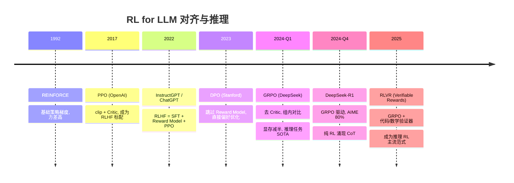

# GRPO：让大模型自己学会推理的 RL 算法

> 📚 参考文献
> - [Kvcache Compression For Long-Context Llm Infere...](../papers/daily/20260323_kvcache_compression_for_long-context_llm_inference_.md) — KVCache Compression for Long-Context LLM Inference: Metho...
> - [Grpo-Group-Relative-Policy-Optimization-Llm-Rea...](../papers/daily/20260321_grpo-group-relative-policy-optimization-llm-reasoning.md) — GRPO: Group Relative Policy Optimization for Large Langua...
> - [Grpo-Group-Relative-Policy-Optimization-For-Lar...](../papers/daily/20260321_grpo-group-relative-policy-optimization-for-large-language-model-reasoning.md) — GRPO: Group Relative Policy Optimization for Large Langua...
> - [Flashattention-3-Fast-And-Accurate-Attention-Fo... [BROKEN]](../../llm-infra/20260321_flashattention-3-fast-and-accurate-attention-for-llms-on-next-gen-accelerators.md) — FlashAttention-3: Fast and Accurate Attention for LLMs on...
> - [Vllm Efficient Memory Management For Large Lang...](../papers/daily/20260323_vllm_efficient_memory_management_for_large_language.md) — vLLM: Efficient Memory Management for Large Language Mode...

**一句话**：GRPO 让模型对同一道题做多次尝试，通过"对答案们打相对分"来学习，不再需要单独养一个打分模型。

**类比**：你学数学时，老师不是单独判断"这次比昨天进步了多少"（需要记住你历史表现的 Critic），而是把你班同学的答案都摊开比一比——你这次比班里平均水平好多少，就给多少奖励。组内排名就是 advantage。

**核心机制**（5步）：
1. 对同一道题（如数学推理），让模型生成 G=8 个不同回答
2. 用规则打分（答对=1, 格式对=0.1, 否则=0）得到 G 个 reward
3. 计算组内均值和标准差，归一化得到每个回答的 advantage
4. 用 PPO 的 clip 目标更新策略，保留 KL 惩罚防止模型"走偏"
5. 无需 Critic 网络 → 节省 50% 显存，收敛更稳定

**和 PPO 的区别**：
| 维度 | PPO | GRPO |
|------|-----|------|
| 需要 Critic | ✅ 需要（同量级模型）| ❌ 不需要 |
| Advantage 来源 | 时序差分 V 函数估计 | 组内相对 reward |
| 显存需求 | 2x | 1x |
| 适用任务 | 通用对齐 | 可验证任务（数学/代码）|
| 方差 | 较高（单次 V 估计不准） | 较低（G 次统计更稳定）|

**工业常见做法**：
- 先 SFT 冷启动（让模型至少能生成合理格式），再 GRPO fine-tune
- G 通常取 8-16；太小方差高，太大计算贵
- 温度设 0.7-1.0：需要多样性，否则 G 个答案全对/全错，方差为 0，梯度消失
- 用 vLLM 并行采样 G 个回答，加速采样阶段
- 监控 KL divergence（>0.1 需降 LR）和组内 reward 方差（接近 0 = 题太简单/难）

**常见考点**：
- Q: GRPO 为何特别适合数学/代码任务？ → 有可验证 reward（规则判对错），无需人工标注偏好
- Q: DeepSeek-R1-Zero 为何自发产生 CoT？ → GRPO 优化压力下发现"先想再答"答对率更高，reward 更高，行为被强化稳定涌现
- Q: GRPO 的 advantage 归一化为什么有效？ → 消除 reward scale 影响，只保留相对优劣信号，类似 batch normalization 的稳定效果

---

## 🆚 创新点 vs 之前方案

| 维度 | REINFORCE | PPO | GRPO（创新） |
|------|-----------|-----|-------------|
| Advantage 估计 | 无 baseline，方差大 | Critic 网络 V(s) 估计 | **组内相对 reward 归一化**，无需 Critic |
| 显存开销 | 1× | 4×（策略+旧策略+Critic+参考） | **2×**（策略+参考） |
| 更新稳定性 | 不稳定 | clip 机制稳定 | clip + KL 惩罚 + 组内归一化三重稳定 |
| 奖励信号 | 任意 | 任意（通常需 reward model） | **规则可验证奖励**（数学/代码） |
| 训练复杂度 | 低 | 高（需训练 Critic） | **中**（只需多次采样） |
| 代表成果 | — | InstructGPT/ChatGPT | **DeepSeek-R1**（AIME 9%→80%）|

---

## 📈 技术演进时间线

---

**演进脉络**：`REINFORCE (1992) → PPO (2017, 带 Critic + clip) → GRPO (2024, 去 Critic + 组内对比)`，核心驱动：LLM 训练的显存成本越来越贵，GRPO 用数学技巧绕开了 Critic。

## 📐 核心公式与原理

### 📐 GRPO 目标函数推导

**核心目标函数：**

$$
\mathcal{L}_{\text{GRPO}}(\theta) = \frac{1}{G}\sum_{i=1}^{G} \left[\min\!\left(r_i(\theta)\hat{A}_i,\ \text{clip}(r_i(\theta),\ 1{-}\epsilon,\ 1{+}\epsilon)\hat{A}_i\right) - \beta\, \mathbb{D}_{\text{KL}}[\pi_\theta \| \pi_{\text{ref}}]\right]
$$

**推导步骤：**

1. **从 PPO 出发**：PPO 的 surrogate objective 是
   $$\mathcal{L}_{\text{PPO}} = \mathbb{E}_t\!\left[\min\!\left(r_t(\theta)\hat{A}_t,\ \text{clip}(r_t(\theta), 1{-}\epsilon, 1{+}\epsilon)\hat{A}_t\right)\right]$$
   其中重要性比率 $r_t(\theta) = \frac{\pi_\theta(a_t|s_t)}{\pi_{\text{old}}(a_t|s_t)}$，Advantage $\hat{A}_t$ 由 Critic 的时序差分估计。

2. **GRPO 的核心替换——去掉 Critic**：对同一 prompt $q$，采样 $G$ 个回答 $\{o_1,\ldots,o_G\}$，规则给出每个回答的 scalar reward $r_i$。令
   $$\hat{A}_i = \frac{r_i - \mu_r}{\sigma_r}, \quad \mu_r = \frac{1}{G}\sum_{j=1}^G r_j,\quad \sigma_r = \sqrt{\frac{1}{G}\sum_{j=1}^G (r_j - \mu_r)^2}$$
   归一化后 $\hat{A}_i$ 代替 Critic 估计的 advantage，无需额外价值网络。

3. **整体回答的概率比**：PPO 是 token 级的 $r_t$；GRPO 在整个回答粒度上做：
   $$r_i(\theta) = \frac{\pi_\theta(o_i \mid q)}{\pi_{\text{old}}(o_i \mid q)} = \prod_{t=1}^{|o_i|} \frac{\pi_\theta(o_{i,t} \mid q, o_{i,<t})}{\pi_{\text{old}}(o_{i,t} \mid q, o_{i,<t})}$$

4. **KL 惩罚防止策略漂移**：
   $$\mathbb{D}_{\text{KL}}[\pi_\theta \| \pi_{\text{ref}}] = \mathbb{E}_{o \sim \pi_\theta}\!\left[\log\frac{\pi_\theta(o|q)}{\pi_{\text{ref}}(o|q)}\right]$$
   $\pi_{\text{ref}}$ 是 SFT 初始化的参考模型，$\beta$ 控制偏离程度，通常 $\beta \in [0.01, 0.1]$。

**符号说明：**

| 符号 | 含义 |
|------|------|
| $G$ | 同一 prompt 的采样回答数（通常 8–16） |
| $o_i$ | 第 $i$ 个采样回答（token 序列） |
| $r_i$ | 规则打分函数给 $o_i$ 的 scalar reward（如答对=1, 答错=0） |
| $\hat{A}_i$ | 组内归一化 advantage，$\in [-3, 3]$ 左右（3σ 截断） |
| $r_i(\theta)$ | 新旧策略在 $o_i$ 上的概率比（重要性权重） |
| $\epsilon$ | clip 边界，通常 0.2，防止单步更新过大 |
| $\beta$ | KL 惩罚系数，防止策略偏离参考模型 |
| $\pi_{\text{ref}}$ | SFT 热启动的参考策略（固定，不更新） |

**直观理解：**
GRPO 就像组内排名打分——不需要知道"绝对应该拿多少分"（Critic），只需知道"比同学高了多少"（组内相对 reward）。归一化消除了 reward 量纲影响，类比 BatchNorm：无论 reward 是 [0,1] 还是 [0,100]，$\hat{A}_i$ 始终在相同数值范围内，梯度稳定。

---

### 📐 PPO → GRPO 显存需求对比

PPO 需要维护：策略模型 $\pi_\theta$（active）、旧策略 $\pi_{\text{old}}$（frozen copy）、Critic $V_\phi$（same size as $\pi_\theta$）、参考模型 $\pi_{\text{ref}}$

$$
\text{PPO 显存} \approx 4 \times M_\theta \text{ (4份同量级模型)}
$$

GRPO 只需要：策略模型 $\pi_\theta$、参考模型 $\pi_{\text{ref}}$（可以 offload）

$$
\text{GRPO 显存} \approx 2 \times M_\theta \approx \frac{1}{2} \text{ PPO 显存}
$$

**符号说明：**
- $M_\theta$：单个策略模型的显存占用（参数 + 优化器状态）
- 70B 模型 BF16 下 $M_\theta \approx 140\text{GB}$，PPO 需要 ~560GB，GRPO 约 ~280GB（A100 80GB × 4 即可）

### Q1: KV Cache 为什么是推理瓶颈？
**30秒答案**：KV Cache 大小 = 2×layers×heads×dim×seq_len×dtype_size。长序列时内存爆炸。优化：①Multi-Query Attention；②量化（FP8/INT4）；③页注意力（vLLM PagedAttention）；④压缩（H2O/SnapKV）。

### Q2: RLHF 和 DPO 的区别？
**30秒答案**：RLHF：训练 reward model + PPO 优化，需要在线采样。DPO：直接用偏好数据优化策略，跳过 reward model，更简单稳定。效果接近但 DPO 训练成本更低。

### Q3: 模型量化的原理和影响？
**30秒答案**：FP32→FP16→INT8→INT4：每次减半存储和计算。①Post-training Quantization：训练后量化，简单但可能损失精度；②Quantization-Aware Training：训练中模拟量化，精度损失更小。

### Q4: Speculative Decoding 是什么？
**30秒答案**：用小模型（draft model）快速生成多个候选 token，大模型一次性验证。如果小模型猜对 n 个，等于大模型「跳过」了 n 步推理。加速比取决于小模型的准确率。

### Q5: MoE 的优势和挑战？
**30秒答案**：优势：同参数量下推理更快（只激活部分 Expert），或同计算量下容量更大。挑战：①负载均衡（部分 Expert 过热/闲置）；②通信开销（分布式 Expert 选择）；③训练不稳定。

### Q6: PagedAttention（vLLM）的核心思想？
**30秒答案**：借鉴操作系统虚拟内存分页，将 KV Cache 切分为固定大小的「页」，按需分配。解决传统方式预分配最大序列长度导致的内存浪费（平均浪费 60-80%）。

### Q7: Continuous Batching 是什么？
**30秒答案**：传统 Static Batching 等最长序列完成才处理下一批。Continuous Batching 每个 token step 都可以加入新请求，序列完成立即释放。将 GPU 利用率从 ~30% 提升到 ~80%。

### Q8: GRPO 和 PPO 的核心区别？
**30秒答案**：PPO 需要 value network 估计 advantage；GRPO 用 group 内的相对奖励替代 value network：采样 G 个输出，用组内排名作为 baseline。更简单、更稳定、不需要额外模型。

### Q9: RAG vs Fine-tuning 怎么选？
**30秒答案**：RAG：知识频繁更新、需要引用来源、不想改模型。Fine-tuning：任务固定、需要特定风格/格式、追求最低延迟。两者可结合：fine-tune 后的模型 + RAG 检索。

### Q10: LLM 推理的三大瓶颈？
**30秒答案**：①Prefill 阶段：计算密集（大量矩阵乘）；②Decode 阶段：内存密集（KV Cache 读写）；③通信：多卡推理时的 AllReduce。优化方向：FlashAttention（①）、PagedAttention（②）、TP/PP 并行（③）。
