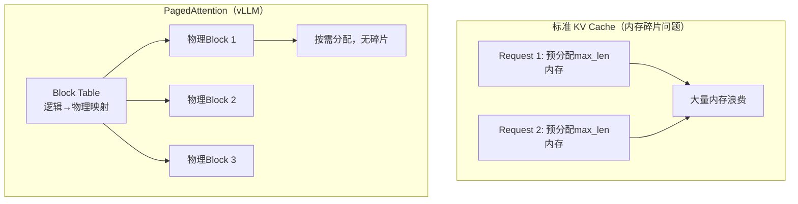

# KV Cache 压缩与 LLM 推理优化全景
> 📚 参考文献
> - [Flashattention-3-Fast-And-Accurate-Attention-Fo... [BROKEN]](../../llm-infra/20260321_flashattention-3-fast-and-accurate-attention-for-llms-on-next-gen-accelerators.md) — FlashAttention-3: Fast and Accurate Attention for LLMs on...
> - [Kvcache Compression For Long-Context Llm Infere...](../papers/daily/20260323_kvcache_compression_for_long-context_llm_inference_.md) — KVCache Compression for Long-Context LLM Inference: Metho...
> - [Efficient-Long-Context-Llms-Survey-Benchmark-20...](../papers/daily/20260321_efficient-long-context-llms-survey-benchmark-2025-2026.md) — Efficient Long-Context LLMs: Survey and Benchmark 2025-2026
> - [Vllm-Paged-Attention](../papers/daily/20260317_vllm-paged-attention.md) — vLLM PagedAttention：LLM 推理内存管理革命
> - [Efficient-Long-Context-Llms-Survey-And-Benchmar...](../papers/daily/20260321_efficient-long-context-llms-survey-and-benchmark-2025-2026.md) — Efficient Long-Context LLMs: Survey and Benchmark 2025-2026
> - [Flashattention-3-Fast-Accurate-Attention-Next-G... [BROKEN]](../../llm-infra/20260321_flashattention-3-fast-accurate-attention-next-gen-accelerators.md) — FlashAttention-3: Fast and Accurate Attention for LLMs on...
> - [Longer-Long-Sequence-Industrial-Rec](../papers/daily/20260319_longer-long-sequence-industrial-rec.md) — LONGER: Scaling Up Long Sequence Modeling in Industrial R...
> - [Continuous Batching And Dynamic Memory Manageme...](../papers/daily/20260323_continuous_batching_and_dynamic_memory_management_f.md) — Continuous Batching and Dynamic Memory Management for Hig...

> 知识卡片 | 创建：2026-03-23 | 领域：llm-infra

---

## 🆚 创新点 vs 之前方案

| 维度 | 朴素 KV Cache | PagedAttention (vLLM) | GQA/MQA | 量化压缩 (MiniKV/H2O) |
|------|-------------|---------------------|---------|---------------------|
| 内存分配 | 预分配 max\_len（浪费 60-80%） | **按需分页**，接近 0 浪费 | 减少 KV head 数（4-32×） | 2-4 bit 量化（4-8×） |
| 并发能力 | batch=1-2（内存紧张） | **batch=16-64**（碎片消除） | 间接提升（内存省下来） | 间接提升 |
| 精度影响 | 无 | 无（完全等价） | MQA ~2%↓, GQA <0.5%↓ | 2-bit 约 1-3%↓ |
| 核心思想 | — | OS 虚拟内存分页 | 注意力头共享 | 重要性驱动的选择性保留 |
| 代表系统 | HuggingFace | vLLM, SGLang | LLaMA-3, Mistral | MiniKV, SnapKV, H2O |

---

## 架构总览



## 📐 核心公式与原理

### 📐 1. MHA → GQA → MQA KV Cache 节省推导

**Multi-Head Attention（标准 MHA）：**

$$
\text{KV}}_{\text{{\text{MHA}}} = 2 \times L \times H \times d_k \times N
$$

$H$ 个头各独立存储 K、V（系数 2），总 KV 内存正比于头数 $H$。

**Grouped Query Attention（GQA）：**

将 $H$ 个 Query 头分为 $G$ 组（$G < H$），每组共享一对 KV：

$$
\text{KV}}_{\text{{\text{GQA}}} = 2 \times L \times G \times d_k \times N = \frac{G}{H} \times \text{KV}}_{\text{{\text{MHA}}}
$$

**Multi-Query Attention（MQA，$G=1$）：**

$$
\text{KV}}_{\text{{\text{MQA}}} = 2 \times L \times 1 \times d_k \times N = \frac{1}{H} \times \text{KV}}_{\text{{\text{MHA}}}
$$

**推导步骤：**

1. **MHA 的 KV 来源**：每个 Query 头 $h$ 独立计算 $K_h = X W_K^h$，$V_h = X W_V^h$，需各自缓存 $L \times N \times d_k$ 个元素，共 $H$ 组。

2. **GQA 的共享策略**：$H$ 个 Q 头分为 $G$ 组，同组的 Q 头复用同一对 KV，仅需 $G$ 组缓存，节省 $H/G$ 倍。

3. **示例（LLaMA-3-8B，$L=32, H=32, G=8, d_k=128, N=8192$，BF16）：**

$$
\text{KV}}_{\text{{\text{GQA}}} = 2 \times 32 \times 8 \times 128 \times 8192 \times 2\text{ B} \approx 1.07\text{ GB}
$$

   MHA 下约需 4.3 GB，GQA（G=8）节省 4×，精度损失 <0.5%。

4. **质量-效率权衡**：$G=1$（MQA）节省最多但精度损失 ~2%；$G=H$（MHA）质量最好；$G \in (1, H)$（GQA）是工业最优解，LLaMA-3/Mistral/Gemma 均采用。

**符号说明：**

| 符号 | 含义 |
|------|------|
| $H$ | Query 总头数（如 32、64）|
| $G$ | GQA 的 KV 组数（$1 \leq G \leq H$）|
| $d_k$ | 每个注意力头的维度（通常 128）|
| $L$ | Transformer 层数 |
| $N$ | 当前序列 token 数 |

**直观理解：** GQA 是"拼车"——$H/G$ 个 Q 头共享同一辆 KV"车"，内存节省 $H/G$ 倍。核心发现：Q 头的多样性（高秩表示）比 KV 头的多样性更重要，减少 KV 头数对质量影响有限。

---

### 📐 2. KV Cache 内存精确计算

$$
\text{KV}}_{\text{{\text{Mem}}} = 2 \times L \times H_{\text{KV}} \times d_k \times N \times s
$$

**推导步骤：**
1. 每层（$L$ 层）需存储 Key 和 Value（系数 2）
2. GQA/MQA 下，KV 头数为 $H_{\text{KV}}$（$\leq H_Q$）
3. 每个 KV 头维度为 $d_k$，序列 $N$ 个 token，每元素 $s$ 字节（BF16→2, FP8→1）

**示例**：LLaMA-3-70B（$L=80, H_{\text{KV}}=8, d_k=128, N=32768, s=2$）：

$$
\text{KV}}_{\text{{\text{Mem}}} = 2 \times 80 \times 8 \times 128 \times 32768 \times 2 \approx 107\text{ GB}
$$

这是单 batch 一个请求占用的 KV Cache，超出单张 H100（80GB）的容量——这就是为何长上下文需要 KV 量化或驱逐。

---

### 3. H2O KV 驱逐策略（Heavy Hitter Oracle）

保留 KV Cache 中 attention score 累积最高的 $k$ 个 token（Heavy Hitters）+ 最近 $w$ 个 token（Sink + Window）：

$$
\text{score}(t) = \sum_{\tau > t} a_{\tau, t}, \quad \text{保留 top-}k \text{ 的 token KV}
$$

其中 $a_{\tau,t}$ 是位置 $\tau$ 对位置 $t$ 的注意力权重。实验结果：保留 20% KV Cache，任务性能保留 95%+。

---

**一句话**：KV Cache 是长上下文推理的「内存黑洞」，今天的内容把三条压缩路线（量化、驱逐、稀疏）和三个系统（vLLM、SGLang、Continuous Batching）串成了一张完整的推理优化地图。

**类比**：KV Cache 像「会议室的黑板」——每个 token 写下自己的「键值笔记」，上下文越长黑板越满。KV 量化是用铅笔代替马克笔（精度低但省空间），KV 驱逐是擦掉不重要的内容（有损），PagedAttention 是把黑板换成活页笔记本（分页管理）。

---

## 新增：MoBA — 混合块注意力（Moonshot, 2025）

> 论文：MoBA: Mixture of Block Attention for Long-Context LLMs (arxiv 2502.13189)

**问题定义**：传统 Full Attention 的 O(n^2) 复杂度在百万 token 上下文中不可承受；现有稀疏注意力（Longformer/BigBird）依赖人为设计的固定模式（局部窗口+全局 token），限制了模型自主学习注意力分布的能力。

**核心方法**：将 MoE 的思想迁移到注意力机制——把上下文切分为固定大小的 KV Block，每个 Query token 通过一个 Gating Router 动态选择 Top-K 个最相关的 KV Block 进行注意力计算，其余 Block 跳过。

**关键创新**：
1. **Block-level 路由**：不是 token-level 稀疏，而是 Block-level 选择，计算粒度更粗、调度更高效，可直接复用 FlashAttention kernel
2. **"Less Structure" 原则**：不预设局部/全局模式，让模型自己学习哪些 Block 重要
3. **Full ↔ Sparse 无缝切换**：Top-K = 全部 Block 时退化为 Full Attention，训练/推理可灵活调节稀疏度
4. **已部署 Kimi**：Moonshot 已将 MoBA 用于 Kimi 的长上下文请求处理

**实验亮点**：
- 在百万 token 上下文中，MoBA 与 Full Attention 性能持平，计算量显著降低
- 在各种 Long-Context Benchmark 上保持低 LM Loss
- 可与 FlashAttention 组合使用，进一步提升硬件利用率

**面试考点**：MoBA vs Longformer/BigBird 的区别？答：Longformer 用固定的局部窗口+全局 token 模式（人为设计），MoBA 用 MoE-style Router 让模型动态选择注意力范围（数据驱动），更灵活且可无缝退化为 Full Attention。

---

## 新增：XQuant — KV Cache 重物化突破内存墙（UC Berkeley, 2025）

> 论文：XQuant: Breaking the Memory Wall for LLM Inference with KV Cache Rematerialization (arxiv 2508.10395)

**问题定义**：传统 KV Cache 量化压缩 K 和 V 两个张量，但 K/V 的激活值分布不规则（尤其 Key 受 RoPE 扭曲），极低比特量化精度损失大。

**核心方法**：不缓存 K 和 V，而是缓存它们的共同输入 X（层输入激活），推理时从量化的 X 实时重算 K = XW_K, V = XW_V（Rematerialization）。

**关键创新**：
1. **存 X 比存 KV 省一半**：KV 需要存两个张量，X 只存一个，即使同精度也直接 2x 内存节省
2. **X 更适合极低比特量化**：X 的分布比 K/V 更平滑（没有 RoPE 扭曲），量化误差更小
3. **XQuant-CL 跨层相似度利用**：相邻层的 X 高度相似，只存差异（delta），进一步压缩至 10-12.5x
4. **GQA 模型适配**：对 GQA 模型用 SVD 分解权重矩阵，允许 X 在低维潜空间存储

**实验亮点**：
- 7.7x 内存节省，PPL 损失 <0.1（vs FP16 baseline）
- XQuant-CL：10x 内存节省，PPL 损失仅 0.01；12.5x 时 PPL 损失 0.1
- 推理是 memory-bandwidth bound，重算 KV 的额外计算开销被内存带宽节省抵消

**核心公式**：
$$
\text{传统 KV Cache: Mem} = 2 \times L \times H_{KV} \times d \times N \times s
$$
$$
\text{XQuant: Mem} = L \times d_{model} \times N \times s_{low} \quad (s_{low} \ll s)
$$

**面试考点**：为什么缓存 X 比缓存 KV 更好？答：(1) 一个张量 vs 两个张量，直接 2x 节省；(2) X 没有 RoPE 扭曲，分布更均匀，量化友好；(3) 跨层 X 高度相似可进一步 delta 压缩。代价是推理时重算 KV 的额外 FLOPs，但 LLM 解码是 memory-bound，这些 FLOPs 几乎免费。

---

## 核心机制：KV Cache 的三条压缩路线

### 路线 A：量化压缩（最安全）
```
FP16 KV → INT8 KV：显存 -50%，质量几乎无损（PPL 变化 <0.5）
INT8 → INT4：显存 -75%，质量轻微下降（约 1-2%）

⚠️ 挑战：KV 激活值 outlier 多，不能用普通对称量化
✅ 方案：per-token 动态量化 + outlier 分离存储（FP16 + INT8 混合）
```

### 路线 B：Token 驱逐（有损但效果好）
```
H2O（Heavy Hitter Oracle）：
    保留累积注意力分数最高的 20% token
    → 显存 -80%，短任务质量 ~100%，长文档质量 -3%

StreamingLLM：
    必须保留「注意力 sink」（开头 4 个 token） + 最近窗口
    → 实现无限长上下文，代价是远距离信息丢失

⚠️ 红线：Attention Sink token（BOS/system prompt）绝对不能驱逐
    → 实验证明：驱逐 sink 后质量崩溃（PPL 从 3 → 100+）
```

### 路线 C：稀疏注意力（结构性优化）
```
Longformer / BigBird：局部窗口 + 全局 token
FlashAttention：IO-aware 分块，显存 O(n²) → O(n)（计算仍 O(n²)）
MLA（DeepSeek-V3）：低秩 KV 压缩，单头 KV 512维→64维，推理显存 -5x

今日新：组合方案（量化 + 驱逐）可减少显存 80%，质量损失约 5%
```

---

## 系统层：vLLM / SGLang / Continuous Batching

### vLLM（PagedAttention）
```
问题：KV Cache 提前分配 → 碎片 + 无法共享
方案：虚拟连续页 → 实际物理分散（类 OS 虚拟内存）

核心收益：
  ├── 内存利用率从 ~60% → ~95%
  ├── 多 request 共享 Prefix KV（相同 system prompt 只存一份）
  └── 支持 beam search 的 copy-on-write 语义
```

### SGLang（RadixAttention）
```
进化：PagedAttention + KV Cache 基数树索引
方案：前缀树（Radix Tree）管理所有 session 的 KV 共享

收益：
  ├── 多用户共享 system prompt：KV 命中率 ~85%
  ├── 支持 constrained decoding（JSON / 正则），推理加速 6x
  └── 特别适合：ReAct Agent（重复结构 prompt），批量推理
```

### Continuous Batching（连续批处理）
```
旧方式：Static Batching → 等最长请求结束才释放 GPU
新方式：Iteration-level Batching → 每个 decoding step 重新组 batch

收益：GPU 利用率从 ~30% → ~80%，吞吐量提升 2-3x
代价：需要高频调度（每 token 一次），增加调度开销约 5%
```

---

## 工业落地的实际选择

| 场景 | 推荐方案 | 原因 |
|------|---------|------|
| 通用生产 API | PagedAttention + INT8 KV | 安全、高利用率 |
| 长对话助手（>32K） | H2O 驱逐 + Sliding Window | 显存可控 |
| Agent/ReAct 应用 | SGLang + RadixAttention | 重复 prefix，KV 命中率高 |
| 批量离线推理 | Continuous Batching + FP8 | 最高吞吐量 |
| 实时广告（<10ms） | KV Cache 不压缩 + 小模型 | SLA 严格，不能引入量化波动 |

---

## 技术演进脉络

```
静态 KV Cache (2020-2022) → 固定长度，内存浪费
    ↓
PagedAttention / vLLM (2023) → 解决内存碎片，行业标准
    ↓
H2O / StreamingLLM (2023) → token 驱逐，无限上下文
    ↓
SGLang / RadixAttention (2024) → KV 跨请求共享
    ↓
KV INT4 + 稀疏化组合 (2024-2025) → 压缩 80% 显存
    ↓
MoBA 块级稀疏注意力 (2025) → MoE-style Router 选择 KV Block，已部署 Kimi
    ↓
XQuant KV 重物化 (2025) → 不存 KV 存 X，重算代替缓存，10-12.5x 压缩
    ↓（预测）
学习型 KV 驱逐策略 + 重物化-稀疏注意力组合 → 动态调整保留/重算策略
```

---

## 常见考点

1. **Q: KV Cache 的显存占用公式？**
   A: `2 × num_layers × num_heads × head_dim × seq_len × precision_bytes`
   GPT-3 (96层,96头,128dim,FP16): 128K tokens ≈ 288GB

2. **Q: Attention Sink 是什么？为什么驱逐它会崩溃？**
   A: 开头几个 token（BOS/system prompt）被所有后续 token 高度关注，承担「信息排水渠」角色；驱逐后信息流断裂

3. **Q: PagedAttention 和 OS 虚拟内存的类比？**
   A: KV Block ↔ 内存页，Block Manager ↔ 页表，Copy-on-Write ↔ Beam Search 分叉，Physical Block Pool ↔ 物理内存

4. **Q: SGLang 相比 vLLM 的核心优势？**
   A: Radix Tree 支持跨 session 的精细前缀共享，vLLM 只支持静态 prefix；SGLang 对 ReAct Agent 场景吞吐量 ~3x

5. **Q: KV INT4 量化的特殊挑战是什么？**
   A: KV 激活值分布不规则（大 outlier），需要 per-token 动态缩放；通道间差异大，不能用 per-tensor 量化

### Q1: KV Cache 为什么是推理瓶颈？
**30秒答案**：KV Cache 大小 = 2×layers×heads×dim×seq_len×dtype_size。长序列时内存爆炸。优化：①Multi-Query Attention；②量化（FP8/INT4）；③页注意力（vLLM PagedAttention）；④压缩（H2O/SnapKV）。

### Q2: RLHF 和 DPO 的区别？
**30秒答案**：RLHF：训练 reward model + PPO 优化，需要在线采样。DPO：直接用偏好数据优化策略，跳过 reward model，更简单稳定。效果接近但 DPO 训练成本更低。

### Q3: 模型量化的原理和影响？
**30秒答案**：FP32→FP16→INT8→INT4：每次减半存储和计算。①Post-training Quantization：训练后量化，简单但可能损失精度；②Quantization-Aware Training：训练中模拟量化，精度损失更小。

### Q4: Speculative Decoding 是什么？
**30秒答案**：用小模型（draft model）快速生成多个候选 token，大模型一次性验证。如果小模型猜对 n 个，等于大模型「跳过」了 n 步推理。加速比取决于小模型的准确率。

### Q5: MoE 的优势和挑战？
**30秒答案**：优势：同参数量下推理更快（只激活部分 Expert），或同计算量下容量更大。挑战：①负载均衡（部分 Expert 过热/闲置）；②通信开销（分布式 Expert 选择）；③训练不稳定。

### Q6: PagedAttention（vLLM）的核心思想？
**30秒答案**：借鉴操作系统虚拟内存分页，将 KV Cache 切分为固定大小的「页」，按需分配。解决传统方式预分配最大序列长度导致的内存浪费（平均浪费 60-80%）。

### Q7: Continuous Batching 是什么？
**30秒答案**：传统 Static Batching 等最长序列完成才处理下一批。Continuous Batching 每个 token step 都可以加入新请求，序列完成立即释放。将 GPU 利用率从 ~30% 提升到 ~80%。

### Q8: GRPO 和 PPO 的核心区别？
**30秒答案**：PPO 需要 value network 估计 advantage；GRPO 用 group 内的相对奖励替代 value network：采样 G 个输出，用组内排名作为 baseline。更简单、更稳定、不需要额外模型。

### Q9: RAG vs Fine-tuning 怎么选？
**30秒答案**：RAG：知识频繁更新、需要引用来源、不想改模型。Fine-tuning：任务固定、需要特定风格/格式、追求最低延迟。两者可结合：fine-tune 后的模型 + RAG 检索。

### Q10: LLM 推理的三大瓶颈？
**30秒答案**：①Prefill 阶段：计算密集（大量矩阵乘）；②Decode 阶段：内存密集（KV Cache 读写）；③通信：多卡推理时的 AllReduce。优化方向：FlashAttention（①）、PagedAttention（②）、TP/PP 并行（③）。
