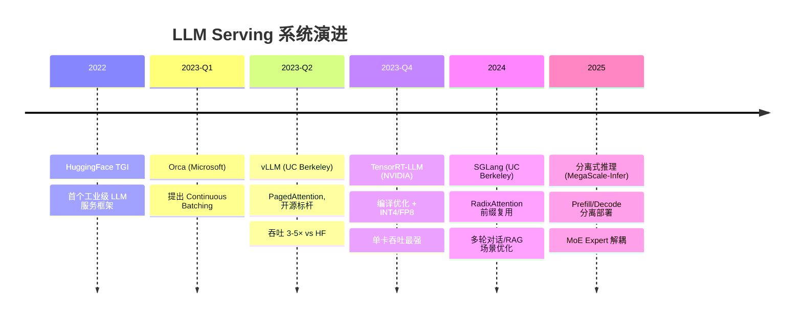

# LLM Serving 系统：从 vLLM 到 TensorRT-LLM 的工程实践

> 📚 参考文献
> - [Continuous Batching And Dynamic Memory Manageme...](../papers/daily/20260323_continuous_batching_and_dynamic_memory_management_f.md) — Continuous Batching and Dynamic Memory Management for Hig...
> - [Vllm-Paged-Attention](../papers/daily/20260317_vllm-paged-attention.md) — vLLM PagedAttention：LLM 推理内存管理革命
> - [Multi-Agent Llm Systems Coordination Protocols ...](../papers/daily/20260323_multi-agent_llm_systems_coordination_protocols_and_.md) — Multi-Agent LLM Systems: Coordination Protocols and Emerg...
> - [Moe-Llama-Mixture-Of-Experts-Efficient-Llm-Serving](../papers/daily/20260321_moe-llama-mixture-of-experts-efficient-llm-serving.md) — MoE-LLaMA: Mixture-of-Experts for Efficient Large Languag...
> - [Flashinfer-Attention-Engine-Llm-Inference](../papers/daily/20260319_flashinfer-attention-engine-llm-inference.md) — FlashInfer: Efficient and Customizable Attention Engine f...
> - [Creativity-Llm-Multi-Agent-Survey](../papers/daily/20260319_creativity-llm-multi-agent-survey.md) — Creativity in LLM-based Multi-Agent Systems: A Survey
> - [Speculative Decoding Draft Alignment](../papers/daily/20260322_speculative_decoding_draft_alignment.md) — Efficiently Aligning Draft Models for Speculative Decoding
> - [Recurrent-Drafter-Speculative-Decoding](../papers/daily/20260319_recurrent-drafter-speculative-decoding.md) — Recurrent Drafter for Fast Speculative Decoding

> 创建：2026-03-24 | 领域：LLM | 类型：综合分析
> 来源：vLLM, TensorRT-LLM, TGI, SGLang, Orca 系列

---

## 🆚 创新点 vs 之前方案

| 维度 | 朴素 Serving (HF) | vLLM | TensorRT-LLM | SGLang |
|------|-------------------|------|--------------|--------|
| Batching | Static（等最长完成） | **Continuous Batching**（逐 step 调度） | Continuous + Inflight | Continuous |
| 内存管理 | 预分配 max\_len | **PagedAttention**（分页按需） | 固定池 | PagedAttention |
| GPU 利用率 | ~30% | **~80%** | ~85%（编译优化） | ~80% |
| 吞吐量（相对） | 1× | 3-5× | 5-8× | 4-6× |
| 易用性 | 高 | 高（Python API） | 中（需编译） | 高 |
| 特色 | 灵活 | 开源标杆 | NVIDIA 官方，INT4/FP8 | **RadixAttention** 前缀复用 |

---

## 📈 LLM Serving 技术演进

---

## 📐 核心公式与原理

### 1. Self-Attention

$$
\text{Attention}(Q,K,V) = \text{softmax}\left(\frac{QK^T}{\sqrt{d_k}}\right)V
$$

- Transformer 核心计算

### 2. KV Cache

$$
\text{Memory} = 2 \times n_{layers} \times n_{heads} \times d_{head} \times seq\_len \times dtype\_size
$$

- KV Cache 内存占用公式

### 3. LoRA

$$
W' = W + \Delta W = W + BA, \quad B \in \mathbb{R}^{d \times r}, A \in \mathbb{R}^{r \times d}
$$

- 低秩适配，r << d 大幅减少可训练参数

---

## 🎯 核心洞察（4条）

1. **LLM Serving 的核心指标是 TTFT 和 TPS**：TTFT（Time To First Token，首 token 延迟）决定用户感知，TPS（Tokens Per Second，生成速度）决定体验流畅度
2. **vLLM PagedAttention 是 Serving 的基础设施**：KV Cache 分页管理 + Continuous Batching 使 GPU 利用率从 30% 提升到 80%+
3. **Prefill 和 Decode 解耦是趋势**：Prefill（prompt 处理）是 compute-bound，Decode（生成）是 memory-bound，分离部署可以各自优化
4. **多租户和 SLA 管理是生产关键**：不同请求有不同的优先级和延迟要求，需要优先级队列 + 抢占机制

---

## 🎓 常见考点（5条）

### Q1: vLLM 的核心创新？
**30秒答案**：PagedAttention——将 KV Cache 按 page 管理（类似 OS 虚拟内存），动态分配/回收 page，解决了 KV Cache 碎片化和预分配浪费问题。配合 Continuous Batching 实现请求动态加入/退出。

### Q2: Continuous Batching vs Static Batching？
**30秒答案**：Static Batching 等所有请求完成生成才处理下一批，短请求被长请求拖累。Continuous Batching 允许每个 iteration 独立加入新请求/移除完成的请求，GPU 利用率更高。

### Q3: TensorRT-LLM 的优化技术？
**30秒答案**：①Kernel Fusion（多个操作合并为一个 GPU kernel）；②INT8/FP8 量化（硬件原生支持）；③Inflight Batching（Continuous Batching 的 NVIDIA 实现）；④Multi-GPU Tensor Parallelism。

### Q4: Prefill-Decode 解耦怎么做？
**30秒答案**：Prefill 节点处理 prompt（需要大算力），生成完整 KV Cache 后通过高速网络传给 Decode 节点。Decode 节点只做逐 token 生成（需要大内存带宽）。好处：各节点用最适合的硬件。

### Q5: LLM Serving 的成本优化策略？
**30秒答案**：①量化（FP16→INT8 节省一半显存和成本）；②Speculative Decoding（小模型猜大模型验，减少大模型推理次数）；③KV Cache 复用（相同 prefix 的请求共享 KV Cache）；④动态 batch size 调整。

---

### Q6: KV Cache 为什么是推理瓶颈？
**30秒答案**：KV Cache 大小 = 2×layers×heads×dim×seq_len×dtype_size。长序列时内存爆炸。优化：①Multi-Query Attention；②量化（FP8/INT4）；③页注意力（vLLM PagedAttention）；④压缩（H2O/SnapKV）。

### Q7: RLHF 和 DPO 的区别？
**30秒答案**：RLHF：训练 reward model + PPO 优化，需要在线采样。DPO：直接用偏好数据优化策略，跳过 reward model，更简单稳定。效果接近但 DPO 训练成本更低。

### Q8: 模型量化的原理和影响？
**30秒答案**：FP32→FP16→INT8→INT4：每次减半存储和计算。①Post-training Quantization：训练后量化，简单但可能损失精度；②Quantization-Aware Training：训练中模拟量化，精度损失更小。

### Q9: Speculative Decoding 是什么？
**30秒答案**：用小模型（draft model）快速生成多个候选 token，大模型一次性验证。如果小模型猜对 n 个，等于大模型「跳过」了 n 步推理。加速比取决于小模型的准确率。

### Q10: MoE 的优势和挑战？
**30秒答案**：优势：同参数量下推理更快（只激活部分 Expert），或同计算量下容量更大。挑战：①负载均衡（部分 Expert 过热/闲置）；②通信开销（分布式 Expert 选择）；③训练不稳定。
## 🌐 知识体系连接

- **上游依赖**：GPU 架构、模型量化、分布式系统
- **下游应用**：ChatBot 部署、API 服务、Agent 推理
- **相关 synthesis**：LLM推理优化完整版.md, MoE架构设计.md

## 📐 核心公式直观理解

### 公式 1：Continuous Batching 吞吐公式

$$
\text{Throughput} = \frac{B_{\text{eff}} \times \bar{L}_{\text{output}}}{\bar{T}_{\text{latency}}}
$$

- $B_{\text{eff}}$：有效 batch 大小（持续填入新请求）
- $\bar{L}_{\text{output}}$：平均输出序列长度
- $\bar{T}_{\text{latency}}$：平均端到端延迟

**直观理解**：传统 static batching 必须等最长的请求完成才能释放 batch 槽位，像"等最慢的人吃完才能收桌子"。Continuous batching 允许已完成的请求随时离开、新请求随时加入，GPU 永远保持满载——吞吐提升 2-5 倍。

### 公式 2：PagedAttention 显存利用率

$$
\text{Utilization} = \frac{\sum_{i} \text{actual\_len}_i}{\sum_{i} \text{allocated\_pages}_i \times \text{page\_size}}
$$

**直观理解**：传统系统为每个请求预分配最大长度的连续显存，大部分空间浪费。PagedAttention 像操作系统的虚拟内存分页——按需分配小块显存，显存碎片从 60-80% 降到 <5%。这就是 vLLM 的核心创新。

### 公式 3：SLA 约束下的最优 batch 策略

$$
B^* = \arg\max_B \; \text{Throughput}(B) \quad \text{s.t.} \quad P_{99}(\text{TTFT}(B)) \leq T_{\text{SLA}}
$$

- $B^*$：最优 batch 大小
- TTFT：Time To First Token（首 token 延迟）
- $T_{\text{SLA}}$：SLA 要求的延迟上限

**直观理解**：推理服务的核心矛盾——batch 越大吞吐越高但延迟越大。最优 batch 大小是"刚好用满 GPU 计算能力，同时不违反延迟约束"的那个点。实际中通过动态调节实现。

