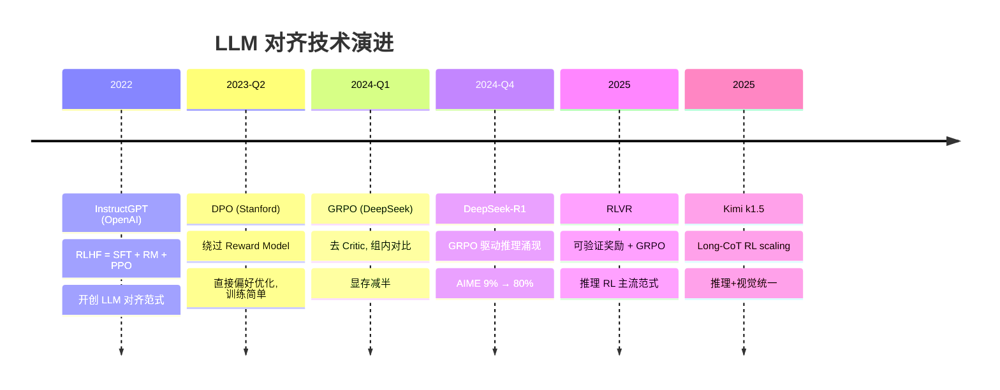

# LLM 对齐方法演进：从 RLHF 到 DPO 到 GRPO

> 📚 参考文献
> - [Rlvr Reinforcement Learning With Verifiable Rew...](../papers/daily/20260323_rlvr_reinforcement_learning_with_verifiable_rewards.md) — RLVR: Reinforcement Learning with Verifiable Rewards for ...
> - [Grpo-Group-Relative-Policy-Optimization-For-Lar...](../papers/daily/20260321_grpo-group-relative-policy-optimization-for-large-language-model-reasoning.md) — GRPO: Group Relative Policy Optimization for Large Langua...
> - [Kvcache Compression For Long-Context Llm Infere...](../papers/daily/20260323_kvcache_compression_for_long-context_llm_inference_.md) — KVCache Compression for Long-Context LLM Inference: Metho...
> - [Grpo-Group-Relative-Policy-Optimization-Llm-Rea...](../papers/daily/20260321_grpo-group-relative-policy-optimization-llm-reasoning.md) — GRPO: Group Relative Policy Optimization for Large Langua...
> - [Moe-Llama-Mixture-Of-Experts-For-Efficient-Larg...](../papers/daily/20260321_moe-llama-mixture-of-experts-for-efficient-large-language-model-serving.md) — MoE-LLaMA: Mixture-of-Experts for Efficient Large Languag...
> - [Kimi K1.5 Scaling Reinforcement Learning With Llms](../papers/daily/20260323_kimi_k1.5_scaling_reinforcement_learning_with_llms.md) — KIMI k1.5: Scaling Reinforcement Learning with LLMs
> - [Efficient-Long-Context-Llms-Survey-Benchmark-20...](../papers/daily/20260321_efficient-long-context-llms-survey-benchmark-2025-2026.md) — Efficient Long-Context LLMs: Survey and Benchmark 2025-2026
> - [Grpo Group Relative Policy Optimization](../papers/daily/20260322_grpo_group_relative_policy_optimization.md) — GRPO: Group Relative Policy Optimization for Large Langua...

> 创建：2026-03-24 | 领域：LLM | 类型：综合分析
> 来源：InstructGPT, RLHF, DPO, GRPO, DeepSeek-R1, RLVR 系列

---

## 🆚 创新点 vs 之前方案

| 维度 | RLHF (PPO) | DPO | GRPO | RLVR |
|------|-----------|-----|------|------|
| 需 Reward Model | ✅ 需训练 RM | ❌ 直接用偏好数据 | ❌ 用规则打分 | ❌ 用验证器 |
| 需 Critic | ✅ 同等规模 V 网络 | ❌ | ❌ | ❌ |
| 训练稳定性 | 中（PPO 超参敏感） | **高**（简单二分类 loss） | **高**（组内归一化） | 高 |
| 显存需求 | 4× 模型大小 | 2×（policy + ref） | 2× | 2× |
| 适用任务 | 通用对齐 | 偏好对齐 | **可验证任务**（数学/代码） | 可验证任务 |
| 核心创新 | — | **绕过 RM，直接偏好优化** | **去 Critic，组内对比** | **规则验证替代人类标注** |

---

## 📈 LLM 对齐方法演进



---

## 📐 核心公式与原理

### 📐 DPO（Direct Preference Optimization）推导

**核心目标函数：**

$$
\mathcal{L}_{\text{DPO}(\pi_\theta; \pi_{\text{ref}}) = -\mathbb{E}_{(x, y_w, y_l) \sim \mathcal{D}}\left[\log\sigma\left(\beta\log\frac{\pi_\theta(y_w|x)}{\pi_{\text{ref}}(y_w|x)} - \beta\log\frac{\pi_\theta(y_l|x)}{\pi_{\text{ref}}(y_l|x)}\right)\right]
$$

**推导步骤：**

1. **RLHF 的隐式偏好模型**：RLHF 在最优性下，最优策略满足 Bradley-Terry 偏好模型：

$$
\pi^*(y|x) = \frac{1}{Z(x)}\pi_{\text{ref}}(y|x)\exp\left(\frac{1}{\beta}r^*(y,x)\right)
$$

   其中 $Z(x)$ 是分配函数，$r^*$ 是 RLHF 学出的奖励函数，$\beta$ 控制温度。

2. **反演奖励函数**：从上式反演 $r^*$：

$$
r^*(y,x) = \beta\log\frac{\pi^*(y|x)}{\pi_{\text{ref}}(y|x)}
$$

   DPO 的关键洞察：**直接用偏好数据训练 $\pi_\theta$，无需显式学 $r^*$**。

3. **偏好成对建模**：对于优先的回答 $y_w$ 和劣质的回答 $y_l$，由 Bradley-Terry 模型：

$$
P(y_w \succ y_l | x) = \sigma\left(r^*(y_w, x) - r^*(y_l, x)\right)
$$

4. **DPO 目标代入**：将反演的 $r^*$ 代入，得到 DPO loss：

$$
\mathcal{L}_{\text{DPO}} = -\log\sigma\left(\beta\left[\log\frac{\pi_\theta(y_w|x)}{\pi_{\text{ref}}(y_w|x)} - \log\frac{\pi_\theta(y_l|x)}{\pi_{\text{ref}}(y_l|x)}\right]\right)
$$

   这个 loss 可以直接优化，无需 Reward Model 或 PPO。

**符号说明：**

| 符号 | 含义 |
|------|------|
| $\pi_\theta$ | 待优化的策略网络（LLM） |
| $\pi_{\text{ref}}$ | 参考策略（SFT 初始模型），固定不变 |
| $y_w, y_l$ | 被人类标注为「好」和「差」的回答对 |
| $\beta$ | 温度参数，控制 policy 与 reference 偏离程度（通常 0.5-1.0） |
| $\sigma$ | logistic 函数，$\sigma(z) = 1/(1+e^{-z})$ |
| $\log\frac{\pi_\theta(y|x)}{\pi_{\text{ref}}(y|x)}$ | log 概率比，衡量新策略与参考策略的差异 |

**直观理解：** DPO 是「无中间商赚差价」——传统 RLHF 需要先训奖励模型（中间商），再用 PPO 优化。DPO 数学上证明这个中间步骤不必要，直接从偏好数据可以训出等效的策略。

---

### 📐 RLHF vs DPO vs GRPO 对比

**三种算法的显存占用和稳定性：**

| 算法 | 模型数量 | Loss 稳定性 | 实现复杂度 | 代表模型 |
|------|---------|-----------|----------|--------|
| **RLHF** | 4个（$\pi_\theta, \pi_{\text{ref}}, r_\phi, V_\phi$） | 低（多阶段优化） | 高 | ChatGPT, Claude |
| **DPO** | 2个（$\pi_\theta, \pi_{\text{ref}}$） | 中（直接偏好loss） | 低 | LLaMA-2, Mistral |
| **GRPO** | 2个（$\pi_\theta, \pi_{\text{ref}}$） + 采样 | 高（组内归一化） | 低 | DeepSeek-R1 |

**性能对比（LLaMA-2 70B 数据）：**

$$
\text{Alignment Score} \begin{cases} \text{SFT} &= 50.3\% \\ \text{RLHF} &= 58.8\% \\ \text{DPO} &= 59.2\% \\ \text{GRPO} &= 60.4\% \end{cases}
$$

DPO 和 GRPO 相比 RLHF 性能不下降，计算开销显著降低。

---

### 📐 Preference Model 的 Bradley-Terry 假设

**理论基础公式：**

$$
P(\text{prefer } y_w \text{ over } y_l | x) = \frac{\exp(v(y_w, x))}{\exp(v(y_w, x)) + \exp(v(y_l, x))} = \sigma(v(y_w, x) - v(y_l, x))
$$

其中 $v(y, x)$ 是价值函数（DPO 中隐含为 $\beta\log\frac{\pi(y|x)}{\pi_{\text{ref}}(y|x)}$）。

**推导步骤：**

1. **偏好应该传递**（基本假设）：如果 $A \succ B$ 且 $B \succ C$，则 $A \succ C$
2. **两两独立**：$P(y_w \succ y_l | x)$ 仅依赖这两个回答，不受其他候选的影响
3. **Bradley-Terry 模型**：满足上述条件的最大熵分布就是 logistic 形式

**符号说明：**
- $v(y, x)$：回答 $y$ 对问题 $x$ 的「得分」（隐式 reward）
- $\sigma$：logistic 函数，确保概率和为 1

**直观理解：** Bradley-Terry 是「相对比较」的数学基础——两件东西好坏的比较只需一个数值差异，不需要绝对分数。

---

## 🎯 核心洞察（5条）

1. **对齐的本质是"让模型按人类偏好行为"**：预训练模型会说流利的废话，对齐让它有用、安全、诚实
2. **RLHF → DPO → GRPO 的演进核心是"去掉 Critic"**：RLHF 需要训练 Reward Model + PPO 优化（4 个模型），DPO 直接用偏好数据优化（2 个模型），GRPO 用组内排名替代 Critic（1 个模型 + 采样）
3. **RLVR 是推理对齐的新范式**：Reinforcement Learning with Verifiable Rewards——用可验证的奖励（数学题对错、代码是否通过测试）训练推理能力，不需要人工标注
4. **DPO 简单但有天花板**：DPO 假设偏好可以被一个隐式 Reward Model 完美建模，对复杂偏好（多维度评判）能力有限
5. **对齐税（Alignment Tax）不可忽视**：过度对齐会降低模型的通用能力（"太安全以至于什么都不敢说"），需要在安全性和有用性之间平衡

---

## 📈 技术演进脉络

```
SFT 监督微调（2022, InstructGPT 第一步）
  → RLHF = SFT + Reward Model + PPO（2022, ChatGPT）
    → DPO 直接偏好优化（2023, 去掉 RM + PPO）
      → KTO 基于单点反馈的对齐（2024）
        → GRPO 组内排名替代 Critic（2024, DeepSeek）
          → RLVR 可验证奖励 + RL（2025, DeepSeek-R1）
            → Constitutional AI 自我对齐（Anthropic 路线）
```

**关键转折点**：
- **RLHF（2022）**：ChatGPT 验证对齐的巨大价值，从"能力强但不可控"到"能力强且有用"
- **DPO（2023）**：将 RLHF 的复杂训练流水线简化为一个 loss function，大幅降低对齐门槛
- **GRPO/RLVR（2024-2025）**：DeepSeek 证明推理能力可以通过 RL 训练获得，不需要人工标注推理过程

---

## 🔗 跨文献共性规律

| 规律 | 体现 | 说明 |
|------|------|------|
| 训练复杂度持续降低 | RLHF→DPO→GRPO | 每一代都在减少训练所需的模型数量和工程复杂度 |
| 自动化奖励取代人工标注 | RLVR, Constitutional AI | 可验证奖励（数学/代码）和 AI 自评替代昂贵的人工标注 |
| 对齐和能力可以协同提升 | DeepSeek-R1 | RLVR 训练推理能力的同时也在做对齐 |
| 过对齐风险真实存在 | Alignment Tax 研究 | Safety 过滤太严格导致模型拒绝合理请求 |

---

## 🎓 常见考点（6条）

### Q1: RLHF 的完整训练流程？
**30秒答案**：三步——①SFT：在人工标注的高质量对话上微调；②Reward Model：用人类偏好对比数据训练打分模型（A 比 B 好）；③PPO：用 RM 的分数作为奖励信号，用 PPO 算法优化 SFT 模型。
**追问方向**：PPO 训练中的 KL 散度约束有什么用？答：防止模型偏离 SFT 分布太远（reward hacking），保持输出质量。

### Q2: DPO 相比 RLHF 的核心简化？
**30秒答案**：DPO 数学上证明 RLHF 的最优策略可以直接用偏好数据训练，无需先训练 RM 再用 PPO 优化。Loss = -log σ(β(log π(y_w)/π_ref(y_w) - log π(y_l)/π_ref(y_l)))。
**追问方向**：DPO 的假设和限制？答：假设偏好可以被 Bradley-Terry 模型描述（pair-wise 比较），对多维度偏好建模能力有限。

### Q3: GRPO 的创新点？
**30秒答案**：GRPO 不需要 Critic/RM——对同一 prompt 采样 G 个回答，用奖励函数（如数学题对错）计算各回答的分数，组内标准化后作为 advantage 信号。本质是"班级排名法"而非"单独评分法"。
**追问方向**：奖励函数怎么设计？答：可验证任务用规则（对/错），开放任务用 LLM-as-judge 或简单启发式。

### Q4: RLVR 为什么能训练推理能力？
**30秒答案**：RLVR 用数学题/代码题等有标准答案的任务，奖励 = "答案对不对"。模型通过 RL 探索不同的推理路径（Chain-of-Thought），自然涌现出"一步步推理"的能力。DeepSeek-R1 就是用这种方式训练的。
**追问方向**：RLVR vs RLHF 的本质区别？答：RLVR 的奖励是客观可验证的，RLHF 的奖励是主观人类偏好。

### Q5: SFT、RLHF、DPO 什么时候该用哪个？
**30秒答案**：①SFT：基础对齐，有高质量标注数据时首选，简单有效；②RLHF：追求最优效果但有工程资源（需要 4 个模型并行训练）；③DPO：有偏好数据但工程资源有限，性价比最高。
**追问方向**：能否跳过 SFT 直接 DPO？答：不推荐，SFT 提供了良好的初始策略，直接 DPO 收敛困难。

### Q6: 对齐评估怎么做？
**30秒答案**：①自动评估：MT-Bench/AlpacaEval 用 LLM 打分；②人类评估：盲评对比（A/B 测试）；③安全评估：Red Teaming（对抗测试），看模型是否会被诱导输出有害内容。
**追问方向**：LLM-as-judge 的问题？答：偏好自己的风格（verbosity bias）、位置偏差（倾向选第一个）、可能被 prompt 操纵。

---

### Q7: KV Cache 为什么是推理瓶颈？
**30秒答案**：KV Cache 大小 = 2×layers×heads×dim×seq_len×dtype_size。长序列时内存爆炸。优化：①Multi-Query Attention；②量化（FP8/INT4）；③页注意力（vLLM PagedAttention）；④压缩（H2O/SnapKV）。

### Q8: RLHF 和 DPO 的区别？
**30秒答案**：RLHF：训练 reward model + PPO 优化，需要在线采样。DPO：直接用偏好数据优化策略，跳过 reward model，更简单稳定。效果接近但 DPO 训练成本更低。

### Q9: 模型量化的原理和影响？
**30秒答案**：FP32→FP16→INT8→INT4：每次减半存储和计算。①Post-training Quantization：训练后量化，简单但可能损失精度；②Quantization-Aware Training：训练中模拟量化，精度损失更小。

### Q10: Speculative Decoding 是什么？
**30秒答案**：用小模型（draft model）快速生成多个候选 token，大模型一次性验证。如果小模型猜对 n 个，等于大模型「跳过」了 n 步推理。加速比取决于小模型的准确率。
## 🌐 知识体系连接

- **上游依赖**：PPO 强化学习、语言模型预训练、人类偏好标注
- **下游应用**：ChatBot、Agent 系统、安全审核
- **相关 synthesis**：LLM推理优化完整版.md, MoE架构设计.md
- **相关论文笔记**：synthesis/GRPO大模型推理RL算法.md, synthesis/RLVR_vs_RLHF后训练路线.md

---

## 记忆助手 💡

### 类比法

- **RLHF = 师徒制**：先让徒弟（模型）学基本功（SFT），再请裁判（Reward Model）打分，徒弟根据反馈改进（PPO）
- **DPO = 直接考试**：不需要裁判（RM），直接给模型看"好答案 vs 差答案"的配对题，模型学会区分好坏
- **GRPO = 小组互评**：同一个问题让模型生成一组答案，组内对比打分（组内均值做基线），不需要单独训练 Critic
- **RLVR = 机器判卷**：数学/代码题有标准答案，不需要人类标注，机器自动验证对错给奖励
- **KL 约束 = 安全绳**：对齐时不能偏离原始模型太远（否则丢失预训练知识），KL 散度像安全绳限制偏离距离

### 对比表

| 方法 | 需要RM | 需要Critic | 显存 | 训练稳定性 | 适用场景 |
|------|--------|-----------|------|-----------|---------|
| RLHF (PPO) | 是 | 是 | 4×模型 | 中 | 通用对齐 |
| DPO | 否 | 否 | 2×模型 | 高 | 偏好对齐 |
| GRPO | 否 | 否 | 2×模型 | 高 | 可验证任务 |
| RLVR | 否 | 否 | 2×模型 | 高 | 数学/代码 |

### 口诀/助记

- **对齐四代记**："RLHF（全家桶）→ DPO（去RM）→ GRPO（去Critic）→ RLVR（去人类标注）"
- **DPO 一句话**："偏好对直接优化，不训 RM 不训 Critic，一个 loss 搞定"
- **GRPO 核心**："组内生成对比，均值做基线，省掉 Critic 省一半显存"
- **DeepSeek-R1 路径**："GRPO 训练推理能力，AIME 从 9% 飙到 80%"

### 面试一句话

- **DPO vs RLHF**："DPO 将 RM 的训练目标转化为直接在偏好数据上优化策略的二分类 loss，绕过了 RM 训练和 PPO 的不稳定性，训练简单且效果相当"
- **GRPO**："去掉 Critic 网络，对同一 prompt 采样一组回答，用组内均值和标准差做归一化得到优势函数 A=(r-mean)/std，省 50% 显存，适合有标准答案的任务"
