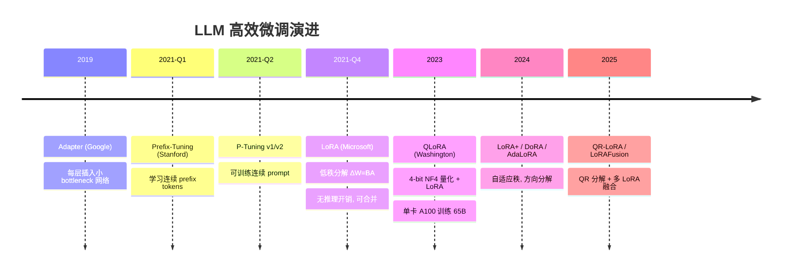
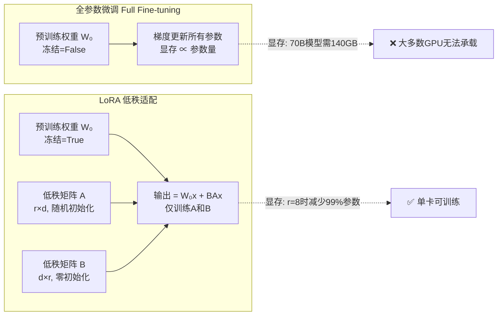

# LLM 微调技术：从全参数到 LoRA 到 QLoRA

> 📚 参考文献
> - [Kvcache Compression For Long-Context Llm Infere...](../papers/daily/20260323_kvcache_compression_for_long-context_llm_inference_.md) — KVCache Compression for Long-Context LLM Inference: Metho...
> - [Flashinfer-Attention-Engine-Llm-Inference](../papers/daily/20260319_flashinfer-attention-engine-llm-inference.md) — FlashInfer: Efficient and Customizable Attention Engine f...
> - [Efficient-Long-Context-Llms-Survey-Benchmark-20...](../papers/daily/20260321_efficient-long-context-llms-survey-benchmark-2025-2026.md) — Efficient Long-Context LLMs: Survey and Benchmark 2025-2026
> - [Beyond-Rag-Agent-Memory](../papers/daily/20260316_beyond-rag-agent-memory.md) — Beyond RAG for Agent Memory: Retrieval by Decoupling and ...
> - [Grpo-Group-Relative-Policy-Optimization-Llm-Rea...](../papers/daily/20260321_grpo-group-relative-policy-optimization-llm-reasoning.md) — GRPO: Group Relative Policy Optimization for Large Langua...
> - [Lora Low-Rank Adaptation Of Large Language Models](../papers/daily/20260323_lora_low-rank_adaptation_of_large_language_models.md) — LoRA: Low-Rank Adaptation of Large Language Models
> - [Lora+ Improved Low-Rank Adaptation With Better ...](../papers/daily/20260323_lora+_improved_low-rank_adaptation_with_better_init.md) — LoRA+: Improved Low-Rank Adaptation with Better Initializ...
> - [Multi-Agent Llm Systems Coordination Protocols ...](../papers/daily/20260323_multi-agent_llm_systems_coordination_protocols_and_.md) — Multi-Agent LLM Systems: Coordination Protocols and Emerg...

> 创建：2026-03-24 | 领域：LLM | 类型：综合分析
> 来源：LoRA, QLoRA, Prefix-Tuning, Adapter, P-Tuning 系列

---

## 🆚 创新点 vs 之前方案

| 维度 | 全参数微调 | Adapter | Prefix-Tuning | LoRA | QLoRA |
|------|----------|---------|--------------|------|-------|
| 可训练参数 | 100% | ~3% | ~1% | **~0.5-1%** | ~0.5-1% |
| 显存占用 | 极高（全参+优化器） | 高 | 中 | **低**（仅 A,B 矩阵） | **极低**（4-bit Base） |
| 推理延迟 | 无额外开销 | +5-10%（额外层） | +1-2%（prefix tokens） | **无额外开销**（可合并） | 同 LoRA（合并后） |
| 多任务切换 | 换整个模型 | 换 Adapter | 换 Prefix | **热切换 LoRA 权重** | 同 LoRA |
| 效果 vs 全参数 | baseline | ~95% | ~90% | **~95-98%** | ~93-96% |
| 核心创新 | — | 插入小网络 | 学习连续 prompt | **低秩分解 ΔW=BA** | **4-bit NF4 量化 Base** |

---

## 📈 PEFT 技术演进



---

## 架构总览



## 📐 核心公式与原理

### 1. Self-Attention

$$
\text{Attention}(Q,K,V) = \text{softmax}\left(\frac{QK^T}{\sqrt{d_k}}\right)V
$$

- Transformer 核心计算

### 2. KV Cache

$$
\text{Memory} = 2 \times n_{layers} \times n_{heads} \times d_{head} \times seq\_len \times dtype\_size
$$

- KV Cache 内存占用公式

### 3. LoRA

$$
W' = W + \Delta W = W + BA, \quad B \in \mathbb{R}^{d \times r}, A \in \mathbb{R}^{r \times d}
$$

- 低秩适配，r << d 大幅减少可训练参数

---

## 🎯 核心洞察（4条）

1. **参数高效微调（PEFT）是 LLM 适配的标准方式**：全参数微调 70B 模型需要 280GB+ 显存，PEFT 只需微调 0.1-1% 参数，效果接近全参数微调
2. **LoRA 是当前 PEFT 的事实标准**：在每个权重矩阵旁加一个低秩分解 ΔW = BA（A∈R^{d×r}, B∈R^{r×d}），rank=16-64 就够了
3. **QLoRA 让消费级 GPU 也能微调大模型**：4-bit 量化基座模型 + LoRA 适配器，7B 模型只需 6GB 显存
4. **微调数据质量 >> 数据数量**：1000 条高质量标注数据的效果通常优于 10000 条低质量数据

---

## 📈 技术演进脉络

```
全参数微调（~2020）→ Adapter（2019）→ Prefix-Tuning（2021）
  → LoRA（2021）→ QLoRA（2023）→ DoRA/LoRA+（2024+）
```

---

## 🎓 常见考点（5条）

### Q1: LoRA 的原理？
**30秒答案**：冻结预训练权重 W₀，训练低秩增量 ΔW = BA，其中 A∈R^{d×r}（随机初始化），B∈R^{r×d}（零初始化）。推理时可以将 ΔW 合并到 W₀ 中，无额外推理延迟。rank r 通常取 16-64。

### Q2: LoRA 应该加在 Transformer 的哪些层？
**30秒答案**：研究表明加在 Q/V 矩阵上效果最好，K/O 矩阵的收益递减。实践中可以在所有 linear 层都加 LoRA，rank 可以设小一些（如 8）。

### Q3: QLoRA 的关键技术？
**30秒答案**：①NF4 量化（Normal Float 4-bit，专为正态分布设计的量化方案）；②双重量化（量化参数本身也被量化，进一步节省存储）；③分页优化器（将优化器状态卸载到 CPU，防止 GPU OOM）。

### Q4: 微调数据怎么准备？
**30秒答案**：①格式：instruction-input-output 三元组；②质量：人工审核 > 模型生成 > 自动抓取；③数量：1K-10K 高质量数据通常就够；④多样性：覆盖目标任务的各种场景和边界情况。

### Q5: 微调 vs Prompt Engineering vs RAG？
**30秒答案**：Prompt Engineering——零成本、快速迭代、但受 context length 限制；RAG——适合知识密集任务、知识可更新；Fine-tuning——适合特定风格/格式/领域任务，一次训练永久使用。通常先尝试 Prompt，不够再 RAG，还不够才 Fine-tune。

---

### Q6: KV Cache 为什么是推理瓶颈？
**30秒答案**：KV Cache 大小 = 2×layers×heads×dim×seq_len×dtype_size。长序列时内存爆炸。优化：①Multi-Query Attention；②量化（FP8/INT4）；③页注意力（vLLM PagedAttention）；④压缩（H2O/SnapKV）。

### Q7: RLHF 和 DPO 的区别？
**30秒答案**：RLHF：训练 reward model + PPO 优化，需要在线采样。DPO：直接用偏好数据优化策略，跳过 reward model，更简单稳定。效果接近但 DPO 训练成本更低。

### Q8: 模型量化的原理和影响？
**30秒答案**：FP32→FP16→INT8→INT4：每次减半存储和计算。①Post-training Quantization：训练后量化，简单但可能损失精度；②Quantization-Aware Training：训练中模拟量化，精度损失更小。

### Q9: Speculative Decoding 是什么？
**30秒答案**：用小模型（draft model）快速生成多个候选 token，大模型一次性验证。如果小模型猜对 n 个，等于大模型「跳过」了 n 步推理。加速比取决于小模型的准确率。

### Q10: MoE 的优势和挑战？
**30秒答案**：优势：同参数量下推理更快（只激活部分 Expert），或同计算量下容量更大。挑战：①负载均衡（部分 Expert 过热/闲置）；②通信开销（分布式 Expert 选择）；③训练不稳定。
## 🌐 知识体系连接

- **上游依赖**：Transformer 架构、量化技术、预训练模型
- **下游应用**：领域大模型、Agent 训练、对齐微调
- **相关 synthesis**：LLM对齐方法演进.md, LLM推理优化完整版.md

---

## LoRA 核心数学推导

参数更新分解：

$$
W = W_0 + \Delta W = W_0 + BA
$$

其中 $W_0 \in \mathbb{R}^{d \times k}$ 冻结，$B \in \mathbb{R}^{d \times r}$，$A \in \mathbb{R}^{r \times k}$，$r \ll \min(d,k)$。

前向传播：

$$
h = W_0 x + \frac{\alpha}{r} B A x
$$

参数量对比（$d=k=4096, r=8$）：全参数 $d \times k = 16.8\text{M}$，LoRA $(d+k) \times r = 65\text{K}$，节省 99.6%。

QLoRA 额外节省：$W_0$ 用 NF4（4-bit 量化），推理时反量化：

$$
\hat{W_0} = \text{dequant}(W_0^{\text{NF4}})
$$

峰值显存对比（7B 模型）：全参数微调 ~80GB，LoRA ~16GB，QLoRA ~6GB。

## DPO vs PPO 训练目标

PPO 目标：

$$
\mathcal{L}_{PPO} = \mathbb{E}\left[r_\phi(x,y) - \beta \log\frac{\pi_\theta(y|x)}{\pi_{\text{ref}}(y|x)}\right]
$$

DPO 直接偏好优化：

$$
\mathcal{L}_{DPO} = -\mathbb{E}\left[\log\sigma\left(\beta\log\frac{\pi_\theta(y_w|x)}{\pi_{\text{ref}}(y_w|x)} - \beta\log\frac{\pi_\theta(y_l|x)}{\pi_{\text{ref}}(y_l|x)}\right)\right]
$$

DPO 消去奖励模型，从 RLHF 最优解推导而来，用策略概率比值直接表示偏好差异。

| 方法 | 奖励模型 | 稳定性 | 显存（7B）| 效果 |
|------|---------|-------|---------|------|
| PPO | 需要 | 差 | 高（4模型）| 最好 |
| DPO | 不需要 | 好 | 低（2模型）| 略低 |
| GRPO | 不需要 | 好 | 低 | 推理任务好 |

---

## 相关概念

- [[concepts/attention_in_recsys|Attention 在搜广推中的演进]]
- [[concepts/multi_objective_optimization|多目标优化]]
