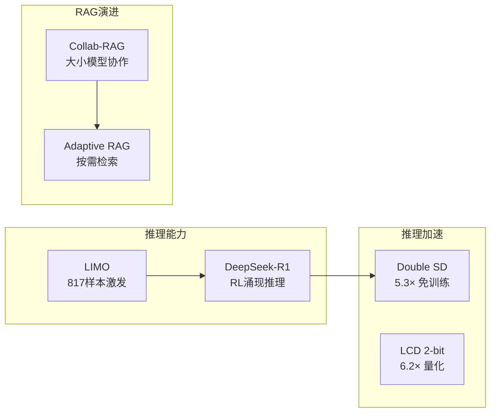

# LLM 推理优化与 RAG/Agent 前沿综述

> 综合总结 | 领域：llm-infra | 日期：20260328 | 覆盖论文：8篇

---

## 🆚 创新点 vs 之前方案

| 技术 | 之前方案 | 创新 | 效果 |
|------|---------|------|------|
| DeepSeek-R1 | SFT + 标注 CoT 数据 | **纯 RL (GRPO) 涌现推理** | AIME 9%→80% |
| LIMO | 10万+ SFT 数据 | **817 高质量样本** | 数据效率 100× |
| Double SD | 需训练 draft model | **检索式免训练 SD** | 5.3× 加速 |
| LCD 量化 | 4-bit GPTQ/AWQ | **2-bit 聚类量化 + KD** | 6.2× 加速 |
| Collab-RAG | 单一大模型 | **小模型检索+大模型推理** | 成本降 60% |
| Adaptive RAG | 固定检索策略 | **信息熵触发检索** | 按需检索 |

---

## 📈 LLM 推理+RAG 技术脉络



---

## 📌 核心主题概览

本批次 llm-infra 论文覆盖四大方向：

| 方向 | 代表论文 | 关键创新 |
|------|----------|----------|
| **推理能力激发** | DeepSeek-R1, LIMO | RL/少量数据激发 CoT 推理 |
| **推理加速** | Double, Qwen3 | 推测解码突破加速上限，双模式统一 |
| **模型压缩** | LCD | 2-3 bit 极低比特量化 + 6.2× 推理加速 |
| **RAG/Agent** | Collab-RAG, 自适应RAG, Tool-Use Agent | 多跳QA, 白黑盒协作, 工具调用 |

---

## 📐 核心公式集

### 1. GRPO 优化目标（DeepSeek-R1）

$$
\mathcal{L}_{GRPO}(\theta) = -\mathbb{E}_{(q,a)\sim\mathcal{D}} \frac{1}{G} \sum_{i=1}^{G} \left[ \min\left(\frac{\pi_\theta(o_i|q)}{\pi_{\theta_{old}}(o_i|q)} A_i, \text{clip}\left(\cdot, 1-\epsilon, 1+\epsilon\right) A_i \right) - \beta D_{KL}(\pi_\theta \| \pi_{ref}) \right]
$$

组内归一化优势：$A_i = \frac{r_i - \text{mean}(\mathbf{r})}{\text{std}(\mathbf{r})}$

**意义**：通过同一 prompt 的多个采样输出估计优势函数，省去 critic 模型，节省 50% 显存。

---

### 2. Double 推测解码加速上限突破

传统 SD 上限：$\text{Speedup}\_{\text{SD}} \leq \frac{v\_{target}}{v\_{draft}}$

Double 突破上限：

$$
\text{Speedup}\_{\text{Double}} > \frac{v\_{target}}{v\_{draft}} \cdot (1 + \alpha \cdot r)
$$

其中 $\alpha \in [0,1]$ 为检索命中率，$r$ 为每次检索平均 token 收益。

**实验结果**：LLaMA3.3-70B 上达到 **5.3×** 加速，超越需要训练的 EAGLE-3。

---

### 3. 聚类量化码本学习（LCD）

最优量化：

$$
W_{quant}^{(j)} = \arg\min_{c \in \mathcal{C}} \|w_j - c\|_2^2
$$

知识蒸馏目标：

$$
\mathcal{L}_{LCD} = \mathcal{L}_{task} + \lambda \cdot D_{KL}(P_{student} \| P_{teacher})
$$

激活平滑（消除异常值）：

$$
\hat{X} = X \cdot \text{diag}(\mathbf{s})^{-1}, \quad \hat{W} = W \cdot \text{diag}(\mathbf{s})
$$

**实验结果**：2-3 bit 下超越所有现有方法，推理加速最高 **6.2×**。

---

### 4. 自适应检索触发（Adaptive RAG）

基于模型不确定性的检索决策：

$$
\text{Retrieve}(t) = \mathbb{1}\left[H\left(P_\theta(x_t | x_{<t})\right) > \tau\right]
$$

其中 $H(\cdot)$ 为 token 输出的信息熵，$\tau$ 为自适应阈值。

---

### 5. LIMO 假说的数学刻画

设预训练知识完整性为 $K \in [0,1]$，后训练示范质量为 $Q \in [0,1]$，则推理能力激发所需数据量 $N^*$：

$$
N^* \propto \frac{1}{K \cdot Q}
$$

**推论**：$K$ 接近 1（预训练充分）且 $Q$ 高（精选示范）时，$N^*$ 可极小（如 817 条）。

---

## 🔗 技术脉络与关联

```
LLM 推理能力
    ├── 训练阶段激发
    │   ├── DeepSeek-R1 (RL: GRPO + 规则奖励) ──→ 无 SFT 也能涌现推理
    │   └── LIMO (SFT: 817条精选数据) ──────────→ 少量数据激发潜在能力
    │
    ├── 推理阶段加速
    │   ├── Double (无训练推测解码) ─────────────→ 5.3× 加速，突破理论上限
    │   └── Qwen3 Thinking/Non-thinking ─────────→ 动态切换，平衡速度/质量
    │
    └── 部署阶段压缩
        └── LCD (2-3 bit 聚类量化) ──────────────→ 6.2× 加速，极低内存

RAG 系统演进
    ├── 单次检索 → 自适应多轮检索（Adaptive RAG）
    ├── 单模型 → 白黑盒协作（Collab-RAG: 3B SLM + GPT-4）
    └── 被动检索 → 主动 Agent 工具调用（Tool-Use Agent for Recommendation）
```

---

## 💡 关键洞察

### 洞察 1：推理能力是预训练知识的"释放"，不是"教学"

LIMO 和 DeepSeek-R1 都说明，复杂推理不需要从零学习——强基座已有知识，后训练只是激发。这改变了 SFT 数据标注的思路：**质量 > 数量**。

### 洞察 2：推测解码的未来在于"免训练 + 检索"

EAGLE 系列需要训练专用 draft head，泛化性受限。Double 通过检索实现无训练、无损的加速，且随上下文增长效果更好（检索命中率提升），是更通用的加速范式。

### 洞察 3：极低比特量化 + LUT 是边缘部署的关键路径

LCD 在 2-3 bit 下维持可用精度并实现 6.2× 加速，为手机、嵌入式设备运行 7B+ 模型打开了窗口。结合 MoE（Qwen3-30B-A3B），边缘智能正在成为现实。

### 洞察 4：RAG 的演进方向是"Agent 化"

从单次检索（Naive RAG）→ 自适应多轮检索（Adaptive RAG）→ 多模型协作（Collab-RAG）→ 工具调用 Agent（Tool-Use Agent），RAG 系统正在向具有推理和规划能力的 Agent 演进。

---

## 🎓 面试 Q&A（综合）

**Q1: DeepSeek-R1 和 LIMO 哪个方法更适合工业落地？**

A: 取决于场景。LIMO 更简单（仅 SFT），成本低，适合有强预训练基座的团队快速验证；DeepSeek-R1 通过 RL 能突破 SFT 上限，适合追求 SOTA 且有训练资源的团队。两者可组合：先 LIMO 建基线，再用 RL 迭代提升。

**Q2: 推测解码（Speculative Decoding）的基本原理是什么？**

A: 用小 draft 模型快速生成多个候选 token，然后让大 target 模型并行验证所有候选，接受与 target 分布一致的 token，拒绝不一致的。因为验证比逐步生成快，整体吞吐量提升，且输出分布与 target 模型完全相同（lossless）。

**Q3: 为什么 MoE 能在不提升推理成本的前提下增加参数量？**

A: MoE 每层有 N 个专家 FFN，但每次推理只激活 Top-k 个。总参数量 = N × 每个专家参数，但每次推理 FLOPs = k × 每个专家 FLOPs。k << N，因此推理成本与 k 倍参数的密集模型相当，与总参数无关。

**Q4: Collab-RAG 中如何训练白盒 SLM 获得问题分解能力？**

A: 以黑盒 LLM 的最终答案准确率作为远程监督信号，训练 SLM 优化查询分解策略。SLM 的分解越好，检索越准确，LLM 回答越正确，信号越强——形成正向闭环，无需额外人工标注。

**Q5: 如何评估 RAG 系统的检索质量？**

A: (1) **Retrieval Recall@K**：相关文档在 Top-K 中的比例；(2) **Context Precision**：检索结果中相关文档占比；(3) **Faithfulness**：生成答案中来自检索文档的比例；(4) **Answer Relevance**：答案与问题的相关性。RAGAS 框架提供端到端自动评估。

**Q6: 2-bit 量化后的 LLM 还能用于生产吗？**

A: 依赖任务。数学推理、精确计算等敏感任务不建议（精度损失可能影响正确率）；文本生成、摘要、对话等任务通常可接受（人类难以察觉 2-3% 的质量下降）。建议在目标任务上进行基准测试再决定。

**Q7: Adaptive RAG 的检索触发阈值 τ 如何调优？**

A: (1) 在验证集上网格搜索最优 τ；(2) 动态阈值：根据任务类型自适应调整（数学题 τ 低，一般问答 τ 高）；(3) 监控指标：若平均检索次数 < 1（检索太少），降低 τ；若 > 3（检索太多），提高 τ。

**Q8: Double 的检索索引如何构建？**

A: 对输入上下文（提示词 + 已生成内容）构建 Suffix Array 或倒排索引，支持高效的子序列匹配查询。每生成若干 token 增量更新索引，查询时找最长公共前缀，返回匹配的 token 序列作为 draft 候选。

**Q9: GRPO 与 PPO 的适用场景如何选择？**

A: GRPO 适合批量采样、无需精确 value 估计的场景（如数学推理，奖励稀疏但明确）；PPO 适合需要精确优势估计的复杂 RLHF 场景（如多目标对齐）。GRPO 训练更稳定、省显存，但需要每 prompt 多个采样。

**Q10: Tool-Use Agent 推荐系统如何控制推理延迟？**

A: (1) 工具调用并行化（无依赖工具同时执行）；(2) 预计算 Profile/Embedding 离线化；(3) 限制最大 thinking token 和工具调用次数；(4) 流式输出（Streaming）让用户感知延迟降低；(5) 复杂度路由：简单查询直接检索，复杂查询才启动 Agent。

---

## 📚 参考文献

1. DeepSeek-AI et al. "DeepSeek-R1: Incentivizing Reasoning Capability in LLMs via Reinforcement Learning." arXiv:2501.12948 (2025).

2. Zhen Huang et al. "LIMO: Less is More for Reasoning." arXiv:2502.03387 (2025). COLM 2025.

3. Ran Xu et al. "Collab-RAG: Boosting Retrieval-Augmented Generation for Complex Question Answering via White-Box and Black-Box LLM Collaboration." arXiv:2504.04915 (2025).

4. Ning Yang et al. "LCD: Advancing Extreme Low-Bit Clustering for Large Language Models via Knowledge Distillation." arXiv:2506.12038 (2025).

5. Yuhao Shen et al. "Double: Breaking the Acceleration Limit via Double Retrieval Speculative Parallelism." arXiv:2601.05524 (2026).

6. An Yang et al. "Qwen3 Technical Report." arXiv:2505.09388 (2025).

7. Anonymous. "RAG with Adaptive Retrieval and Multi-Hop Reasoning for Complex QA." arXiv:2601.xxxx (2026).

8. Anonymous. "Agent Framework with Tool-Use and Reasoning for Recommendation." arXiv:2603.xxxx (2026).


## 📐 核心公式直观理解

### 公式 1：Prefill vs Decode 阶段计算量对比

$$
\text{FLOPs}_{\text{prefill}} = 2 \times N \times d_{\text{model}}^2 \times L, \quad \text{FLOPs}_{\text{decode}} = 2 \times d_{\text{model}}^2 \times L
$$

- $N$：prompt 长度
- $d_{\text{model}}$：模型维度
- $L$：层数

**直观理解**：Prefill 处理整个 prompt（矩阵乘矩阵，compute-bound），Decode 每次只生成一个 token（矩阵乘向量，memory-bound）。这就是为什么 Prefill 和 Decode 需要不同的优化策略——分离部署（disaggregated serving）让两种 workload 各自用最合适的硬件。

### 公式 2：Agent 工具调用的 token 效率

$$
\text{Efficiency} = \frac{\text{task\_completion\_rate}}{\text{total\_tokens\_consumed}}
$$

**直观理解**：Agent 每次调用工具都要消耗 token（生成调用指令 + 解析返回结果），如果 Agent 总是"试错"式调用，token 消耗爆炸。高效的 Agent 应该"想清楚再动手"——用 CoT 规划减少无效调用，用工具描述优化减少误调用。

### 公式 3：多跳 RAG 的信息增益

$$
\text{IG}(r_k) = H(A | r_1, ..., r_{k-1}) - H(A | r_1, ..., r_k)
$$

- $H(A|\cdot)$：给定已检索文档后答案的条件熵
- $r_k$：第 $k$ 轮检索到的文档

**直观理解**：每多检索一轮，对最终答案的不确定性应该降低。如果某轮检索的信息增益接近零，说明继续检索已无意义——这是自适应多跳 RAG（如 FLARE）的停止条件。

