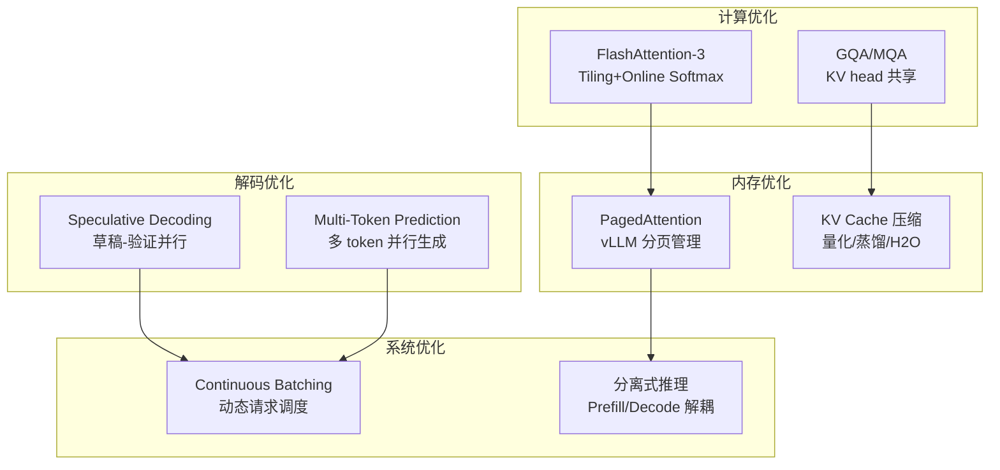

# LLM 推理优化完整版：从 KV Cache 到 Speculative Decoding 到分布式推理

> 📚 参考文献
> - [Efficiently-Aligning-Draft-Models-Via-Parameter...](../papers/daily/20260321_efficiently-aligning-draft-models-via-parameter-and-data-efficient-adaptation-for-speculative-decoding.md) — Efficiently Aligning Draft Models via Parameter- and Data...
> - [Flashattention-3-Fast-And-Accurate-Attention-Fo... [BROKEN]](../../llm-infra/20260321_flashattention-3-fast-and-accurate-attention-for-llms-on-next-gen-accelerators.md) — FlashAttention-3: Fast and Accurate Attention for LLMs on...
> - [Moe-Llama-Mixture-Of-Experts-For-Efficient-Larg...](../papers/daily/20260321_moe-llama-mixture-of-experts-for-efficient-large-language-model-serving.md) — MoE-LLaMA: Mixture-of-Experts for Efficient Large Languag...
> - [Speculative Decoding Draft Alignment](../papers/daily/20260322_speculative_decoding_draft_alignment.md) — Efficiently Aligning Draft Models for Speculative Decoding
> - [Continuous Batching And Dynamic Memory Manageme...](../papers/daily/20260323_continuous_batching_and_dynamic_memory_management_f.md) — Continuous Batching and Dynamic Memory Management for Hig...
> - [Kvcache Compression For Long-Context Llm Infere...](../papers/daily/20260323_kvcache_compression_for_long-context_llm_inference_.md) — KVCache Compression for Long-Context LLM Inference: Metho...
> - [Megascale-Infer-Disaggregated-Expert-Parallelism](../papers/daily/20260320_MegaScale-Infer-Disaggregated-Expert-Parallelism.md) — MegaScale-Infer: Serving Mixture-of-Experts at Scale with...
> - [Grpo-Group-Relative-Policy-Optimization-For-Lar...](../papers/daily/20260321_grpo-group-relative-policy-optimization-for-large-language-model-reasoning.md) — GRPO: Group Relative Policy Optimization for Large Langua...

> 创建：2026-03-24 | 领域：LLM | 类型：综合分析
> 来源：FlashAttention-3, KV Cache 压缩系列, Speculative Decoding, MegaScale-Infer, vLLM

---

## 🆚 创新点 vs 之前方案

| 优化方向 | 朴素方案 | 创新方案 | 加速倍数 |
|---------|---------|---------|---------|
| Attention 计算 | 标准 O(n²) 矩阵乘 | FlashAttention-3（Tiling + Online Softmax） | 1.5-2× |
| KV Cache 内存 | 全量缓存 | GQA + 量化 + PagedAttention | 4-32× 内存省 |
| 解码速度 | 逐 token 自回归 | Speculative Decoding（草稿-验证） | 2-5× |
| 批处理 | Static Batching | Continuous Batching（vLLM） | 2-3× 吞吐 |
| 分布式 | Tensor Parallelism | Prefill-Decode 分离 + MoE 解耦 | 1.5-2× |

---

## 📈 LLM 推理优化技术全景



---

## 📐 核心公式与原理

### 1. Self-Attention

$$
\text{Attention}(Q,K,V) = \text{softmax}\left(\frac{QK^T}{\sqrt{d_k}}\right)V
$$

- Transformer 核心计算

### 2. KV Cache

$$
\text{Memory} = 2 \times n_{layers} \times n_{heads} \times d_{head} \times seq\_len \times dtype\_size
$$

- KV Cache 内存占用公式

### 3. LoRA

$$
W' = W + \Delta W = W + BA, \quad B \in \mathbb{R}^{d \times r}, A \in \mathbb{R}^{r \times d}
$$

- 低秩适配，r << d 大幅减少可训练参数

---

## 🎯 核心洞察（5条）

1. **推理成本三大来源**：Memory（KV Cache 随序列长度线性增长）、Compute（Attention O(n²) 复杂度）、IO（GPU 内存带宽是瓶颈而非计算能力），不同优化瞄准不同瓶颈
2. **KV Cache 是内存杀手**：70B 模型生成 4096 token 的 KV Cache 约 40GB，比模型参数本身还大；压缩 KV Cache 是长文本推理的关键
3. **FlashAttention 的核心不是"更快的注意力算法"而是"更好的内存管理"**：通过 tiling（分块计算）避免写出完整的 attention 矩阵到 HBM，减少 IO 时间 2-4x
4. **Speculative Decoding 用"小模型猜 + 大模型验"加速生成**：小模型连续猜 K 个 token，大模型一次并行验证，接受率 70-90% 时速度提升 2-3x
5. **Continuous Batching 是 serving 的核心创新**：vLLM 的 PagedAttention 将 KV Cache 分页管理，不同请求可以动态加入/退出 batch，GPU 利用率从 30% 提升到 80%+

---

## 📈 技术演进脉络

```
朴素 Attention O(n²)（~2020）
  → FlashAttention-1 分块 IO 优化（2022）
    → FlashAttention-2 并行度优化（2023）
      → FlashAttention-3 异步流水线（2024）
→ KV Cache 基础实现（~2020）
  → Grouped Query Attention GQA（2023）
    → KV Cache 量化/稀疏化（2024）
      → 跨层 KV 共享 KVSharer（2025）
→ vLLM PagedAttention（2023）
  → Continuous Batching 普及（2024）
    → 分离式推理 Prefill/Decode 解耦（2025）
→ Speculative Decoding（2023）
  → 自适应投机解码 Nightjar（2024-2025）
```

**关键转折点**：
- **FlashAttention（2022）**：证明 Attention 优化的关键不在算法而在 IO，改变了整个推理优化思路
- **vLLM PagedAttention（2023）**：KV Cache 分页管理使大规模 serving 成为现实
- **GQA（2023）**：Llama-2 采用，KV Cache 减少 4-8x，几乎无精度损失

---

## 🔗 跨文献共性规律

| 规律 | 体现 | 说明 |
|------|------|------|
| IO 才是真正瓶颈 | FlashAttention, PagedAttention | 现代 GPU 的 TFLOPS 远超 HBM 带宽，推理受限于搬数据 |
| 压缩比和精度的 Pareto 前沿 | KV Cache 量化, 模型量化 | INT8 几乎无损，INT4 需要校准，INT2 严重降质 |
| 批处理提升 GPU 利用率 | Continuous Batching | 请求之间共享 GPU 时间片，避免空闲等待 |
| 用空间换时间的反向趋势 | Speculative Decoding | 多跑一个小模型来减少大模型的推理次数 |

---

## 🎓 常见考点（8条）

### Q1: FlashAttention 的核心原理？
**30秒答案**：传统 Attention 需要将 QK^T（n×n 矩阵）写到 GPU HBM 再读回来做 softmax，IO 成本 O(n²)。FlashAttention 将 Q/K/V 分块（tiling），在 SRAM 中完成分块 attention 计算（online softmax），避免写出完整 n×n 矩阵。
**追问方向**：FlashAttention-3 比 2 快在哪？答：异步流水线——数据搬运和 Tensor Core 计算重叠执行，H100 利用率从 35% 到 75%。

### Q2: KV Cache 为什么重要？怎么压缩？
**30秒答案**：自回归生成中，每个新 token 需要和之前所有 token 做 attention，KV Cache 缓存历史 K/V 避免重复计算。压缩方式：①GQA（多 Query 头共享 KV 头）；②量化（FP16→INT8）；③稀疏化（只保留重要 token 的 KV）；④跨层共享（KVSharer）。
**追问方向**：GQA 的 group 数怎么选？答：Llama-2 用 8 组（32 头分 8 组），KV Cache 减 4x。

### Q3: Continuous Batching 怎么工作？
**30秒答案**：传统 static batching 要等一个 batch 全部完成才能处理下一个；Continuous Batching 允许请求随时加入/退出——一个请求完成生成后立即让出位置，新请求立即加入。vLLM 的 PagedAttention 将 KV Cache 分页，动态分配/回收。
**追问方向**：PagedAttention 的 page 大小怎么选？答：通常 16-256 tokens/page，太小碎片多，太大浪费。

### Q4: Speculative Decoding 的原理和适用条件？
**30秒答案**：小模型（draft model）快速生成 K 个候选 token，大模型（target model）并行验证这 K 个 token 的概率分布，数学保证与大模型直接生成的分布一致。适用条件：draft model 和 target model 的分布足够接近（接受率 >70%）。
**追问方向**：draft model 怎么选？答：同架构的小模型（如 7B→70B）、或剪枝/蒸馏的版本。

### Q5: 模型量化的精度-效率权衡？
**30秒答案**：FP32→FP16：几乎无损，2x 加速；FP16→INT8：轻微损失（<0.5% 性能下降），2x 加速+内存减半；INT8→INT4：需要 GPTQ/AWQ 校准，1-2% 损失，适合部署；INT4→INT2：严重降质，仅实验用。
**追问方向**：GPTQ 和 AWQ 的区别？答：GPTQ 逐层量化+重建，AWQ 根据 activation 分布保护重要权重。

### Q6: Prefill 和 Decode 阶段有什么区别？
**30秒答案**：Prefill 处理整个 prompt（compute-bound，大量矩阵乘法），Decode 逐 token 生成（memory-bound，主要是 KV Cache 读取）。解耦推理（Disaggregated Inference）将两阶段分到不同 GPU 集群。
**追问方向**：为什么要解耦？答：Prefill 需要大算力（A100），Decode 需要大内存带宽（H100），混合使用效率低。

### Q7: MoE 推理的特殊挑战？
**30秒答案**：MoE 模型总参数量大（如 Mixtral 47B/141B）但每次只激活一部分专家（如 2/8），挑战是：①专家分布在不同 GPU 上需要 AllToAll 通信；②专家负载不均衡导致 GPU 空闲。
**追问方向**：怎么优化 MoE 推理？答：MegaScale-Infer 将 attention 和 expert 分别部署在不同节点，异步流水线。

### Q8: 长文本推理（100K+ tokens）的瓶颈？
**30秒答案**：KV Cache 内存爆炸（70B 模型 100K tokens 需要 ~1TB KV Cache），O(n²) 注意力计算时间增长。解决：①稀疏注意力（只看最近窗口 + 全局 token）；②KV Cache 分页到 CPU/SSD；③Ring Attention 分布式计算。

---

### Q9: KV Cache 为什么是推理瓶颈？
**30秒答案**：KV Cache 大小 = 2×layers×heads×dim×seq_len×dtype_size。长序列时内存爆炸。优化：①Multi-Query Attention；②量化（FP8/INT4）；③页注意力（vLLM PagedAttention）；④压缩（H2O/SnapKV）。

### Q10: RLHF 和 DPO 的区别？
**30秒答案**：RLHF：训练 reward model + PPO 优化，需要在线采样。DPO：直接用偏好数据优化策略，跳过 reward model，更简单稳定。效果接近但 DPO 训练成本更低。
## 🌐 知识体系连接

- **上游依赖**：Transformer 架构、GPU 硬件原理（HBM/SRAM/Tensor Core）
- **下游应用**：LLM Serving 系统（vLLM/TGI/TensorRT-LLM）、RAG 推理、Agent 推理
- **相关 synthesis**：LLM对齐方法演进.md, MoE架构设计.md
- **相关论文笔记**：synthesis/KVCache与LLM推理优化全景.md, llm-infra/01_llm_fundamentals.md

---

## 投机解码数学分析

设草稿模型 $M_q$，目标模型 $M_p$，草稿长度 $\gamma$，token 接受率：

$$
\alpha = \mathbb{E}\left[\min\left(1, \frac{p(x)}{q(x)}\right)\right]
$$

期望加速比：

$$
\text{Speedup} \approx \frac{\gamma+1}{1 + (1-\alpha)/\alpha \cdot c}
$$

其中 $c = t_{large}/t_{small}$。当 $\alpha \to 1$ 时加速比趋近 $\gamma+1$（通常 3-4×）。

拒绝后重采样，保证输出分布与大模型完全一致（无损加速）：

$$
p'(x) = \text{norm}(\max(0, p(x) - q(x)))
$$

## Continuous Batching 吞吐分析

标准 Batching GPU 利用率仅 30-50%（短请求完成后等待）。

Continuous Batching 每个解码步骤可插入新请求，吞吐量：

$$
\text{Throughput} \approx \frac{N_{\text{queue}}}{\bar{L}} \times \text{GPU}}_{\text{{\text{FLOPS}}}
$$

GPU 利用率提升至 85-95%，是 vLLM 相比朴素部署 5-10× 吞吐的核心来源。
