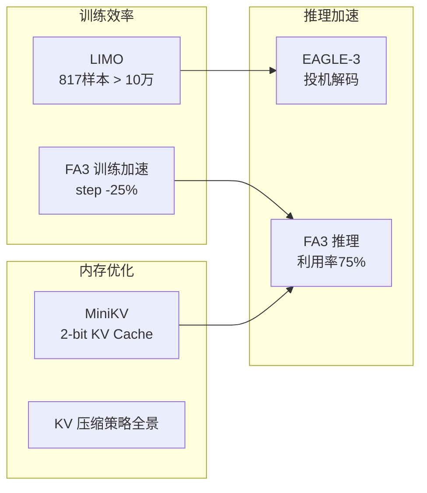

# LLM推理加速与高效训练技术全景（2026-03-30）

> 领域：llm-infra | 类型：综合综述 | 覆盖论文：5篇

---

## 🆚 创新点 vs 之前方案

| 技术 | 之前方案 | 创新 | 效果 |
|------|---------|------|------|
| LIMO | 10万+ SFT 数据 | **817 高质量样本激发** | 数据效率 100× |
| EAGLE-3 | EAGLE-2（固定 draft head） | **训练时 Scaling draft** | 接受率提升 |
| MiniKV | 8-bit KV Cache 量化 | **2-bit 系统协同设计** | 内存 8× 压缩 |
| FlashAttention-3 | FA2（35% GPU 利用率） | **TMA+WGMMA Warp 分工** | 利用率 75% |

---

## 📈 效率优化全链路



---

## 一、技术维度总览

```
LLM 效率优化全链路：
┌─────────────────────────────────────────────────────────┐
│  训练效率          │  推理加速           │  KV Cache 优化   │
│  ─────────         │  ──────────         │  ──────────────  │
│  LIMO (少样本)     │  EAGLE-3 (投机解码) │  MiniKV (2-bit)  │
│  FlashAttention-3  │  FlashAttention-3   │  KV Cache 综述   │
│  (训练加速)        │  (H100 优化)        │  (策略全景)      │
└─────────────────────────────────────────────────────────┘
```

## 二、核心技术深度

### 2.1 高效推理训练（LIMO）

**核心发现**：样本质量 >> 样本数量

$$
\text{LIMO Hypothesis: } \mathcal{K}_\text{pretrain} \supset \mathcal{K}_\text{reasoning}
$$

预训练已积累推理知识，SFT 只需"激活"（< 1000 samples 即可）。

**数据质量标准**：
- ✅ 步骤完整（无跳步，每题 8+ 步）
- ✅ 推理可验证（数学题有程序验证器）
- ✅ 多样性（覆盖代数/几何/组合/数论）
- ❌ 避免机械重复和错误示范

**效率对比**：
| 方法 | 训练数据 | AIME 2024 | 数据效率 |
|------|----------|-----------|----------|
| 标准数学 SFT | 100K+ | 43% | 1x |
| LIMO | 817 | 57% | ~100x |

### 2.2 Attention 加速（FlashAttention-3）

**IO 复杂度优化**：

标准 Attention IO 复杂度：$O(n^2 d)$（写 attention matrix 到 HBM）
FlashAttention IO 复杂度：$O(n^2 d^2 / M)$（$M$ = SRAM size，分块消除中间写）

**H100 特有优化**：

| 特性 | A100 | H100 | 加速来源 |
|------|------|------|----------|
| 矩阵乘 | WMMA | WGMMA | warpgroup 级，更大 tile |
| IO | 同步 DMA | TMA 异步 | IO/计算重叠 |
| 精度 | BF16/FP32 | BF16/FP8 | FP8 速度 2x |
| 利用率 | 70% | 75%+ | 充分利用 Hopper |

**Online Softmax（FlashAttention 核心技巧）**：

$$
m_i = \max(m_{i-1}, \max_j s_{ij}), \quad l_i = e^{m_{i-1}-m_i}l_{i-1} + \sum_j e^{s_{ij}-m_i}
$$

逐块更新 running statistics，无需存储完整 $n \times n$ attention matrix。

### 2.3 推测解码（EAGLE-3）

**加速原理**：

$$
\text{Speedup} \approx \frac{1}{1-\alpha} \cdot \frac{1}{1+c}
$$

$\alpha$：token 接受率（EAGLE-3: 0.82），$c$：草稿模型相对成本（~0.1）

**EAGLE 系列演进**：
```
EAGLE:   草稿模型 + target logit 对齐
EAGLE-2: 动态草稿长度（根据上下文难度调整）
EAGLE-3: TTT（Training-Time Test）+ Feature-level speculation
         → 接受率从 0.71 → 0.82
```

**Tree-based Drafting**：
```
       [draft 1a] → [draft 1a1]
root → [draft 1b] → [draft 1b1]
       [draft 1c]
```
目标模型并行验证所有分支，选最长合法前缀（加速比更高）

### 2.4 KV Cache 优化体系

**显存占用公式**：

$$
M_\text{KV} = 2 \times L \times N_h \times d_h \times T \times \text{bytes}
$$

70B 模型，100K token，FP16 → $\approx$ 140 GB

**优化策略层次**：

| 层次 | 策略 | 节省比例 | 精度损失 |
|------|------|----------|----------|
| 精度压缩 | MiniKV INT2 | 8x | <2% |
| Token 稀疏 | H2O/SnapKV | 2-4x | <3% |
| 结构共享 | MLA (DeepSeek) | 8-16x | ~0% |
| 前缀复用 | PagedAttention | 按场景 | 0% |
| 卸载 | CPU/SSD offload | 理论无上限 | 延迟增加 |

**MLA（Multi-head Latent Attention）**：

$$
c_{KV} = W_{KV} h_t \in \mathbb{R}^{d_c}, \quad d_c \ll N_h \times d_h
$$

KV Cache 只存低维 latent，推理时还原，是 DeepSeek 的核心效率创新。

## 三、📐 关键数学公式

**1. FlashAttention 分块计算**：

$$
O_i = \text{diag}(l_i)^{-1} \sum_j e^{s_{ij}-m_i} V_j
$$

**2. Speculative Decoding 接受概率**：

$$
\alpha = \min\left(1, \frac{p_\text{target}(x)}{p_\text{draft}(x)}\right)
$$

**3. MiniKV 量化误差上界**：

$$
\|K_\text{quant} - K\|_F \leq \frac{\Delta}{2} \cdot \sqrt{n \cdot d}
$$

$\Delta$：量化步长，分组量化使 $\Delta$ 更小。

## 四、🎓 面试 Q&A（10题）

**Q1**: FlashAttention 的核心思想是什么？
> 将 QKV 分块（tiling），在 SRAM 内完成整个 attention 计算（softmax + 加权 V），避免 HBM 读写 $O(n^2)$ 的 attention matrix。从 IO-bound 变为 compute-bound

**Q2**: Speculative Decoding 为什么保证质量与原模型完全一致？
> 用 Rejection Sampling：草稿 token 以概率 $\min(1, p_\text{target}/p_\text{draft})$ 接受，被拒绝时从 $\max(0, p_\text{target}-p_\text{draft})$ 重采样，输出分布与目标模型完全等价

**Q3**: H100 相比 A100 在 attention 上的关键新特性？
> TMA 异步 IO 使内存搬运与计算重叠；WGMMA 指令（warpgroup 级矩阵乘）更大 tile 提升利用率；FP8 Tensor Core 速度 2x

**Q4**: LIMO 为什么能用 817 条数据达到 SOTA？
> LLM 预训练已经学会了大量数学知识和推理"基础设施"，SFT 只是提供格式示范和策略激活。高质量样本提供的信噪比远高于大量低质量数据

**Q5**: KV Cache 量化（INT2）的主要挑战？
> ① KV 分布有 outlier（大激活值），naive 量化误差大 → 需分组量化；② INT2 dequantize 需要专门 CUDA kernel；③ 混合精度（重要 token 高精度）的动态判断开销

**Q6**: PagedAttention 如何减少显存碎片？
> 固定大小 KV block（16 token），逻辑连续/物理分散，按需分配。多个 requests 的 prefix 可以物理共享同一 block，极大提升显存利用率

**Q7**: EAGLE-3 的 Training-Time Test（TTT）是什么？
> 训练时模拟推测解码的接受-拒绝过程，将被拒绝的草稿 token 纳入训练信号，使草稿模型学会"如何生成目标模型会接受的 token"，接受率大幅提升

**Q8**: MLA（Multi-head Latent Attention）如何减少 KV Cache？
> 传统 KV Cache 存储所有 head 的 K/V：$N_h \times d_h$；MLA 只存 latent $c_{KV}$（维度 $d_c \approx d_h / N_h$），推理时动态还原，压缩 8-16x

**Q9**: 在线 Softmax（Online Softmax）的原理？
> 维护 running max $m$ 和 running sum $l$，处理新 block 时用 $e^{m_\text{old}-m_\text{new}}$ 修正前面的累积值，数学等价于全局 softmax，但只需 O(1) 额外存储

**Q10**: 如何为 LLM 推理选择优化策略优先级？
> ① 量化（INT4/INT8）：最易实施，速度提升 2x，精度损失可控；② PagedAttention：显存利用率提升，批次增大；③ Speculative Decoding：延迟提升 3-4x；④ FlashAttention：训练/推理稳定提速

## 🎯 核心洞察

1. **LLM 推理效率的三角**：Compute（算力）× Memory（显存）× Latency（延迟）构成不可能三角。FlashAttention-3 优化 Compute，MiniKV/KV Cache 优化 Memory，EAGLE-3 优化 Latency——三条路线各有侧重，工程实践需要组合出最优点。

2. **LIMO 颠覆了"大数据是唯一答案"的直觉**：817 条 > 100K 条，因为基础大模型已有能力，SFT 只需"激活"。这对推荐/搜索/广告领域的"少量高质量标注 fine-tune"有直接启发——不要无脑堆数据，要关注数据质量标准。

3. **Speculative Decoding 的接受率是关键指标，不是加速比**：接受率 $\alpha$ 决定了一切（加速比 ≈ $1/(1-\alpha)$），EAGLE-3 从 0.71 → 0.82 就是 3x → 5x 的差别。Training-Time Test（TTT）直接优化接受率而非间接，是方法论突破。

4. **KV Cache 优化的优先级是反直觉的**：直觉上量化是有损的、应该最后考虑；但工程实践中，Prefix Caching（零损失）→ INT8量化（<1%损失）→ 稀疏化（<3%损失）才是正确顺序——从最安全、最易实施的开始。

5. **MLA（DeepSeek 的 Multi-head Latent Attention）是 KV Cache 压缩的架构级解法**：量化/稀疏是推理时 patch，MLA 是训练时设计——在模型层面消除冗余，比推理层面优化更根本，代价是无法直接用于已训练的模型。

6. **FlashAttention → H100 的演进路线说明硬件协同优化不可或缺**：A100 上最优的 tiling 策略在 H100 上不是最优（TMA 异步 IO 改变了瓶颈）。每代硬件都需要重新设计算子，这是 AI 基础设施的长期工作。

## 📚 参考文献

> - [LIMO_less_is_more_for_reasoning](../papers/LIMO_less_is_more_for_reasoning.md) — 817 条数据超越 100K，少样本激活推理能力
> - [EAGLE3_scaling_inference_acceleration_training_time_test](../papers/EAGLE3_scaling_inference_acceleration_training_time_test.md) — Training-Time Test 提升草稿接受率到 0.82
> - [MiniKV_2bit_KV_cache_compression_system_codesign](../papers/MiniKV_2bit_KV_cache_compression_system_codesign.md) — 2-bit KV Cache 量化，8x 压缩精度损失 <2%
> - [KV_Cache_optimization_strategies_scalable_efficient_LLM_inference](../papers/KV_Cache_optimization_strategies_scalable_efficient_LLM_inference.md) — KV Cache 优化策略全景综述
> - [FlashAttention3_fast_accurate_attention_H100_GPUs](../papers/FlashAttention3_fast_accurate_attention_H100_GPUs.md) — H100 Hopper 架构专属 FlashAttention-3 优化


## 📐 核心公式直观理解

### 公式 1：混合精度训练的 loss scaling

$$
\text{scaled\_loss} = \text{loss} \times S, \quad \text{grad}_{\text{fp32}} = \frac{\text{grad}_{\text{fp16}}}{S}
$$

- $S$：loss scaling factor（通常 $2^{16}$ 起步，动态调整）

**直观理解**：FP16 的最小可表示正数约 $6 \times 10^{-8}$，而梯度经常比这还小（下溢为零）。Loss scaling 把梯度"放大"到 FP16 可表示的范围内计算，更新参数前再"缩回来"。就像用放大镜看微小文字——放大看清后按原比例记录。

### 公式 2：GQA（Grouped Query Attention）KV Cache 节省

$$
M_{\text{GQA}} = M_{\text{MHA}} \times \frac{n_{\text{kv\_heads}}}{n_{\text{q\_heads}}}
$$

- $n_{\text{q\_heads}}$：query 头数量
- $n_{\text{kv\_heads}}$：KV 头数量（GQA 中远少于 query 头）

**直观理解**：MHA 给每个 query head 配一个独立的 KV head（1:1），GQA 让多个 query head 共享一个 KV head（N:1）。LLaMA-2 70B 用 8 个 KV head 服务 64 个 query head，KV Cache 直接缩小 8 倍——这是超长上下文推理的关键。

### 公式 3：FSDP 显存占用

$$
M_{\text{FSDP}} = \frac{M_{\text{params}} + M_{\text{grads}} + M_{\text{optim}}}{N_{\text{GPUs}}} + M_{\text{activations}}
$$

**直观理解**：FSDP 把模型参数、梯度、优化器状态都切片分散到多个 GPU 上，每个 GPU 只存 $1/N$ 的份额。需要时再 all-gather 拼回来，用完立刻丢弃。代价是多了通信开销，但使得单 GPU 能"装下"远超其显存容量的模型。

