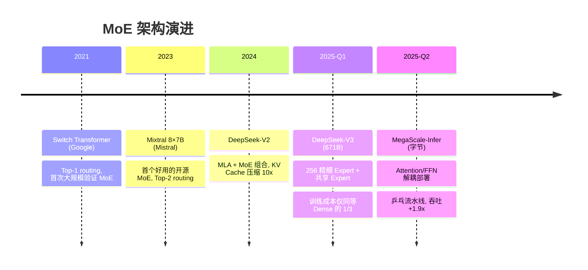
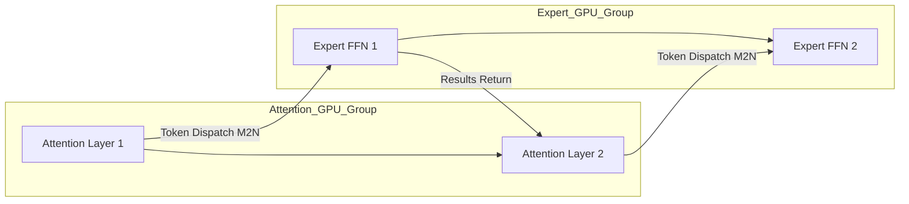

# MoE 架构设计：从稀疏激活到分布式推理（含 MegaScale-Infer 解耦架构）

> 📚 参考文献
> - [Megascale-Infer-Disaggregated-Expert-Parallelism](../papers/daily/20260320_MegaScale-Infer-Disaggregated-Expert-Parallelism.md)
> - [Moe-Llama-Mixture-Of-Experts-Efficient-Llm-Serving](../papers/daily/20260321_moe-llama-mixture-of-experts-efficient-llm-serving.md)
> - [Continuous Batching And Dynamic Memory Manageme...](../papers/daily/20260323_continuous_batching_and_dynamic_memory_management_f.md)
> - [Moe Llama Mixture Of Experts](../papers/daily/20260322_moe_llama_mixture_of_experts.md)
> - [Flashinfer-Attention-Engine-Llm-Inference](../papers/daily/20260319_flashinfer-attention-engine-llm-inference.md)

> 创建：2026-03-20 | 更新：2026-04-02（合并自 MoE推理解耦架构.md + MoE架构设计.md）
> 领域：LLM推理·MoE | 难度：⭐⭐⭐⭐

---

## 🆚 创新点 vs 之前方案

| 维度 | 之前方案 | MoE 创新 |
|------|---------|----------|
| 模型结构 | Dense FFN（所有参数参与每次计算） | 稀疏激活：N 个 Expert 只激活 Top-K，"大模型小计算" |
| 路由粒度 | Switch Transformer: Top-1, Mixtral: 8 大 Expert | DeepSeek-V3: 256 小 Expert + 共享 Expert，更精细匹配 |
| KV Cache | 完整 Multi-Head KV 缓存 | MLA（Multi-head Latent Attention）低秩压缩 KV Cache 10x+ |
| 推理部署 | Tensor Parallelism 切 head，Attention+FFN 共存 | MegaScale-Infer：Attention/FFN 解耦部署 + 乒乓流水线，吞吐 +1.9x |
| 通信 | NCCL All-Reduce（密集集合通信） | M2N 零拷贝 RDMA（稀疏点对点 token dispatch） |

---

## 📐 核心公式与原理

### 1. MoE Gate（路由机制）

$$
G(x) = \text{TopK}(\text{softmax}(W_g \cdot x))
$$

$$
y = \sum_{i \in \text{TopK}} G_i(x) \cdot E_i(x)
$$

**符号说明**：
- $x \in \mathbb{R}^d$：输入 token 的隐藏表示
- $W_g \in \mathbb{R}^{N \times d}$：门控权重矩阵，$N$ 为 Expert 数
- $G_i(x)$：token $x$ 分配给 Expert $i$ 的门控权重（softmax 归一化后取 TopK）
- $E_i(x)$：第 $i$ 个 Expert（小型 FFN）的输出
- TopK：只保留得分最高的 $K$ 个 Expert（通常 $K=1$ 或 $2$）

**直觉**：Router 就像一个调度员，看到每个 token 后决定把它交给哪几个专家处理，最终结果是各专家输出的加权和。

### 2. 负载均衡 Auxiliary Loss

$$
\mathcal{L}_{aux} = \alpha \cdot N \cdot \sum_{i=1}^{N} f_i \cdot P_i
$$

**推导与符号说明**：
- $f_i = \frac{\text{分配到 Expert } i \text{ 的 token 数}}{B}$（实际分配比例，$B$ 为 batch 内总 token 数）
- $P_i = \frac{1}{B}\sum_{x \in \mathcal{B}} p_i(x)$（Router 给 Expert $i$ 的平均概率）
- $\alpha$：平衡系数，通常 0.01-0.1
- $N$：Expert 总数

**直觉**：当某个 Expert 同时被大量 token 选中（$f_i$ 大）且 Router 给它高概率（$P_i$ 大）时，$f_i \cdot P_i$ 项很大，loss 惩罚这种不均衡。最小化时趋向 $f_i = P_i = 1/N$（均匀分配）。

### 3. Self-Attention

$$
\text{Attention}(Q,K,V) = \text{softmax}\left(\frac{QK^T}{\sqrt{d_k}}\right)V
$$

### 4. KV Cache 内存占用

$$
\text{Memory}}_{\text{{KV}} = 2 \times n_{layers} \times n_{heads} \times d_{head} \times L \times s
$$

其中 $L$ 为序列长度，$s$ 为数据类型字节数（FP16=2, INT8=1）。

---

## 🎯 核心洞察

1. **MoE 的核心 = "大模型小计算"**：DeepSeek-V3 总参 671B 但每 token 只激活 37B，兼顾能力和效率
2. **Router 是灵魂**：Top-K routing 主流，K=1 最高效，K=2 效果更好
3. **负载均衡是训练核心挑战**：Expert Collapse 用 Auxiliary Loss 解决
4. **MoE 推理需专用架构**：token-to-expert 的 AllToAll 通信是瓶颈
5. **DeepSeek MoE 引领行业**：共享专家 + 256 精细路由 + MLA

---

## 📈 技术演进时间线



---

## 🔬 MegaScale-Infer 解耦架构详解

### 核心思想

MoE 模型中 Attention 层（计算密集）和 FFN/Expert 层（内存密集）特性完全不同。**将它们分开部署到不同 GPU 组，各自优化**。



### 乒乓流水线（核心 trick）

```
时间轴:
  Attn GPU:   [处理 batch-A] [处理 batch-B] [处理 batch-C]
  Expert GPU:      [处理 batch-A] [处理 batch-B]
  通信:        A→E   B→E   C→E   A←E   B←E

关键：通信与计算重叠 → 通信延迟几乎被隐藏
```

### M2N 通信库 vs NCCL

| 特性 | NCCL | M2N |
|------|------|-----|
| 通信模式 | 集合通信（All-Reduce） | 稀疏点对点（token dispatch） |
| 初始化 | 秒级 | 毫秒级 |
| 适用场景 | Dense 模型 TP | MoE Expert Parallelism |
| 拷贝 | GPU→CPU→GPU | 零拷贝 RDMA |

### 生活类比

传统餐厅：所有厨师每道菜都经历备料→烹饪→摆盘，"备料"（FFN）特别慢，"烹饪"（Attention）特别快，互相等待。**MegaScale-Infer**：A 厨房专做 Attention，B 厨房专做 FFN，乒乓传菜，永远有事做。

---

## 🏭 工业落地 vs 论文差异

| 论文 | 工业落地 |
|------|---------|
| 理想化单一模型 | 多版本模型混合部署 |
| 静态 batch size | 动态调整 micro-batch 适应流量 |
| 纯吞吐优化 | 吞吐 + TTFT 双指标 |
| RDMA 理想环境 | 需 InfiniBand/RoCE 高速网络 |

---

## 🎓 常见考点

### Q1: MoE 模型的基本结构？
**30秒答案**：每个 Transformer 层的 FFN 替换为 N 个 Expert + 1 个 Router。Router 对每个 token 选 Top-K Expert 处理，输出 = Σ(gate\_score\_i × expert\_i(x))。K=1 最高效，K=2 效果更好。

### Q2: 专家坍缩怎么解决？
**30秒答案**：加 Auxiliary Loss $\mathcal{L}\_{aux} = \alpha N \sum f\_i P\_i$，强制均匀分配。$\alpha$ 通常 0.01-0.1，太大影响主 loss，太小不均衡。

### Q3: MoE 推理的通信挑战？
**30秒答案**：EP 将不同 Expert 放不同 GPU，每 token 需 AllToAll 通信。减少方法：①Expert 分组本地化；②增大 batch 均摊；③MegaScale-Infer 解耦架构。

### Q4: DeepSeek-V3 精细路由设计？
**30秒答案**：256 小 Expert（vs Mixtral 8 大），每 token 选 top-8 激活。1 个共享 Expert 永远激活处理通用知识。Router 只是 linear(hidden\_dim → 256)，开销可忽略。

### Q5: MLA 是什么？
**30秒答案**：DeepSeek-V2 将 KV Cache 压缩到低秩 latent 向量，推理时只缓存 latent 而非完整 K/V，KV Cache 减少 10x+。与 GQA 互补：GQA 减少 head 数，MLA 压缩维度。

### Q6: MoE vs Dense 怎么选？
**30秒答案**：算力受限选 MoE（同推理成本能力更强）；简单部署选 Dense（无需 EP）；边端选 Dense（MoE 内存 = 总参数量）。

### Q7: 为什么 FFN 层是"内存密集"？
**30秒答案**：N 个 Expert 常驻 GPU 内存但每 token 只激活 Top-K，compute/memory ratio 极低，GPU 计算单元等内存加载。

### Q8: 乒乓流水线为什么能隐藏通信？
**30秒答案**：将 batch 分成 micro-batches。Expert GPU 处理 A 时，Attention GPU 处理 B，同时 A 结果在通信返回。三动作重叠，通信被计算覆盖。

---

## 🌐 知识体系连接

- **上游**：Transformer 架构、分布式训练（EP/TP/PP）
- **下游**：大规模 LLM 部署、推理成本优化
- **相关 synthesis**：LLM推理优化完整版.md, FlashAttention3与LLM推理基础设施.md
