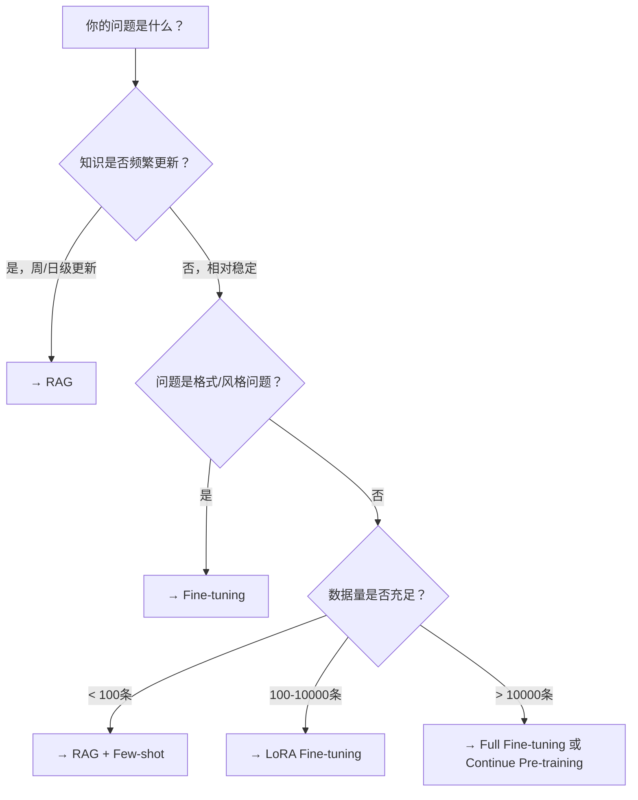

# RAG vs Fine-tuning：工程决策框架

> 这是实际工作中最常被问的问题之一：什么时候用 RAG，什么时候用 Fine-tuning？

## 先搞清楚它们解决什么问题

**RAG（检索增强生成）解决的问题**：
- 知识实时性（LLM 训练截止日期后的新信息）
- 知识范围（公司私有文档、内部 Wiki）
- 幻觉风险（提供可验证的文档来源）

**Fine-tuning 解决的问题**：
- 格式/风格一致性（固定的输出格式、品牌语气）
- 领域专业知识深度（医学/法律术语理解）
- 推理模式（特定任务的 step-by-step 模式）
- 减少 prompt 长度（将示例知识内化到权重）

## 决策树

## 具体场景判断

| 场景 | 推荐方案 | 原因 |
|------|---------|------|
| 客服机器人（公司产品知识）| RAG | 产品手册频繁更新 |
| 代码补全（特定语言风格）| Fine-tuning | 格式固定，可以学习 |
| 医疗问答（医学术语）| RAG + Fine-tuning | 知识实时性 + 专业理解都需要 |
| 广告文案生成（品牌风格）| Fine-tuning | 风格一致性，数据量足够 |
| 法律合同分析 | RAG | 法律文本具体内容频繁变化 |
| 数学推理提升 | RLVR Fine-tuning | 有可验证标准答案 |

## 成本对比（7B 模型为例）

| 方案 | 一次性成本 | 运行成本 | 更新成本 |
|------|----------|---------|---------|
| Prompt Engineering | 低 | 高（长 prompt）| 低 |
| RAG | 中（向量库构建）| 中 | 低（更新文档即可）|
| LoRA Fine-tuning | 中（训练）| 低（短 prompt）| 中（重新训练）|
| Full Fine-tuning | 高 | 低 | 高（重新训练）|

## 常见误区

**误区1："Fine-tuning 一定比 RAG 好"**
→ Fine-tuning 无法解决知识实时性问题。如果数据库每周更新，Fine-tuning 需要每周重训，成本不可接受。

**误区2："RAG 就够了，不需要 Fine-tuning"**
→ RAG 的检索质量取决于 query 和 document 的相关性。如果模型不理解领域专业术语，检索会失败（"心肌梗死"检索不到 "心脏病"的文档）。

**误区3："两者选一个"**
→ 最常见的最优解是组合：用 Fine-tuning 让模型理解领域，用 RAG 提供实时知识。

## 面试标准答案

**Q：你们是怎么决定用 RAG 还是 Fine-tuning 的？**

> 我们按三个维度判断：①知识时效性——如果信息频繁变化（天/周级），选 RAG；②格式一致性——如果需要固定输出格式或品牌语气，Fine-tuning 更有效；③数据量——Fine-tuning 至少需要几百条高质量样本，否则用 RAG + few-shot 更实际。大多数情况下我们会先上 RAG 验证方向，再考虑是否需要 Fine-tuning 做补强。
