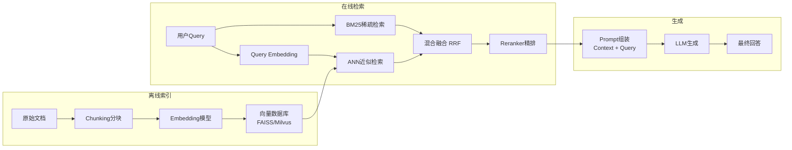

# RAG 系统全景：检索增强生成的工程实践

> 📚 参考文献
> - [Multi-Agent Llm Systems Coordination Protocols ...](../papers/daily/20260323_multi-agent_llm_systems_coordination_protocols_and_.md) — Multi-Agent LLM Systems: Coordination Protocols and Emerg...
> - [Creativity-Llm-Multi-Agent-Survey](../papers/daily/20260319_creativity-llm-multi-agent-survey.md) — Creativity in LLM-based Multi-Agent Systems: A Survey
> - [Efficient-Long-Context-Llms-Survey-And-Benchmar...](../papers/daily/20260321_efficient-long-context-llms-survey-and-benchmark-2025-2026.md) — Efficient Long-Context LLMs: Survey and Benchmark 2025-2026
> - [Kvcache Compression For Long-Context Llm Infere...](../papers/daily/20260323_kvcache_compression_for_long-context_llm_inference_.md) — KVCache Compression for Long-Context LLM Inference: Metho...
> - [Creativity-Llm-Multiagent-Survey](../papers/daily/20260319_creativity-llm-multiagent-survey.md) — Creativity in LLM-based Multi-Agent Systems: A Survey
> - [Efficient-Long-Context-Llms-Survey-Benchmark-20...](../papers/daily/20260321_efficient-long-context-llms-survey-benchmark-2025-2026.md) — Efficient Long-Context LLMs: Survey and Benchmark 2025-2026
> - [Beyond-Rag-Agent-Memory](../papers/daily/20260316_beyond-rag-agent-memory.md) — Beyond RAG for Agent Memory: Retrieval by Decoupling and ...
> - [Grpo-Group-Relative-Policy-Optimization-Llm-Rea...](../papers/daily/20260321_grpo-group-relative-policy-optimization-llm-reasoning.md) — GRPO: Group Relative Policy Optimization for Large Langua...

> 创建：2026-03-24 | 领域：LLM | 类型：综合分析
> 来源：RAG Survey, HyDE, Self-RAG, CRAG, Chunk 策略系列

---

## 🆚 创新点 vs 之前方案

| 维度 | Naive RAG | Advanced RAG | Agentic RAG |
|------|----------|-------------|-------------|
| 检索策略 | 单次 top-K 检索 | 查询重写 + 混合检索 | **多步迭代 + 自适应触发** |
| 文档处理 | 固定 chunk size | 语义分块 + 重叠 | 分层索引 + 知识图谱 |
| 生成控制 | 拼接 context 直接生成 | Re-ranking + 压缩 | **反思 + 工具调用** |
| 幻觉控制 | 无 | Faithfulness 约束 | **Self-RAG 自我验证** |
| Query 增强 | 无 | HyDE（假设文档） | 子问题分解 + CoT |
| 代表方案 | LangChain naive | CRAG, HyDE | Self-RAG, Agentic RAG |

## 架构总览

## 📐 核心公式与原理

### 1. Self-Attention

$$
\text{Attention}(Q,K,V) = \text{softmax}\left(\frac{QK^T}{\sqrt{d_k}}\right)V
$$

- Transformer 核心计算

### 2. KV Cache

$$
\text{Memory} = 2 \times n_{layers} \times n_{heads} \times d_{head} \times seq\_len \times dtype\_size
$$

- KV Cache 内存占用公式

### 3. LoRA

$$
W' = W + \Delta W = W + BA, \quad B \in \mathbb{R}^{d \times r}, A \in \mathbb{R}^{r \times d}
$$

- 低秩适配，r << d 大幅减少可训练参数

---

## 🎯 核心洞察（5条）

1. **RAG 是 LLM 落地的关键技术**：解决 LLM 的知识时效性、幻觉和领域专业性问题，让 LLM 基于检索到的事实回答
2. **Chunk 策略决定 RAG 质量的下限**：文档切分太大失去精度，太小丢失上下文。最佳实践：512-1024 tokens + 20% overlap + 按语义段落切分
3. **检索 → 重排 → 生成 的三阶段架构**：向量检索（粗召回 top-50）→ Cross-Encoder 重排（精选 top-5）→ LLM 基于 top-5 生成回答
4. **Query 改写是提升 RAG 效果的最高杠杆**：用户原始 query 直接检索效果差，HyDE（先生成假设答案再检索）、Multi-Query（多角度改写）可提升 Recall 10-20%
5. **Self-RAG 和 CRAG 代表"自适应 RAG"方向**：模型自己判断"需不需要检索"、"检索结果是否有用"，避免所有问题都检索的浪费

---

## 🎓 常见考点（6条）

### Q1: RAG 的基本架构？
**30秒答案**：①离线：文档切分（Chunking）→ 编码为向量 → 存入向量数据库；②在线：用户 Query → （可选）Query 改写 → 向量检索 top-K → （可选）Reranker 精选 → 将检索结果 + Query 拼接为 Prompt → LLM 生成回答。

### Q2: Chunk 策略有哪些？
**30秒答案**：①固定长度切分（512 tokens + 128 overlap）——最简单；②语义段落切分（按标题/段落边界）——保持语义完整性；③递归切分（先按段落、段落太长再按句子）——兼顾两者；④Agentic Chunking（让 LLM 判断切分边界）——最灵活但最慢。

### Q3: RAG 中检索效果差怎么优化？
**30秒答案**：①改善 Chunk：调整大小、增加 overlap、使用语义切分；②改善 Query：HyDE/Multi-Query 改写；③改善 Embedding：用 domain-specific 模型（如 BGE-M3）；④加 Reranker：Cross-Encoder 精排 top-K；⑤加 metadata filter：按时间/类别预过滤。

### Q4: 如何减少 RAG 中的幻觉？
**30秒答案**：①引用标注（让 LLM 明确标注哪些信息来自哪个 chunk）；②Self-consistency（多次生成取一致的回答）；③Faithfulness 检查（用另一个 LLM 验证回答是否忠于检索内容）；④Grounding Score（计算回答与检索内容的语义重叠度）。

### Q5: Self-RAG 的工作原理？
**30秒答案**：训练 LLM 输出特殊 token 来决定：①是否需要检索 [Retrieve]；②检索结果是否相关 [IsRel]；③生成的回答是否被检索内容支持 [IsSup]。这样模型自主决定何时检索、如何使用检索结果。

### Q6: RAG vs Fine-tuning vs 长上下文，什么时候用哪个？
**30秒答案**：RAG——知识频繁更新、需要引用来源、知识量大（>100K tokens）；Fine-tuning——任务特定（特定格式/风格）、知识相对固定；长上下文——知识量适中（<128K）、需要全局理解。三者可组合使用。

---

### Q7: KV Cache 为什么是推理瓶颈？
**30秒答案**：KV Cache 大小 = 2×layers×heads×dim×seq_len×dtype_size。长序列时内存爆炸。优化：①Multi-Query Attention；②量化（FP8/INT4）；③页注意力（vLLM PagedAttention）；④压缩（H2O/SnapKV）。

### Q8: RLHF 和 DPO 的区别？
**30秒答案**：RLHF：训练 reward model + PPO 优化，需要在线采样。DPO：直接用偏好数据优化策略，跳过 reward model，更简单稳定。效果接近但 DPO 训练成本更低。

### Q9: 模型量化的原理和影响？
**30秒答案**：FP32→FP16→INT8→INT4：每次减半存储和计算。①Post-training Quantization：训练后量化，简单但可能损失精度；②Quantization-Aware Training：训练中模拟量化，精度损失更小。

### Q10: Speculative Decoding 是什么？
**30秒答案**：用小模型（draft model）快速生成多个候选 token，大模型一次性验证。如果小模型猜对 n 个，等于大模型「跳过」了 n 步推理。加速比取决于小模型的准确率。
## 🌐 知识体系连接

- **上游依赖**：向量检索（Dense Retrieval）、LLM、Cross-Encoder
- **下游应用**：企业知识库问答、客服系统、搜索增强
- **相关 synthesis**：混合检索融合_多路召回实践.md, LLM推理优化完整版.md, 搜索Query理解.md

## 📐 核心公式直观理解

### 公式 1：BM25 稀疏检索分数

$$
\text{BM25}(q, d) = \sum_{t \in q} \text{IDF}(t) \cdot \frac{\text{TF}(t, d) \cdot (k_1 + 1)}{\text{TF}(t, d) + k_1 \cdot (1 - b + b \cdot \frac{|d|}{\text{avgdl}})}
$$

- $\text{TF}(t,d)$：词 $t$ 在文档 $d$ 中的频率
- $\text{IDF}(t)$：逆文档频率，稀有词权重高
- $k_1$：TF 饱和参数（通常 1.2）
- $b$：文档长度归一化（通常 0.75）

**直观理解**：BM25 的核心逻辑——一个词在某篇文档里出现很多次（TF 高）且在整个语料库里很少见（IDF 高），说明这篇文档和包含这个词的 query 高度相关。$k_1$ 防止 TF 无限增长（一个词出现 100 次不比出现 10 次重要 10 倍），$b$ 修正长文档天然 TF 高的偏差。

### 公式 2：Hybrid Retrieval 融合

$$
\text{score}_{hybrid} = \alpha \cdot \text{score}_{dense} + (1-\alpha) \cdot \text{score}_{sparse}
$$

**直观理解**：Dense 检索擅长语义匹配（"汽车"≈"轿车"），Sparse 检索擅长精确匹配（型号、代码）。混合检索取长补短——$\alpha=0.7$ 偏语义，$\alpha=0.3$ 偏精确。实践中 hybrid 几乎总是优于单一方法。

### 公式 3：Reranker 交叉编码器得分

$$
\text{score}(q, d) = \text{MLP}(\text{CLS}_{token}(\text{BERT}([q; \text{SEP}; d])))
$$

**直观理解**：Reranker 把 query 和 document 拼接后一起过 BERT，让每个 token 都能"看到"对方——这比双塔（分别编码后算内积）精确得多，但慢得多（不能预计算）。所以工业上先用双塔/BM25 粗检索 top-100，再用 reranker 精排 top-10。

---

## 相关概念

- [[concepts/embedding_everywhere|Embedding 技术全景]]
- [[concepts/attention_in_recsys|Attention 在搜广推中的演进]]

---

## 记忆助手 💡

### 类比法

- **RAG = 开卷考试**：模型不需要记住所有知识（闭卷），考试时可以翻书（检索文档），答案更准确也更可溯源
- **Chunking = 拆书**：把长文档拆成小段（chunk），像把百科全书拆成词条，方便精准检索
- **HyDE = 以身试法**：不直接搜原始 query，而是先让 LLM 生成一个"假设答案"，用假设答案去检索（因为答案和文档的语义更接近）
- **Self-RAG = 带反思的开卷**：模型先判断"这道题需不需要翻书"，翻到后再判断"这段内容可靠吗"，不盲目检索
- **Reranker = 精筛**：初步检索返回 top-100，Cross-Encoder 精排挑出 top-5 最相关的，质量大幅提升

### 对比表

| RAG 阶段 | Naive RAG | Advanced RAG | Agentic RAG |
|---------|----------|-------------|-------------|
| 检索 | 单次 top-K | 查询重写+混合检索 | 多步迭代+自适应触发 |
| 文档处理 | 固定 chunk | 语义分块+重叠 | 分层索引+知识图谱 |
| 生成 | 拼接 context | 重排+压缩 | 反思+工具调用 |
| 幻觉控制 | 无 | 忠实度约束 | Self-RAG 自我验证 |

### 口诀/助记

- **RAG 三步走**："检索（找到）→ 重排（选好）→ 生成（答对）"
- **RAG vs Finetune 选型**："知识常更新→RAG，风格要统一→Finetune，两者可组合"
- **Chunk 策略三选一**："固定（简单）、语义（智能）、层次（复杂但效果好）"
- **混合检索金律**："BM25 + Dense + RRF 是最鲁棒方案"

### 面试一句话

- **RAG 核心**："检索增强生成将 LLM 的参数化知识（可能过时/幻觉）与外部文档的非参数化知识结合，通过 retrieval 提供事实基础，减少幻觉并支持知识溯源"
- **RAG vs Finetune**："知识时效性强用 RAG（文档随时更新），任务特定格式/风格用 Finetune（模型永久学会），复杂场景两者组合：先 finetune 再 RAG"
