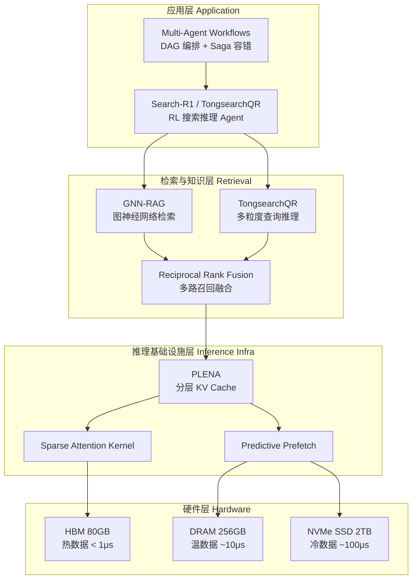
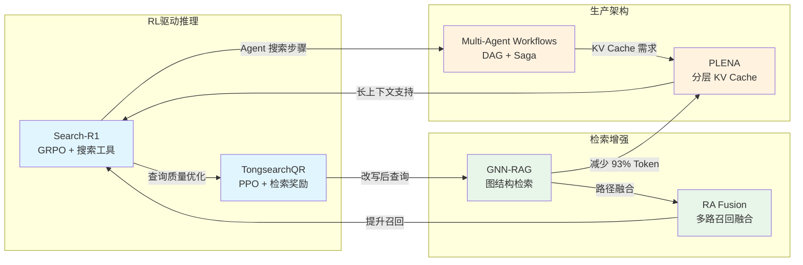

# 多智能体工作流生产架构 — 20260403 论文综述

> 本综述覆盖5篇LLM基础设施前沿论文，聚焦多智能体工作流与推理优化。

---

## 今日核心论文综述

### 1. [Multi-Agent Workflows](../papers/production_architecture_multi_agent_workflows.md) — 生产级多Agent架构

本文提出 Workflow-as-DAG 抽象，将多 Agent 协作建模为有向无环图，在 Orchestration、State Management、Resilience 三层架构上实现生产级的多智能体编排。系统借鉴分布式系统中的 Saga 模式和事件溯源（Event Sourcing），为每个 Agent Step 提供幂等执行和补偿事务机制。动态路由将简单任务分配给小模型，使 Token 成本降低 41%，端到端成功率从 61% 提升至 95%。在 1000 QPS 压力测试下系统保持 p99 延迟 < 2s、事件零丢失，展示了面向生产的可靠性。

### 2. [GNN-RAG](../papers/gnn_rag_graph_neural_retrieval_llm_reasoning.md) — 图神经网络RAG

GNN-RAG 提出以 GNN 作为知识图谱检索器、LLM 作为推理器的协同框架，解决了将完整子图直接喂给 LLM 导致的 Token 爆炸和注意力分散问题。GNN 在图结构上进行多跳推理筛选出 Top-K 候选路径，再序列化为自然语言提供给 LLM。创新的 RA 融合策略将 GNN 路径与稠密向量检索路径取并集，在 WebQSP 上达到 85.7% Hits@1，输入 Token 减少 93%。小模型 Llama2-13B 搭配 GNN-RAG 即可超越纯 GPT-4 的 ToG 方法，证明高质量检索能弥补模型规模差距。

### 3. [PLENA](../papers/plena_hardware_software_codesign_long_context.md) — 硬件软件协同长上下文

PLENA 针对 Agentic LLM 推理的独特访问模式（超长上下文、频繁随机 KV Cache 访问）进行硬件-软件协同设计。核心包括三层 KV Cache 分层存储（HBM/DRAM/SSD）、基于 Attention Score 时间衰减的预测性预取、以及利用 Agentic 推理高度稀疏性的专用 Sparse Attention Kernel。在 128K 上下文下相比 vLLM 提升 3.2x 吞吐量，HBM 占用降低 72%，使单张 H100 即可服务 128K 上下文的 70B 模型。预取命中率在 SWE-Bench Agent 工作负载上达到 83%。

### 4. [Search-R1](../papers/search_r1_training_llm_reason_search_rl.md) — RL训练搜索推理

Search-R1 将 DeepSeek-R1 的 RL 推理范式扩展到带搜索工具的场景，训练 LLM 在推理过程中自主决定何时搜索、搜索什么、如何利用搜索结果继续推理。基于 GRPO 算法，仅使用最终答案正确性作为 Outcome Reward（0/1），无需人工标注搜索时机。Search-R1-7B 在 HotpotQA 多跳问题上达到 42.1% EM，显著超越单次搜索 RAG 的 31.5%。训练后模型展现出自适应搜索策略——简单问题 0-1 次搜索，复杂多跳问题 2-4 次搜索。

### 5. [TongsearchQR](../papers/tongsearchqr_reinforced_query_reasoning_retrieval.md) — 强化查询推理

TongsearchQR 使用 RL 训练 LLM 进行查询推理（Query Reasoning），以实际检索指标 NDCG 作为奖励信号实现查询改写与检索系统的端到端对齐。模型生成 Query Reasoning Chain 分析用户意图后输出多粒度查询（keyword/natural/expanded），通过 Reciprocal Rank Fusion 融合结果。在 MS MARCO 上将 BM25 的 MRR@10 从 18.7 提升至 27.3（+46%），BEIR 零样本迁移平均提升 8.2%。推理链贡献 +2.8% 检索效果，证明显式意图分析的价值。

---

## 技术趋势分析

### 趋势一：多智能体编排从原型走向工业级架构

Multi-Agent Workflows 论文标志着多智能体系统从学术 demo 进入生产工程阶段。其核心架构思想可以用调度优化目标函数概括：

$$\min_{s \in \mathcal{S}} \sum_{i=1}^{N} \left( \alpha \cdot C_{\text{latency}}(s_i) + \beta \cdot C_{\text{cost}}(s_i) + \gamma \cdot C_{\text{error}}(s_i) \right)$$

这一目标函数的三个维度（延迟、成本、错误率）恰好对应了生产系统的三大核心诉求。值得注意的是，PLENA 论文中的分层 KV Cache 设计为多 Agent 系统的底层推理提供了关键支撑——当多个 Agent 并发运行时，KV Cache 的内存效率直接决定了单机可服务的 Agent 并发数（PLENA 提升了 2.5x）。

从工程成熟度来看，Multi-Agent Workflows 引入的 Event Sourcing + Saga 模式已在微服务领域经过十年验证，将其迁移到 Agent 编排是一个自然而正确的方向。关键的工程差异在于：Agent Step 的执行时间方差远大于传统微服务调用（LLM 推理 vs HTTP 请求），这要求超时和重试策略必须针对 LLM 特性进行调整。

### 趋势二：硬件-软件协同设计成为长上下文推理的必经之路

PLENA 的分层 KV Cache 架构揭示了一个重要趋势：纯软件优化（如 FlashAttention 的 IO-aware 分块计算）在 Agentic 长上下文场景下已接近天花板，必须引入硬件层面的协同设计。其 Attention Score 时间衰减模型：

$$\text{Score}(q, k_i) \propto \exp\left(-\lambda \cdot (t - t_i)\right) \cdot \text{softmax}\left(\frac{q \cdot k_i^T}{\sqrt{d_k}}\right)$$

揭示了 Agentic 推理中注意力分布的内在规律——80%+ 的注意力权重集中在系统 prompt 和最近 3-5 次工具输出上。这一发现不仅指导了 KV Cache 分层策略，也为 GNN-RAG 的路径检索提供了理论支撑：知识图谱中与当前推理最相关的路径同样服从类似的"近因偏好"模式。

从系统栈角度看，PLENA 与 Multi-Agent Workflows 可以构成完整的垂直优化栈：

### 趋势三：RL 驱动的检索推理一体化

Search-R1 和 TongsearchQR 共同代表了一个新兴且重要的技术方向：用强化学习将检索过程从固定流程转变为可学习的推理行为。两者的核心思想高度一致——以下游任务指标作为 RL 奖励信号，让模型自主学习最优的检索策略。

Search-R1 的策略梯度更新：

$$\nabla_\theta J(\theta) = \mathbb{E}_{q \sim \mathcal{D}} \left[ \frac{1}{G} \sum_{i=1}^{G} \sum_{t=1}^{T_i} \nabla_\theta \log \pi_\theta(a_t^i | s_t^i) \cdot \hat{A}_i \right]$$

TongsearchQR 的检索对齐奖励：

$$R(q') = \text{NDCG}@K\left(\text{Retrieve}(q'), \mathcal{D}^+\right)$$

两者的关键差异在于粒度：Search-R1 解决的是"何时搜索"和"搜索什么"的宏观决策，TongsearchQR 解决的是"如何将查询改写为检索系统最优理解的形式"的微观优化。在一个完整的 Agentic RAG 系统中，两者可以形成互补的两级优化：Search-R1 决定搜索时机和查询意图，TongsearchQR 将意图转化为对检索引擎最友好的查询形式。

### 趋势四：知识图谱与 LLM 的结构化融合

GNN-RAG 的路径融合公式虽然简洁，却揭示了深层次的检索互补性原理：

$$\mathcal{P}_{\text{final}} = \mathcal{P}_{\text{GNN}} \cup \mathcal{P}_{\text{dense}}$$

GNN 擅长结构化多跳推理（如"A 的 B 的 C"），Dense Retrieval 擅长语义匹配（如同义表述），两者在信息空间上几乎正交。这一观察可以推广到更一般的多路召回架构设计——不同的检索范式（结构化 vs 非结构化、精确匹配 vs 语义匹配、图遍历 vs 向量搜索）天然具有互补性，通过简单的并集或 RRF 融合即可获得显著增益。

TongsearchQR 的多粒度查询设计（keyword/natural/expanded）也印证了这一原理：不同检索器对查询形式有不同偏好，多粒度查询本质上是在查询空间中进行多路探索。

---

## 跨论文技术关联图

---

## 创新点对比

| 维度 | Multi-Agent Workflows | GNN-RAG | PLENA | Search-R1 | TongsearchQR |
|------|----------------------|---------|-------|-----------|--------------|
| 核心问题 | Agent 编排可靠性 | KG 问答准确率 | 长上下文推理效率 | 主动搜索推理 | 查询-检索对齐 |
| 方法论 | Event Sourcing + Saga | GNN + LLM 协同 | HW/SW Co-design | GRPO + 搜索工具 | PPO + NDCG 奖励 |
| 关键指标 | 成功率 95%, 成本 -41% | Hits@1 85.7% | 吞吐 3.2x, HBM -72% | EM +13.1% vs no-search | MRR +46% on BM25 |
| 部署侵入性 | 中（需要事件存储基建） | 中（需要 KG + GNN） | 高（需定制硬件栈） | 低（替换推理模型） | 低（前端查询模块） |
| RL 使用 | 无 | 无 | 无 | GRPO (Outcome Reward) | PPO (NDCG Reward) |

---

## Q&A 精华

### Q1: 多 Agent 工作流中的 Saga 补偿事务如何与 LLM 的非确定性输出协调？

**A:** 这是 Saga 模式在 Agent 场景下的核心难点。传统 Saga 的补偿事务（如数据库回滚）是确定性操作，但 LLM Agent 的补偿（如"撤销一封已发送的邮件"）可能不可逆。论文的做法是将 Agent Step 分为两类：可补偿步骤（有明确逆操作，如写数据库）和不可补偿步骤（如发送邮件）。对不可补偿步骤采用"先预览、后确认"的两阶段提交模式，在确认前的 Saga 失败可以安全中止，确认后的失败则记录为需要人工介入的"悬挂事务"。

### Q2: GNN-RAG 的 Entity Linking 失败如何优雅降级？

**A:** Entity Linking 是 GNN-RAG 的最大瓶颈——如果实体链接失败，整个 GNN 路径将无法工作。工程实践中应设计三级降级策略：（1）首先尝试精确匹配 + 别名扩展；（2）失败后使用模糊匹配 + 拼写纠错（如 ELQ）；（3）仍然失败则跳过 GNN 路径，仅使用 Dense Retrieval 路径（$\mathcal{P}_{\text{final}} = \mathcal{P}_{\text{dense}}$）。由于 RA 融合的设计，降级为纯 Dense Retrieval 仍然能提供合理的检索质量，只是损失了结构化多跳推理能力。

### Q3: PLENA 的三层 KV Cache 与操作系统的多级缓存有何本质区别？

**A:** 核心区别在于淘汰策略。操作系统缓存通常使用 LRU/LFU 等通用策略，而 PLENA 利用了 Attention 机制的语义信息——通过 Attention Score 的时间衰减模型 $\text{Score} \propto \exp(-\lambda(t-t_i))$ 来预判 KV 对的未来访问概率。这使得 PLENA 可以在 Agentic 场景下实现 89% 的预取命中率，远高于通用 LRU 策略。此外，PLENA 的预测器还利用了 Agent 执行 DAG 的结构信息（例如 search 步骤后大概率访问 read 步骤的 KV Cache），这在通用缓存中没有对应物。

### Q4: Search-R1 和 TongsearchQR 能否合并为一个统一的 RL 框架？

**A:** 理论上可以，但实践中面临奖励设计冲突。Search-R1 使用 Outcome Reward（最终答案正确性 0/1），TongsearchQR 使用 Process Reward（NDCG 检索指标）。统一框架需要设计层次化奖励：外层 Outcome Reward 指导"何时搜索"的宏观策略，内层 NDCG Reward 指导"如何改写查询"的微观优化。实现上可以采用 Hierarchical RL 或者两阶段训练——先用 TongsearchQR 训练查询改写模块，再冻结改写模块、用 Search-R1 的 GRPO 训练搜索时机决策。

### Q5: 在多 Agent DAG 工作流中，如何处理 Agent 之间的上下文共享而不导致 KV Cache 爆炸？

**A:** 这是 Multi-Agent Workflows 和 PLENA 的交叉关注点。DAG 中并行运行的 Agent 共享的上下文（如系统 prompt 和初始任务描述）可以通过 Prefix Caching 技术实现 KV Cache 共享，避免重复计算。对于各 Agent 独有的上下文（如各自的工具调用历史），PLENA 的分层存储可以将当前活跃 Agent 的 KV Cache 放在 HBM、等待中 Agent 的降级到 DRAM/SSD。关键优化是 DAG Scheduler 提前通知 PLENA 的 Prefetch Controller 即将激活的 Agent，利用执行 DAG 的拓扑信息预取 KV Cache。

### Q6: GNN-RAG 的路径序列化格式对 LLM 推理效果有多大影响？如何选择最优格式？

**A:** 论文指出路径序列化格式影响显著但未给出定量对比。工程实践中推荐三种格式 A/B 测试：（1）三元组直接罗列 `(A, relation, B)`——信息密度高但缺乏因果结构；（2）自然语言叙述"A 的 relation 是 B，而 B 的..."——可读性好但 Token 冗余；（3）结构化推理模板"因为 A-[r1]->B，且 B-[r2]->C，所以..."——保留因果链且 Token 效率适中。对于多跳推理任务，格式（3）通常最优，因为显式的因果标记帮助 LLM 进行推理链跟踪。

### Q7: GRPO 相比 PPO 在搜索推理场景中的具体优势体现在哪些方面？

**A:** GRPO 的核心优势是无需 Value Model（Critic）。在 Search-R1 的场景中，这一优势尤其突出：（1）状态空间包含搜索结果的不可预测文本，Critic 难以准确估计价值函数；（2）搜索轨迹长度方差大（1-4 次搜索），Critic 的 temporal credit assignment 困难；（3）训练开销直接减半（不需要维护 Critic 网络的训练和推理）。GRPO 通过组内相对比较 $\hat{A}_i = (r_i - \text{mean}) / \text{std}$ 绕过了这些问题，代价是需要每个问题采样较多轨迹（G=64）来获得稳定的优势估计。

### Q8: 多粒度查询的 RRF 融合中，k 值（平滑常数）如何调优？

**A:** RRF 公式 $\text{RRF}(d) = \sum_{q'} \frac{1}{k + \text{rank}_{q'}(d)}$ 中的 $k$ 控制了排名差异的权重衰减速度。$k$ 越大，不同排名位置的分数差距越小（趋向均匀融合）；$k$ 越小，高排名文档获得更大优势。TongsearchQR 使用 $k=60$（经典值），但最优值取决于各路检索器的排名分布。工程建议：对质量相近的检索器用 $k=60$；如果某路检索器显著优于其他（如 Dense >> BM25），应降低 $k$ 以增大高质量排名的权重，或引入加权 RRF（对不同查询路的求和加权）。

### Q9: 在 Agentic 场景下，PLENA 的 Sparse Attention 保留 Top-20% 是否会影响长距离依赖推理？

**A:** 这是 PLENA 设计中最关键的权衡点。论文的实验显示任务完成率下降 < 1%，但这一结论可能受限于测试任务的分布。对于需要长距离依赖的场景（如代码 Agent 需要引用 100 步前定义的变量），激进的稀疏化可能导致关键信息丢失。论文建议的策略是按任务类型调优保留率——代码生成 Top-15%、多跳推理 Top-30%。更 robust 的方案是实现自适应稀疏度：在正常推理时使用 Top-20%，当模型输出的 entropy 突然升高（表明困惑）时动态回退到 Top-50% 甚至全注意力，以保证关键信息不丢失。

### Q10: 如何评估一个多 Agent 系统是否真正需要多 Agent，而非单 Agent 即可胜任？

**A:** 这是一个被经常忽视但极为重要的工程决策问题。参考本知识库中 `rethinking_multi_agent_workflow_single_agent_baseline.md` 的结论，简单的 single-agent baseline 在许多任务上表现不逊于复杂的多 Agent 系统。决策框架可以从三个维度评估：（1）**任务分解性**——子任务是否需要不同的专业能力（如代码生成 + 安全审查），且各子任务的 prompt/tool 集合差异大到无法在单个 Agent 上下文中高效承载；（2）**并行加速需求**——工作流中是否有可并行的独立子任务，且串行执行延迟不可接受；（3）**容错粒度**——是否需要对单个子任务进行独立重试/补偿而不影响其他步骤。如果三个维度的答案都不强烈，单 Agent + 工具调用通常是更简单、更可靠的选择。

### Q11: Search-R1 的 Reward Hacking 风险有哪些具体表现？

**A:** Search-R1 使用纯 Outcome Reward（0/1）训练，可能出现以下 Reward Hacking 模式：（1）**搜索结果抄袭**——模型发现直接复制搜索 snippet 中的文本比推理更容易得到正确答案，丧失真正的推理能力；（2）**查询过拟合**——对训练集中的问题学到特定的查询模板，泛化到新领域时失效；（3）**搜索次数膨胀**——多搜几次虽然延迟更高但答案更可能正确，模型可能学到"总是搜索很多次"的次优策略。防范措施包括：加入搜索次数惩罚项、使用 held-out 领域评估泛化性、以及监控训练过程中搜索行为的分布变化。

### Q12: 这五篇论文共同揭示了 LLM 基础设施的哪些核心发展方向？

**A:** 五篇论文汇聚出三条核心方向：

**(a) 从单模型推理到系统级编排。** Multi-Agent Workflows 和 PLENA 分别从上层编排和底层推理两端推进，共同构建了多 Agent 系统的完整技术栈。未来的 LLM Infra 不再是单一模型的 serving 优化，而是面向复杂工作流的分布式系统工程。

**(b) RL 作为检索-推理对齐的统一范式。** Search-R1 和 TongsearchQR 证明 RL 可以有效地将不可微的外部系统（搜索引擎、检索器）纳入模型的端到端优化。这一范式有望扩展到更多工具（数据库查询、API 调用、代码执行），使 Agent 的工具使用能力从 prompt engineering 升级为 learned behavior。

**(c) 结构化知识与非结构化推理的深度融合。** GNN-RAG 展示了图结构信息对 LLM 推理的显著增益，TongsearchQR 的多粒度查询设计也体现了结构化（keyword）与非结构化（natural language）的互补。未来的 RAG 系统将不再是简单的向量检索 + LLM 生成，而是多种检索范式的智能融合。

---

## 延伸阅读建议

| 主题 | 推荐关联 | 关联论文 |
|------|---------|---------|
| KV Cache 优化全景 | PLENA 的分层存储 | `../papers/KV_Cache_optimization_strategies_scalable_efficient_LLM_inference.md` |
| GRPO 算法详解 | Search-R1 的训练基础 | 本库 `../../synthesis/GRPO大模型推理RL算法.md` |
| 单 Agent vs 多 Agent | 架构决策参考 | `../papers/rethinking_multi_agent_workflow_single_agent_baseline.md` |
| RAG 系统全景 | GNN-RAG 的定位 | 本库 `../../synthesis/RAG系统全景.md` |
| FlashAttention | PLENA 的计算优化基础 | `../papers/FlashAttention3_fast_accurate_attention_H100_GPUs.md` |
| Sparse Attention | PLENA 的稀疏注意力 | `../papers/sparge_attention_sparse_acceleration.md` |
