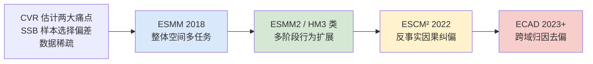
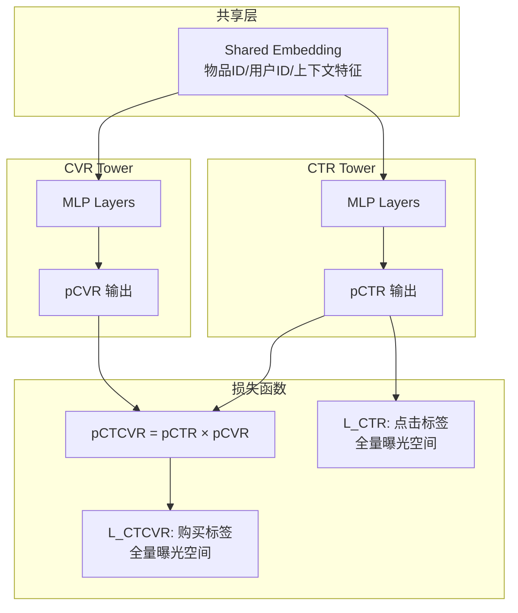
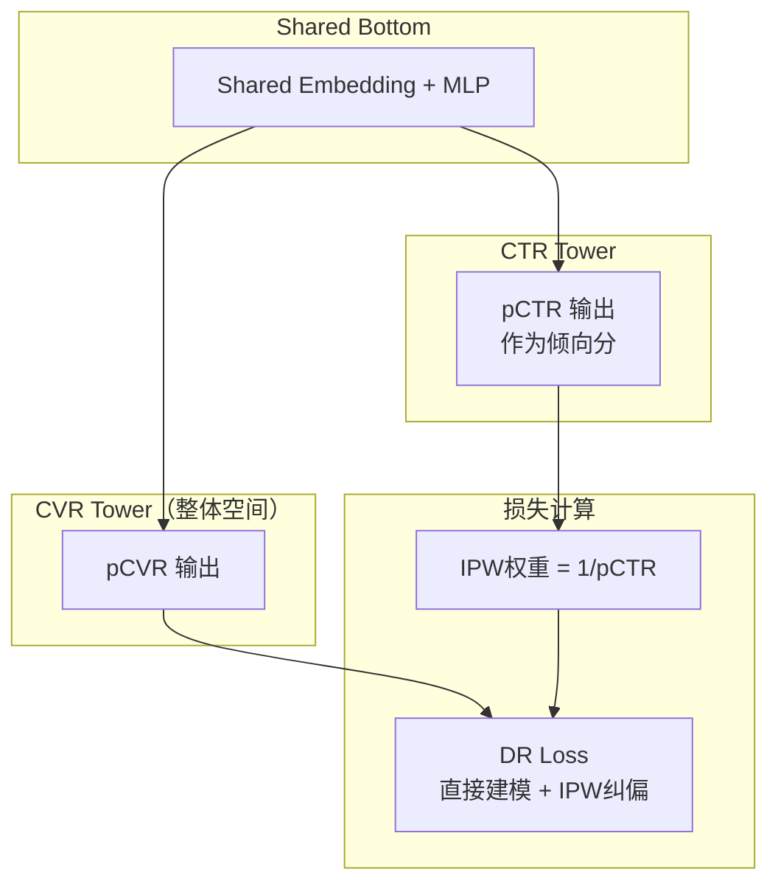
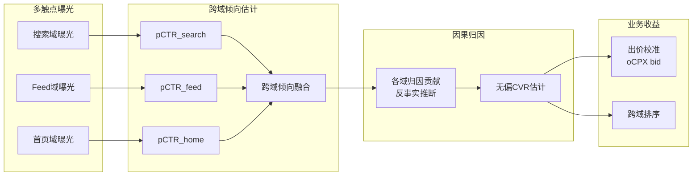
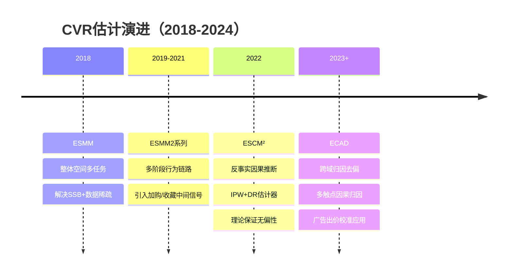

# ESMM 系列：CVR 估计从整体空间到因果推断

> **核心问题脉络**：CVR 估计的样本选择偏差（SSB）+ 数据稀疏 → ESMM 整体空间 → ESMM2 多阶段扩展 → ESCM² 因果纠偏 → ECAD 跨域归因去偏

## 架构总览



---

## 一、背景：CVR 估计的两大痛点

### 1. 样本选择偏差（SSB, Sample Selection Bias）

```
【训练空间】  曝光(impression) → 点击(click) → 转化(conversion)
                                  ↑
                    CVR 传统训练只在这里
【推理空间】  全量曝光（包含未点击的）
```

- 训练时：CVR 模型只见过**被点击的样本**（偏向于用户感兴趣的商品）
- 推理时：需要对**所有曝光商品**预测 CVR（包括用户没有点击的）
- 结果：**训练分布 ≠ 推理分布**，CVR 预估系统性偏高

### 2. 数据稀疏（Data Sparsity）

| 行为 | 数量级比例 | 信号强度 |
|------|-----------|---------|
| 曝光 | 1,000,000 | 弱（只是见过） |
| 点击 | 10,000 (1%) | 中（有兴趣） |
| 转化 | 200 (2%) | 强（有购买意愿） |

CVR 正样本极稀疏，直接训练泛化性极差。

---

## 二、ESMM（KDD 2018，阿里巴巴）

**论文**：Entire Space Multi-Task Model for Post-Click Conversion Rate Estimation

### 核心思想

将 CVR 建模问题转化为两个可在整体空间（entire impression space）观测的任务：

$$
p(\text{CTCVR}) = p(\text{CTR}) \times p(\text{CVR} | \text{CTR}=1)
$$

- $p(\text{CTCVR})$：用户**曝光后点击且转化**的概率，可在整个曝光空间观测
- $p(\text{CTR})$：用户**曝光后点击**的概率，可在整个曝光空间观测
- $p(\text{CVR})$：从上式推导，间接在整体空间训练

### 模型架构



### 损失函数

$$
\mathcal{L} = \underbrace{\sum_{i=1}^{N} \ell\!\left(y_i^{\text{CTR}}, f_{\text{CTR}}(x_i)\right)}_{\mathcal{L}_{\text{CTR}}\ (\text{全量曝光空间})} + \underbrace{\sum_{i=1}^{N} \ell\!\left(y_i^{\text{CTCVR}},\ f_{\text{CTR}}(x_i) \cdot f_{\text{CVR}}(x_i)\right)}_{\mathcal{L}_{\text{CTCVR}}\ (\text{全量曝光空间，间接约束 CVR})}
$$

其中 $N$ 是**全量曝光样本数**，不再只用点击样本。

**📐 ESMM 去偏的数学证明（为何 CTCVR 损失能约束全空间 CVR）：**

1. **传统 CVR 损失的偏差**：

$$
\mathcal{L}_{\text{naive-CVR}} = \frac{1}{|\mathcal{O}|}\sum_{i \in \mathcal{O}} \ell(y_i^{\text{CVR}}, f_{\text{CVR}}(x_i))
$$

期望：$\mathbb{E}[\mathcal{L}_{\text{naive-CVR}}] \propto \sum_i P(O_i = 1) \cdot \ell_i = \sum_i p_i^{\text{CTR}} \cdot \ell_i \neq \sum_i \ell_i$（有偏，高 CTR 样本被过度惩罚）

2. **ESMM 的 CTCVR 损失期望**：

$$
\mathbb{E}[\mathcal{L}_{\text{CTCVR}}] = \sum_{i=1}^N \mathbb{E}[\ell(y_i^{\text{CTCVR}}, p_i^{\text{CTR}} \cdot f_{\text{CVR}}(x_i))]
$$

$y_i^{\text{CTCVR}} = y_i^{\text{CTR}} \cdot y_i^{\text{CVR}}$，其中 $y_i^{\text{CTR}} \in \{0,1\}$ 在**全量曝光空间**都有标签（曝光样本：$y^{\text{CTR}}=1$ 当且仅当用户点击）。

3. **链式约束**：当 $f_{\text{CTR}}$ 收敛后（已用 $\mathcal{L}_{\text{CTR}}$ 约束），$\mathcal{L}_{\text{CTCVR}}$ 等价于对 $f_{\text{CVR}}$ 施加：

$$
\min_{f_{\text{CVR}}} \sum_{i=1}^N \ell(y_i^{\text{CVR}},\ f_{\text{CVR}}(x_i)) \cdot \underbrace{p_i^{\text{CTR}}}_{\text{曝光-点击权重}}
$$

即用 CTR 作为隐式权重，赋予不同曝光样本对 CVR 训练的贡献——全曝光空间的样本都参与了 CVR 的训练，只是贡献度由 CTR 加权。

**符号说明：**

| 符号 | 含义 |
|------|------|
| $\mathcal{O}$ | 点击样本集合（CVR 传统训练集）|
| $P(O_i = 1) = p_i^{\text{CTR}}$ | 样本 $i$ 被点击的概率（倾向分）|
| $y_i^{\text{CTCVR}}$ | 样本 $i$ 的 CTCVR 标签（=1 当且仅当点击且转化）|
| $f_{\text{CTR}}, f_{\text{CVR}}$ | CTR 子网和 CVR 子网的输出概率 |

### ESMM 的贡献与局限

**✅ 贡献**：
- 将 CVR 训练移到整体空间，消除了训练/推理空间不一致
- 共享 embedding 解决了数据稀疏问题（CTR 数据丰富，可迁移给 CVR）
- 多任务框架简洁有效，工业落地容易

**❌ 局限**：
1. **过强约束（Overconstrained）**：强制 $p(\text{CTCVR}) = p(\text{CTR}) \times p(\text{CVR})$ 是乘法分解，实际上点击和购买有因果关系而非独立
2. **伪标签问题**：未点击样本的 CVR 标签是 0（实际上是不可观测，不等于用户不想买）
3. **混淆因素**：用户点击后的页面浏览时长、商品详情等信息没有被利用

---

## 三、ESMM2 / 多阶段行为扩展

> 注：ESMM2 不是单一论文，指代这个方向的若干跟进工作（2019-2021），代表性的有阿里内部迭代和 HM3 等。

### 核心改进方向：多阶段用户行为建模

引入中间行为（比如：曝光 → 点击 → 加购 → 购买）：

$$
p(\text{购买}) = p(\text{点击}) \times p(\text{加购}|\text{点击}) \times p(\text{购买}|\text{加购})
$$

```mermaid
graph LR
    IMP[曝光] --> CLK[点击<br/>pCTR]
    CLK --> CART[加购/收藏<br/>pCART|CTR]
    CART --> BUY[购买<br/>pCVR|CART]

    subgraph "多任务塔"
        T1[CTR塔]
        T2[CART塔]
        T3[CVR塔]
    end

    subgraph "损失"
        L1[L_CTR 全空间]
        L2[L_CART 全空间<br/>pCTR × pCART]
        L3[L_BUY 全空间<br/>pCTR × pCART × pCVR]
    end
```

### 代表工作：STEM（随机两侧动量估计器）

提出了 **stochastic approach**：不强制 CVR = CTCVR / CTR，而是用随机抽样来估计无偏 CVR。

### 这一阶段的价值
- 引入中间信号（加购/收藏）缓解了数据稀疏
- 多阶段链路建模更接近用户决策过程
- 但**因果推断问题依然没解决**

---

## 四、ESCM²（SIGIR 2022，阿里巴巴）

**论文**：ESCM²: Entire Space Counterfactual Multi-Task Model for Post-Click Conversion Rate Estimation

### 关键洞察：ESMM 的根本问题是因果问题

```
用户行为因果链：
曝光 → [用户兴趣 + 页面质量 + 商品匹配] → 点击 → [商品质量 + 价格 + 信任] → 购买

ESMM 建模的是：  P(购买 | 曝光) = P(点击 | 曝光) × P(购买 | 点击, 曝光)
实际上这里有个混淆因素：影响点击的因素 ≠ 影响购买的因素
```

形式化为**反事实框架（Potential Outcomes）**：

$$
Y_{CVR}(1) = \text{如果点击，CVR 的结果（可观测，对已点击样本）}
$$

$$
Y_{CVR}(0) = \text{如果未点击，CVR 的结果（不可观测，反事实）}
$$

我们只能观测到 $Y_{CVR}(1)$（点击样本的 CVR），需要估计 $\mathbb{E}[Y_{CVR}(1)]$ 在全体样本上的期望。

### ESCM²-IPW：逆倾向加权

**思路**：对点击样本按照被点击的概率（倾向分）加权，模拟"如果所有样本都被点击"的反事实分布。

$$
\hat{\mathcal{L}}_{IPW} = \sum_{i: O_i=1} \frac{1}{p_i^{CTR}} \ell(y_i^{CVR}, f_{CVR}(x_i))
$$

其中 $O_i=1$ 表示第 $i$ 个样本被点击了，$p_i^{CTR}$ 是倾向分（倾向于被点击的概率）。

**直觉**：高 CTR 的样本（热门商品）被过度采样，用 $1/p^{CTR}$ 下调其权重；低 CTR 的样本（冷门商品）被欠采样，用 $1/p^{CTR}$ 上调其权重。

**与 ESMM 的关系**：ESMM 等价于 IPW 的一种近似（把 $1/p^{CTR}$ 建模为常数 1），因此 ESMM 有偏。

### ESCM²-DR：双重鲁棒估计器

结合**直接建模**和 **IPW**：

$$
\hat{\mathcal{L}}_{DR} = \underbrace{\sum_{i=1}^{N} \ell(y_i^{imputed}, f_{CVR}(x_i))}_{\text{全空间直接建模}} + \underbrace{\sum_{i: O_i=1} \frac{1}{p_i^{CTR}} \left(\ell(y_i^{CVR}, f_{CVR}(x_i)) - \ell(y_i^{imputed}, f_{CVR}(x_i))\right)}_{\text{IPW 纠偏项}}
$$

其中 $y_i^{imputed}$ 是用另一个模型预测的"填充标签"（imputed label）。

**DR 的优势**：
- 只要**两个模型中有一个是正确的**，估计就是无偏的（Double Robustness）
- 比纯 IPW 方差更小（IPW 在 $p^{CTR}$ 极小时方差爆炸）

### ESCM² 模型架构



### ESMM vs ESCM² 对比

| 维度 | ESMM | ESCM²-IPW | ESCM²-DR |
|------|------|-----------|-----------|
| 偏差 | 有偏（乘法分解假设） | 无偏（IPW 纠正） | 无偏（双重鲁棒） |
| 方差 | 低 | 较高（$p^{CTR}$ 极小时爆炸） | 低（DR 控制方差） |
| 实现复杂度 | 低 | 中 | 高 |
| 对小倾向分的鲁棒性 | 无问题 | 差 | 好 |
| 工业落地 | 广泛 | 部分落地 | 研究为主 |

---

## 五、ECAD（2023+，跨域归因去偏）

> ECAD: Entire-space Causal Attribution Debiasing（或相近命名）

### 动机：从单域到跨域

ESMM/ESCM² 解决了单域（如 Taobao 搜索）的 CVR 估计问题，但实际广告系统中：
- 用户可能在**多个平台/场景**曝光同一商品（搜索、Feed、首页推荐）
- 归因（Attribution）：一次购买到底应该归因给哪个触点？
- **跨域 SSB**：各域的点击率不同，直接合并训练会引入新的偏差

### ECAD 的核心贡献

**1. 跨域倾向估计（Cross-domain Propensity）**

不同域的用户行为分布差异显著：
- 搜索域：用户有明确购买意图，CTR 高，CVR 也高
- Feed 域：用户浏览状态，CTR 低，CVR 也低
- 直接合并：搜索域样本的 IPW 权重远小于 Feed 域，导致 Feed 域数据几乎无效

ECAD 为每个域单独估计倾向分，再跨域融合：

$$
p_{\text{cross}}^{CTR}(x) = \sum_{d \in \mathcal{D}} w_d \cdot p_d^{CTR}(x)
$$

**2. 因果归因（Causal Attribution）**

引入反事实推断解决多触点归因问题：

$$
\text{归因贡献}(d) = \mathbb{E}[\Delta \text{CVR}|\text{移除触点 } d]
$$

即：如果没有域 $d$ 的曝光，CVR 会下降多少？用 Do-Calculus 形式化：

$$
p(\text{CVR} | do(\text{不曝光于域} d)) = \sum_{x} p(\text{CVR} | x, T_d=0) p(x)
$$

**3. 去偏（Debiasing）目标**

在跨域 DR 框架下，联合优化所有域的 CVR 估计：

$$
\hat{\mathcal{L}}_{ECAD} = \sum_{d \in \mathcal{D}} \lambda_d \hat{\mathcal{L}}_{DR}^d + \mathcal{R}_{attribution}
$$



---

## 六、四代模型总结与面试要点

### 演进脉络一览



### 面试高频问题

**Q1：ESMM 如何解决 CVR 的样本选择偏差？**

> 答：ESMM 的核心是将 CVR 训练从"点击空间"移到"整体曝光空间"。通过分解 $p(CTCVR) = p(CTR) \times p(CVR)$，利用 CTCVR 标签（曝光→购买，全空间可观测）和 CTR 标签（曝光→点击，全空间可观测）作为监督信号，CVR 塔的梯度通过 CTCVR 路径传播，间接获得全空间训练信号。同时共享 embedding 将 CTR 的丰富信号迁移给数据稀疏的 CVR 塔。

**Q2：ESMM 的局限是什么？ESCM² 如何改进？**

> 答：ESMM 的根本问题是**乘法分解假设过强**——它假设 $P(CTCVR) = P(CTR) \times P(CVR)$ 严格成立，即点击和购买独立，但实际上点击是购买的前置因果条件（混淆因素不同）。ESCM² 用反事实框架形式化这个问题，引入 IPW（逆倾向加权）用点击率的倒数重新加权训练样本，理论上可以给出无偏的 CVR 估计。进一步的 DR 估计器结合了直接建模和 IPW，在倾向分极小时更鲁棒（双重鲁棒性：两个子模型只要一个对就无偏）。

**Q3：什么是双重鲁棒（Double Robustness）？**

> 答：DR 估计器 $\hat{L}_{DR} = \hat{L}_{DM} + IPW \cdot \text{残差}$，其中 DM 是直接建模，IPW 是倾向加权的残差修正。只要以下两个条件之一成立，整体估计就是无偏的：①直接建模模型 $f_{CVR}$ 是正确的；②倾向估计模型 $p^{CTR}$ 是正确的。这给了系统两道防线，比纯 IPW（只有一道防线）更健壮。

**Q4：工业落地时 ESMM vs ESCM²，选哪个？**

> 答：要看系统阶段。ESMM 实现简单、工程风险低、实验结果可控，是大多数中小系统的首选。ESCM² 需要精确估计倾向分，而倾向分的质量直接影响 IPW 效果（倾向分估计有偏，IPW 反而更差）。工业落地时通常先上 ESMM，验证链路后再做 ESCM² 的增量实验，且往往用 DR 而不是纯 IPW（方差更小）。

**Q5：ECAD 解决什么新问题？**

> 答：解决**多域（multi-domain）广告系统中的跨域归因去偏**。同一商品在搜索、Feed、首页等多个场景曝光，不同场景的用户意图和点击率差异巨大，直接合并训练会引入新偏差。ECAD 为每域单独估计倾向分后融合，并引入反事实归因解决"这次购买应该归因于哪个触点"的问题，最终应用于多域出价校准（oCPX bid）。

**Q6：如何在 serving 层使用 ESMM 的输出？**

> 答：
> - **CVR 排序**：直接用 pCVR 输出（整体空间训练，可直接用于排序）
> - **CTCVR 排序**：用 pCTR × pCVR，用于 oCPM 场景（平台收曝光费，需要估计用户购买概率）
> - **oCPC 出价**：bid = CPA_target × pCVR，其中 pCVR 来自 ESMM 的 CVR 塔
> - 注意：pCVR 的**绝对值校准**很重要（ESMM 输出的是相对排序，绝对值可能偏）

---

## 七、与其他技术的关联

### ESMM 与多任务学习（MTL）

ESMM 是 MTL 的特例，其特殊性在于：
- 任务之间有**乘法关系**而非独立任务
- 监督信号来自**不同粒度的行为**（曝光/点击/购买）
- 和 MMOE/PLE 的区别：后者是通用 MTL 框架，ESMM 是针对 CVR 问题的专有设计

### ESMM 与 Uplift Modeling 的关系

| 维度 | ESMM 系列 | Uplift Modeling |
|------|-----------|-----------------|
| 问题 | CVR 估计的偏差 | 因果增量效果估计 |
| 目标 | 无偏 $P(Y|X)$ | $P(Y=1|T=1,X) - P(Y=1|T=0,X)$ |
| 技术 | 整体空间 + IPW/DR | DML/Meta-learner/Uplift树 |
| 应用 | CTR/CVR 排序 | 优惠券发放、广告投放决策 |

ESCM² 的 DR 估计器和 Uplift 的 DR 估计器在数学形式上类似，核心都是反事实推断。

---

## 八、推荐阅读顺序

1. **ESMM 论文**（KDD 2018）：先理解问题设定和整体空间思路
2. **ESCM² 论文**（SIGIR 2022）：理解 IPW/DR 的数学推导
3. **因果推断基础**：Rubin 潜在结果框架，Pearl Do-Calculus
4. **本知识库**：`推荐系统因果推断.md`（广义因果背景）、`广告CTR_CVR预估与校准.md`（工程实践）

---

*最后更新：2026-03-29 | 来源：技术学习整理*


## 📐 核心公式直观理解

### ESMM 整体空间建模

$$
P(\text{CVR}) = \frac{P(\text{CTCVR})}{P(\text{CTR})}
$$

**直观理解**：CVR 的训练样本只有点击用户（有偏子集），但 CTCVR 和 CTR 都可以在全部曝光样本上训练。通过乘法关系间接学 CVR，巧妙绕过了样本选择偏差——不在有偏的"点击用户"子集上训练，而在"全部用户"空间上训练。

### ESCM² 的 IPW（逆概率加权）去偏

$$
\hat{\mathcal{L}}_{\text{IPW}} = \frac{1}{N}\sum_{i: O_i=1} \frac{\ell(\hat{y}_i, y_i)}{\hat{e}(x_i)}
$$

- $O_i$：样本 $i$ 是否被观测到（点击=1）
- $\hat{e}(x_i)$：被观测到的概率（倾向性得分）

**直观理解**：高 CTR 用户更容易被"观测到"（点击了才有 CVR 标签），导致训练数据偏向高活用户。IPW 通过给"不太可能被观测到但确实被观测到"的样本加大权重，还原真实分布——类似调查统计中的"加权回归"。

### DR（双重稳健）估计器

$$
\hat{\theta}_{\text{DR}} = \hat{\mu}(x) + \frac{O \cdot (Y - \hat{\mu}(x))}{\hat{e}(x)}
$$

**直观理解**：DR 同时用 outcome 模型 $\hat{\mu}$ 和 propensity 模型 $\hat{e}$ 做估计——只要其中一个是对的，结果就是无偏的。就像"两道防线"——即使一个模型犯错，另一个模型能兜住。这是 ESCM² 比 ESMM 更先进的核心原因。

