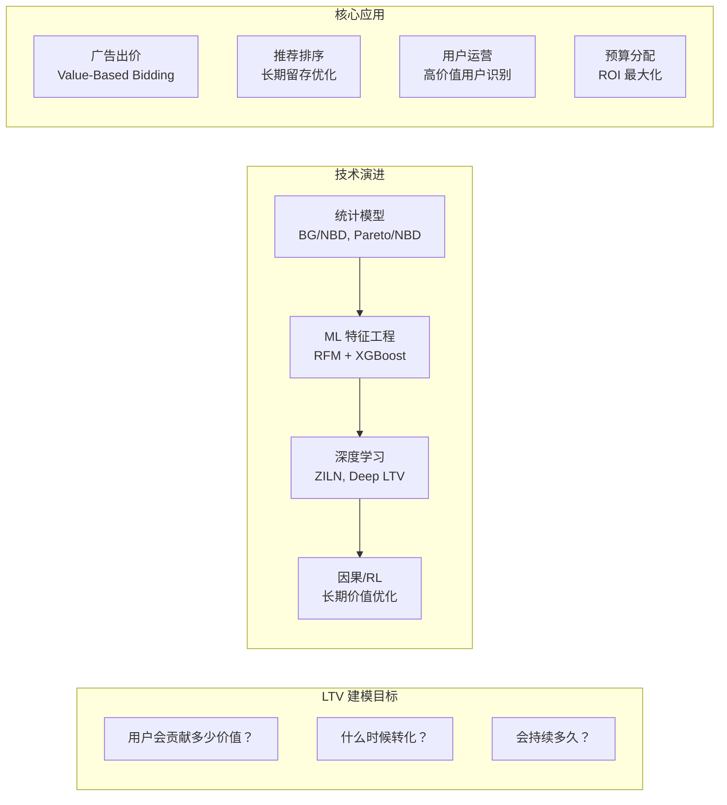
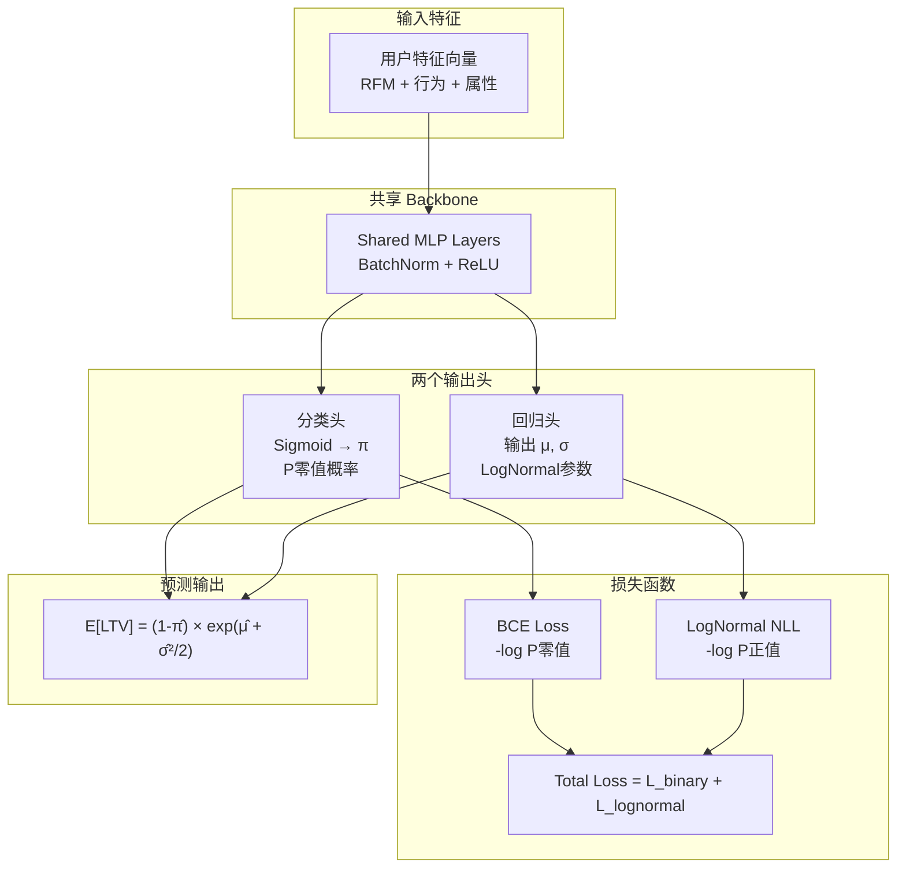
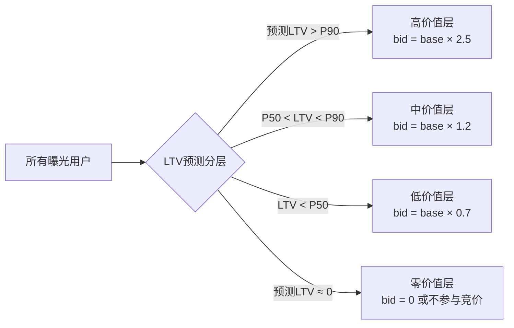

# LTV 预测：技术演进与工业实践全景

> **LTV（Lifetime Value，用户生命周期价值）** 是预测一个用户在未来一段时间内能为平台带来的总价值。本文系统梳理其建模用例、分布挑战、技术演进（统计 → ML → 深度学习 ZILN → 因果建模）及工业落地。

## 架构总览



---

## 一、为什么 LTV 预测困难？——分布挑战

### 1.1 LTV 分布的三大特征

真实场景下的 LTV 分布（以电商为例）：

```
用户数量
  ^
  │████                      ← 大量零值用户（注册但从未购买）
  │ ████
  │   ██
  │    ██
  │     ███
  │       █████████__________
  └──────────────────────────→ LTV 金额
  0   100  500  1000  5000+
```

**特征 1：零膨胀（Zero-Inflated）**
- 70-90% 的用户 LTV = 0（从未产生过购买）
- 不能用普通回归——预测值会被大量零值拖向负数

**特征 2：右偏重尾（Heavy-Tailed）**
- 少量高价值用户（头部 5%）贡献了 50-80% 的总收入
- 普通 MSE 损失会忽视高价值用户（稀少，但重要）

**特征 3：非负约束**
- LTV 不能为负数，但 Linear Regression 没有这个约束

### 1.2 为什么不能直接用标准回归？

| 方法 | 问题 |
|------|------|
| 线性回归 | 忽视零膨胀，预测可为负 |
| Log 变换后回归 | log(0) 无定义 |
| 分类问题（高/中/低）| 信息损失，无法用于出价计算 |
| 普通 Poisson 回归 | 只适合计数数据，不适合连续金额 |

---

## 二、主要业务用例

### 2.1 游戏行业：玩家 LTV 预测

**场景**：手游（Candy Crush、王者荣耀类）预测玩家首日/7日内付费金额

- **输入**：登录频次、关卡进度速度、社交行为（加好友/组队）、设备型号
- **目标**：预测玩家 30/90/180 天总消费
- **用途**：
  - UA（User Acquisition）出价：`max bid = predicted LTV × margin`
  - 差异化运营：对高 LTV 玩家推送高价值道具，低 LTV 玩家推送低价位入门包
  - 防流失：识别高价值玩家的流失预警

**难点**：早期信号极度稀疏，用户只玩了几小时就需要预估未来半年的价值。

### 2.2 电商：GMV/CLV 预测

**场景**：淘宝/京东/亚马逊预测用户未来购买金额

- **输入**：RFM 特征（Recency 最近购买、Frequency 购买频次、Monetary 历史消费金额）+ 品类偏好 + 价格敏感度
- **目标**：预测未来 12 个月 GMV
- **用途**：
  - 优惠券策略：高 LTV 用户不需要大额优惠券，低 LTV 用户才需要刺激
  - 广告出价：对高 LTV 用户的再营销出价更高（ROAS 更好）
  - 推荐个性化：品质/高客单价商品优先推给高 LTV 用户

### 2.3 订阅制业务：留存周期预测

**场景**：Netflix/Spotify/会员订阅，预测用户订阅多少个月

- **统计模型最适合**（contractual 场景，可观测到订阅终止事件）
- BG/NBD 类模型专门为此设计
- 重点在于建模**流失概率**随时间的演化

### 2.4 广告主 LTV：新广告主价值预测

**场景**：Google Ads/Facebook Ads 预测新开户广告主未来 12 个月的广告消费

- **输入**：账户设置偏好、首次充值金额、行业类别、目标设置
- **目标**：预测广告主 LTV（而非用户 LTV）
- **用途**：确定销售资源分配，对高 LTV 广告主提供专属客服

### 2.5 广告投放：LTV 导向的 Value-Based Bidding

**最重要的应用场景**：

传统 CPA 出价：每次转化出价相同
```
bid = CPA_target × pCVR
```

LTV 出价：按用户价值差异化出价
```
bid = target_ROAS × predicted_LTV × pCVR
```

Google tROAS（Target Return on Ad Spend）就是典型实现，需要广告主回传每次转化的价值（可以是实际成交额，也可以是预测 LTV）。

---

## 三、技术演进路线

### 阶段 1：统计模型（2000s-2010s）

#### BG/NBD 模型（Beta-Geometric / Negative Binomial Distribution）

**适用场景**：非合同制业务（用户可随时停止购买，但不会显式"取消"）

**核心假设**：
- 每个用户活跃期间，购买行为服从参数为 $\lambda$ 的 Poisson 过程
- 每次购买后，用户以概率 $p$ 流失（几何分布）
- 用户间的 $\lambda$ 服从 Gamma 分布，$p$ 服从 Beta 分布

**预测公式**：

$$
E[\text{购买次数} | T, x] = \frac{a}{b+a} \cdot \left(1 - \left(\frac{b+T}{b+T+t}\right)^{r+x} \cdot \frac{B(a+1, b+r+x)}{B(a, b+r+x)}\right)
$$

**优点**：可解释，不需要深度学习，适合小数据

**缺点**：假设太强，无法利用用户特征（只用 RFM 历史行为）

#### Pareto/NBD 模型

类似 BG/NBD，但流失时间用 Pareto（指数分布）建模而非几何分布，更灵活。

---

### 阶段 2：ML 特征工程（2015-2018）

**典型方案**：RFM 特征 + XGBoost/LightGBM 回归

**特征工程**：

| 特征类别 | 具体特征 |
|---------|---------|
| RFM | 最近购买距今天数、30/90天购买次数、历史总消费金额 |
| 行为序列 | 品类偏好分布、价格带偏好、购买时段分布 |
| 用户属性 | 城市等级、年龄段、会员等级 |
| 外部信号 | 设备类型（iOS LTV > Android）、渠道来源 |

**处理零膨胀的 trick**：
- 两阶段模型：先用分类器预测是否转化，再用回归预测金额
- Log1p 变换：`log(1 + LTV)` 规避 log(0) 问题
- Quantile Regression：预测 P50/P90/P99，不被极端值干扰

---

### 阶段 3：深度学习 — ZILN（2019，Google）

#### 📄 核心论文

**"A Flexible Framework for Predicting Revenue"**（Google, KDD 2019）  
*Sai Vemuri, et al.*，又称 **ZILN（Zero-Inflated Log-Normal）**

#### 核心思想

将 LTV 分布显式建模为**两部分的混合**：

$$
P(Y = y) = \begin{cases} \pi & \text{if } y = 0 \\ (1-\pi) \cdot \text{LogNormal}(y; \mu, \sigma^2) & \text{if } y > 0 \end{cases}
$$

其中：
- $\pi = P(Y = 0)$：用户不转化的概率（零膨胀部分）
- $\text{LogNormal}(\mu, \sigma^2)$：转化用户的 LTV 分布（对数正态分布）

#### 为什么是 Log-Normal？

对数正态分布有几个很好的性质适合 LTV：
1. **非负**：$Y = e^Z$，$Z \sim \mathcal{N}(\mu, \sigma^2)$，所以 $Y > 0$ 永远成立
2. **右偏重尾**：和实际 LTV 分布形状吻合
3. **参数可解释**：$\mu$ 控制中位数，$\sigma$ 控制分布宽度（不确定性）

**期望值**：

$$
E[Y | Y > 0] = \exp\left(\mu + \frac{\sigma^2}{2}\right)
$$

#### 模型架构



#### 损失函数详解

$$
\mathcal{L} = \underbrace{-\sum_i \left[y_i^{>0} \log(1-\hat{\pi}_i) + y_i^{=0} \log \hat{\pi}_i\right]}_{\text{Binary CE（是否转化）}} - \underbrace{\sum_{i: y_i > 0} \log \phi\left(\frac{\log y_i - \hat{\mu}_i}{\hat{\sigma}_i}\right)}_{\text{LogNormal NLL（转化金额）}}
$$

其中 $\phi$ 是标准正态分布的 PDF。

#### ZILN 的输出如何使用？

```
推理时输出三个值：
  π̂     → 转化概率（可用于 CTR/CVR 类排序）
  μ̂     → 转化金额的对数期望
  σ̂     → 不确定性（置信区间 = exp(μ̂ ± 1.96 σ̂)）

LTV点估计：
  E[LTV] = (1 - π̂) × exp(μ̂ + σ̂²/2)

广告出价：
  bid = target_ROAS × E[LTV]
```

#### ZILN 与传统方法对比

| 维度 | 两阶段模型 | ZILN |
|------|-----------|------|
| 零膨胀处理 | 独立训练分类器 | 联合建模，梯度共享 |
| 端到端优化 | ❌ 两个模型误差累积 | ✅ 单一损失函数 |
| 不确定性 | ❌ 点估计 | ✅ 给出分布参数 σ |
| 分布假设 | 无 | Log-Normal（可替换为 Weibull） |
| 工程复杂度 | 低 | 中 |

---

### 阶段 3.5：Tweedie 分布——ZILN 的替代方案

**Tweedie 分布** 是 Zero-Inflated Log-Normal 的另一种自然选择：

$$
\text{Var}(Y) = \phi \cdot E[Y]^p, \quad p \in (1, 2)
$$

当 $p \in (1, 2)$，Tweedie 分布自然产生零膨胀的右偏分布：
- $p = 1$：Poisson（纯计数）
- $p = 2$：Gamma（连续正值）
- $p \in (1, 2)$：**复合 Poisson-Gamma**，天然零膨胀！

**使用场景对比**：
| 场景 | 推荐分布 |
|------|---------|
| LTV 分布已知接近 Log-Normal | ZILN |
| 不确定分布，需要自动拟合零膨胀 | Tweedie（$p$ 可学习）|
| 保险索赔金额建模 | Tweedie（行业标准）|
| LTV 极端右偏（游戏氪金） | Weibull 或 Pareto |

---

### 阶段 4：深度学习扩展——Deep LTV & 序列建模

#### Snap 的 Deep LTV（2021）

多任务深度学习，同时预测多个时间窗口的 LTV：

```
输出头：
  - LTV_7d（7天消费）
  - LTV_30d（30天消费）
  - LTV_90d（90天消费）
  - LTV_churn（流失概率）

损失：
  L = Σ_t w_t × ZILN_loss(LTV_t) + w_churn × BCE_loss(churn)
```

**多时间窗口的好处**：
- 早期信号（7d）监督信号多，有助于学习短期行为模式
- 远期预测（90d）是真实目标，用早期窗口作为辅助任务提升泛化
- 自动学习"早期行为 → 长期价值"的映射

#### 用户序列行为建模（DIN/HSTU for LTV）

不只用统计特征，而是用原始行为序列：

```
输入序列：[商品A购买$50, 商品B浏览, 商品C购买$200, ...]
↓ Transformer/LSTM
用户价值表示向量
↓
ZILN 预测头 → E[LTV]
```

**优势**：能捕捉用户价值变化趋势（上升型用户 vs 下降型用户）

---

### 阶段 5：长期价值优化——RL 与因果建模

#### 推荐系统的"长视野"问题

传统推荐系统优化短期 CTR，但最优化 LTV 需要考虑：

```
今天推送高转化低满意度内容
→ 短期 CTR 高
→ 用户满意度下降
→ 7天后流失
→ LTV 损失

优化 LTV 需要长期 reward 建模
```

#### 基于 RL 的 LTV 优化

将推荐序列决策建模为 MDP：

$$
s_t = \text{用户状态（历史行为 + 当前上下文）}
$$

$$
a_t = \text{推荐的 item}
$$

$$
r_t = \text{即时反馈（点击/购买）}
$$

$$
R_{\text{total}} = \sum_{t=0}^{T} \gamma^t r_t \approx \text{LTV}
$$

**工业代表**：YouTube 的 "long-term satisfaction" 信号（与完播率/点赞加权组合）

#### 代理指标（Proxy Label）的设计

真实 LTV 需要等待很长时间才可观测，工程上使用代理指标：

| 代理指标 | 相关性 | 延迟 |
|---------|-------|------|
| 7日回访次数 | 高 | 7天 |
| 首次购买客单价 | 中 | 即时 |
| 会员等级晋升 | 高 | 30天 |
| 分享/评价次数 | 中 | 即时 |
| N日留存率 | 高 | N天 |

---

## 四、Proxy Label 与 Label Delay 问题

### 4.1 延迟归因挑战

LTV 观测的时间窗越长越准，但：
- **训练延迟**：需要等 90 天才能拿到"真实" 90d LTV 标签
- **模型陈旧**：3个月前的特征分布可能已偏移
- **冷启动**：新用户无历史，只能靠注册行为推测

### 4.2 分段训练策略

```
阶段 1（即时）：训练首购转化模型（CTR/CVR）
阶段 2（7天）：用 7d LTV 代理标签微调
阶段 3（30天）：用 30d 真实 LTV 校准

线上服务：三个模型加权融合
E[LTV_90d] ≈ α × LTV_7d_pred + β × LTV_30d_pred + 校正因子
```

### 4.3 Calibration（校准）

ZILN 输出的 E[LTV] 通常需要后处理校准：

$$
\text{calibrated}}_{\text{{\text{LTV}}} = f(\hat{\mu}, \hat{\sigma}, \hat{\pi}, \text{用户分层})
$$

常见方法：
- **Isotonic Regression** 保序校准
- 分桶校准（将用户按预测值分桶，校正每桶的系统偏差）
- **Temperature Scaling**（借用 NLP 的置信度校准方法）

---

## 五、LTV 在广告出价中的应用

### 5.1 Google tROAS（Target ROAS）

```
传统 tCPA（目标每次获客成本）：
  bid = CPA_target × pConversion

tROAS（目标 ROAS 出价）：
  bid = revenue_target / ROAS_target
       = E[LTV] / tROAS
```

广告主需要在转化回传时附带每次转化的**价值**（可以是实际成交额，也可以是预测 LTV）。Google 内部用 ZILN 类模型估计没有回传价值的转化事件的 LTV。

### 5.2 Meta 的 Value Optimization（VO）

Meta 允许广告主上传用户价值信号（LTV 分层），广告系统学习一个"价值感知"的用户评分，优先把广告投给预测高价值的用户。

```
VO 出价 = w × pCVR × predicted_value
         = w × pCTCVR × E[LTV | converted]
```

### 5.3 差异化出价（Bid Differentiation）

按 LTV 分层差异化出价策略：



---

## 六、冷启动：新用户 LTV 预测

### 6.1 问题

新用户没有历史行为，RFM 特征全为空，传统模型完全失效。

### 6.2 常用方案

**方案 A：注册行为特征**

```
注册来源（自然搜索/付费广告/社交裂变）
注册设备（iPhone 14 Pro > iPhone SE > Android）
注册地区（一线城市 > 新线城市）
注册时段（晚上 8-10 点高意图）
首次访问深度（浏览页面数量）
```

**方案 B：用户相似度（User Analogy）**

找到历史用户中与新用户注册行为最相似的 Top-K 用户，用他们的实际 LTV 加权平均作为新用户估计。

**方案 C：Early Signal 快速更新**

新用户注册后的前 24/48/72 小时行为信号是 LTV 的强预测器：

```
特征：首日访问次数、首日停留时长、首日是否有购买意向行为
→ 快速更新 LTV 预测（每小时刷新一次）
→ 前 3 天的预测误差比纯注册特征降低 40-60%
```

---

## 七、工程落地要点

### 7.1 训练数据构建

```
1. 采样窗口：  [T-180d, T-30d] 的用户作为训练样本
   观测窗口：  T-30d 到 T 的 LTV 作为标签（30天LTV）
   预测窗口：  T 之后用于在线推理

2. 正负样本比例：
   零值用户（LTV=0）：通常占 80%+ → 无需下采样（ZILN 原生处理）
   高值用户（LTV > P95）：可适当上采样 × 3-5（重要性采样）

3. 截断处理：
   P99 截断防止极端值主导训练
   例：LTV > 10000 截断为 10000
```

### 7.2 特征重要性（通用规律）

| 排名 | 特征 | 重要性 |
|------|------|-------|
| 1 | 历史消费金额（Monetary） | ⭐⭐⭐⭐⭐ |
| 2 | 历史购买频次（Frequency） | ⭐⭐⭐⭐⭐ |
| 3 | 最近购买距今（Recency） | ⭐⭐⭐⭐ |
| 4 | 设备类型 | ⭐⭐⭐ |
| 5 | 用户城市等级 | ⭐⭐⭐ |
| 6 | 品类偏好 | ⭐⭐ |
| 7 | 渠道来源 | ⭐⭐ |

### 7.3 线上服务

```
离线阶段：
  每日批量预测 → 写入 Redis/Hive LTV 分层表
  新用户：实时预测（< 100ms）

在线阶段：
  出价系统：查询 Redis 获取用户 LTV 分层 → 调整出价倍率
  推荐系统：LTV 作为排序特征之一（连续值或分桶 Embedding）
```

---

## 八、面试高频问题与答案

**Q1：LTV 预测为什么要用 Zero-Inflated 模型，不能直接用回归吗？**

> 答：LTV 分布是典型的零膨胀重尾分布——70-90% 的用户 LTV 为零（从未购买），剩余用户的消费金额又呈右偏对数正态分布。直接用线性回归的问题：①大量零值会让模型"学会"预测很小的值，而非真正的零；②误差指标（MSE）对高价值用户不够敏感，预测出的均值被零值拖低。ZILN 把零和正值分开建模：一个头预测是否会购买（Binary CE），一个头预测购买金额的对数正态参数，联合端到端训练，梯度共享，比独立两阶段模型效果更好。

**Q2：ZILN 中 σ（标准差）参数有什么用？**

> 答：σ 表示**预测的不确定性**。同等 μ 的两个用户，σ 大的用户 LTV 预测置信度低（比如新用户、行为稀疏用户）。工业上 σ 的用途：①风险控制：σ 大的用户谨慎出价，σ 小的用户激进出价；②出价公式可以用悲观估计 `exp(μ - β×σ)` 而非均值出价，对不确定性高的用户保守；③用于探索-利用权衡（UCB 类出价策略）。

**Q3：LTV 标签有延迟，怎么在实时系统中使用？**

> 答：三个思路。①**代理标签**：用短期可观测的指标（7日回访、首购金额）作为代理，与真实 LTV 相关但延迟短；②**多任务学习**：同时训练 7d/30d/90d LTV 预测，早期窗口提供频繁监督信号，远期窗口是真实目标；③**标签异步回填**：用流式系统（Flink）持续收集用户行为，每天批量回填最新 LTV 标签，模型按周/月更新。关键是要做好**training/serving 时间对齐**：训练时用 T-90d 到 T-30d 的特征预测 T-30d 到 T 的 LTV，推理时特征时间窗同样保持一致。

**Q4：LTV 在广告出价中如何应用？给出具体公式。**

> 答：
> - **tCPA 升级为 tROAS 出价**：`bid = E[LTV] / tROAS`，E[LTV] 由 ZILN 模型输出
> - **分层差异化出价**：`bid = base_bid × LTV_multiplier(segment)`，高 LTV 用户出价倍率 2-3x，低 LTV 用户 0.5-0.7x，零价值用户不参竞
> - **Meta Value Optimization**：转化信号中附带 LTV 价值，广告系统学习"价值感知"用户打分，优化总 LTV 而非转化次数
> 注意：LTV 出价需要定期重新校准，因为用户行为分布会随时间变化（concept drift）。

**Q5：如何评估 LTV 预测模型的好坏？**

> 答：
> - **分布评估**：用 Gini 系数评估模型是否能区分高/低价值用户，而非点预测 MSE（因为 LTV 零膨胀，MSE 会被大量准确的"零预测"拉高）
> - **分段 MSE/MAE**：分别计算零值用户（二分类准确率）和正值用户（回归误差）
> - **NDCG 式评估**：按真实 LTV 排序，看模型预测排序是否一致
> - **在线 A/B**：最终看 LTV 出价策略上线后，广告主 ROAS 是否改善，或用户运营中高价值用户识别的召回率/精确率

**Q6：ZILN vs Tweedie，什么时候选哪个？**

> 答：两者都是处理零膨胀右偏分布的方案，核心差异：ZILN 显式分离"零/非零"和"金额"两个子问题，解释性强，适合你能明确说明"零值有特定业务含义"的场景（如 LTV=0 代表用户从未购买）；Tweedie 是统一分布，用一个参数 $p$ 自动调节零膨胀程度，无需显式分离，实现更简单，在 LightGBM/XGBoost 中有原生支持。实践建议：特征工程 + LightGBM 的快速 baseline 用 Tweedie 损失；深度学习模型用 ZILN（更灵活，能同时输出不确定性）。

---

## 九、相关知识图谱

| 技术 | 关联 | 位置 |
|------|------|------|
| ESMM/ESCM² | CVR 估计的偏差，LTV 中也有类似 SSB 问题 | `ads/02_rank/synthesis/ESMM系列CVR估计演进.md` |
| Uplift Modeling | LTV 的因果增量版（"用优惠券后 LTV 增量"） | `rec-search-ads/rec-sys/04_multi-task/synthesis/推荐系统因果推断.md` |
| AutoBidding | LTV 是 AutoBidding 中 value 信号的来源 | `ads/04_bidding/synthesis/AutoBidding技术演进.md` |
| 长期价值推荐 | RL 为 LTV 优化的排序扩展 | `rec-sys/04_multi-task/papers/Long_term_Value_Prediction_Framework_in_Video_Ranking.md` |

---

*最后更新：2026-03-31 | 文件路径：rec-search-ads/ads/02_rank/synthesis/LTV预测技术演进与工业实践.md*
