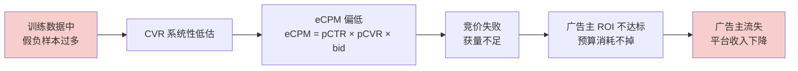

# 延迟转化预估处理方案：从归因窗口到生存分析的全链路

#延迟转化 #CVR预估 #DelayedFeedback #生存分析 #广告系统

> 📚 参考文献
> - [[ocpc_ocpa_deep|oCPC/oCPA 深度解析]] — §3.3 延迟转化问题
> - [[CPM_CPC_CPA_oCPM|广告计费模式全景]] — §1.3 归因窗口 & §考点5
> - [[ocpc_ocpa_optimization|oCPC/oCPA 优化实践]] — §延迟反馈处理
> - [[ESMM系列CVR估计演进_从整体空间到因果推断|ESMM 系列 CVR 演进]] — 全空间多任务框架
> - [[广告CTR_CVR预估与校准|CTR/CVR 预估与校准]] — 延迟标签与样本加权
> - [[LTV预测技术演进与工业实践|LTV 预测]] — ZILN 长周期建模

> 创建：2026-04-15 | 领域：广告系统 | 类型：综合专题
> 来源：DFM (Chapelle 2014), ESDF, ES-DFM, DEFER, DRSA, NoDeF

---

## 一、问题定义：为什么延迟转化是核心难题

### 1.1 延迟转化的本质

广告系统中，用户点击广告后并不总是立即发生转化（购买、注册、下载等）。**转化行为天然具有时间延迟**：

```
时间线：
  t=0     t=1h    t=6h    t=24h   t=3d    t=7d    t=14d
  点击 ──→ 浏览 ──→ 加购 ──→ ───── ──→ 购买 ──→ ─────
                                              ↑
                                         真实转化时刻
```

在 $t=24h$ 时观察这条样本：**标签为负**（未转化）。但 3 天后用户完成了购买，这条样本**本应是正样本**。

### 1.2 不同行业的延迟分布差异

| 行业 | 典型延迟 | 转化窗口 | 特点 |
|------|---------|---------|------|
| 电商（日用品） | 分钟～小时 | 1-3 天 | 冲动消费，延迟短 |
| 电商（高客单价） | 小时～天 | 7-14 天 | 比价决策，延迟中等 |
| 金融（贷款/保险） | 天～周 | 14-30 天 | 审核流程，延迟长 |
| 教育（课程报名） | 天～周 | 7-30 天 | 决策周期长 |
| 游戏（付费） | 天～月 | 14-30+ 天 | 留存后付费，延迟极长 |
| 本地生活（到店） | 小时～天 | 3-7 天 | 线上决策 + 线下履约 |

### 1.3 延迟转化对系统的级联影响



**核心矛盾**：模型需要尽快更新以捕捉分布漂移，但标签需要足够长的等待时间才能准确。

$$
\text{数据新鲜度} \quad \leftrightarrow \quad \text{标签准确性}
$$

这是延迟转化处理的**根本 trade-off**。

### 1.4 形式化定义

设用户在时刻 $t_0$ 点击广告，转化发生在时刻 $t_0 + d$（$d$ 为转化延迟），当前观测时刻为 $t_0 + e$（$e$ 为已过去时间）：

- **真实标签**：$y^* = \mathbb{1}[d < \infty]$（是否最终转化）
- **观测标签**：$y^{obs} = \mathbb{1}[d \leq e]$（在观测窗口内是否转化）
- **假负样本（Fake Negative）**：$y^* = 1$ 但 $y^{obs} = 0$（已点击，尚未转化，但最终会转化）

观测到的 CVR 与真实 CVR 的关系：

$$
\text{CVR}_{obs}(e) = P(y^{obs}=1 | \text{click}) = P(y^*=1) \cdot P(d \leq e | y^*=1) = \text{CVR}^* \cdot F_d(e)
$$

其中 $F_d(e) = P(d \leq e | y^*=1)$ 是转化延迟的 CDF。

**关键推论**：

$$
\text{CVR}^* = \frac{\text{CVR}_{obs}(e)}{F_d(e)} > \text{CVR}_{obs}(e) \quad \forall e < \infty
$$

观测到的 CVR 永远低于真实 CVR，低估幅度取决于等待时间 $e$ 和延迟分布 $F_d$。

---

## 二、基线方法：归因窗口法（Attribution Window）

### 2.1 固定窗口法

最简单的处理：设定一个固定窗口 $W$，只使用点击后超过 $W$ 时间的样本进行训练。

$$
\mathcal{D}_{train} = \{(x_i, y_i^{obs}) \mid e_i > W\}
$$

**窗口选择**：

| 窗口 $W$ | 正样本召回率（电商） | 数据延迟 | 适用场景 |
|----------|-------------------|---------|---------|
| 1 天 | ~70% | 1 天 | 快消品、冲动消费 |
| 7 天 | ~90% | 7 天 | 通用电商 |
| 14 天 | ~95% | 14 天 | 高客单价 |
| 30 天 | ~99% | 30 天 | 金融/教育 |

**Meta 默认**：7 天点击归因窗口，1 天浏览归因窗口。

### 2.2 动态窗口法

按行业/广告主/广告类型自适应调整窗口：

$$
W_{advertiser} = F_d^{-1}(\alpha) \quad \text{其中} \ \alpha \in [0.90, 0.95]
$$

即选择能覆盖 $\alpha$ 比例转化的最短窗口。

**实现**：
1. 按广告主/行业统计历史转化延迟分布
2. 计算 90% 分位数作为窗口
3. 定期（周级）更新窗口参数

### 2.3 双窗口策略

工业实践中常用**短窗口 + 长窗口**双模型：

```
短窗口模型（W=24h）：
  - 数据新鲜，更新快
  - 正样本召回率低（~70%），CVR 低估
  - 负责捕捉实时分布变化

长窗口模型（W=7d）：
  - 数据成熟，标签准
  - 更新慢，跟不上分布漂移
  - 负责校准和兜底

最终预估 = f(短窗口预估, 长窗口预估, elapsed_time)
```

### 2.4 窗口法的局限

| 问题 | 说明 |
|------|------|
| 窗口过短 | 大量假负样本 → CVR 低估 |
| 窗口过长 | 训练数据陈旧 → 无法跟踪分布漂移 |
| 固定窗口一刀切 | 不同品类/行业延迟差异大 |
| 数据浪费 | 窗口内的样本完全不用 |

> 归因窗口法是 **NoDeF（No Delayed Feedback）** 的核心思想：通过等待来回避问题，但代价是数据新鲜度。

---

## 三、正样本回补（Positive Sample Correction）

### 3.1 基本思路

不等待窗口到期，而是**实时回补**：当转化事件发生时，回溯更新之前的训练样本。

```
t=0:   (x, click, label=0) → 送入训练
t=3d:  转化发生 → 回溯修改 label=1 → 重新送入训练

方案 A：直接修改存储中的样本 label（需要可修改的样本存储）
方案 B：生成一条新的正样本追加到训练流（更常用）
```

### 3.2 实时回补的工程实现

```
数据管道：
  Click Stream ──→ [样本生成器] ──→ [样本缓冲区] ──→ [训练]
                                        ↑
  Conversion Stream ──→ [回补模块] ─────┘
                         |
                    JOIN(click_id) → 更新 label
```

**关键设计点**：
- **Join 逻辑**：通过 click_id 匹配点击和转化事件
- **缓冲窗口**：样本在缓冲区保留 $W$ 天，等待可能的回补
- **去重**：同一 click_id 只回补一次
- **时效性**：回补延迟应 < 分钟级

### 3.3 两阶段微调法

阿里实践中常用的变体：

```
Stage 1：用短窗口（24h）数据训练 base 模型
         - 数据新鲜但有假负样本
         - 模型学到了当前分布的特征交互

Stage 2：用长窗口（7d+）成熟数据微调
         - 修正假负样本带来的偏差
         - 微调学习率远小于 Stage 1
```

### 3.4 优缺点

| 优点 | 缺点 |
|------|------|
| 充分利用所有数据 | 数据管道复杂度高 |
| 正样本信号不丢失 | 需要维护可修改的样本存储 |
| 与在线学习兼容 | 回补延迟导致模型暂时偏差 |

---

## 四、DFM：延迟反馈模型（核心方法）

### 4.1 DFM 模型框架（Chapelle, KDD 2014）

**"Modeling Delayed Feedback in Display Advertising"** 是延迟转化领域的奠基论文。核心思想：将延迟转化建模为**缺失数据问题**，用 EM 算法求解。

**模型分解**：每个点击样本有两个待估计的量：
1. **是否转化**：$P(C=1|x) = p(x)$（CVR 模型）
2. **转化延迟**：$P(d|C=1, x) = f(d|x)$（延迟分布模型）

假设延迟服从**指数分布**：

$$
f(d|x) = \lambda(x) \cdot e^{-\lambda(x) \cdot d}
$$

其中 $\lambda(x) > 0$ 是与样本特征相关的速率参数。

对应的生存函数（未转化的概率）：

$$
S(e|x) = P(d > e | C=1, x) = e^{-\lambda(x) \cdot e}
$$

### 4.2 似然函数推导

对于一个已过去时间为 $e$ 的样本，有两种观测结果：

**情况 1：已观测到转化（在延迟 $d$ 处转化）**

$$
\mathcal{L}_1 = P(C=1, d|x) = p(x) \cdot f(d|x) = p(x) \cdot \lambda(x) \cdot e^{-\lambda(x) \cdot d}
$$

**情况 2：未观测到转化（elapsed = $e$）**

这包含两种子情况：
- 真正不会转化：概率 $1 - p(x)$
- 会转化但还没到时间（fake negative）：概率 $p(x) \cdot S(e|x)$

$$
\mathcal{L}_0 = (1 - p(x)) + p(x) \cdot S(e|x) = (1 - p(x)) + p(x) \cdot e^{-\lambda(x) \cdot e}
$$

**完整对数似然**：

$$
\log \mathcal{L} = \sum_{i: y_i^{obs}=1} \log\big[p(x_i) \cdot \lambda(x_i) \cdot e^{-\lambda(x_i) \cdot d_i}\big] + \sum_{i: y_i^{obs}=0} \log\big[(1-p(x_i)) + p(x_i) \cdot e^{-\lambda(x_i) \cdot e_i}\big]
$$

### 4.3 EM 算法推导（面试重点）

直接优化上述似然中第二项较困难（log-sum 形式），引入隐变量 $z_i \in \{0, 1\}$ 表示未观测到转化的样本的真实标签。

#### E 步：计算隐变量的后验概率

对于未观测到转化的样本 $i$（$y_i^{obs} = 0$），计算其为 fake negative 的概率：

$$
w_i = P(z_i = 1 | y_i^{obs} = 0, x_i, e_i) = \frac{p(x_i) \cdot S(e_i|x_i)}{(1 - p(x_i)) + p(x_i) \cdot S(e_i|x_i)}
$$

展开：

$$
\boxed{w_i = \frac{p(x_i) \cdot e^{-\lambda(x_i) \cdot e_i}}{1 - p(x_i) + p(x_i) \cdot e^{-\lambda(x_i) \cdot e_i}}}
$$

**直觉**：
- $e_i$ 很大（等待很久）→ $e^{-\lambda \cdot e_i} \approx 0$ → $w_i \approx 0$（大概率真负样本）
- $e_i$ 很小（刚点击不久）→ $e^{-\lambda \cdot e_i} \approx 1$ → $w_i \approx p(x_i)$（fake negative 概率高）
- $p(x_i)$ 很大（模型认为该样本容易转化）→ $w_i$ 更大

#### M 步：更新模型参数

**CVR 模型**：用加权样本训练
- 已转化样本：权重 1，标签 1
- 未转化样本分裂为两份：
  - 权重 $w_i$，标签 1（fake negative 部分）
  - 权重 $(1 - w_i)$，标签 0（true negative 部分）

$$
\mathcal{L}_{CVR} = -\sum_{i: y_i^{obs}=1} \log p(x_i) - \sum_{i: y_i^{obs}=0} \big[w_i \log p(x_i) + (1-w_i) \log(1-p(x_i))\big]
$$

**延迟模型**：仅用（观测到的 + 推断的）正样本更新
- 已转化样本：用观测到的 $d_i$ 更新 $\lambda$
- fake negative（权重 $w_i$）：用 $e_i$ 作为右删失观测更新

#### 实际训练：Online EM with SGD

工业实践中不做完整 EM 迭代，而是：

```
for each mini-batch:
    1. 用当前模型计算 w_i（E 步）
    2. 用 w_i 加权的 loss 做一步 SGD（M 步）
    → 单次 EM 嵌入到 SGD 中，无需完整收敛
```

### 4.4 DFM 的局限

| 问题 | 说明 |
|------|------|
| 指数分布假设 | 真实延迟分布通常是多峰的（如电商的"当天买"和"周末买"） |
| CVR 和延迟模型耦合 | 两个模型相互依赖，容易陷入局部最优 |
| 不处理 SSB | 仅在点击空间建模，未做全空间修正 |
| 冷启动 | 新广告主没有延迟分布先验 |

---

## 五、重要性采样 / 样本权重修正

### 5.1 核心思想

不用 EM 迭代，直接通过**重要性权重**修正观测标签的分布偏差。

训练数据的观测分布 $P_{obs}$ 与真实分布 $P_{true}$ 不同，通过重要性权重进行分布修正：

$$
\mathbb{E}_{P_{true}}[\ell(x, y^*)] = \mathbb{E}_{P_{obs}}\left[\frac{P_{true}(x, y)}{P_{obs}(x, y)} \cdot \ell(x, y^{obs})\right]
$$

### 5.2 负样本权重推导

对于**已转化**样本：观测标签 = 真实标签，权重 = 1。

对于**未观测到转化**样本（elapsed = $e$）：

该样本最终是真负样本的概率为：

$$
P(\text{true neg} | \text{obs neg}, x, e) = \frac{1 - p(x)}{1 - p(x) + p(x) \cdot S(e|x)}
$$

因此负样本的重要性权重为：

$$
\boxed{w_{neg}(x, e) = \frac{1 - p(x)}{1 - p(x) + p(x) \cdot S(e|x)}}
$$

注意：$w_{neg} = 1 - w_i$（DFM 中 fake negative 权重的补），两种方法本质等价。

### 5.3 DEFER 方法

**DEFER（Dynamic Estimation of Feedback with Exponential Recency）** 基于重要性采样，但增加了**动态估计**机制：

1. 延迟分布 $S(e|x)$ 使用历史数据的经验估计（非参数方法）
2. 每小时/每天更新 $S(e|x)$ 的估计
3. 不需要 EM 迭代，直接在 loss 中加权

```python
# DEFER 伪代码
for batch in data_stream:
    for sample in batch:
        if sample.converted:
            weight = 1.0
            label = 1
        else:
            # 计算该样本是 true negative 的概率
            p_cvr = model.predict(sample.features)
            survival = delay_model.survival(sample.elapsed, sample.features)
            weight = (1 - p_cvr) / (1 - p_cvr + p_cvr * survival)
            label = 0
        loss += weight * cross_entropy(model(sample.features), label)
```

### 5.4 Fake Negative Weighted Loss

直接在损失函数中修正假负样本的影响：

$$
\mathcal{L}_{FNW} = -\sum_{i: y_i=1} \log p(x_i) - \sum_{i: y_i=0} w_{neg}(x_i, e_i) \cdot \log(1 - p(x_i))
$$

等价于：对近期的负样本降低权重（因为 $w_{neg}$ 在 $e$ 小时较低），对古老负样本全权重。

### 5.5 方差问题与对策

重要性采样的固有问题是**高方差**：

$$
\text{Var}[w_{neg}] \propto \frac{1}{(1-p)^2} \quad \text{当 } p \to 1 \text{ 时方差爆炸}
$$

**解决方案**：
- **权重裁剪**：$w_{clip} = \min(w_{neg}, C)$，通常 $C \in [5, 10]$
- **自归一化**：$\tilde{w}_i = w_i / \sum_j w_j$
- **混合策略**：$w_{final} = \alpha \cdot w_{neg} + (1-\alpha) \cdot 1.0$，$\alpha \in [0.5, 0.9]$

---

## 六、生存分析模型（Survival Analysis）

### 6.1 为什么用生存分析

延迟转化天然是一个**事件时间预测**问题：
- **事件**：转化发生
- **时间**：从点击到转化的延迟 $d$
- **右删失（Right Censoring）**：观测窗口内未转化 ≠ 永不转化

这正是生存分析（Survival Analysis）的经典设定。

### 6.2 核心概念与公式

**生存函数** $S(t|x)$：事件在时刻 $t$ 之后才发生的概率

$$
S(t|x) = P(T > t | x) = 1 - F(t|x)
$$

**风险函数（Hazard Function）** $h(t|x)$：在时刻 $t$ 存活的条件下，$t$ 时刻立即发生事件的瞬时概率

$$
h(t|x) = \lim_{\Delta t \to 0} \frac{P(t \leq T < t + \Delta t | T \geq t, x)}{\Delta t} = \frac{f(t|x)}{S(t|x)}
$$

**累积风险函数** $H(t|x)$：

$$
H(t|x) = \int_0^t h(u|x) \, du = -\log S(t|x)
$$

**生存函数与风险函数的关系**（面试常考）：

$$
\boxed{S(t|x) = \exp\left(-\int_0^t h(u|x) \, du\right) = \exp(-H(t|x))}
$$

**概率密度函数**：

$$
f(t|x) = h(t|x) \cdot S(t|x)
$$

### 6.3 Kaplan-Meier 估计

非参数方法，直接从数据中估计生存曲线：

$$
\hat{S}(t) = \prod_{t_i \leq t} \left(1 - \frac{d_i}{n_i}\right)
$$

- $t_i$：第 $i$ 个事件发生时刻
- $d_i$：在 $t_i$ 时刻发生的事件数（转化数）
- $n_i$：在 $t_i$ 时刻仍在 risk set 中的样本数

**应用**：为不同广告类别/行业画延迟分布曲线，决定归因窗口。

### 6.4 Cox 比例风险模型

**半参数模型**：分离基线风险和特征影响。

$$
h(t|x) = h_0(t) \cdot \exp(\beta^T x)
$$

- $h_0(t)$：基线风险函数（非参数，不假设分布形式）
- $\exp(\beta^T x)$：特征对风险的乘性影响
- **比例风险假设**：特征的效果与时间无关

**偏似然（Partial Likelihood）**——不需要估计 $h_0(t)$：

$$
\mathcal{L}_{partial} = \prod_{i:\delta_i=1} \frac{\exp(\beta^T x_i)}{\sum_{j \in \mathcal{R}(t_i)} \exp(\beta^T x_j)}
$$

其中 $\mathcal{R}(t_i)$ 是时刻 $t_i$ 的风险集（所有此时仍未转化/未删失的样本）。

### 6.5 DeepSurv：深度 Cox 模型

将 Cox 模型中的线性预测器替换为深度网络：

$$
h(t|x) = h_0(t) \cdot \exp\big(\text{DNN}(x)\big)
$$

**损失函数**（负对数偏似然）：

$$
\mathcal{L}_{DeepSurv} = -\sum_{i:\delta_i=1} \left[\text{DNN}(x_i) - \log\sum_{j \in \mathcal{R}(t_i)} \exp(\text{DNN}(x_j))\right]
$$

**优点**：不需要指定延迟分布形式；DNN 捕捉复杂特征交互。
**缺点**：仍有比例风险假设；风险集计算 $O(n^2)$。

### 6.6 DRSA：深度循环生存分析

**核心改进**：离散化时间轴，用 RNN 建模**时变风险率**，突破 Cox 的比例风险假设。

将时间轴离散化为 $K$ 个区间 $[t_0, t_1), [t_1, t_2), \ldots, [t_{K-1}, t_K)$：

**离散风险率**：

$$
h_k(x) = P(T \in [t_{k-1}, t_k) | T \geq t_{k-1}, x), \quad k = 1, \ldots, K
$$

**RNN 建模**：

$$
h_k = \text{RNN}(h_{k-1}, x, \text{timeFeatures}_k), \quad h_k(x) = \sigma(W \cdot h_k + b)
$$

**离散生存函数**：

$$
S(t_k|x) = \prod_{j=1}^{k} (1 - h_j(x))
$$

**离散概率密度**：

$$
f(t_k|x) = h_k(x) \cdot \prod_{j=1}^{k-1} (1 - h_j(x)) = h_k(x) \cdot S(t_{k-1}|x)
$$

**损失函数**（负对数似然，处理删失）：

$$
\mathcal{L}_{DRSA} = -\sum_i \left[\delta_i \cdot \log f(t_{k_i}|x_i) + (1 - \delta_i) \cdot \log S(t_{k_i}|x_i)\right]
$$

其中 $\delta_i = 1$ 表示已转化（uncensored），$\delta_i = 0$ 表示右删失（观测期内未转化）。

展开：

$$
\mathcal{L}_{DRSA} = -\sum_i \left[\delta_i \left(\log h_{k_i}(x_i) + \sum_{j=1}^{k_i-1} \log(1 - h_j(x_i))\right) + (1-\delta_i) \sum_{j=1}^{k_i} \log(1 - h_j(x_i))\right]
$$

### 6.7 生存分析在延迟转化中的应用方式

**方式 1：直接预测 CVR**

$$
\text{CVR}(x) = 1 - S(\infty|x) = \lim_{t \to \infty} F(t|x)
$$

实际中取 $S(T_{max}|x)$，$T_{max}$ 为最大归因窗口。

**方式 2：延迟修正因子**

$$
\text{CVR}_{corrected}(x) = \frac{\text{CVR}_{obs}(x, e)}{F(e|x)} = \frac{\text{CVR}_{obs}(x, e)}{1 - S(e|x)}
$$

**方式 3：辅助任务**

生存模型作为多任务框架的一个 tower，提供 $S(e|x)$ 给 DFM/DEFER 等方法使用。

---

## 七、全空间延迟反馈建模

### 7.1 问题：SSB + 延迟反馈的叠加

CVR 预估同时面临两个偏差：
1. **样本选择偏差（SSB）**：CVR 模型只在点击样本上训练
2. **延迟反馈偏差**：点击样本中的标签还不准确

ESMM 解决了 SSB，DFM 解决了延迟反馈，但**两者需要联合处理**。

### 7.2 ES-DFM：全空间延迟反馈模型

**三塔架构**：

```
                    ┌─────────┐
                    │  CTR    │ ← 全曝光空间标签
                    │  Tower  │
                    └────┬────┘
                         │ pCTR
    ┌────────────────────┼────────────────────┐
    │                    │                    │
┌───┴───┐          ┌────┴────┐          ┌────┴────┐
│  CVR  │          │  Delay  │          │ Shared  │
│ Tower │          │  Tower  │          │Embedding│
└───┬───┘          └────┬────┘          └─────────┘
    │ pCVR              │ λ(x)
    │                   │
    └───────┬───────────┘
            │
    pCTCVR = pCTR × pCVR
    S(e|x) = exp(-λ(x)·e)
```

**三组件分解**：

$$
P(\text{click, convert within } T | x) = \underbrace{P(\text{click}|x)}_{\text{CTR tower}} \times \underbrace{P(\text{convert}|\text{click}, x)}_{\text{CVR tower}} \times \underbrace{P(d \leq T | \text{convert}, x)}_{\text{Delay tower}}
$$

**联合损失**：

$$
\mathcal{L} = \mathcal{L}_{CTR} + \alpha \cdot \mathcal{L}_{CVR}^{corrected} + \beta \cdot \mathcal{L}_{delay}
$$

其中 $\mathcal{L}_{CVR}^{corrected}$ 使用 DFM 的 EM 权重 $w_i$。

### 7.3 ESDF：全空间延迟反馈

阿里提出的 ESDF（Entire Space Delayed Feedback）在 ESMM 框架下处理延迟反馈：

**核心改进**：
1. CVR tower 的标签修正：使用 EM 软标签替代硬标签
2. CTCVR 标签：同样需要延迟修正
3. 延迟分布作为辅助任务联合训练

**修正后的损失**：

$$
\mathcal{L}_{ESDF} = \mathcal{L}_{CTR} + \mathcal{L}_{CTCVR}^{DFM}
$$

其中 CTCVR 的 DFM 修正：

$$
\mathcal{L}_{CTCVR}^{DFM} = -\sum_i \big[y_i^{obs} \log(\hat{p}_{CTR} \cdot \hat{p}_{CVR}) + (1-y_i^{obs})(1-w_i) \log(1-\hat{p}_{CTR} \cdot \hat{p}_{CVR})\big]
$$

$w_i$ 是 fake negative 的后验概率（同 DFM）。

### 7.4 方法对比

| 方法 | 解决 SSB | 解决延迟反馈 | 延迟分布 | 复杂度 |
|------|---------|------------|---------|--------|
| ESMM | ✅ | ❌ | — | 低 |
| DFM | ❌ | ✅ | 参数化（指数） | 中 |
| ES-DFM | ✅ | ✅ | 参数化 | 高 |
| ESDF | ✅ | ✅ | 参数化 | 高 |
| ESMM + DRSA | ✅ | ✅ | 非参数 | 很高 |

---

## 八、在线学习与延迟反馈

### 8.1 Online Learning 的延迟问题

在线学习（FTRL / Online SGD）需要实时处理到达的样本，但转化信号是延迟到达的。

**朴素做法**（有问题）：

```
t=0:  样本到达 → label=0 → 更新模型
t=3d: 转化发生 → label=1 → 再次更新？

问题：t=0 的错误更新已经对模型产生了影响
```

### 8.2 FTRL 的延迟更新机制

Follow-the-Regularized-Leader 天然支持延迟更新：

$$
w_{t+1} = \arg\min_w \left[\sum_{s=1}^{t} g_s \cdot w + \frac{1}{2} \sum_{s=1}^{t} \sigma_s \|w - w_s\|^2 + \lambda_1 \|w\|_1\right]
$$

**延迟处理**：
- 当转化信号在 $t + d$ 到达时，重新计算 $g_t$（梯度）
- 用修正后的梯度 $g_t' = g_t^{correct} - g_t^{wrong}$ 进行补偿更新
- FTRL 的 regret bound 对延迟 $d$ 只有 $O(\sqrt{d})$ 的退化

### 8.3 流式训练管道设计

```
┌─────────┐     ┌──────────┐     ┌──────────┐     ┌─────────┐
│ Click   │ ──→ │ Feature  │ ──→ │ Sample   │ ──→ │ Online  │
│ Stream  │     │ Join     │     │ Queue    │     │ Trainer │
└─────────┘     └──────────┘     │          │     └─────────┘
                                 │  label=0 │         ↑
┌─────────┐     ┌──────────┐     │          │    ┌────┴────┐
│Conversion│ ──→│ Label    │ ──→ │  补偿样本 │ ──→│ Gradient│
│ Stream  │     │ Backfill │     │  label=1 │    │ Correct │
└─────────┘     └──────────┘     └──────────┘    └─────────┘
```

**关键设计**：
1. **双流 Join**：Click 流 + Conversion 流实时 Join
2. **补偿样本生成**：转化发生时生成 $(x, y=1)$ 追加训练
3. **梯度补偿**：可选，对之前的错误梯度进行修正
4. **样本过期**：超过最大归因窗口的未转化样本标记为确认负样本

---

## 九、工业实践案例

### 9.1 阿里妈妈

**架构**：ESMM → ESDF → 延迟修正因子

- **基础框架**：全空间多任务（CTR/CVR/CTCVR），共享 Embedding
- **延迟处理**：EM 风格的软标签 + 延迟修正因子
- **延迟修正因子**（按时间分桶）：

```
时间桶            修正因子
0-1h              1.45 （大量正样本还没回来）
1-6h              1.25
6-24h             1.12
1-3d              1.05
3-7d              1.02
>7d               1.00 （标签基本稳定）
```

$$
\text{CVR}_{final} = \text{CVR}_{model} \times \text{correctionFactor}(\text{elapsedTime})
$$

- **双窗口训练**：短窗口（实时）模型 + 长窗口（成熟数据）校准模型
- **特征工程**：elapsed_time 作为模型特征，让模型自适应学习延迟效应

### 9.2 Google（DV360）

**DFM 原论文来自 Criteo/Google 生态**：

- **核心方法**：DFM + 指数延迟分布 + Online EM
- **工程实现**：
  - 每个 campaign 独立估计延迟分布参数 $\lambda$
  - 支持多种归因窗口（view-through 1d, click-through 30d）
  - 实时流式训练 + 批量校准
- **校准层**：Platt Scaling 在 pCVR 之上校准，使预估值与实际转化率对齐
- **Display & Video 360**：支持广告主自定义归因窗口和转化类型

### 9.3 Meta（Facebook Ads）

- **多任务学习**：类 ESMM 框架处理转化优化
- **延迟处理策略**：
  1. **观测窗口法**（主力）：等待归因窗口到期后使用标签
  2. **延迟曲线修正**：按广告主/品类估计延迟 CDF
  3. **部分信用（Partial Credit）**：对窗口内样本赋予分数标签

$$
y_{partial}(x, e) = y^{obs} + (1 - y^{obs}) \cdot \hat{P}(\text{will convert} | \text{not yet converted}, e)
$$

- **校准**：模型后校准（isotonic regression），确保预估 CVR 与长期实际 CVR 一致
- **默认窗口**：7 天点击归因 + 1 天浏览归因

### 9.4 快手

- **生存分析 + CVR 校准**：
  1. 用 DRSA 风格的离散风险模型估计延迟分布
  2. Kaplan-Meier 为不同广告垂类画延迟曲线
  3. 延迟修正后 + isotonic regression 校准
- **垂类差异处理**：
  - 电商直播（分钟级延迟）：短窗口 + 快速回补
  - 游戏（天级延迟）：生存模型 + 延迟修正因子
  - 本地生活（小时级）：中等窗口 + 双模型

### 9.5 美团

- **O2O 到店转化**的独特挑战：
  - 用户看到美团广告 → 线下到店消费 → 转化确认
  - 延迟 = 决策时间 + 到店时间，天级延迟
- **处理方案**：
  1. **多粒度延迟建模**：外卖（30min）vs 酒店（天级）vs 旅游（周级）
  2. **两阶段模型**：
     - Stage 1：快转化品类（外卖）训练，频繁更新
     - Stage 2：慢转化品类用成熟数据训练
  3. **线下归因**：通过 LBS + 支付匹配线上曝光和线下转化
  4. **反事实修正**：因果推断区分广告驱动转化 vs 自然转化

---

## 十、CVR 延迟修正因子：统一视角

### 10.1 修正因子的通用形式

无论采用哪种方法，最终都可以统一为**延迟修正因子**的形式：

$$
\boxed{\text{CVR}_{corrected}(x, e) = \text{CVR}_{raw}(x) \times \text{CF}(x, e)}
$$

其中修正因子 $\text{CF}(x, e) \geq 1$：

| 方法 | 修正因子 $\text{CF}(x, e)$ |
|------|--------------------------|
| 固定窗口 | $1 / F_d(W)$（固定常数） |
| DFM | $1 / [1 - S(e\|x) \cdot w_i / p(x)]$（样本级动态） |
| 生存分析 | $1 / F_d(e\|x) = 1 / (1 - S(e\|x))$（样本级动态） |
| 经验查表 | 按时间桶的统计修正值 |

### 10.2 修正因子的估计方法

**方法 1：经验法（最简单）**

```python
# 按时间桶统计修正因子
for bucket in time_buckets:  # [0-1h, 1-6h, 6-24h, 1-3d, 3-7d]
    cvr_at_bucket = count_conversions_within(bucket) / total_clicks
    cvr_at_maturity = count_conversions_within("30d") / total_clicks
    correction_factor[bucket] = cvr_at_maturity / cvr_at_bucket
```

**方法 2：参数化法**

假设延迟服从某分布（指数、对数正态、Weibull 等），MLE 估计参数：

- **指数分布**：$F(e) = 1 - e^{-\lambda e}$, CF = $1/(1-e^{-\lambda e})$
- **对数正态**：$F(e) = \Phi\left(\frac{\ln e - \mu}{\sigma}\right)$
- **Weibull**：$F(e) = 1 - e^{-(e/\eta)^k}$

**方法 3：非参数法**

用 Kaplan-Meier 直接估计 $F(e)$，无分布假设。

---

## 十一、方法选择指南

### 11.1 按场景选择

```
延迟短（<1天）且分布稳定：
  → 固定窗口法 + 正样本回补
  → 简单有效，工程复杂度低

延迟中等（1-7天）：
  → DFM / DEFER + 延迟修正因子
  → 平衡数据新鲜度和标签准确性

延迟长（>7天）且分布复杂：
  → 生存分析（DRSA）+ 全空间建模
  → 处理多峰延迟分布和右删失

需要同时解决 SSB：
  → ES-DFM / ESDF
  → 全空间 + 延迟反馈联合处理
```

### 11.2 工程复杂度对比

| 方法 | 模型复杂度 | 数据管道复杂度 | 效果提升 | 推荐优先级 |
|------|-----------|--------------|---------|-----------|
| 固定窗口 | ⭐ | ⭐ | 基线 | 首选（快速上线） |
| 正样本回补 | ⭐ | ⭐⭐⭐ | +3-5% CVR | 配合窗口法使用 |
| 延迟修正因子 | ⭐⭐ | ⭐⭐ | +5-8% CVR | 第二步优化 |
| DFM | ⭐⭐⭐ | ⭐⭐ | +8-12% CVR | 主力方法 |
| DEFER | ⭐⭐ | ⭐⭐ | +6-10% CVR | DFM 的简化替代 |
| 生存分析 | ⭐⭐⭐⭐ | ⭐⭐⭐ | +10-15% CVR | 长延迟场景 |
| ES-DFM/ESDF | ⭐⭐⭐⭐⭐ | ⭐⭐⭐⭐ | +12-18% CVR | 大厂终极方案 |

---

## 十二、面试深度 Q&A

### Q1：为什么不能简单丢弃未转化样本？

**A**：丢弃未转化样本会引入严重的**样本选择偏差**。假设丢弃所有 3 天内未转化的样本：
1. **正样本被丢弃**：那些最终会转化但还没转化的样本被丢了
2. **留下的负样本不具代表性**：只剩下"等了很久都没转化"的，分布偏移
3. **数据利用率低**：大量有价值的样本被浪费

正确做法是**使用但修正**：通过 DFM/重要性采样/生存分析等方法修正标签偏差，而不是丢弃样本。

### Q2：请推导 DFM 的 EM 算法，并解释 $w_i$ 的物理意义

**A**：

**目标**：最大化观测数据的似然。

**引入隐变量**：对于未观测到转化的样本 $i$，其真实标签 $z_i$ 未知。

**E 步**：

$$
w_i = P(z_i=1|y_i^{obs}=0, x_i, e_i) = \frac{p(x_i) \cdot S(e_i|x_i)}{1 - p(x_i) + p(x_i) \cdot S(e_i|x_i)}
$$

**物理意义**：$w_i$ 是"这个看起来没转化的样本，实际上最终会转化"的概率（fake negative probability）。

- $w_i$ 受两个因素控制：
  - **CVR 预估值 $p(x_i)$**：模型认为该样本越可能转化 → $w_i$ 越大
  - **已等待时间 $e_i$**：等待越久 → $S(e_i)$ 越小 → $w_i$ 越小

**M 步**：将 $w_i$ 作为软标签训练模型。

### Q3：生存分析 vs 分类模型，延迟转化应该选哪个？

**A**：

| 维度 | 分类模型 + DFM | 生存分析 |
|------|---------------|---------|
| **建模目标** | 是否转化（二分类） | 何时转化（时间预测） |
| **延迟分布** | 需要假设（如指数分布） | 可以非参数估计 |
| **右删失处理** | 通过 EM 间接处理 | 天然支持（核心能力） |
| **多峰延迟** | 单指数难以拟合 | DRSA 可以捕捉 |
| **工程落地** | 简单，与现有排序模型兼容 | 复杂，需要额外 tower |
| **适用场景** | 延迟短、分布简单 | 延迟长、分布复杂 |

**建议**：
- 如果延迟主要在 24h 内 → 分类 + DFM 足够
- 如果延迟跨天/周且多峰 → 生存分析更合适
- 工业实践中最常见的是**分类模型 + 延迟修正因子**，工程友好

### Q4：归因窗口设置对模型有什么影响？如何选择最优窗口？

**A**：

**窗口过短**：
- 大量 fake negative → CVR 系统性低估
- eCPM 偏低 → 广告主获量不足
- 正样本召回率低，模型学不到完整的转化模式

**窗口过长**：
- 数据延迟大 → 模型跟不上分布漂移（如大促、季节变化）
- 训练效率低（需要等待更长时间）
- 存储和计算成本增加

**最优窗口选择**：

$$
W^* = \arg\min_W \left[\underbrace{\alpha \cdot (1 - F_d(W))}_{\text{假负样本损失}} + \underbrace{(1-\alpha) \cdot W / T_{shift}}_{\text{分布漂移损失}}\right]
$$

- $F_d(W)$：窗口 $W$ 内的转化召回率
- $T_{shift}$：分布漂移的特征时间尺度
- $\alpha$：业务权衡系数

**实际做法**：选 90-95% 转化召回率对应的窗口，即 $W = F_d^{-1}(0.9 \sim 0.95)$。

### Q5：如何评估延迟转化处理方案的效果？

**A**：

**离线评估**：
1. **回溯测试**：用历史成熟数据（标签已稳定）作为 ground truth
2. **时间切分**：在 $t$ 时刻用模型预测，用 $t + W_{max}$ 的成熟标签评估
3. **指标**：AUC、LogLoss、Calibration（预估 CVR vs 实际 CVR 的比率）

$$
\text{Calibration} = \frac{\text{avg predicted CVR}}{\text{actual CVR (mature)}} \to 1.0
$$

**在线评估**：
1. **A/B 测试**：对比不同延迟处理方案的广告收入、CVR 准确性
2. **校准度监控**：实时监控预估 CVR 与实际转化率的偏差
3. **广告主指标**：CPA（单次转化成本）、ROAS（广告回报率）

### Q6：DFM 假设指数分布，但真实延迟分布往往是多峰的，怎么办？

**A**：

**多峰延迟的典型原因**：
- 电商：部分用户当场购买（分钟级），部分用户加购后周末购买（天级）
- 游戏：部分用户首日付费，部分用户玩到某关卡才付费

**解决方案**：

1. **混合指数分布（Mixture of Exponentials）**：

$$
f(d|x) = \sum_{k=1}^{K} \pi_k(x) \cdot \lambda_k(x) \cdot e^{-\lambda_k(x) \cdot d}
$$

2. **对数正态分布**：比指数分布更灵活，长尾更好

$$
f(d|x) = \frac{1}{d \cdot \sigma(x) \sqrt{2\pi}} \exp\left(-\frac{(\ln d - \mu(x))^2}{2\sigma(x)^2}\right)
$$

3. **非参数方法（DRSA）**：离散化时间轴 + RNN，完全不假设分布形式

4. **分段指数**：不同时间段用不同 $\lambda$

$$
f(d|x) = \begin{cases} \lambda_1 e^{-\lambda_1 d} & d \in [0, t_1) \\ \lambda_2 e^{-\lambda_2 (d-t_1)} & d \in [t_1, t_2) \\ \cdots \end{cases}
$$

推荐顺序：混合指数（工程友好）→ 对数正态（更灵活）→ DRSA（最灵活但最复杂）

### Q7：在线学习系统中，延迟反馈的梯度补偿具体怎么做？

**A**：

当样本 $(x, y=0)$ 在 $t=0$ 送入在线学习模型，但 $t=3d$ 收到转化信号时：

**梯度补偿法**：

$$
g_{correct} = \nabla \ell(f(x), y=1) - \nabla \ell(f(x), y=0)
$$

在 $t=3d$ 将补偿梯度 $g_{correct}$ 送入优化器（如 FTRL），相当于"撤销错误更新 + 添加正确更新"。

**实际问题**：
- 模型参数在 $t=0$ 到 $t=3d$ 之间已经变了，补偿梯度的方向可能不再准确
- 解决：只做正向补偿（追加正样本），不做负向撤销

**更常用的做法**：直接将 $(x, y=1)$ 作为新样本追加训练，而不做梯度补偿。简单且效果接近。

### Q8：延迟转化处理在 oCPC 出价中的具体影响是什么？

**A**：

oCPC 出价公式：

$$
\text{bid} = \text{targetCPA} \times \text{pCVR} \times k
$$

其中 $k$ 是 PID 控制的调节系数。

**如果 pCVR 因延迟而低估**：

$$
\text{bid}_{biased} = \text{targetCPA} \times \underbrace{\text{pCVR}_{obs}}_{\text{低估}} \times k < \text{bid}_{true}
$$

- 出价偏低 → 竞价失败率增加 → 获量不足
- 实际 CPA < target CPA → 广告主预算花不出去
- PID 控制器检测到实际 CPA 偏低，会逐步提高 $k$，但调整有滞后

**延迟修正后**：

$$
\text{bid}_{corrected} = \text{targetCPA} \times \text{pCVR}_{obs} \times \text{CF}(e) \times k
$$

修正因子 CF 使出价更接近真实价值，提升广告主的预算消耗率和平台收入。

---

## 十三、总结与方法论

### 核心方法速查表

| 方法 | 核心思想 | 公式关键 | 优势 | 劣势 |
|------|---------|---------|------|------|
| 归因窗口 | 等待标签成熟 | $W = F_d^{-1}(0.95)$ | 简单可靠 | 数据陈旧 |
| 正样本回补 | 实时更新标签 | Join(click_id) | 不浪费数据 | 管道复杂 |
| DFM (EM) | 软标签建模 | $w_i = \frac{p \cdot S}{1-p+p \cdot S}$ | 理论优美 | 指数分布假设 |
| DEFER | 重要性采样 | $w_{neg} = \frac{1-p}{1-p+p \cdot S}$ | 无需 EM | 高方差 |
| 生存分析 | 时间到事件 | $S(t) = e^{-H(t)}$ | 处理右删失 | 工程复杂 |
| ES-DFM | 全空间 + DFM | 三塔联合 | 最完整 | 最复杂 |

### 演进路线

```
NoDeF（等窗口） → 正样本回补 → DFM（EM 软标签）
                                    ↓
                            DEFER（重要性采样）
                                    ↓
                    ES-DFM / ESDF（全空间 + 延迟）
                                    ↓
                        生存分析（DRSA / DeepSurv）
                                    ↓
                  统一框架：全空间 + 生存分析 + 在线学习
```

**横切概念关联**：
- [[multi_objective_optimization|多目标优化]]：CVR 预估是多目标排序的关键输入
- [[embedding_everywhere|Embedding 全景]]：延迟转化模型中的共享 Embedding 设计
- [[attention_in_recsys|Attention in RecSys]]：用户行为序列建模辅助 CVR 预估

---

> 本文覆盖延迟转化预估的 7 类方法 + 5 家工业实践 + 8 道面试 Q&A，是 CVR 预估和 oCPC 出价的核心工程知识。
