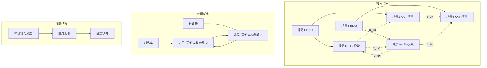

# AutoIFS: Automated Information Flow Selection for Multi-scenario Multi-task Recommendation

> 来源：https://arxiv.org/abs/2512.13396 | 领域：ads | 学习日期：20260403

## 问题定义

多场景多任务推荐(Multi-scenario Multi-task Recommendation)是工业推荐系统的核心架构问题。以电商广告为例，搜索场景和推荐场景共享部分用户行为数据，但场景特性和优化目标各异。现有方法如STAR(Star Topology Adaptive Recommender)和HiNet通过手工设计的信息流(information flow)连接不同场景和任务的网络模块，但这种手工设计存在以下问题：

(1) 最优的信息流拓扑因业务和数据分布不同而异，手工试错成本高；(2) 场景和任务数量增加时，可能的信息流组合指数级增长；(3) 固定的信息流无法适应数据分布的动态变化。

AutoIFS提出了一种类NAS(Neural Architecture Search)的方法，自动化地搜索多场景多任务推荐模型中的最优信息流拓扑。将信息流选择建模为可微分的架构搜索问题，使用超网络(supernet)训练+结构参数优化的范式，高效地从指数级搜索空间中找到最优连接模式。

## 核心方法与创新点

### 信息流搜索空间

定义搜索空间为有向图 $G = (V, E)$，其中节点 $V$ 包含各场景各任务的网络模块(如场景1-CTR模块、场景2-CVR模块等)，边 $E$ 表示模块间的信息传递。每条候选边 $e_{ij}$ 关联一个连续的架构参数 $\alpha_{ij}$，表示信息从模块 $i$ 传递到模块 $j$ 的强度：

$$h_j = \sum_{i \in \mathcal{N}(j)} \frac{\exp(\alpha_{ij})}{\sum_{i' \in \mathcal{N}(j)} \exp(\alpha_{i'j})} \cdot f_{ij}(h_i)$$

其中 $\mathcal{N}(j)$ 是模块 $j$ 的候选输入集合，$f_{ij}$ 是边上的变换函数(如线性映射或identity)。

### 双层优化

AutoIFS采用DARTS风格的双层优化(bi-level optimization)。外层优化架构参数 $\boldsymbol{\alpha}$，内层优化模型参数 $\boldsymbol{w}$：

$$\min_{\boldsymbol{\alpha}} \mathcal{L}_{val}(\boldsymbol{w}^*(\boldsymbol{\alpha}), \boldsymbol{\alpha}) \quad \text{s.t.} \quad \boldsymbol{w}^*(\boldsymbol{\alpha}) = \arg\min_{\boldsymbol{w}} \mathcal{L}_{train}(\boldsymbol{w}, \boldsymbol{\alpha})$$

通过一阶近似(first-order approximation)将双层优化转化为交替梯度下降，每步同时更新 $\boldsymbol{w}$ 和 $\boldsymbol{\alpha}$，避免完整内层优化的高昂成本。

### 搜索空间约束

为避免搜索退化，引入两个正则化约束：
- **稀疏性约束**：鼓励每个模块只保留少数输入连接，$\mathcal{R}_{sparse} = \sum_j \|\boldsymbol{\alpha}_j\|_1$
- **无环约束**：确保信息流图无环，通过DAG约束 $\mathcal{R}_{DAG} = \text{tr}(e^{\mathbf{A}}) - |V|$ 实现

### 关键创新

- **自动化搜索**：替代人工设计信息流拓扑，大幅减少模型设计人力成本
- **可微分优化**：连续化架构参数支持梯度下降搜索，比离散搜索(如RL-based NAS)高效数个数量级
- **通用框架**：适用于任意场景数和任务数，场景/任务增减仅需修改搜索空间
- **DAG约束**：确保搜索到的信息流有合理的因果方向，避免循环依赖

## 系统架构

## 实验结论

- 在工业多场景推荐数据集上，AutoIFS搜索到的结构相比手工设计的STAR架构，平均AUC提升 **+0.42%**
- 相比HiNet手工设计的信息流提升 **+0.31%**
- 搜索到的信息流揭示了非直觉的连接模式：如CVR任务的信息反向流入CTR任务有正收益
- 搜索成本：在4个场景×3个任务的搜索空间上，搜索耗时约 **8小时**(8×V100)，相比完整训练仅增加 **20%** 计算量
- 搜索到的结构在数据分布变化后仍有效，3个月内无需重新搜索
- 消融实验：去掉稀疏约束后搜索到的结构过于稠密，推理延迟增加40%但AUC仅提升0.05%

## 工程落地要点

- **搜索与部署分离**：搜索阶段使用supernet在子采样数据上运行，得到最优结构后在全量数据上从头训练
- **搜索周期**：建议每季度重新搜索一次，或在新场景/任务接入时触发搜索
- **搜索空间设计**：候选边集合需覆盖同场景跨任务、跨场景同任务、跨场景跨任务三种信息流
- **部署优化**：搜索到的稀疏结构可编译为静态计算图，消除动态路由开销
- **渐进式扩展**：新场景接入时，固定已有结构，仅搜索新场景相关的边

## 面试考点

1. **Q: AutoIFS的搜索空间是什么？** A: 由多场景多任务的网络模块组成的有向图，候选边表示模块间的信息传递路径，搜索目标是找到最优的稀疏子图。
2. **Q: 为什么用DARTS式的可微分搜索而不是RL-based NAS？** A: 可微分搜索通过梯度下降同时优化架构和权重，比RL-based方法(需采样-评估循环)快数个数量级。
3. **Q: 双层优化中为什么用一阶近似？** A: 精确的双层优化需要完整训练内层模型，计算量不可接受；一阶近似将其简化为交替梯度下降，实践中效果足够好。
4. **Q: DAG约束如何防止信息流出现环路？** A: 使用矩阵指数迹约束 $\text{tr}(e^{\mathbf{A}}) - |V| = 0$ 当且仅当图无环，将其作为正则项加入优化目标。
5. **Q: 搜索到的信息流结构稳定吗？** A: 实验表明搜索结果在3个月内保持有效，但重大业务变化(如新场景上线)需重新搜索以适应新的数据分布。
