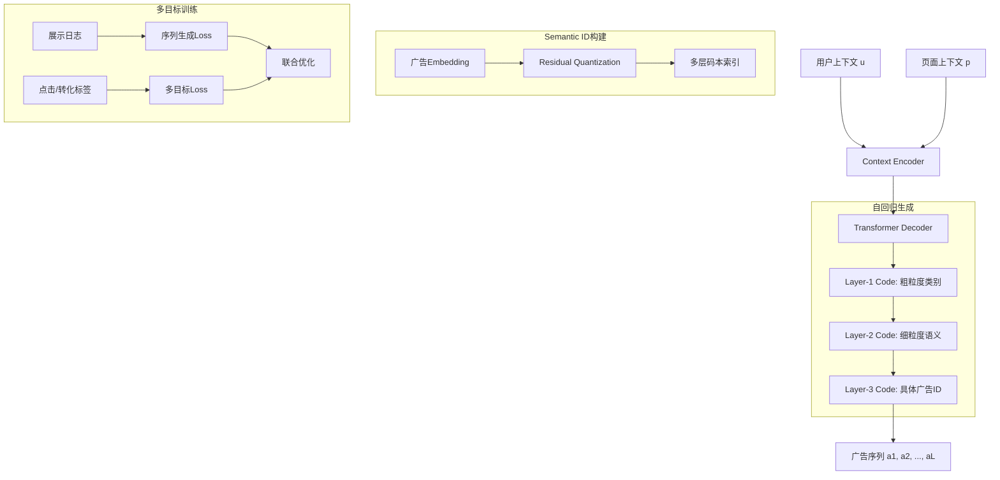

# EGA-v2: An End-to-End Generative Framework for Industrial Advertising

> 来源：https://arxiv.org/abs/2505.17549 | 领域：ads | 学习日期：20260403

## 问题定义

传统广告系统采用召回-排序级联架构，各阶段使用判别式模型(discriminative model)对候选广告进行独立评分。这种范式存在固有局限：(1) 召回阶段可能丢失潜在高质量广告（漏召回）；(2) 各阶段目标不一致，全局最优难以保证；(3) 候选集规模受计算预算硬约束，精排能看到的广告数量有限。

EGA-v2是端到端生成式广告框架(End-to-end Generative Advertising)的第二代系统。相比初代EGA主要关注生成式召回，v2将生成范式扩展到整个广告链路——从候选生成到排序到出价，形成完整的生成式广告pipeline。核心思想是将"从海量广告中选择最佳广告"转化为"直接生成最优广告序列"，从根本上消除级联架构的信息损失。

EGA-v2在工业级广告系统中部署，验证了生成式框架在全链路广告投放中的有效性，代表了广告系统从判别式向生成式范式转型的重要一步。

## 核心方法与创新点

### 广告序列生成

EGA-v2将广告投放建模为条件序列生成。给定用户上下文 $u$ 和页面上下文 $p$，模型自回归地生成广告展示序列 $\mathbf{a} = (a_1, a_2, ..., a_L)$：

$$P(\mathbf{a}|u, p) = \prod_{\ell=1}^{L} P(a_\ell | a_{<\ell}, u, p; \theta)$$

每个广告 $a_\ell$ 通过其语义ID(Semantic ID)表示，该ID通过对广告embedding进行残差量化(Residual Quantization, RQ)获得。广告的语义ID是一个多层码本索引序列，生成过程从粗到细逐层decode。

### 多目标联合生成

v2的关键创新是将点击、转化等多目标信号融入生成过程。通过条件生成实现多目标优化：

$$\mathcal{L} = -\sum_{\ell=1}^{L} \left[ \log P(a_\ell | a_{<\ell}, u, p) + \sum_{k} \gamma_k \cdot \log P(y_k | a_\ell, u, p) \right]$$

其中 $y_k$ 是第 $k$ 个目标(CTR, CVR, GMV等)的标签，$\gamma_k$ 是目标权重。这使得生成的广告序列同时优化多个业务目标。

### 关键创新

- **全链路生成**：从候选生成到排序到展示位分配，一个生成模型端到端完成
- **语义ID体系**：通过RQ将广告映射到层级化的离散token空间，支持自回归生成
- **多目标融合**：生成过程中直接融入CTR/CVR等多目标信号，无需后处理
- **位置感知生成**：生成序列中的位置隐式编码了展示位置信息，自然建模位置偏差

## 系统架构

## 实验结论

- 相比传统召回+排序级联系统，EGA-v2在离线评估中NDCG@10提升 **+4.2%**
- 广告覆盖率(Coverage)提升 **+15%**，生成模型能发现传统召回遗漏的长尾广告
- 在线A/B测试：广告收入(Revenue)提升 **+2.5%**，广告主ROI提升 **+1.8%**
- 系统延迟：全链路生成推理约 **20ms**，与传统系统的总延迟持平
- Semantic ID的RQ码本大小为 $256 \times 4$ 层，覆盖百万级广告库
- 消融实验：去掉多目标联合训练后收入下降3.1%，去掉位置感知生成后CTR预估偏差增大2.4%

## 工程落地要点

- **Semantic ID更新**：广告库变动时需增量更新RQ码本，支持新广告的实时索引
- **Beam Search优化**：生成时使用constrained beam search，排除已下线/预算耗尽的广告
- **多目标权重调节**：$\gamma_k$ 可作为运营杠杆，实时调节CTR/CVR/Revenue的权重比例
- **与传统系统并行**：上线初期采用"生成式+判别式"双路打分，逐步提升生成式路径的权重
- **模型更新频率**：Semantic ID码本每周更新，生成模型每日增量训练

## 面试考点

1. **Q: EGA-v2如何将广告表示为可生成的token？** A: 通过Residual Quantization将广告embedding映射为多层码本索引序列(Semantic ID)，每层从粗到细表示广告语义。
2. **Q: 生成式广告框架相比判别式的核心优势？** A: 生成式直接产出最优广告序列，避免了召回漏选和级联信息损失；且天然支持序列级全局优化而非逐个评分。
3. **Q: 如何处理广告库动态变化(新增/下线)？** A: Semantic ID码本支持增量更新，新广告通过RQ编码获得语义ID即可被生成模型索引；下线广告通过constrained decoding排除。
4. **Q: 多目标联合生成如何避免目标冲突？** A: 通过可调权重 $\gamma_k$ 控制各目标的优化力度，根据业务需求动态调整；训练中使用梯度调和技术处理冲突。
5. **Q: EGA-v2的推理延迟如何控制？** A: 层级化Semantic ID减少了解码步数(通常4层×beam_size)，配合KV-cache和早停策略，将延迟控制在20ms内。
