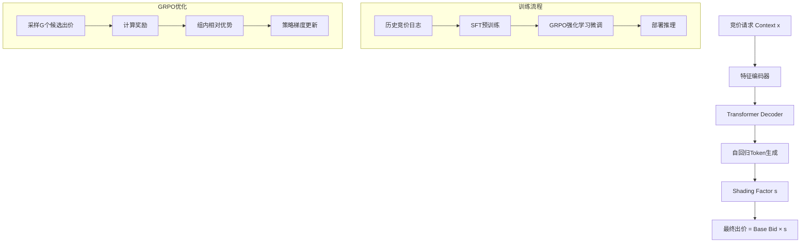

# Generative Bid Shading in Real-Time Bidding Advertising

> 来源：https://arxiv.org/abs/2508.06550 | 领域：ads | 学习日期：20260403

## 问题定义

在实时竞价(RTB)广告系统中，bid shading 是广告主在首价拍卖(First-Price Auction)环境下控制出价的核心策略。传统方法通常采用两阶段(two-stage)框架：先预估市场价格分布(landscape forecasting)，再基于预估分布计算最优出价折扣。这种级联式方法存在两个关键问题：(1) landscape预估误差会逐级传播并放大(cascade error)；(2) 每个阶段独立优化，无法达到全局最优(local suboptimal)。

随着生成式模型在序列决策中的成功应用，本文提出将bid shading建模为一个生成式序列决策问题。核心思想是利用自回归模型(autoregressive model)直接从历史竞价数据中学习出价策略，避免显式的市场价格预估，从而绕过级联误差问题。同时引入GRPO(Group Relative Policy Optimization)强化学习偏好对齐，将ROI约束和预算约束直接嵌入策略优化目标中。

该方法在工业级RTB系统中进行了大规模实验验证，显著优于传统两阶段方法和端到端回归方法，证明了生成式范式在广告竞价领域的可行性和优越性。

## 核心方法与创新点

### 自回归出价生成

模型将出价折扣因子(shading factor)离散化为token序列，利用Transformer-based自回归模型逐token生成。给定竞价上下文 $x$（包括广告特征、用户特征、竞价环境特征），模型生成shading factor $s$ 的条件概率为：

$$
P(s|x) = \prod_{t=1}^{T} P(s_t | s_{<t}, x; \theta)
$$

其中 $s_t$ 是离散化后的第 $t$ 个token，$T$ 是序列长度，$\theta$ 是模型参数。

### GRPO偏好对齐

在监督学习(SFT)预训练之后，采用GRPO进行强化学习微调。对于每个竞价请求 $x$，采样一组候选出价 $\{s^{(1)}, s^{(2)}, ..., s^{(G)}\}$，根据奖励函数计算组内相对优势：

$$
A^{(i)} = \frac{r(s^{(i)}, x) - \text{mean}(\{r(s^{(j)}, x)\}_{j=1}^{G})}{\text{std}(\{r(s^{(j)}, x)\}_{j=1}^{G})}
$$

奖励函数 $r(s, x)$ 综合考虑了竞价胜出概率、ROI约束和预算消耗平滑性。GRPO相比PPO避免了critic网络的训练，降低了训练不稳定性。

### 关键创新总结

- **端到端生成**：避免了两阶段级联误差，直接从上下文到出价策略
- **离散化表示**：将连续的shading factor离散为token，利用生成模型的序列建模能力
- **GRPO对齐**：通过组内相对排序避免绝对奖励估计，更稳定地融入约束

## 系统架构

## 实验结论

- 在大规模RTB数据集上，相比传统两阶段方法(Landscape+Optimization)，胜出率(Win Rate)提升约 **+3.2%**，同时ROI提升 **+2.8%**
- 相比端到端回归方法(Direct Regression)，在预算利用率上提升 **+4.1%**，预算消耗更平滑
- GRPO微调相比纯SFT，ROI约束满足率从 87% 提升到 **95%+**
- 消融实验证明离散化粒度(token vocabulary size)对性能有显著影响，过粗和过细都会降低效果
- 在线A/B测试中，广告主成本降低约 **5-8%**，同时保持类似的转化量

## 工程落地要点

- **推理延迟**：自回归生成天然比单次前向推理慢，需要优化token数量（通常3-5个token即可表示shading factor），配合KV-cache加速
- **离散化策略**：shading factor通常在 [0.3, 1.0] 范围内，离散为256个bin在精度和效率间取得平衡
- **在线GRPO**：可以采用离线批量GRPO训练+在线serving的方式，每日/每小时更新模型
- **预算约束处理**：在生成时可加入约束解码(constrained decoding)，确保累计出价不超预算
- **回退机制**：新模型上线初期需保留传统方法作为fallback，逐步放量

## 面试考点

1. **Q: 为什么两阶段bid shading有级联误差问题？** A: 第一阶段landscape预估的偏差会直接影响第二阶段最优出价计算，两阶段各自优化无法保证全局最优。
2. **Q: GRPO相比PPO的优势是什么？** A: GRPO通过组内相对排序计算优势函数，不需要额外训练critic网络，降低了训练不稳定性和计算开销。
3. **Q: 为什么将shading factor离散化为token？** A: 离散化使得可以利用自回归语言模型的序列建模能力，同时天然支持采样多样性，便于GRPO的组采样。
4. **Q: 如何在生成式出价中处理预算约束？** A: 可通过奖励函数中加入预算消耗惩罚项，以及推理时的约束解码来双重保障。
5. **Q: 生成式bid shading的推理延迟如何优化？** A: 控制离散化token数量(3-5个)、使用KV-cache、模型蒸馏为更小的模型、以及批量并行解码等手段。
