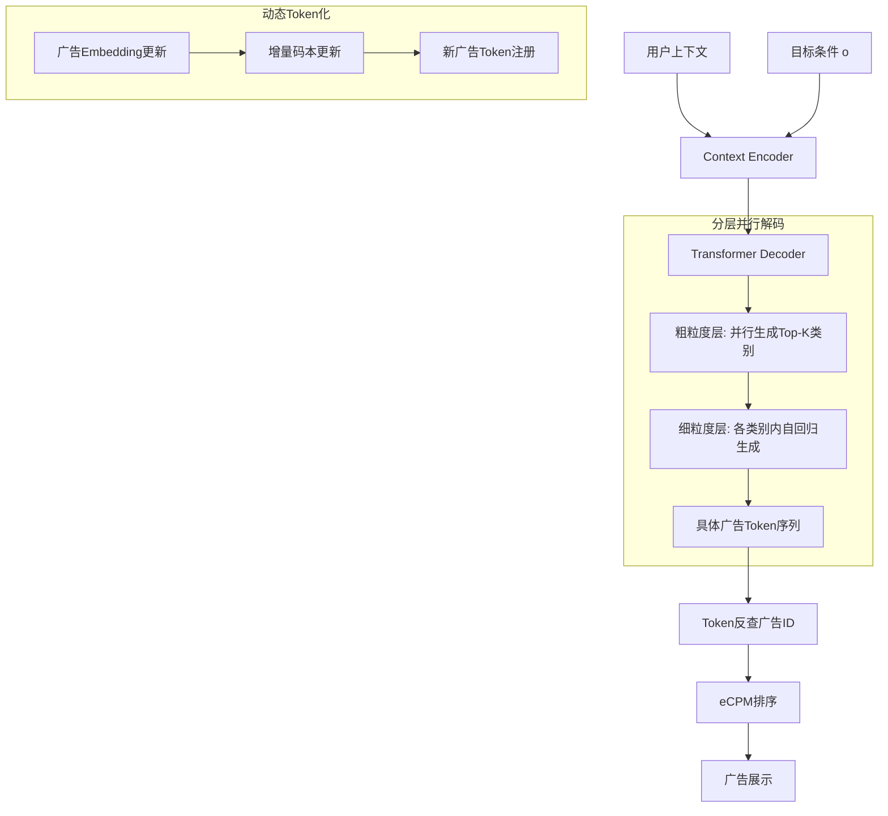

# Generative Recommendation for Large-Scale Advertising

> 来源：https://arxiv.org/abs/2602.22732 | 领域：ads | 学习日期：20260403

## 问题定义

生成式推荐(Generative Recommendation)近年在学术界受到广泛关注，但在大规模广告系统中的实际应用仍面临诸多挑战。广告场景相比普通推荐有其特殊性：(1) 广告库更新频率极高（每天数十万条新广告上线/下线），传统的item token化方案难以实时跟踪；(2) 广告系统对延迟敏感，生成式推理的自回归解码天然较慢；(3) 广告需同时优化多方目标——用户体验、广告主ROI、平台收入。

本文系统性地研究了生成式推荐在大规模广告系统中的落地方案，包括广告的token化表示(tokenization)、高效解码策略、以及多目标生成优化。论文在真实大规模广告平台上进行了全面的实验验证，提出了一套可行的工业部署方案。

这项工作填补了生成式推荐从学术到广告工业落地的技术gap，为广告系统的范式转型提供了参考路径。

## 核心方法与创新点

### 广告Token化

提出动态语义Token化(Dynamic Semantic Tokenization)方案，将广告映射到可自回归生成的token序列。使用Product Quantization(PQ)的变体对广告embedding进行分层编码：

$$\text{TokenSeq}(a) = (c_1(a), c_2(a), ..., c_D(a))$$

其中 $c_d(a)$ 是第 $d$ 层子空间的码本索引。与静态RQ不同，动态方案支持在线增量更新码本，新广告通过最近邻查找获得token序列，无需重训练码本。

### 多目标条件生成

广告生成需同时考虑相关性、点击率和商业价值。通过多目标条件生成(Multi-Objective Conditional Generation)实现：

$$P(\mathbf{a}|u, \mathbf{o}) = \prod_{l=1}^{L} P(a_l | a_{<l}, u, \mathbf{o}; \theta)$$

其中 $\mathbf{o} = (o_1, o_2, ..., o_K)$ 是目标条件向量，$o_k \in \{0, 1\}$ 表示是否要求第 $k$ 个目标为正(如 $o_1$ 表示点击，$o_2$ 表示转化)。训练时根据历史标签设置条件，推理时设定所有目标为正以生成多目标均优的广告。eCPM可通过加权融合不同条件下的生成概率实现：

$$\text{eCPM}(a) = \text{bid}(a) \cdot P(a|u, o_{click}=1) \cdot P(o_{convert}=1|a, u)$$

### 关键创新

- **动态Token化**：支持广告库的实时增删，无需全量重新编码
- **多目标条件生成**：将多目标优化嵌入生成条件，推理时灵活组合
- **高效解码**：提出分层并行解码(Hierarchical Parallel Decoding)，粗粒度层并行+细粒度层自回归
- **工业适配**：系统性解决了延迟、实时性、多目标等工业级问题

## 系统架构

## 实验结论

- 动态Token化相比静态Token化在广告覆盖率上提升 **+22%**（因能实时索引新广告）
- 多目标条件生成相比独立目标生成，CTR提升 **+1.3%**，CVR提升 **+2.1%**
- 分层并行解码将推理延迟从自回归的 **35ms** 降至 **12ms**，降低 **65%**
- 在线A/B测试：广告收入提升 **+3.2%**，用户负面反馈率下降 **-5.8%**
- 新广告从入库到可被生成模型索引的延迟 < **5分钟**
- 与传统判别式ranking系统对比，生成式方案在长尾广告的曝光公平性上提升显著(Gini系数降低0.08)

## 工程落地要点

- **码本容量设计**：每层码本大小1024，4层PQ可表示 $1024^4 \approx 10^{12}$ 个广告，远超实际需求
- **增量更新流水线**：新广告入库 -> embedding计算 -> PQ编码 -> token注册 -> 生成模型可索引，全流程自动化
- **Beam Search约束**：排除预算耗尽、已下线、违规广告的token路径，通过prefix tree高效实现
- **AB实验**：支持流量级别和广告主级别的双层实验，评估对双边的影响
- **监控指标**：除常规CTR/Revenue外，需监控token命中率(生成的token是否对应有效广告)和多样性

## 面试考点

1. **Q: 为什么广告场景的Token化比普通推荐更难？** A: 广告库每天大量增删，静态Token化无法实时索引新广告；且广告数量级通常更大，码本需支持百万级甚至亿级索引。
2. **Q: 多目标条件生成如何在推理时平衡不同目标？** A: 推理时将目标条件设为全正（要求点击且转化），模型自动生成多目标均优的广告；也可通过调整条件概率的融合权重实现目标偏好。
3. **Q: 分层并行解码如何在保持效果的同时降低延迟？** A: 粗粒度层(类别级)互相独立可并行生成，仅细粒度层(具体广告)需自回归，层级较少因此延迟低。
4. **Q: 动态Token化如何处理码本漂移问题？** A: 定期全量重建码本保持全局一致性，中间通过最近邻增量编码处理新广告，两者交替进行。
5. **Q: 生成式广告推荐对长尾广告的公平性为何更好？** A: 判别式模型倾向于高曝光广告(马太效应)，生成式模型通过采样多样性天然产出长尾候选。
