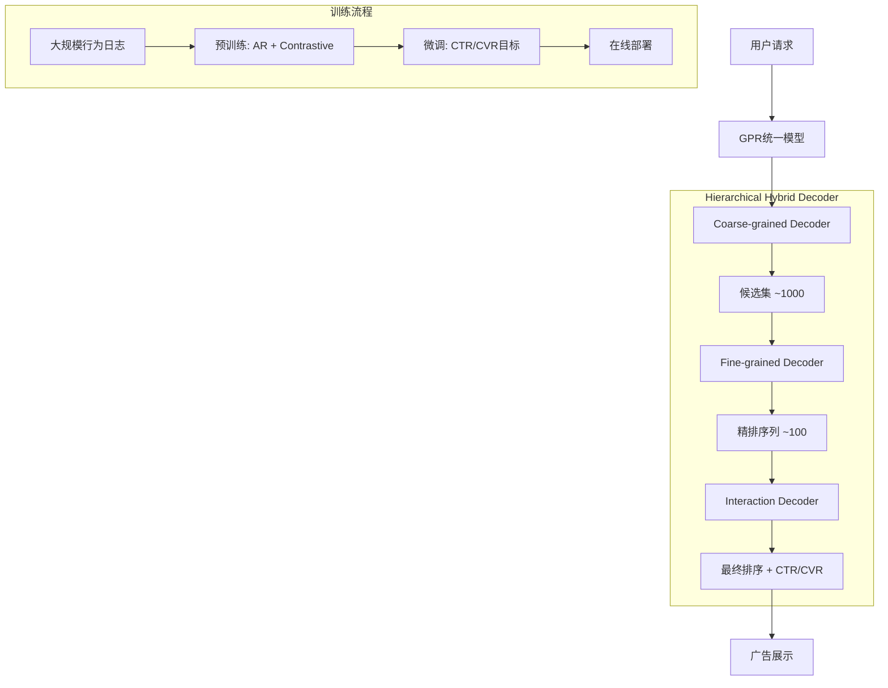

# GPR: Generative Pre-trained One-Model Paradigm for Large-Scale Advertising

> 来源：https://arxiv.org/abs/2511.10138 | 领域：ads | 学习日期：20260403

## 问题定义

大规模广告系统传统上采用多阶段级联架构：召回(retrieval) -> 粗排(pre-ranking) -> 精排(ranking) -> 重排(re-ranking)，每个阶段使用独立模型。这种架构存在几个根本性问题：(1) 各阶段模型独立训练，目标不一致导致全局次优；(2) 不同阶段间信息丢失，上游误差逐级累积；(3) 维护多个模型的工程成本高昂；(4) 各阶段模型能力受限于其有限的输入信息。

华为提出GPR(Generative Pre-trained One-Model)范式，目标是用一个统一的生成式预训练模型替代传统四阶段pipeline。GPR将广告推荐建模为序列生成任务，通过Hierarchical Hybrid Decoder架构实现从候选集生成到精细排序的全流程统一建模。

该方法在华为广告平台上部署验证，实现了"一个模型搞定全链路"的技术突破，大幅简化系统架构的同时提升了广告效果。

## 核心方法与创新点

### Hierarchical Hybrid Decoder

GPR的核心架构是Hierarchical Hybrid Decoder(HHD)，包含三个层级：

1. **Coarse-grained Decoder**：从全量广告候选池中生成粗粒度候选集，类似召回+粗排
2. **Fine-grained Decoder**：对候选集进行精细化评估和排序
3. **Interaction Decoder**：建模用户-广告交互的细粒度信号

生成概率采用层级分解：

$$
P(a|u, C) = \sum_{k=1}^{K} P_{coarse}(g_k|u) \cdot P_{fine}(a|g_k, u) \cdot P_{interact}(y|a, u)
$$

其中 $u$ 是用户表示，$C$ 是候选广告集合，$g_k$ 是第 $k$ 个粗粒度分组，$a$ 是具体广告，$y$ 是交互结果。

### 预训练与微调策略

GPR采用两阶段训练：预训练使用大规模用户行为序列学习通用表示，微调阶段针对广告特定的CTR/CVR目标优化。预训练目标结合了自回归生成损失和对比学习损失：

$$
\mathcal{L}_{pretrain} = -\sum_{t=1}^{T} \log P(a_t | a_{<t}, u; \theta) + \lambda \cdot \mathcal{L}_{contrastive}
$$

其中自回归部分学习用户行为序列的生成模式，对比学习部分拉近相似用户-广告对的表示距离。

### 关键创新

- **四阶段统一**：一个模型实现召回、粗排、精排、重排全流程
- **层级生成**：HHD通过粗到细的层级生成，兼顾效率和精度
- **预训练范式**：大规模行为序列预训练提供通用特征提取能力
- **参数共享**：不同阶段共享底层表示，信息无损传递

## 系统架构

## 实验结论

- 相比传统四阶段级联系统，GPR在离线评估中CTR AUC提升 **+1.5%**，CVR AUC提升 **+2.1%**
- 在线A/B测试中，广告收入提升 **+3.8%**，用户体验指标(停留时长)无下降
- 系统延迟：单模型推理延迟约 **15ms**，低于四阶段级联总延迟(~25ms)
- 模型参数量从四个独立模型的总计约12B减少到单模型 **4B**，显存和计算资源节省 **60%+**
- 消融实验：去掉预训练阶段AUC下降1.8%，去掉HHD改为flat decoder AUC下降1.2%

## 工程落地要点

- **分阶段迁移**：从传统架构迁移到GPR不需一步到位，可先用GPR替换粗排+精排，保留召回和重排
- **推理优化**：Coarse-grained Decoder可采用近似最近邻搜索(ANN)加速，Fine-grained Decoder使用batch推理
- **增量训练**：预训练模型较稳定，每月更新；微调层每日更新以捕捉实时趋势
- **容灾设计**：保留轻量级fallback模型，GPR异常时快速切换
- **特征工程简化**：GPR从原始特征出发自动学习交叉，减少人工特征工程量约 **70%**

## 面试考点

1. **Q: GPR如何用一个模型实现四阶段推荐pipeline？** A: 通过Hierarchical Hybrid Decoder将候选生成、粗排、精排、交互建模分层集成在同一模型中，共享底层表示。
2. **Q: HHD中粗粒度和细粒度Decoder的区别是什么？** A: 粗粒度Decoder从全量候选中快速筛选出千级候选集（类似召回），细粒度Decoder对候选集进行精细化评分排序。
3. **Q: 预训练阶段为什么要同时使用自回归和对比学习？** A: 自回归捕捉行为序列的时序模式，对比学习增强用户-广告表示的区分度，两者互补提升表示质量。
4. **Q: 统一模型相比级联模型在延迟上有何优势？** A: 级联模型每阶段有独立的网络IO和计算开销，统一模型一次前向传播完成全流程，减少IO开销和上下文切换。
5. **Q: GPR在工业部署中如何处理系统可靠性？** A: 保留轻量fallback模型作为降级方案，GPR异常时自动切换；同时分阶段上线降低风险。
