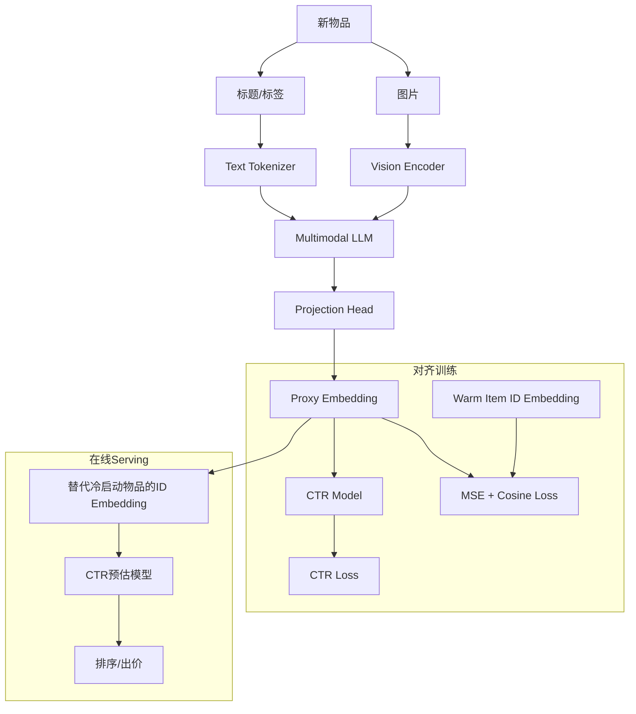

# IDProxy: Cold-Start CTR Prediction with Multimodal LLMs

> 来源：https://arxiv.org/abs/2603.01590 | 领域：ads | 学习日期：20260403

## 问题定义

冷启动问题是推荐系统和广告CTR预估中的核心挑战之一。新物品(item)缺乏交互历史，其ID embedding无法通过协同过滤信号学习到有效的表示。传统冷启动方案包括：(1) 使用内容特征(如标题、图片)的side information填充；(2) meta-learning快速适配；(3) 基于相似物品的embedding迁移。但这些方法通常在cold-start和warm-start之间存在较大的表示鸿沟(representation gap)。

小红书(Xiaohongshu/RED)提出了IDProxy方法，利用多模态大语言模型(Multimodal LLM)为冷启动物品生成代理ID embedding(proxy embedding)。核心思路是：多模态LLM天然具备对图文内容的深度理解能力，可以从物品的图片、标题、标签等多模态信息中提取语义表示，并将其对齐到已有的ID embedding空间中，作为冷启动物品的初始embedding。

该方法在小红书的笔记推荐和广告系统中进行了大规模线上验证，有效缩小了冷启动物品与热门物品之间的CTR预估精度差距，显著提升了新内容的分发效率。

## 核心方法与创新点

### Proxy Embedding生成

IDProxy使用多模态LLM（如基于LLaVA或Qwen-VL的变体）作为backbone，输入物品的图片和文本信息，输出一个与ID embedding维度一致的proxy embedding向量。对齐训练目标采用MSE + Cosine similarity联合损失：

$$
\mathcal{L}_{align} = \alpha \cdot \|e_{proxy} - e_{ID}\|_2^2 + (1-\alpha) \cdot \left(1 - \frac{e_{proxy} \cdot e_{ID}}{\|e_{proxy}\| \cdot \|e_{ID}\|}\right)
$$

其中 $e_{proxy}$ 是LLM生成的proxy embedding，$e_{ID}$ 是经过充分训练的物品ID embedding（来自warm items），$\alpha$ 是平衡系数。

### 端到端对齐训练

为了确保proxy embedding在下游CTR任务中有效，IDProxy采用端到端训练策略。在对齐损失之外，加入CTR预估任务的监督信号：

$$
\mathcal{L}_{total} = \mathcal{L}_{align} + \beta \cdot \mathcal{L}_{CTR}(f(e_{proxy}, \mathbf{x}), y)
$$

其中 $f$ 是下游CTR模型，$\mathbf{x}$ 是其他特征，$y$ 是点击标签。通过联合优化，proxy embedding不仅语义上接近真实ID embedding，在下游任务中也能直接替代使用。

### 关键创新总结

- **多模态理解**：利用LLM对图片+文本的联合理解，生成比单模态更精准的内容表示
- **端到端对齐**：proxy embedding同时对齐ID空间和下游CTR任务，避免两阶段割裂
- **渐进式替换**：物品从冷启动到warm阶段，proxy embedding可以平滑过渡到真实ID embedding
- **工业可部署**：proxy embedding可离线预计算，不增加在线推理负担

## 系统架构

## 实验结论

- 离线AUC：冷启动物品CTR预估AUC提升 **+1.8%** (相比content-based baseline)
- 冷启动物品的proxy embedding与warm embedding的cosine similarity达到 **0.72+**
- 在线A/B测试：冷启动笔记的点击率提升 **+8.5%**，冷启动广告的eCPM提升 **+5.2%**
- 新物品从发布到获得有效曝光的时间缩短约 **40%**
- 消融实验：去掉图片模态AUC下降0.9%，去掉端到端CTR loss AUC下降1.2%，说明多模态和端到端训练都很关键
- 与Meta-learning方法(MAML变体)对比，IDProxy在cold-start和warm-start上都更优

## 工程落地要点

- **离线预计算**：新物品入库时，通过LLM生成proxy embedding并存入特征库，在线serving直接读取，不增加推理延迟
- **模型规模选择**：工业实践中使用7B参数量级的多模态LLM，在效果和计算成本间取得平衡
- **Embedding过渡策略**：物品积累足够交互后(如>100次曝光)，proxy embedding按比例混合真实ID embedding，逐步过渡
- **训练数据构建**：使用已有warm items的多模态特征和ID embedding构建对齐训练集，确保分布覆盖
- **增量更新**：LLM模型每周/每月fine-tune一次，projection head每日更新以跟踪ID embedding空间的漂移

## 面试考点

1. **Q: IDProxy如何解决冷启动物品缺乏ID embedding的问题？** A: 利用多模态LLM从物品的图片和文本中提取语义表示，通过对齐训练映射到ID embedding空间，生成可直接替代的proxy embedding。
2. **Q: 为什么需要端到端CTR loss而不是只做embedding对齐？** A: 纯对齐可能在embedding空间中距离近但在下游CTR任务中表现差，加入CTR loss确保proxy embedding对点击率预估直接有效。
3. **Q: proxy embedding到真实ID embedding如何平滑过渡？** A: 设置曝光阈值，超过阈值后按比例 $e = (1-\gamma) \cdot e_{proxy} + \gamma \cdot e_{ID}$ 混合，$\gamma$ 随交互量递增。
4. **Q: 多模态LLM的推理成本如何控制？** A: proxy embedding离线预计算并缓存，新物品入库时batch推理，不影响在线CTR预估的延迟。
5. **Q: 对齐训练中MSE和Cosine loss的作用分别是什么？** A: MSE约束绝对距离保持embedding数值一致性，Cosine loss约束方向一致性保持语义相似性，两者互补。
