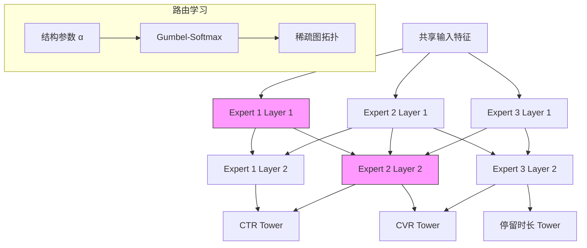

# Macro Graph of Experts for Billion-Scale Multi-Task Recommendation (MGOE)

> 来源：https://arxiv.org/abs/2506.10520 | 领域：ads | 学习日期：20260403

## 问题定义

多任务学习(Multi-Task Learning, MTL)是工业推荐系统的标准范式，同时预估CTR、CVR、停留时长等多个目标。主流的MTL架构基于Mixture-of-Experts(MoE)，如MMoE、PLE等，通过共享专家和任务特定专家的组合实现知识共享与任务差异化。

然而，现有MoE方法在微观层面(micro-level)进行专家路由——每个样本在每一层独立选择专家组合。这带来两个问题：(1) 微观路由的搜索空间指数爆炸，难以稳定训练；(2) 不同层之间的专家选择缺乏协调，可能导致信息流路径不一致。

MGOE(Macro Graph of Experts)提出在宏观层面(macro-level)进行专家路由：将整个模型视为一个由专家节点组成的有向图(DAG)，每条从输入到输出的路径代表一种宏观信息流模式。通过学习图上的路径权重，实现任务间的结构化知识共享。这种宏观视角大幅简化了路由搜索空间，同时保持了跨层信息流的一致性。

## 核心方法与创新点

### 宏观专家图构建

MGOE将L层的多专家网络表示为有向无环图 $G = (V, E)$。节点集 $V$ 包含每层的 $M$ 个专家，加上输入节点和各任务的输出节点。边集 $E$ 连接相邻层的专家节点。对于任务 $t$，其信息流由一条从输入到输出的路径 $\pi_t$ 决定：

$$h_t^{(l)} = \sum_{m=1}^{M} w_{t,m}^{(l)} \cdot \text{Expert}_m^{(l)}(h_t^{(l-1)})$$

其中 $w_{t,m}^{(l)}$ 是任务 $t$ 在第 $l$ 层选择专家 $m$ 的路由权重。不同于微观MoE对每个样本独立路由，MGOE的路由权重是任务级别的全局参数。

### 图结构学习

MGOE通过可微分的结构学习优化图的拓扑。引入结构参数 $\boldsymbol{\alpha}$ 控制边的连接强度，使用Gumbel-Softmax采样实现离散结构的可微分优化：

$$w_{t,m}^{(l)} = \frac{\exp((\alpha_{t,m}^{(l)} + g_m) / \tau)}{\sum_{m'=1}^{M} \exp((\alpha_{t,m'}^{(l)} + g_{m'}) / \tau)}$$

其中 $g_m$ 是Gumbel噪声，$\tau$ 是温度参数。训练完成后，通过硬阈值截断获得稀疏的专家图结构。最终每个任务对应图中的一条稀疏路径，路径间的重叠部分对应共享知识，独占部分对应任务特定知识。

### 关键创新

- **宏观路由**：任务级别的全局路由替代样本级别的微观路由，搜索空间从 $O(M^{L \times N})$ 降到 $O(M^{L \times T})$
- **图结构化**：专家间的信息流通过DAG显式建模，跨层信息传递路径一致
- **可微分搜索**：Gumbel-Softmax实现结构和参数的联合优化
- **可解释性**：学到的图结构直观展示任务间的知识共享模式

## 系统架构

## 实验结论

- 在十亿级工业数据集上，MGOE相比PLE在CTR AUC上提升 **+0.38%**，CVR AUC提升 **+0.52%**
- 相比MMoE提升更显著：CTR +0.61%，CVR +0.78%
- 训练收敛速度比微观路由MoE快 **30%**（得益于更小的搜索空间）
- 推理延迟与PLE持平（稀疏图剪枝后每个任务仅激活部分专家）
- 图结构分析：CTR和CVR任务在底层共享 **60%** 的专家，顶层仅共享 **20%**，符合"底层共享高层分化"的直觉
- 消融实验：去掉Gumbel-Softmax改为soft routing，AUC下降0.15%（稀疏结构有正则化效果）

## 工程落地要点

- **搜索与训练分离**：先用小规模数据搜索最优图结构，再用全量数据训练固定结构的模型
- **专家数量选择**：每层4-8个专家在效果和计算开销间取得平衡，过多专家导致稀疏路由不稳定
- **结构漂移监控**：定期重新搜索结构，检测任务关系变化(如新任务引入可能改变共享模式)
- **与现有MoE兼容**：MGOE可作为现有PLE/MMoE系统的升级，保持tower结构不变，仅替换路由机制
- **并行推理**：稀疏图结构支持任务级并行推理，不同任务的独占路径可在不同GPU stream执行

## 面试考点

1. **Q: MGOE的宏观路由与传统MoE的微观路由有何区别？** A: 微观路由对每个样本在每层独立选择专家，搜索空间大且不稳定；宏观路由在任务级别全局确定专家路径，搜索空间小且跨层一致。
2. **Q: 为什么使用Gumbel-Softmax而不是直接用softmax？** A: Gumbel-Softmax在训练时近似离散采样，推理时可得到真正的稀疏结构，兼顾可微分优化和结构稀疏性。
3. **Q: MGOE学到的图结构有什么可解释的规律？** A: 底层专家被多任务共享度高（学习通用特征），顶层专家任务特定度高（学习任务特异信号），与直觉一致。
4. **Q: 如何处理新增任务对已有图结构的影响？** A: 固定已有任务的路径，仅搜索新任务的路由权重，允许复用已有专家或引入新专家。
5. **Q: MGOE在十亿级数据上的训练效率如何保证？** A: 结构搜索在子采样数据上完成，全量训练时结构固定与普通MoE训练成本相同，无额外开销。
