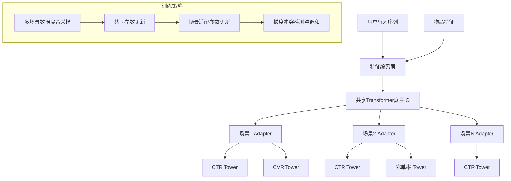

# MTFM: Scalable Foundation Model for Industrial Recommendation

> 来源：https://arxiv.org/abs/2602.11235 | 领域：ads | 学习日期：20260403

## 问题定义

工业推荐系统面临多场景(multi-scenario)、多任务(multi-task)的复杂需求。以美团为例，外卖、到店、酒旅等不同业务场景各有独立的推荐模型，存在以下问题：(1) 各场景数据量不均，小场景数据稀疏导致模型效果差；(2) 不同场景间的知识无法共享，重复建设成本高；(3) 单场景模型规模受限于该场景的数据量和计算预算。

美团提出MTFM(Meituan Foundation Model)，一个面向工业推荐的可扩展基础模型。核心理念是：跨场景共享一个大规模预训练基础模型，通过多任务学习和场景适配机制，实现"一个模型服务多个场景"。关键发现是模型规模的scaling law在推荐领域同样成立——每次迭代模型规模增长3倍以上，仍能获得正向收益(positive returns)。

MTFM已在美团多个核心推荐场景上线，验证了推荐基础模型的工业可行性和规模效应。

## 核心方法与创新点

### 多场景多任务架构

MTFM采用"共享底座+场景/任务适配"的架构。共享底座是一个大规模Transformer编码器，处理用户行为序列和物品特征。各场景和任务通过轻量级适配层(adapter)进行差异化：

$$
\hat{y}_{s,t} = \sigma\left(W_{s,t} \cdot h_{shared}(x; \Theta) + b_{s,t}\right)
$$

其中 $h_{shared}(x; \Theta)$ 是共享底座的输出表示，$W_{s,t}$ 和 $b_{s,t}$ 是场景 $s$ 任务 $t$ 的适配参数，$\sigma$ 是激活函数。共享底座参数 $\Theta$ 占总参数量的90%以上。

### Scaling Law验证

MTFM的核心贡献之一是验证了推荐基础模型的scaling law。定义模型性能(以AUC衡量)与模型规模(参数量 $N$)、数据量($D$)的关系：

$$
\text{AUC}(N, D) = \text{AUC}}_{\text{{\infty}} - \left(\frac{N_c}{N}\right)^{\alpha_N} - \left(\frac{D_c}{D}\right)^{\alpha_D}
$$

实验表明 $\alpha_N \approx 0.07$，$\alpha_D \approx 0.12$，即增大数据量带来的收益略高于增大模型，但两者均呈幂律递减。关键发现是在3倍规模增长时(从1B到3B到10B)，AUC持续正向提升，未出现饱和。

### 关键创新

- **跨场景共享**：统一底座学习通用用户偏好，小场景借力大场景数据
- **Scaling验证**：首次在工业推荐中系统验证scaling law，证明大模型路线的可持续性
- **高效适配**：adapter参数量仅占5-10%，新场景接入成本极低
- **渐进式扩展**：支持在不影响已有场景的前提下增加新场景和任务

## 系统架构

## 实验结论

- 从单场景独立模型迁移到MTFM，小场景(数据量<10M) CTR AUC提升 **+2.3%**，大场景提升 **+0.8%**
- 模型从1B扩展到3B，平均AUC提升 **+0.5%**；从3B到10B，提升 **+0.35%**，收益持续正向
- 在线A/B测试：外卖场景CTR提升 **+1.2%**，到店场景GMV提升 **+2.8%**
- 新场景接入时间从原来的2-3周缩短到 **3天**（仅需训练adapter层）
- 训练效率：10B模型使用256张GPU训练约 **48小时** 完成一次迭代
- 推理延迟：共享底座推理 **8ms** + adapter推理 **1ms**，满足在线要求

## 工程落地要点

- **数据混合策略**：各场景数据按有效样本量的平方根比例混合采样，避免大场景主导训练
- **梯度冲突处理**：使用PCGrad(Projecting Conflicting Gradients)或GradNorm处理多任务梯度冲突
- **模型分片部署**：共享底座使用模型并行(tensor parallelism)部署在多GPU上，adapter层在单GPU上
- **特征对齐**：不同场景的特征schema需要统一，通过特征映射层处理异构特征
- **AB实验框架**：支持场景级别的模型版本独立切换，新场景可独立评估MTFM效果

## 面试考点

1. **Q: MTFM如何解决小场景数据稀疏问题？** A: 通过跨场景共享底座，小场景可以借用大场景数据学到的通用表示，共享底座的泛化能力弥补了小场景数据不足。
2. **Q: 推荐系统中的scaling law与LLM的scaling law有什么区别？** A: 推荐系统的scaling指数更小(~0.07 vs LLM的~0.1)，且数据异质性更强，scaling效果受特征工程和数据质量影响更大。
3. **Q: 多场景训练中梯度冲突如何处理？** A: 采用PCGrad方法，当两个任务梯度方向冲突时，将冲突梯度投影到对方梯度的法平面上，消除负干扰。
4. **Q: 新场景接入MTFM需要哪些步骤？** A: 定义场景特征映射、初始化adapter参数、使用场景数据训练adapter(冻结共享底座)、在线灰度验证。
5. **Q: MTFM的推理延迟如何控制在可接受范围？** A: 共享底座推理结果可缓存复用，不同场景/任务共享一次前向传播，仅adapter层分别计算，总延迟约9ms。
