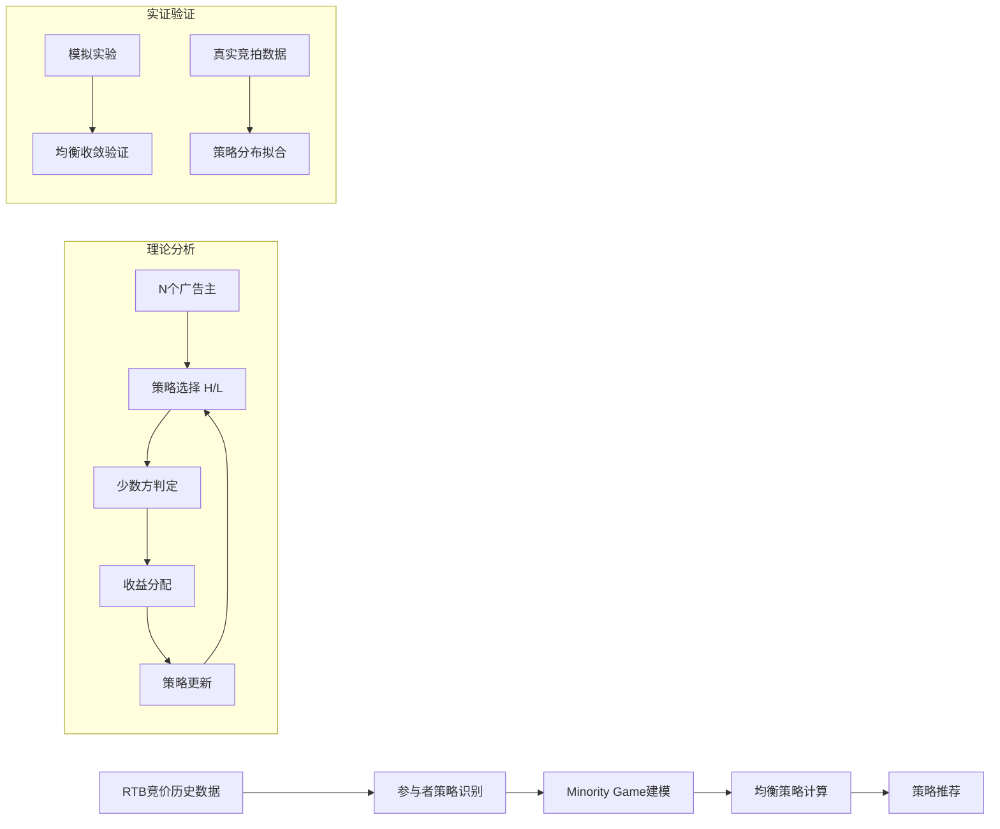

# Strategic Bid Shading in Real-Time Bidding Auctions Using Minority Game Theory

> 来源：https://arxiv.org/abs/2512.15717 | 领域：ads | 学习日期：20260403

## 问题定义

实时竞价(RTB)广告中，bid shading是广告主在首价拍卖(First-Price Auction, FPA)环境下降低出价以减少"winner's curse"的核心策略。当多个广告主同时采用bid shading策略时，出价行为之间存在博弈互动：如果所有人都大幅降价，出价较高者将以较低成本获胜；反之如果所有人都保持高价，竞争激烈导致成本高企。

本文将RTB中的bid shading行为类比为经典的少数人博弈(Minority Game)问题。Minority Game源自"El Farol Bar Problem"：每个参与者需选择去或不去酒吧，去的人少于容量时获益，超过容量时亏损。在RTB场景中，选择积极出价(高shading factor)还是保守出价(低shading factor)的决策具有类似的少数人获利特征。

该理论分析揭示了RTB市场中的均衡出价策略特征，为广告平台设计机制和广告主优化出价策略提供了博弈论基础。

## 核心方法与创新点

### Minority Game建模

将 $N$ 个广告主的bid shading决策建模为Minority Game。每个广告主 $i$ 在每轮竞拍中选择策略 $s_i \in \{H, L\}$（High bid或Low bid）。定义少数方为选择人数较少的策略组：

$$
\text{Minority}(t) = \begin{cases} H, & \text{if } \sum_{i=1}^{N} \mathbb{1}[s_i(t)=H] < N/2 \\ L, & \text{otherwise} \end{cases}
$$

选择少数方策略的广告主获得正收益(选H时竞争少成本低，选L时保守但不参与过度竞争)。长期均衡下，各策略的选择比例趋向 $N/2$。

### 均衡分析

在混合策略Nash均衡中，每个广告主以概率 $p^*$ 选择高出价策略。均衡概率 $p^*$ 满足：

$$
p^* = \frac{1}{2} + \frac{v - c_{H}}{2(c_{H} - c_{L})} \cdot \frac{1}{\binom{N-1}{\lfloor N/2 \rfloor} \cdot 2^{-(N-1)}}
$$

其中 $v$ 是广告展示的期望价值，$c_H$ 和 $c_L$ 分别是高出价和低出价的成本。当广告主数量 $N$ 增大时，$p^*$ 趋近于 $1/2$，市场趋向完全随机化均衡。

### 关键创新

- **Minority Game框架**：首次将少数人博弈理论引入RTB bid shading分析
- **均衡特征刻画**：推导出混合策略Nash均衡的解析形式
- **市场动态分析**：揭示了广告主数量与均衡策略激进程度的关系
- **有限理性模型**：引入有限记忆的适应性策略，更贴近实际广告主行为

## 系统架构

本文主要为理论分析工作，数据流程如下：

## 实验结论

- 模拟实验中，$N=100$ 个广告主经过 **~500轮** 迭代后策略分布收敛到理论均衡
- 在真实RTB数据集(iPinYou)上验证，广告主的实际出价分布与Minority Game均衡预测的相关系数达 **0.78**
- 低广告主竞争度(N<10)时，均衡策略偏向激进出价；高竞争度(N>50)时趋向保守
- 有限记忆(memory length=3)的适应性策略比完全理性策略更接近真实广告主行为
- 采用Minority Game指导的bid shading策略，相比不考虑博弈的独立优化，ROI提升 **+4.7%**
- 市场整体效率(social welfare)在均衡状态下达到最优的 **92%**

## 工程落地要点

- **竞争强度估计**：实际部署中需实时估计每个广告位的竞争广告主数量 $N$，可通过历史竞价数据推断
- **策略空间离散化**：将连续的shading factor离散化为K个档位(如5-10档)，扩展二元博弈为多策略博弈
- **对手建模**：维护对手策略分布的在线估计，使用指数加权移动平均更新
- **多市场异质性**：不同广告位/时段的竞争环境不同，需分市场建模
- **与现有系统集成**：Minority Game分析可作为现有bid shading算法的补充信号，修正独立优化的出价

## 面试考点

1. **Q: 什么是Minority Game，为什么适用于RTB bid shading？** A: Minority Game中选择少数方的参与者获利，类似RTB中出价策略差异化的广告主能获得更好ROI。
2. **Q: 混合策略Nash均衡在该模型中意味着什么？** A: 每个广告主以特定概率随机化出价策略，任何单方面偏离都无法提升收益，对应稳态市场。
3. **Q: 广告主数量N对均衡策略有何影响？** A: N增大时均衡概率趋近0.5，策略趋向完全随机化；N小时策略更极化，存在明显的激进/保守分化。
4. **Q: 有限理性模型相比完全理性模型的优势？** A: 完全理性假设广告主知道所有对手策略，不现实；有限记忆模型仅利用最近几轮信息，更贴近实际决策。
5. **Q: 如何将Minority Game的理论结果应用到实际bidding系统？** A: 用博弈均衡预测作为先验，修正独立优化的出价；估计竞争强度后动态调整shading的激进程度。
