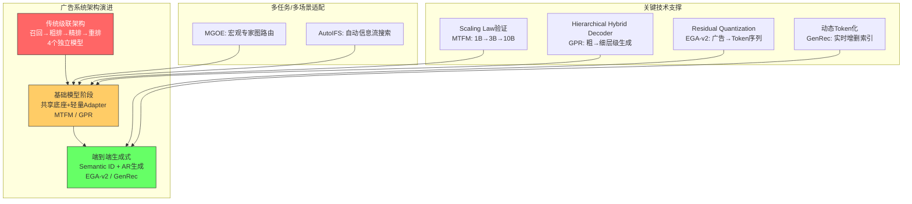

# 工业广告系统生成式革命 — 20260403 论文综述

> 本综述覆盖10篇广告系统前沿论文，聚焦生成式方法在工业广告中的应用革命。从竞价优化、全链路生成、基础模型到冷启动解决方案，系统梳理广告系统从判别式范式向生成式范式迁移的技术脉络。

---

## 今日核心论文综述

### 1. [Generative Bid Shading](../papers/generative_bid_shading_real_time_bidding.md) — 生成式出价遮蔽

本文将RTB中的bid shading问题重新建模为生成式序列决策任务。传统两阶段方法（先landscape预估再优化出价）存在级联误差放大的顽疾，而本文提出的自回归模型将shading factor离散化为token序列，利用Transformer直接从竞价上下文生成最优出价折扣。训练采用SFT预训练 + GRPO强化学习微调的两阶段范式，GRPO通过组内相对优势避免了critic网络的不稳定性。在线A/B测试中广告主成本降低5-8%，ROI约束满足率从87%提升至95%+，证明了生成式方法在竞价优化中的巨大潜力。这项工作标志着出价优化从"预测-优化"两阶段范式向端到端生成范式的关键转变。

### 2. [IDProxy](../papers/idproxy_cold_start_ctr_multimodal_llm.md) — 小红书冷启动CTR

小红书提出的IDProxy利用多模态LLM（视觉+文本理解）为冷启动物品生成代理ID embedding。核心创新在于端到端对齐训练：proxy embedding不仅通过MSE+Cosine loss对齐到warm item的ID embedding空间，还同时优化下游CTR预估目标，确保生成的embedding在实际排序任务中有效。冷启动笔记点击率提升8.5%，冷启动广告eCPM提升5.2%，新物品获得有效曝光的时间缩短40%。该方法巧妙地利用了LLM的多模态理解能力弥合冷启动表示鸿沟，且proxy embedding可离线预计算，不增加在线serving延迟。

### 3. [GPR](../papers/gpr_generative_pretrained_one_model_advertising.md) — 华为生成式预训练统一范式

华为GPR提出了"一个模型搞定全链路"的激进方案，通过Hierarchical Hybrid Decoder（HHD）将召回、粗排、精排、重排四个阶段统一到单一生成式模型中。HHD采用粗到细的层级生成——Coarse-grained Decoder从全量候选中快速筛选千级候选集，Fine-grained Decoder精细排序，Interaction Decoder建模交互信号。预训练结合自回归生成损失和对比学习损失，微调阶段针对CTR/CVR目标优化。单模型推理延迟15ms（低于四阶段级联的25ms），参数量从12B降至4B，广告收入提升3.8%。这是生成式范式对传统级联架构的一次系统性挑战。

### 4. [ICL-Bandit](../papers/icl_bandit_relevance_labeling_llm.md) — Bandit优化LLM标注

ICL-Bandit将LLM的in-context example selection建模为contextual multi-armed bandit问题，用LinUCB策略为每个query-ad pair动态选择最优的few-shot示例。上下文特征包含语义相似度、query类型、landing page质量等维度，UCB项平衡exploration与exploitation。相比随机ICL示例准确率提升6.3%，Cohen's Kappa从0.62提升至0.74，且仅需500-1000个样本即可收敛。该方法无需fine-tune LLM本身，通过优化prompt构成即可显著提升标注质量，同时将API成本降低约40%。这体现了LLM在广告系统中的另一种应用模式——不直接参与inference，而是提升数据质量。

### 5. [MTFM](../papers/mtfm_scalable_foundation_model_recommendation.md) — 美团推荐基础模型

美团MTFM验证了推荐基础模型的scaling law：模型从1B扩展到3B时AUC提升0.5%，3B到10B提升0.35%，收益持续正向未饱和。架构采用"共享Transformer底座 + 场景/任务轻量adapter"的设计，共享底座参数占90%以上，adapter仅占5-10%。小场景CTR AUC提升2.3%（借力大场景数据），新场景接入时间从2-3周缩短到3天。关键工程洞察包括：数据按有效样本量平方根比例混合采样、PCGrad处理梯度冲突、共享底座推理结果可跨场景缓存复用。MTFM证明了"大力出奇迹"在推荐领域同样适用。

### 6. [Strategic Bid Shading](../papers/strategic_bid_shading_minority_game_theory.md) — 少数博弈出价遮蔽

本文将RTB中多广告主的bid shading博弈类比为经典的Minority Game（少数人博弈）。当多个广告主同时调整出价策略时，选择"少数方"策略的参与者获利——出价差异化带来竞争优势。推导了混合策略Nash均衡的解析形式，揭示了广告主数量N与均衡策略激进程度的定量关系：N增大时策略趋向随机化，N小时则出现明显的激进/保守分化。在iPinYou真实数据上，预测分布与实际出价的相关系数达0.78，Minority Game指导的策略ROI提升4.7%。这项理论工作为数据驱动的生成式出价方法提供了博弈论基础。

### 7. [EGA-v2](../papers/ega_v2_end_to_end_generative_advertising.md) — 端到端生成式广告v2

EGA-v2将生成范式从召回阶段扩展到整个广告链路。核心设计是Semantic ID体系：通过Residual Quantization将广告embedding映射为多层码本索引序列，支持自回归生成。多目标联合生成将CTR/CVR/GMV信号直接融入序列生成损失，无需后处理阶段。广告覆盖率提升15%（发现传统召回遗漏的长尾广告），在线收入提升2.5%，Semantic ID的RQ码本 $256 \times 4$ 层覆盖百万级广告库。位置感知生成隐式编码展示位置信息，自然建模位置偏差。这是生成式广告框架从"概念验证"走向"工业可用"的关键一步。

### 8. [MGOE](../papers/mgoe_macro_graph_experts_billion_scale.md) — 宏观专家图

MGOE提出在宏观层面（任务级别）进行专家路由，替代传统MoE的样本级微观路由。将多任务模型建模为由专家节点组成的DAG，通过Gumbel-Softmax可微分搜索学习每个任务的最优路径。搜索空间从微观路由的 $O(M^{L \times N})$ 降至 $O(M^{L \times T})$，训练收敛速度快30%。图结构分析揭示了"底层共享高层分化"的规律：CTR和CVR任务在底层共享60%专家，顶层仅共享20%。相比PLE在CTR AUC上提升0.38%，CVR提升0.52%。MGOE为多任务广告模型提供了结构化且可解释的专家路由机制。

### 9. [Generative Rec for Ads](../papers/generative_recommendation_large_scale_advertising.md) — 大规模广告生成式推荐

本文系统性地解决了生成式推荐在广告场景落地的三大工程难题：(1) 动态语义Token化支持广告库实时增删，新广告入库到可索引延迟<5分钟；(2) 分层并行解码将推理延迟从35ms降至12ms（降低65%）；(3) 多目标条件生成通过条件向量 $\mathbf{o}$ 灵活组合CTR/CVR目标。在线收入提升3.2%，长尾广告曝光公平性显著改善（Gini系数降低0.08）。该工作填补了生成式推荐从学术到广告工业落地的技术gap，提供了一套完整的工业部署方案。

### 10. [AutoIFS](../papers/autoifs_automated_information_flow_selection.md) — 自动信息流选择

AutoIFS将多场景多任务推荐中的信息流拓扑设计自动化。采用DARTS风格的可微分架构搜索，在场景-任务模块组成的有向图上寻找最优稀疏连接模式。双层优化框架：外层优化架构参数，内层优化模型参数，通过一阶近似实现高效交替更新。搜索发现了非直觉的连接模式（如CVR信息反向流入CTR任务有正收益），相比手工STAR架构AUC提升0.42%。搜索耗时仅8小时（8xV100），搜索到的结构3个月内保持有效。AutoIFS代表了广告模型从"手工设计架构"到"自动搜索架构"的演进方向。

---

## 技术趋势分析

### 趋势一：生成式方法重塑竞价优化

Generative Bid Shading和Strategic Bid Shading从两个互补视角推动竞价优化的范式升级。前者提出数据驱动的端到端方案，后者提供博弈论的理论框架。

**核心公式对比：** 生成式出价将shading factor的条件生成概率建模为：

$$
P(s|x) = \prod_{t=1}^{T} P(s_t | s_{<t}, x; \theta)
$$

而Minority Game的均衡出价概率为：

$$
p^* = \frac{1}{2} + \frac{v - c_{H}}{2(c_{H} - c_{L})} \cdot \frac{1}{\binom{N-1}{\lfloor N/2 \rfloor} \cdot 2^{-(N-1)}}
$$

两者的互补性在于：生成式方法从数据中学习最优策略（single-agent视角），Minority Game则刻画多agent均衡特征。工业系统可以将博弈均衡预测作为先验，嵌入生成模型的GRPO奖励函数中，实现"数据驱动+博弈论"的双重优化。

GRPO的组内相对优势计算避免了绝对奖励估计的困难：

$$
A^{(i)} = \frac{r(s^{(i)}, x) - \text{mean}(\{r(s^{(j)}, x)\}_{j=1}^{G})}{\text{std}(\{r(s^{(j)}, x)\}_{j=1}^{G})}
$$

这种相对排序机制天然适合竞价场景——出价的"好坏"本质上是相对于竞争环境的。

### 趋势二：基础模型统一广告全链路

GPR、MTFM和EGA-v2共同指向一个趋势：用大规模基础模型统一广告系统的多阶段pipeline。三者的技术路线各有侧重：

| 维度 | GPR (华为) | MTFM (美团) | EGA-v2 |
|------|-----------|-------------|--------|
| 统一目标 | 四阶段级联 -> 单模型 | 多场景 -> 单底座 | 全链路 -> 序列生成 |
| 核心架构 | Hierarchical Hybrid Decoder | 共享Transformer + Adapter | Semantic ID + AR Decoder |
| 参数规模 | 4B (替代12B) | 1B-10B (scaling law) | 未明确 |
| 延迟 | 15ms | 9ms (共享+adapter) | 20ms |
| 关键突破 | 层级生成兼顾效率精度 | 推荐scaling law验证 | 多目标条件生成 |

MTFM验证的scaling law关系式：

$$
\text{AUC}(N, D) = \text{AUC_{\infty}} - \left(\frac{N_c}{N}\right)^{\alpha_N} - \left(\frac{D_c}{D}\right)^{\alpha_D}
$$

其中 $\alpha_N \approx 0.07$, $\alpha_D \approx 0.12$，表明数据量的边际收益略高于模型规模。这一发现对广告系统的资源分配有重要指导意义：在数据充足的前提下，持续扩大模型规模仍能获得正向收益。

### 趋势三：LLM赋能冷启动与数据质量

IDProxy和ICL-Bandit展示了LLM在广告系统中的两种差异化应用模式：

**IDProxy（在线路径）：** LLM作为embedding生成器，通过多模态理解为冷启动物品生成proxy embedding。对齐训练的联合损失：

$$
\mathcal{L}_{total} = \alpha \cdot \|e_{proxy} - e_{ID}\|_2^2 + (1-\alpha) \cdot \left(1 - \cos(e_{proxy}, e_{ID})\right) + \beta \cdot \mathcal{L}_{CTR}
$$

**ICL-Bandit（离线路径）：** LLM作为标注器，通过Bandit优化的in-context examples提升query-ad相关性标注质量。LinUCB的选择策略：

$$
d^* = \arg\max_{d_i} \left( \hat{\mathbf{c}}^T \hat{\boldsymbol{\theta}}_i + \alpha \sqrt{\mathbf{c}^T \mathbf{A}_i^{-1} \mathbf{c}} \right)
$$

两者的共同点是将LLM的能力"蒸馏"到广告系统中，而非在线实时调用大模型推理，这是工业落地的关键设计选择。

### 趋势四：多任务/多场景架构的自动化演进

MGOE和AutoIFS分别从专家路由和信息流拓扑两个角度推动多任务架构的自动化设计：

- **MGOE的宏观路由**将搜索空间从样本级 $O(M^{L \times N})$ 降至任务级 $O(M^{L \times T})$，用Gumbel-Softmax实现可微分结构学习
- **AutoIFS的双层优化**在场景-任务模块图上搜索最优稀疏连接，发现了CVR→CTR反向信息流等非直觉模式

两者可以级联使用：AutoIFS决定场景间的信息流拓扑，MGOE决定每个场景内的专家路由，形成"宏观拓扑+微观路由"的两级自动化架构搜索。

---

## Q&A 精华

### Q1: 生成式出价（Generative Bid Shading）与传统两阶段出价的本质区别是什么？

**A:** 传统方法将出价分解为"预测市场价格分布"和"基于分布计算最优出价"两个独立子问题，各自优化导致全局次优且误差逐级放大。生成式方法将出价直接建模为从竞价上下文到shading factor的端到端条件生成 $P(s|x) = \prod_t P(s_t|s_{<t},x)$，通过GRPO直接优化ROI和预算约束，绕过了中间的landscape预估环节。类比LLM领域，这相当于从"分析-规划-执行"的pipeline式AI转向"直接生成答案"的端到端AI。

### Q2: IDProxy的proxy embedding与普通content-based embedding（如预训练BERT/CLIP特征）有何本质不同？

**A:** Content-based embedding在语义空间中表示物品，而ID embedding在协同过滤空间中编码交互模式。两个空间的分布和结构截然不同。IDProxy的核心价值在于通过端到端对齐训练，将多模态LLM的语义理解投射到协同过滤空间中——proxy embedding不仅语义上理解物品内容，还在下游CTR任务中可以直接替代ID embedding使用。消融实验显示去掉CTR loss后AUC下降1.2%，证明纯语义对齐不足以产出有效的proxy embedding。

### Q3: GPR的Hierarchical Hybrid Decoder如何兼顾效率和精度？

**A:** 效率来自层级剪枝：Coarse-grained Decoder从全量候选（百万级）快速筛选到千级候选集，大幅缩小Fine-grained Decoder的计算范围。精度来自参数共享：三个层级的Decoder共享底层Transformer表示，信息无损传递，避免了级联架构中上游模型信息丢失的问题。层级生成概率 $P(a|u,C) = \sum_k P_{coarse}(g_k|u) \cdot P_{fine}(a|g_k,u) \cdot P_{interact}(y|a,u)$ 的设计使得每个层级只需建模该粒度的分布，降低了单层模型的建模难度。

### Q4: Minority Game理论如何指导实际的bidding系统设计？

**A:** Minority Game揭示了RTB中的关键动态：当多数广告主采用相同策略（如都激进出价）时，少数"反向操作"的广告主获利。实际应用中，可以通过实时估计每个广告位的竞争强度N，利用均衡预测 $p^*$ 修正独立优化的出价——竞争激烈时（大N）策略应偏随机化（均匀混合高低出价），竞争温和时（小N）可以更激进。这个理论信号可以作为GRPO奖励函数的一部分，增强生成式出价模型的博弈意识。

### Q5: MTFM的scaling law实验有什么值得注意的发现？与LLM的scaling law有何异同？

**A:** 相同点：参数量和数据量的增长都带来幂律递减的收益。关键不同：(1) 推荐的scaling指数更小（$\alpha_N \approx 0.07$ vs LLM的约0.1），说明推荐模型对规模增长的敏感度较低；(2) 数据量指数 $\alpha_D \approx 0.12$ 高于模型规模指数，暗示"数据飞轮"在推荐系统中可能比模型扩大更有效；(3) 推荐数据的异质性（多场景、多目标）使得scaling效果受数据混合策略和梯度冲突处理的影响更大。MTFM采用"按有效样本量平方根比例混合采样"的策略来平衡不同场景的数据贡献。

### Q6: EGA-v2的Semantic ID体系与Generative Rec for Ads的动态Token化方案各有什么优劣？

**A:** EGA-v2使用Residual Quantization（RQ）构建Semantic ID，优势是层级化表示（从粗到细）天然适合自回归生成，$256 \times 4$层即可覆盖百万级广告库。劣势是RQ码本更新需要全量重训练。Generative Rec for Ads的动态Token化基于Product Quantization（PQ）变体，支持在线增量更新码本，新广告入库到可索引<5分钟，但牺牲了RQ的层级化语义结构。工业实践中可以结合两者：日常使用动态PQ处理新广告，定期（如每周）重建RQ码本保持全局语义一致性。

### Q7: MGOE的宏观路由与AutoIFS的自动搜索是否冲突？如何协同使用？

**A:** 两者不冲突，解决的是不同层级的问题。AutoIFS搜索的是场景间和任务间的信息流拓扑（哪些模块之间应该有连接），MGOE搜索的是单个模块内部的专家路由（如何组合共享专家和任务特定专家）。协同方案：先用AutoIFS确定宏观信息流图，再在每个模块内部用MGOE确定专家路由，形成"宏观拓扑搜索 + 微观路由优化"的两级自动化。AutoIFS发现的CVR→CTR反向信息流可以作为MGOE的先验约束，指导专家图的构建。

### Q8: 生成式广告框架（EGA-v2, GenRec）在推理延迟上的瓶颈是什么？有哪些优化手段？

**A:** 核心瓶颈是自回归解码的串行性——每个token依赖前序token的生成结果。优化手段包括：(1) **减少解码步数**：EGA-v2用4层RQ码本将解码步数控制在4步（而非逐位生成）；(2) **分层并行解码**：GenRec在粗粒度层并行生成Top-K类别，仅细粒度层自回归，延迟从35ms降至12ms；(3) **KV-cache**：缓存已计算的attention，避免重复计算；(4) **Constrained Beam Search**：通过prefix tree排除无效token路径，减少无效搜索。综合应用这些技术，生成式框架的延迟可控制在与传统级联系统持平（15-20ms）。

### Q9: ICL-Bandit的LinUCB策略在exploration-exploitation平衡上有什么优势？为什么不用Thompson Sampling？

**A:** LinUCB通过显式的置信上界 $\sqrt{\mathbf{c}^T \mathbf{A}_i^{-1} \mathbf{c}}$ 量化不确定性，优势是：(1) 确定性策略——相同context下选择确定的示例组合，便于调试和复现；(2) 理论保证——regret bound为 $O(\sqrt{T \log T})$；(3) 计算高效——仅需维护矩阵逆。Thompson Sampling需要维护后验分布并采样，在高维context下计算量更大。不过Thompson Sampling在非线性reward下可能更灵活。实际中LinUCB在500-1000样本即可收敛，说明线性假设在ICL示例选择场景下已足够好。

### Q10: 从这10篇论文整体看，广告系统在2025-2026年的技术演进主线是什么？

**A:** 三条并行的主线正在汇聚：

**(1) 生成式范式替代判别式范式。** 从Generative Bid Shading（出价生成）到EGA-v2/GenRec（全链路广告生成），生成式方法正在侵入广告系统的每个环节。核心驱动力是端到端优化消除级联误差、采样多样性改善长尾分发。

**(2) 基础模型统一多阶段/多场景pipeline。** GPR统一四阶段级联，MTFM统一多场景模型，两者共同指向"一个大模型替代多个小模型"的方向。Scaling law的验证提供了持续投入的信心。

**(3) LLM能力渗透到广告全链路。** IDProxy将LLM能力用于冷启动embedding生成，ICL-Bandit将LLM能力用于数据标注质量提升，两者都选择"离线蒸馏"而非"在线调用"的部署模式，兼顾了效果与延迟。

三条主线的交汇点是：未来的广告系统将是一个大规模生成式基础模型，预训练阶段吸收LLM的多模态理解能力和世界知识，微调阶段针对广告特定目标（CTR/CVR/ROI）优化，推理阶段端到端生成最优广告序列。MGOE和AutoIFS则提供了在此过程中自动化设计模型结构的工具支持。

### Q11: 如果你是广告系统架构师，面对这10篇论文的技术，优先落地顺序是什么？

**A:** 建议分三个阶段：

**第一阶段（低风险，高ROI）：** 落地ICL-Bandit（提升标注质量，纯离线，不影响线上系统）和MGOE/AutoIFS（优化已有多任务模型的架构，渐进式升级）。

**第二阶段（中等风险）：** 落地IDProxy（解决冷启动，LLM离线预计算，不影响在线延迟）和Generative Bid Shading（出价模块独立性强，可独立AB测试）。同时可以引入Minority Game理论指导出价策略。

**第三阶段（高回报，高风险）：** 落地GPR/EGA-v2/GenRec（全链路重构，需要系统架构级变更）。建议先用GPR替换粗排+精排作为切入点，逐步扩展到全链路生成，同时保留传统pipeline作为fallback。

### Q12: 这些论文中哪些技术组合可以产生协同效应？

**A:** 三组高价值组合：

**(1) Generative Bid Shading + Minority Game Theory：** 将博弈均衡分析嵌入GRPO的奖励函数中，使生成式出价模型具备竞争感知能力。具体做法：估计竞争强度N后计算均衡概率 $p^*$，当模型生成的出价策略分布偏离均衡时给予惩罚。

**(2) IDProxy + MTFM：** IDProxy生成的proxy embedding可以作为MTFM共享底座的输入特征，使基础模型对冷启动物品也能产出高质量表示。两者结合可以实现"大模型底座 + LLM辅助冷启动"的完整方案。

**(3) EGA-v2 + AutoIFS：** 在多场景生成式广告系统中，AutoIFS可以搜索不同场景的Semantic ID码本是否应该共享、生成模型的哪些层应该跨场景共享，自动化地设计多场景生成式广告的架构拓扑。

---

## 总结

今日10篇论文共同描绘了工业广告系统正在经历的生成式革命。从微观的出价token化生成，到宏观的全链路统一模型，生成式方法正在系统性地重塑广告技术栈的每个环节。LLM的多模态理解能力和世界知识通过冷启动embedding生成、数据标注质量提升等路径渗透到广告系统中。多任务/多场景架构的自动化搜索则为日益复杂的广告系统提供了可持续的模型设计方案。

这场革命的核心驱动力可以归结为一点：**端到端优化消除信息损失**。无论是生成式出价消除两阶段级联误差，还是统一模型消除四阶段间的信息丢失，还是宏观路由消除微观路由的搜索空间爆炸，本质上都是在追求更少的中间环节、更直接的优化路径、更统一的建模视角。

---

## 相关概念

- [[generative_recsys|生成式推荐统一视角]]
- [[multi_objective_optimization|多目标优化]]
- [[embedding_everywhere|Embedding 技术全景]]
- [[vector_quantization_methods|向量量化方法]]
