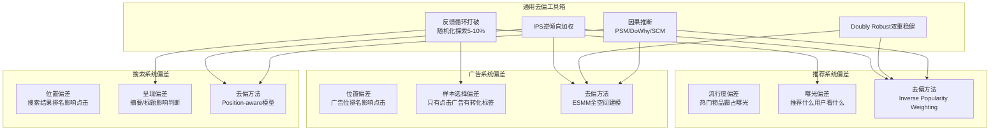

# 偏差治理体系：推荐/广告/搜索中的偏差识别与纠正

> 📚 参考文献
> - [[MMoE_PLE_Pareto|Multi-Objective-Ads-Ranking]] — 多目标广告排序：MMoE、PLE 与 Pareto 优化
> - [[Multi_Objective_Optimization_for_Online_Advertising_Balan|Multi-Objective-Optimization-For-Online-Adverti...]] — Multi-Objective Optimization for Online Advertising: Bala...
> - [[A_Generative_Re_ranking_Model_for_List_level_Multi_object|A Generative Re-Ranking Model For List-Level Multi]] — A Generative Re-ranking Model for List-level Multi-object...
> - [[20260323_multi-agent_llm_systems_coordination_protocols_and_|Multi-Agent Llm Systems Coordination Protocols ...]] — Multi-Agent LLM Systems: Coordination Protocols and Emerg...
> - [[Jointly_Optimizing_Debiased_CTR_and_Uplift_for_Coupons_Ma|Debiased Ctr Uplift Coupon]] — Jointly Optimizing Debiased CTR and Uplift for Coupons Ma...
> - [[esmm_cvr|Esmm-Cvr]] — ESMM：全空间多任务 CVR 预估
> - [[Addressing_Multiple_Hypothesis_Bias_in_CTR_Prediction_for|Multiple-Hypothesis-Bias-Ctr]] — Addressing Multiple Hypothesis Bias in CTR Prediction for...
> - [[EST_Efficient_Scaling_Laws_in_CTR_Prediction_via_Unified|Est-Ctr-Scaling]] — EST: Efficient Scaling Laws in CTR Prediction via Unified...

> 创建：2026-03-24 | 领域：跨域 | 类型：综合分析
> 来源：IPS, Doubly Robust, ESMM, Position Bias Correction, Causal Inference 系列

## 📐 核心公式与原理

### 1. 多目标优化

$$
\min_{\theta} \sum_k \lambda_k L_k(\theta)
$$

- Scalarization 方法，λ 控制任务权重

### 2. Pareto 最优

$$
x^* \text{ is Pareto optimal } \iff \nexists x: f_i(x) \leq f_i(x^*) \forall i
$$

- 不存在在所有目标上都更好的解

### 3. 偏差校正 (IPW)

$$
\hat{R} = \frac{1}{n}\sum_i \frac{r_i}{P(O=1|x_i)}
$$

- 逆倾向加权消除选择偏差

### 4. 位置偏差建模（Examination Hypothesis）

用户点击 = 相关性 × 是否被审视，核心分解公式：

$$
P(\text{click}|\text{pos}) = P(\text{click}|\text{rel, pos}) \times P(\text{exam}|\text{pos})
$$

审视概率随位置衰减，常用幂律建模：$P(\text{exam}|\text{pos}}_{\text{k) = f(k)$，典型形式为 $f(k) = k^{-\eta}}$，其中 $\eta \approx 0.5 \sim 1.0$。

### 5. IPW 损失函数

$$
\mathcal{L}_{IPW} = \sum_{i} \frac{\ell(y_i, \hat{y}_i)}{P(\text{exam}|\text{pos}}_{\text{i)}}
$$

- 位置越靠后的样本，权重越大，补偿审视概率低导致的标签噪声

### 6. SNIPS 归一化估计

为降低 IPW 的高方差，Self-Normalized IPS 对权重归一化：

$$
\hat{R}_{SNIPS} = \frac{\sum_i w_i r_i}{\sum_i w_i}, \quad w_i = \frac{1}{P(\text{exam}|\text{pos}}_{\text{i)}}
$$

### 7. 双重稳健估计（Doubly Robust）

$$
\hat{R}_{DR} = \frac{1}{n}\sum_i \left[\hat{r}(x_i) + \frac{o_i(r_i - \hat{r}(x_i))}{p_i}\right]
$$

- 只要倾向得分 $p_i$ 或回归模型 $\hat{r}(x_i)$ 其中之一正确，估计即无偏

### 8. 倾向得分（Propensity Score）

$$
p(x) = P(T=1|X=x)
$$

- 在因果推断框架中，倾向得分用于平衡处理组与对照组的协变量分布

### 9. 因果效应估计

**平均处理效应（ATE）**：

$$
\tau = E[Y(1) - Y(0)]
$$

**条件平均处理效应（CATE）**：

$$
\tau(x) = E[Y(1) - Y(0)|X=x]
$$

- ATE 衡量总体因果效应，CATE 衡量异质性因果效应（用于 Uplift Modeling）

### 10. 选择偏差量化

$$
\text{Bias} = E[\hat{\theta}] - \theta^*
$$

- 当训练数据非随机采样时，模型估计量 $\hat{\theta}$ 系统性偏离真实值 $\theta^*$

### 11. 曝光公平性（Disparate Impact）

$$
\text{DI} = \frac{P(\text{exposure}|\text{group}}_{\text{a)}}{P(\text{exposure}|\text{group}}_{\text{b)}}
$$

- 美国 EEOC 标准：$\text{DI} < 0.8$ 视为不公平

### 12. 流行度偏差

$$
\text{PopBias}(i) = \frac{\text{freq}(i)}{\sum_j \text{freq}(j)}
$$

- 热门物品的 PopBias 远大于其真实质量应得的曝光比例

### 13. 因果图与 do-calculus

$$
P(Y|do(X)) \neq P(Y|X)
$$

- 干预分布 $P(Y|do(X))$ 与观测条件分布 $P(Y|X)$ 不同，需要因果推断消除混淆

**后门调整公式（Backdoor Adjustment）**：

$$
P(Y|do(X)) = \sum_z P(Y|X,Z=z)P(Z=z)
$$

- 当 $Z$ 满足后门准则时，可通过观测数据估计干预效应

### 14. Heckman 选择校正

$$
E[Y|X, S=1] = X\beta + \rho\sigma_u\lambda(\alpha'Z)
$$

- $\lambda(\cdot)$ 为逆 Mills 比，用于校正样本选择导致的截断偏差（广告 CVR 预估常用）

### 15. 位置去偏 Calibration

$$
P(\text{click}) = \sigma(f(x) - \text{bias}(\text{pos}))
$$

- 推理时将 $\text{bias}(\text{pos})$ 置零或设为默认值，分离位置效应

### 16. Debiased Loss

$$
\mathcal{L}_{debias} = \sum_i \ell(y_i, \hat{y}_i - b_{\text{pos}}_{\text{i}})
$$

- 训练时学习位置偏置 $b_{\text{pos}}_{\text{i}}$，推理时不加入

### 17. 公平性约束

$$
|P(\hat{Y}=1|A=0) - P(\hat{Y}=1|A=1)| \leq \epsilon
$$

- Demographic Parity 要求不同群体获得相近的正预测概率

### 18. KL 散度（分布偏移度量）

$$
D_{KL}(P \| Q) = \sum_x P(x)\log\frac{P(x)}{Q(x)}
$$

- 用于衡量训练分布 $P$ 与真实分布 $Q$ 之间的偏移程度

### 19. 反事实推理

$$
Y_{x}(u) = Y_{M_x}(u)
$$

- 在结构因果模型中，$Y_{x}(u)$ 表示对个体 $u$ 将 $X$ 干预为 $x$ 时 $Y$ 的取值

### 20. Uniform Treatment 偏差

$$
\text{Bias}}_{\text{{UT}} = E_{\pi_0}[r] - E_{\pi_{\text{uniform}}}[r]
$$

- 衡量当前策略 $\pi_0$ 相对于均匀随机策略的系统性偏差

---

## 🎯 核心洞察（5条）

1. **偏差无处不在且种类繁多**：位置偏差（排名靠前被点击多）、选择偏差（只有被展示的才有标签）、流行度偏差（热门物品被过度推荐）、曝光偏差（模型推什么用户看什么，形成反馈循环）
2. **偏差治理的核心工具是因果推断**：从"相关性"到"因果性"——"用户点击了排名第一的广告"不等于"这个广告最好"，需要因果推断方法分离位置效应和真实偏好
3. **IPS（逆倾向加权）是最基础的去偏方法**：给每个样本乘以 1/P(展示|特征) 的权重，数学上等价于在无偏分布上训练，但方差大
4. **双重稳健（Doubly Robust）是实践最优**：结合 IPS 和回归模型的优点，只要 IPS 或回归模型其一正确，估计就是无偏的
5. **位置偏差是三个领域最普遍的问题**：搜索结果、推荐列表、广告排序都有"靠前=被点"的问题，解决方案高度通用

---

## 📈 技术演进脉络

```
忽略偏差直接训练（~2015）
  → IPS 逆倾向加权（2016-2018）
    → ESMM 全空间建模解决选择偏差（2018）
      → 双重稳健估计 DR（2019-2020）
        → 因果表示学习（2021-2023）
          → LLM 辅助因果发现（2024+）
```

**关键转折点**：
- **IPS 引入（2016）**：首次在推荐系统中系统性处理偏差，从"知道有偏差"到"能纠正偏差"
- **ESMM（2018）**：用全空间建模优雅解决 CVR 的样本选择偏差
- **因果推断工具普及（2021）**：DoWhy/EconML 等库使因果推断从理论走向工程实践

---

## 🔗 跨文献共性规律

| 偏差类型 | 推荐 | 广告 | 搜索 |
|---------|------|------|------|
| 位置偏差 | 推荐列表排名 | 广告位排名 | 搜索结果排名 |
| 选择偏差 | 只有曝光物品有标签 | 只有点击广告有转化标签 | 只有被展示的文档有点击标签 |
| 流行度偏差 | 热门物品霸占曝光 | 头部广告主挤压长尾 | 高权重网站排名靠前 |
| 反馈循环 | 推荐什么用户看什么 | 投放什么数据就偏向什么 | 点击什么排名就更高 |

---

## 🎓 常见考点（6条）

### Q1: 推荐/广告中的位置偏差怎么处理？
**30秒答案**：①训练时：加位置特征但推理时置为默认值（"dropout 位置信息"）；②IPS 加权：`weight = 1/P(click|position)`，位置越靠后权重越大；③双塔去偏：单独建一个位置塔，推理时去掉位置塔的影响。
**追问方向**：位置偏差的 propensity 怎么估计？答：经验公式 P(click|pos=k) ∝ 1/k^α（α≈0.5-1.0），或通过 randomization 实验精确估计。

### Q2: ESMM 解决了什么偏差？
**30秒答案**：样本选择偏差——CVR 训练只有"被点击"的样本有转化标签，但推理时要预估"所有曝光"的转化率。ESMM 建模 pCTCVR = pCTR × pCVR，在全曝光空间训练 CTR 任务，间接约束 CVR 任务。
**追问方向**：还有其他解决选择偏差的方法吗？答：①IPS 加权（给点击样本更高权重）；②全空间负采样（随机选未展示的作负例）。

### Q3: IPS 的方差问题怎么缓解？
**30秒答案**：IPS 的权重 1/P 可能极大（罕见事件 P 很小导致权重爆炸），方差大。缓解：①权重裁剪（cap 最大权重为 M）；②Self-Normalized IPS（权重归一化 Σw_i=1）；③Doubly Robust（结合回归模型减少方差）。
**追问方向**：什么是 Doubly Robust？答：DR = IPS 估计 + 回归模型修正项，只要 IPS 或回归其一正确就无偏。

### Q4: 流行度偏差怎么纠正？
**30秒答案**：①训练去偏：对热门物品的正样本降权（inverse popularity weighting）；②推理调整：`score = model_score × popularity^(-β)`，β>0 抑制热门；③因果方法：Causal Embedding 分离"物品质量"和"流行度效应"。
**追问方向**：去偏太狠会怎样？答：过度抑制热门物品导致推荐"冷门但不好"的内容，用户体验下降。

### Q5: 反馈循环（Feedback Loop）怎么打破？
**30秒答案**：①在线随机化：预留 5-10% 流量做随机推荐/展示，获取无偏数据；②离线去偏训练：用 IPS/DR 方法在有偏数据上训练无偏模型；③多样性注入：重排阶段强制引入非模型推荐的物品。
**追问方向**：为什么不能全部随机化？答：用户体验严重下降，只能用小比例流量做探索。

### Q6: 因果推断在推荐/广告中的应用？
**30秒答案**：①Uplift Modeling：预估"推荐这个物品对用户购买的因果效应"而非相关性；②Treatment Effect Estimation：评估广告投放/促销活动的真实效果；③工具变量/断点回归：利用自然实验估计因果效应。

---

### Q7: 搜广推三个领域的技术共性？
**30秒答案**：①都需要召回+排序架构；②都用 CTR/CVR 预估模型；③都面临冷启动问题；④都需要实时特征系统；⑤都可以用 LLM 增强。差异主要在约束条件和评估指标。

### Q8: 多目标优化在三个领域的应用？
**30秒答案**：广告：收入+用户体验+广告主 ROI；推荐：CTR+时长+多样性+留存；搜索：相关性+新鲜度+权威性+多样性。方法共通：Pareto/MMoE/PLE/Scalarization。

### Q9: 偏差问题在三个领域的表现？
**30秒答案**：广告：位置偏差+样本选择偏差；推荐：流行度偏差+曝光偏差；搜索：位置偏差+呈现偏差。解决方法类似：IPW/因果推断/去偏训练。

### Q10: 端到端学习的趋势和挑战？
**30秒答案**：趋势：统一模型替代分层管道（OneRec 统一召排）。挑战：①推理效率（一个大模型 vs 多个小模型）；②可控性差（难以插入业务规则）；③调试困难（黑盒）。
## 🌐 知识体系连接

- **上游依赖**：因果推断理论（Rubin Causal Model, DoWhy）、统计学（IPS, DR）
- **下游应用**：公平推荐、广告效果评估、A/B 测试设计
- **相关 synthesis**：广告系统多目标优化.md, 推荐系统排序范式演进.md
- **相关论文笔记**：synthesis/广告系统偏差治理三部曲.md, rec-sys/推荐系统因果推断.md

## 系统架构


