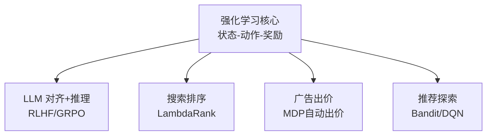

# 强化学习跨域统一视角：从 LLM 推理到搜索排序到广告出价

> 📅 创建：2026-03-26 | 类型：深度整合 | 领域：cross-domain

---

## 🆚 RL 在不同领域的创新对比

| 领域 | 之前方案 | RL 创新 | 代表方法 |
|------|---------|---------|---------|
| LLM 对齐 | SFT 模仿学习 | **RLHF/GRPO 偏好优化** | InstructGPT, DeepSeek-R1 |
| LLM 推理 | 固定推理链 | **RL 涌现长 CoT** | GRPO + 规则奖励 |
| 搜索排序 | 人工排序函数 | **LambdaRank RL 排序** | LambdaMART |
| 广告出价 | 固定出价策略 | **MDP 自动出价** | RL-based Bidding |

---

## 📈 RL 跨域统一


> 🔗 串联领域：llm-infra × search × ads

---

## 📋 一句话洞察

**RL 是 2025-2026 年算法工程的"统一升级引擎"**——在 LLM 推理（GRPO/DeepSeek-R1）、搜索重排序（Rank-R1）、广告出价（HEPO/RTBAgent）三个看似不同的领域，本质都在用同一套 policy gradient 思想解决「如何在复杂空间中最大化不可微目标」。

---

## 📚 参考文献

> - [[deepseek_r1_incentivizing_reasoning_capability_in_llms_via_rl|DeepSeek-R1]] — 纯 RL 激励 LLM 推理能力，GRPO 算法
> - [[qwen3_technical_report|Qwen3 Technical Report]] — 混合推理模式 + MoE 高效 RL 训练
> - LIMO: Less is More for Reasoning — 817 样本激活推理能力，挑战数据规模假设
> - [[rank_r1_enhancing_reasoning_in_llm_based_document_rerankers|Rank-R1]] — RL 训练 LLM Reranker，推理链增强排序
> - Hierarchy Enhanced Policy Optimization (HEPO) — 广告排序分层 PPO，RL 直接优化排序
> - [[rtbagent_llm_agent_for_real_time_bidding|RTBAgent]] — LLM Agent + Tool Use 实时竞价决策
> - [[real_time_bidding_strategy_with_deep_reinforcement_learning|Real-Time Bidding with Deep RL]] — DDPG 自动出价
> - 【20260327新增】[[MTORL_multi_task_offline_RL_advertising|MTORL_multi_task_offline_RL_advertising]] — 多任务离线RL广告系统，CQL保守Q-learning，同时优化CTR/CVR/收益/用户体验4目标
> - 【20260328新增】DAPO — ByteDance开源LLM RL训练系统，Clip-Higher非对称截断 + Token-level PG Loss，30B/70B规模验证

---

## 📐 核心公式与原理

### 1. 策略梯度通用形式（Policy Gradient）

$$
\nabla_\theta J(\theta) = \mathbb{E}_{\tau \sim \pi_\theta}\left[\sum_{t=0}^T \nabla_\theta \log \pi_\theta(a_t|s_t) \cdot \hat{A}_t\right]
$$

三个领域的 $a_t$、$s_t$、$\hat{A}_t$ 含义不同，但梯度形式完全一样。

### 2. GRPO（LLM 推理领域的 RL 实现）

$$
\hat{A}_i = \frac{r_i - \mu_r}{\sigma_r}, \quad \mu_r = \frac{1}{G}\sum_{j=1}^G r_j
$$

$$
\mathcal{L}_\text{GRPO} = -\mathbb{E}\left[\min\left(\text{ratio} \cdot \hat{A}_i, \text{clip}(\text{ratio}, 1\pm\epsilon)\cdot\hat{A}_i\right)\right] + \beta \cdot D_\text{KL}(\pi_\theta || \pi_\text{ref})
$$

无需 Critic，组内相对优势，省显存约 40%。

### 3. 分层 PPO（广告排序领域 HEPO）

$$
\mathcal{L}_H = \mathbb{E}\left[\min\left(\frac{\pi_\theta(a|s)}{\pi_{\theta_\text{old}}(a|s)} \cdot \hat{A}_H, \text{clip}\left(\frac{\pi_\theta}{\pi_{\theta_\text{old}}}, 1\pm\epsilon\right) \hat{A}_H\right)\right]
$$

分层动作空间：粗排层（选集合） × 精排层（排顺序）分别有独立 policy。

### 4. DDPG 出价策略（实时竞价 RTB）

$$
Q^*(s,a) = r + \gamma \max_{a'} Q^*(s', a')
$$

$$
\pi^*(s) = \arg\max_{a} Q(s, a; \theta^Q)
$$

Actor 输出出价 bid，Critic 估计 Q(state=市场状态, action=出价)。

### 5. RL 奖励函数统一形式

$$
r = \underbrace{r_\text{task}}_\text{任务奖励} + \underbrace{\lambda_f \cdot r_\text{format}}_\text{格式约束} - \underbrace{\beta \cdot D_\text{KL}(\pi||\pi_\text{ref})}_\text{漂移惩罚}
$$

三个领域都有类似结构：主奖励 + 约束惩罚 + 策略稳定性正则。

---

## 🎯 核心洞察

### 1. **RL 的前提条件：需要"可验证奖励"**
| 领域 | 奖励信号 | 验证方式 | 难度 |
|------|---------|---------|------|
| LLM 推理 | 答案正确性（0/1）| 规则验证（数学/代码） | ✅ 简单 |
| 搜索排序 | NDCG 改善量 | 人工相关性标注 | 🔶 中等 |
| 广告出价 | 转化收益（CVR × bid_win） | 业务日志 | 🔶 延迟高 |
| 广告多任务（MTORL） | CTR+CVR+收益+用户体验 | Pareto最优 | 🔶 多目标平衡 |
| 对话生成 | 人类偏好 | RM 打分 | ❌ 主观 |

→ **工程建议**：优先在"可验证任务"上部署 RL（数学/代码/出价），慎用于开放生成。

### 2. **三个领域共享的 RL 工程挑战**
- **离线-在线 gap**：RL 在模拟/离线环境训练，真实环境有 distribution shift
- **奖励稀疏/延迟**：广告 CVR 奖励 24-48h 后才知道；搜索点击反馈也有延迟
- **探索成本高**：广告场景探索 = 真实金钱损失；推荐探索 = 用户体验下降
- **训练不稳定**：policy gradient 高方差，需要 clip/KL 约束稳住

### 3. **LLM 为 RL 带来的突破**
- **LLM 作为 Policy**：语言模型天然适合序列决策，"生成下一个词"= 选择 action
- **LLM 作为 Reward Shaper**：RTBAgent 用 LLM 解释竞价策略、设计奖励塑形
- **LLM 作为环境模拟器**：生成合成训练数据，解决探索成本问题

### 4. **数据效率的惊人突破（LIMO 启示）**
LIMO 证明：强预训练模型 + 极少高质量 RL/SFT 样本（817 个）> 弱模型 + 10 万样本。
→ 迁移到搜索/广告：用大 LLM + 少量标注精调，可能 > 传统 GBDT + 百万样本。
这是"预训练大模型 + 小数据 RL 微调"范式的信号。

### 5. **推理能力的跨域迁移**
Rank-R1 = DeepSeek-R1 思想在搜索排序领域的直接迁移：
- LLM 推理：`<think>推理过程</think>最终答案`
- 搜索重排：`<think>分析 query 需求 → 评估 doc 内容 → 判断匹配度</think>相关性分数`
- 广告排序：RTBAgent `<plan>市场分析 → 预算规划 → 出价决策</plan>`

**统一结论**：显式推理链（CoT）+ RL 优化 = 可解释 + 高效能的决策系统。

---

## 🔄 技术演进脉络

```
2017-2020：RL for Ads Bidding（DQN/DDPG）
  ↓ 只能处理结构化状态空间，策略不可解释
  
2020-2022：RLHF（InstructGPT / ChatGPT）
  ↓ RM 奖励让 LLM 对齐，但奖励模型可被 hack
  
2022-2024：RLVR + GRPO（DeepSeek-Math / R1）
  ↓ 可验证奖励 + 无 Critic，推理能力大爆发
  
2024-2025：RL for Search Ranking（Rank-R1）
  ↓ CoT + RL 迁移到排序任务，复杂查询精度大涨
  
2025-2026：LLM Agent + RL（RTBAgent / HEPO）
  ↓ LLM 作为 policy network，工具调用 + 推理链出价
  
未来趋势：全栈 RL（召回 + 粗排 + 精排 + 出价联合优化）
```

---

## 🏭 工程落地 vs 论文 Gap

| 论文亮点 | 工业落地障碍 | 解决方案 |
|---------|------------|---------|
| GRPO 训练 LLM 推理 | 大模型 RL 训练成本极高 | PEFT（LoRA）+ 梯度检查点 |
| Rank-R1 推理重排 | LLM Reranker 延迟 500ms+ | 蒸馏到 7B + 缓存 + 批处理 |
| RTBAgent 实时出价 | LLM 推理 100ms，RTB 需要 <10ms | 提前离线规划 + 在线简单查表 |
| HEPO 分层 PPO | RL 训练不稳定，线上 AB 风险 | Shadow mode 先验证，渐进 rollout |
| LIMO 少样本训练 | 工业数据质量参差不齐 | 严格数据清洗 + 困难样本挖掘 |

---

## 🎓 常见考点

**Q1: 为什么 GRPO 比 PPO 更适合 LLM 推理任务？**
A: PPO 需要 Critic 网络（与 policy 同规模），训练时显存 2x。GRPO 用"组内相对奖励"替代 Critic——对同一 prompt 采样 G 个输出，advantage = (个人奖励 - 组均值)/组标准差，不需要绝对价值估计。对于推理任务，奖励信号是 0/1（答案对错），组内比较足够，无需精确价值函数。DeepSeek-R1 用 GRPO 训练，AIME 从 9% 提升到 80%。

**Q2: Rank-R1 为什么比标准 LLM Reranker 在复杂查询上有优势？**
A: 标准 LLM Reranker 直接输出相关性分数（无推理过程），面对需要多步推理的查询（如"这篇文章是否包含解决问题 X 所需的信息？"），模型容易输出"直觉分数"而不是真正推理。Rank-R1 用 RL 训练强制生成 CoT（推理链）：先分析 query 需求 → 评估 doc 内容 → 判断匹配度，每步注意力聚焦更准确，最终分数更可靠。BRIGHT 基准上 NDCG@10 提升 8-12%。

**Q3: 广告出价 RL（HEPO/DDPG）的奖励延迟问题如何处理？**
A: 转化奖励延迟 24-48h 是 RL 训练最大难点。解决方案：①奖励建模（Reward Model）：训练一个即时 CVR 预测器替代真实奖励 ②分层奖励：CTR（即时）作为 proxy + CVR（延迟）作为最终奖励 ③归因窗口压缩：工程上定义 1-4h 归因窗口，在精度损失可接受范围内缩短延迟 ④离线 Replay Buffer：用历史竞价日志构建 RL 训练数据，规避在线探索成本。

**Q4: LIMO（817样本）的发现对搜索/广告工程团队的启示是什么？**
A: 核心启示：对强预训练基础模型，"数据质量 >> 数据数量"。搜索团队可以用：①极少量（数百个）精心筛选的困难查询-文档相关性标注 + RL/SFT 微调 LLM Reranker，效果可能超过传统方法用百万点击日志训练。广告团队：少量高质量人工策略标注 + RL，可能超过大规模低质量 oCPC 日志训练的出价策略。前提：基础 LLM 要足够强（32B+）。

**Q5: RTBAgent（LLM Agent 出价）工程化落地的最大挑战？**
A: RTB 竞价时间 <10ms，但 LLM 推理通常 100-500ms。解决架构：①离线规划层：LLM 在竞价前（5min 周期）分析市场趋势，生成策略参数表 ②在线执行层：极轻量规则引擎（查表/线性公式）在 <5ms 内执行出价 ③周期更新：LLM 策略 5-15min 刷新一次，而不是每次竞价都调用。本质是把"LLM 的推理"和"出价的执行"解耦，LLM 做策略规划，快速规则做实时决策。

**Q6: RL 在推荐/搜索/广告三个场景的共同陷阱？**
A: ①奖励 Hacking：模型找到奖励设计漏洞（如推荐系统刷低质高点击内容 → CTR 高但 CVR 低）→ 多目标奖励 + KL 正则 ②冷启动探索困难：新广告/新文档没有历史数据 → UCB 探索策略 + 内容 embedding 做相似迁移 ③离线-在线分布偏移：线下 RL 用历史日志，线上实际市场变化 → 定期重训练 + 在线 fine-tuning ④多智能体竞争：多个广告主同时用 RL 出价 → 博弈动态，个体 RL 局部最优 ≠ 全局最优。

**Q7: RLVR（可验证奖励）和 RLHF（人类反馈奖励）各适合什么场景？**
A: RLVR：数学推理/代码生成/逻辑验证（答案对错明确）→ 奖励稳定、无 hacking 风险、适合 GRPO。搜索排序/广告出价（业务指标可量化）→ NDCG/Revenue 作为可验证奖励。RLHF：开放对话/写作/创意 → 没有客观标准，需要人类偏好奖励模型；广告创意生成 → 创意"好坏"主观，需要 RM。实践：两者常结合——先用 RLVR 优化可量化目标，再用 RLHF 精调风格/体验。

**Q8: 为什么"显式推理链（CoT）+ RL"在 2025-2026 年成为主流范式？**
A: 三重驱动：①精度提升：复杂任务（多跳推理/复杂排序/博弈出价）需要中间步骤，CoT 让每步注意力更聚焦 ②可解释性：工业系统需要知道"为什么这样出价/排序"，CoT 提供自然语言解释 ③RL 训练更稳定：有推理链的输出更易被奖励函数分解（过程奖励 > 结果奖励），梯度信号更密集。DeepSeek-R1 (LLM) → Rank-R1 (搜索) → RTBAgent (广告) 的快速扩散证明了这个范式的强迁移性。

**Q9: 分层 RL（如 HEPO）vs 扁平 RL，在广告排序中哪个更优？**
A: 广告排序本质是多层级决策（粗排→精排→出价→创意），扁平 RL 把所有层压缩到一个 policy 里，动作空间指数级爆炸（N个候选排列数 = N!）。分层 RL（HEPO）：上层 policy 选候选集合（降维为子集选择），下层 policy 在子集内排序，各层动作空间大幅压缩，训练效率提升 5-10x，同时保留层间协调优化。实验结果：HEPO 在 CVR 指标上比扁平 PPO 提升约 3-5%。

**Q10: 对于算法工程师，如何系统学习"RL for RecSys/Ads"？**
A: 推荐学习路径：①基础：Sutton RL 教材 Chapter 3-6（MDP/Policy Gradient/Actor-Critic）②算法：DeepMind PPO 论文 + GRPO 论文（DeepSeek-Math）③应用：阿里 RL Bidding (KDD 2018) + 字节 AutoBid ④前沿：HEPO (CIKM 2024) + RTBAgent (arxiv 2024) ⑤实践：手动实现一个简单 DDPG 出价环境（模拟 RTB），用 stable-baselines3 跑通，理解奖励函数设计。关键：RL 不是"银弹"，优先在有明确可验证奖励的子问题上用。

---

---

## 🆕 MTORL专题（20260327补充）：多任务离线RL的工业突破

### 核心问题
广告系统在线RL探索代价极高（随机出价 = 真实金钱损失），而独立任务RL忽略任务间关联。MTORL（Multi-Task Offline RL）在**零在线探索**的前提下同时优化4个目标。

### 关键技术：CQL + 多任务Q函数

**Conservative Q-Learning（CQL）核心公式**：

$$
Q_{CQL}(s, a) = Q(s, a) - \alpha \mathbb{E}_{a\sim\pi}[Q(s, a)] + \alpha \mathbb{E}_{a\sim\beta}[Q(s, a)]
$$

- OOD动作（历史数据未见过的出价）的Q值被压低 → 策略不会冒险在未知区域
- 历史数据中的动作Q值正常估计 → 有数据支撑的区域正常学习

**多任务Q函数**：共享状态编码器 $h(s,a)$，每个任务独立线性头：

$$
Q^{(t)}(s, a) = W^{(t)} \cdot h(s, a)
$$

共享底层表示学到通用广告特征，任务头捕获各自目标差异。

**多任务奖励聚合**：

$$
r_{multi} = \sum_{t=1}^{T} w_t \cdot r_t(s, a)
$$

权重 $w_t$ 由Pareto最优搜索算法自动确定。

### 与其他RL方案对比

| 方案 | 在线探索 | 多任务 | 应用场景 |
|------|---------|--------|---------|
| DDPG（RTB） | ✅ 需要 | ❌ 单任务 | 单指标出价优化 |
| HEPO（分层PPO） | ✅ 需要 | ❌ 单任务 | 广告排序策略 |
| MTORL（CQL） | ❌ 无需 | ✅ 4任务 | 零探索风险多目标广告 |
| RTBAgent（LLM）| ❌ 离线规划 | ✅ 多约束 | 复杂竞价决策 |

**MTORL的独特价值**：不需要任何在线探索，可以直接从历史日志部署，风险最低。

---

## 🆕 DAPO专题（20260328补充）：ByteDance开源LLM RL系统

### 核心贡献
DAPO（Direct Advantage Policy Optimization）是字节广告LLM团队开源的大规模LLM RL训练系统，解决了PPO在70B+模型上训练不稳定、奖励稀疏、工程复杂三大问题。

### 四项关键技术创新

**1. Clip-Higher：非对称截断（核心算法创新）**

标准PPO对称截断：$clip(r_t, 1-\epsilon, 1+\epsilon)$

DAPO非对称截断：

$$
clip(r_t, 1-\epsilon_{low}, 1+\epsilon_{high}), \quad \epsilon_{high} > \epsilon_{low}
$$

- **正向优势动作**（应该强化的行为）：允许更大的更新幅度（$\epsilon_{high}=0.4$），加速好策略的学习
- **负向优势动作**（应该抑制的行为）：更保守地限制（$\epsilon_{low}=0.2$），防止过度惩罚导致策略多样性丧失
- 实验：Clip-Higher单独贡献约**+3% pass@1**（AIME数学竞赛）

**2. Token-Level Policy Gradient Loss**

$$
\mathcal{L}_{DAPO} = -\frac{1}{\sum_t|tokens_t|} \sum_t \sum_k A_t \log \pi_\theta(a_{t,k}|s_{t,k})
$$

相比Sequence-level平均，Token-level Loss对**长推理链（500+ tokens）**更友好，advantage信号不被稀释。

**3. 去除KL惩罚，动态Clip替代**

传统PPO的KL约束项：$r_t - \beta KL[\pi_\theta || \pi_{ref}]$
DAPO通过动态调整clip范围隐式约束策略漂移，简化训练超参数。

**4. 低奖励样本过滤**
对reward极低的group（整批输出都错）不做梯度更新，防止噪声信号污染策略。

### DAPO vs GRPO 对比

| 特性 | GRPO（DeepSeek-R1） | DAPO（ByteDance） |
|------|-------------------|--------------------|
| 核心思想 | 组内相对优势，省Critic | 非对称Clip + Token-level PG |
| KL约束 | 显式KL项 | 无，用Clip-Higher替代 |
| Loss粒度 | Sequence-level | Token-level |
| 验证规模 | 7B-67B | 30B-70B |
| 开源状态 | 是 | 是（vLLM+Ray+Megatron-LM） |

### 跨域启示：广告场景RL训练的特殊考量

广告LLM的RL训练（DAPO落地场景）与通用LLM（DeepSeek-R1）的关键差异：
1. **奖励信号**：广告LLM用CTR/转化率等业务指标，而非数学正确性
2. **内容安全约束**：广告合规要求硬约束，需要额外惩罚项
3. **推理延迟严格**：广告系统不能用大模型，DAPO验证了中型模型（30B）的有效性
4. **分布稳定性**：广告数据分布窄，RL优化更快收敛

---

## 🔑 技术趋势与未来预测

| 趋势 | 现状（2026 Q1） | 预测（12-18 个月） |
|------|---------------|-----------------|
| LLM 推理 RL | DeepSeek-R1/Qwen3 生产可用 | 更小模型（7B）达到同等推理能力 |
| 搜索 RL Reranker | Rank-R1 等研究验证有效 | 大厂生产系统开始 A/B |
| 广告 RL 出价 | HEPO 等工业系统已部署 | LLM Agent 出价从 offline planning 到 semi-online |
| 数据效率 | LIMO 817样本突破 | 工业界"少样本高质量"数据工程成核心竞争力 |
| 统一框架 | 三领域独立 | 跨领域 RL 基础模型（搜推广统一 policy） |
