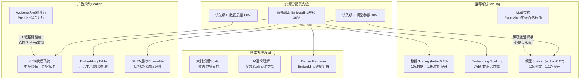

# 推荐系统 Scaling 定律：工程决策指南

> 📅 创建：20260328 | 类型：深度整合 | 领域：cross-domain
> 🔗 串联领域：rec-sys × ads × llm-infra

---

## 📋 一句话洞察

**推荐系统的Scaling定律颠覆了"大模型即王道"的直觉**——推荐模型对参数规模的边际回报（α≈0.07）仅为LLM（α≈0.34）的1/5，但对数据量（β≈0.28）的回报与LLM相当。正确的资源分配顺序是：**数据 > Embedding规模 > 模型参数**，而非盲目扩大网络深度/宽度。

---

## 📚 参考文献

> - [Scaling Laws for Recommendation Models](../../rec-sys/papers/scaling_laws_recommendation_models.md) — 建立推荐Scaling Law方程，α≈0.07 vs LLM 0.34
> - [RankMixer](../../rec-sys/papers/rankmixer_scaling_ranking_models.md) — 字节排序MoE Scaling，千亿参数验证推荐Scaling Law存在
> - [Wukong CTR](../../ads/papers/wukong_ctr_scalable_deep_parallel_training.md) — 快手超大规模CTR并行训练，Pre-LN + 大Batch工程实践
> - [Qwen3 Technical Report](../../llm-infra/papers/qwen3_technical_report.md) — LLM Scaling的对照组，α≈0.34数据规模指数
> - [DHEN](../../ads/papers/dhen_deep_hierarchical_ensemble_ctr.md) — Meta广告Ensemble深化，层次交叉提升的边际效益对比

---

## 📐 核心公式与原理

### 1. 推荐系统Scaling Law方程

$$
L(N, D) = \frac{A}{N^\alpha} + \frac{B}{D^\beta} + L_\infty
$$

**关键参数对比**：

| 参数 | LLM（Chinchilla） | 推荐系统 | 含义 |
|------|-------------------|----------|------|
| $\alpha$（模型规模指数） | ≈ 0.34 | ≈ 0.07 | 参数量每增10×，Loss降 $10^{0.07}≈1.17$× |
| $\beta$（数据量指数） | ≈ 0.29 | ≈ 0.28 | 数据每增10×，Loss降 $10^{0.28}≈1.90$× |
| $L_\infty$（理论下界） | 语言困惑度下界 | 用户行为随机性下界 | 永远无法突破的噪声floor |

**实践含义**：模型参数增大10倍，只换来1.17倍的性能提升；数据增大10倍，换来1.90倍提升。**数据的性价比是模型参数的~1.6倍**。

### 2. Embedding Table的独立Scaling维度

$$
\Delta L_{emb}(V, d) \approx -\gamma \log(V \cdot d)
$$

- $V$：词表大小（item/user数），增大覆盖更多长尾
- $d$：embedding维度，增大提升表征精度
- Embedding Scaling与网络参数Scaling**相互独立**，两个独立的优化维度

### 3. 最优计算预算分配

给定总FLOPs预算 $C$，推荐系统最优分配（实验导出）：

$$
C_{data} : C_{emb} : C_{model} \approx 60\% : 30\% : 10\%
$$

而LLM的最优分配约为 $50\% : 0\% : 50\%$（无Embedding维度）。

### 4. RankMixer MoE Scaling曲线

验证了推荐排序的AUC Scaling Law：

$$
\Delta AUC \propto N^{0.05 \sim 0.08}
$$

（Dense基线）

$$
\Delta AUC_{MoE} \propto N^{0.07 \sim 0.12}
$$

（MoE架构，斜率更陡）

MoE架构比Dense在Scaling时效率更高，是推荐排序超越百亿参数的优选路径。

---

## 🗺️ 技术演进脉络：推荐Scaling的三个阶段

```
推荐系统Scaling历史：

阶段一（2015-2019）：特征工程驱动
├─ 人工特征 + LR/GBDT → 数据多了就加特征，无法Scaling
└─ Scaling手段：堆人工特征 = 低效Scaling

阶段二（2020-2023）：网络结构驱动
├─ DeepFM → DCN V2 → DHEN → 特征交叉深化
├─ 以为更复杂的结构 = 更高AUC
└─ 实验发现：结构改进边际收益递减，超过某点新结构无显著提升

阶段三（2024-2026）：数据+规模双轮驱动（Scaling Law指导下）
├─ Scaling Laws论文：理论化"数据比模型更重要"
├─ RankMixer：MoE让参数Scaling首次在推荐排序持续有效
└─ Wukong：工程突破——如何真正大规模并行训练CTR模型

当前认知：推荐Scaling的"三个维度"
  数据量 >>> Embedding规模 > 模型参数
```

---

## 🔍 横向对比：推荐 vs LLM 的Scaling本质差异

| 维度 | LLM | 推荐系统 | 根本原因 |
|------|-----|----------|---------|
| 模型参数Scaling效益 | 高（α≈0.34） | 低（α≈0.07） | 推荐"知识"在ID Embedding中，不在网络权重里 |
| 数据Scaling效益 | 高（β≈0.29） | 相当（β≈0.28） | 两者都从更多样本中受益 |
| Embedding Scaling | 无此维度 | 关键维度 | 推荐有user/item个体差异，LLM没有 |
| 数据时效性 | 静态语料 | 时效敏感（concept drift） | 推荐旧数据效益递减快 |
| Scaling的"天花板" | 语言理解极限 | 用户行为随机性（$L_\infty$高） | 用户本身不稳定 |

**关键洞察**：LLM通过更多参数来"记住更多世界知识"，效益高。推荐系统通过更多参数来"提升非线性拟合能力"，但用户行为的固有随机性（$L_\infty$）限制了拟合上限——拟合能力再强，用户行为本身就是随机的。

---

## 🎯 核心洞察（老师视角）

### 洞察1：推荐系统"买的是数据，不是模型"
Scaling Law的结论对产品和商业决策有直接影响：与其花预算买更多GPU训更大的模型，不如花同等预算采集更高质量的训练数据（用户反馈、精准标注、多模态内容信号）。数据飞轮（用户越多数据越好模型越好用户更多）比模型规模更重要。

### 洞察2：Embedding Table是推荐的"独特资产"
LLM没有用户/物品级别的个体表征，而推荐系统的Embedding Table存储了每个用户和物品的个性化向量。这张表越大（更多item、更高维度），推荐越精准。Scaling Law验证了$V \cdot d$与性能对数正比——这是推荐系统**独有的Scaling维度**，是护城河。

### 洞察3：RankMixer解答了"为什么之前推荐模型Scaling看起来没用"
之前推荐模型Scaling不起效的原因：架构瓶颈——Dense网络在参数超过百亿后推理延迟无法接受（无法线上serving），被迫停在百亿以内，看起来Scaling到达上限。RankMixer用MoE突破了这个瓶颈：稀疏激活使千亿参数模型的推理FLOPs与百亿Dense相当，首次让推荐排序的Scaling突破百亿障碍。

### 洞察4：推荐Scaling Law预示"数据工程是未来核心竞争力"
既然数据效益最高（β≈0.28），推荐系统的竞争将从"谁的模型架构更好"转向"谁有更高质量的数据"——负反馈清洗、多模态标注、真实意图挖掘、长期反馈收集。数据工程师和数据质量将成为推荐系统的核心竞争力。

### 洞察5：Wukong是"Scaling的工程基础设施论文"
没有Wukong这样解决大规模并行训练稳定性（Pre-LN + Large-Batch + 混合并行）的工程突破，Scaling Law的理论收益将永远停留在论文里。Scaling Law告诉你"去哪"，Wukong这样的系统告诉你"怎么去"。

---

## 🏭 工程决策指南：给算法工程师的操作手册

### 场景一：新项目，如何分配计算预算？

```
推荐计算预算分配公式（经验法则）：

总预算 = 100单位GPU·小时

优先级1：数据收集/清洗（~40单位）
  - 增加高质量正反馈标注
  - 清洗机器流量/误点击
  - 收集多模态内容信号

优先级2：Embedding规模（~30单位）
  - 扩大item Embedding维度（64→256）
  - 增加用户行为序列长度
  - 引入更多侧信息Embedding

优先级3：训练数据量（~20单位）
  - 增加历史数据时间窗口（注意时效衰减）
  - 数据增强（负采样策略优化）

优先级4：模型参数扩大（~10单位）
  - 最后考虑，先用MoE而非Dense
  - 注意推理延迟约束
```

### 场景二：存量项目，如何判断是否值得继续Scaling？

```python
# 简化的Scaling回报预测
def estimate_scaling_return(current_auc, target_compute_multiplier, dimension='data'):
    alpha = {'model': 0.07, 'data': 0.28, 'embedding': 0.15}  # 经验估计
    baseline_loss = 1 - current_auc  # 简化
    expected_loss_reduction = baseline_loss * (1 - target_compute_multiplier ** (-alpha[dimension]))
    expected_auc_gain = expected_loss_reduction
    return expected_auc_gain

# 示例：当前AUC=0.71，数据增加10x的预期AUC提升
gain = estimate_scaling_return(0.71, 10, 'data')
# 预期增益 ≈ 0.0082（+0.008 AUC，推荐场景约等于显著提升）
```

### 场景三：Scaling实验设计（如何验证Scaling Law存在？）

```
Step 1：选择候选Scaling维度（优先数据量或Embedding）
Step 2：控制其他变量，只改变目标维度
  - 数据量Scaling：固定模型，跑1x/2x/5x/10x数据
  - 模型Scaling：固定数据，跑100M/300M/1B/3B参数
Step 3：记录各点的验证集logloss
Step 4：用最小二乘拟合 L = A/N^α + C
  - 若R² > 0.95，说明该维度有稳定的Scaling Law
  - 若曲线plateau（Slope → 0），说明该维度已饱和
Step 5：用拟合曲线预测全量规模的收益，与成本对比
```

---

## 🎓 常见考点（≥10题）

**Q1：推荐系统的Scaling Law和LLM最大的区别是什么？背后的原因？**
A：模型参数的Scaling指数α：推荐≈0.07，LLM≈0.34，差5倍。根本原因：LLM通过参数记忆世界知识（参数即知识），参数越多记忆越丰富；推荐系统的"知识"存在ID Embedding表中（用户/item的行为模式），网络参数只提供拟合能力，但用户行为本身的随机性（$L_\infty$高）限制了拟合的上限，所以继续增加参数边际收益快速递减。

**Q2：为什么推荐系统的Embedding Table Scaling如此重要？如何确定最优维度？**
A：Embedding Table直接记录了每个user/item的个性化特征向量，是推荐系统的核心信息储库。维度增大：每个entity能区分更细粒度的特征；词表增大：覆盖更多长尾item。经验法则：维度从64→256效益显著，256→512中等，512以上几乎无收益。词表：对频繁出现的item分配独立Embedding，低频item截断（tail-cutting）节省内存。

**Q3：RankMixer如何突破了推荐排序Scaling的瓶颈？**
A：传统Dense排序模型的Scaling瓶颈：参数超百亿后推理延迟超出线上SLA，被迫停止Scaling。RankMixer用稀疏MoE解决：参数量可以扩展到千亿（专家数×单专家参数），但推理时只激活Top-K专家，实际FLOPs与百亿Dense模型相当。这使得参数Scaling和推理延迟首次解耦，突破了"百亿瓶颈"。

**Q4：如何用小规模实验预测大规模的Scaling效益？**
A：在10%的数据和模型规模上，测试3-5个不同规模点（如1x、2x、5x模型参数或数据量），记录验证集logloss，用最小二乘拟合$L = A/N^\alpha + C$，如果拟合R²高说明该维度有稳定Scaling行为，用外推预测全量规模的AUC增益。注意：推荐Scaling有时效性（旧数据效益递减），外推要考虑数据质量折扣。

**Q5：为什么推荐系统"数据时效性"会影响Scaling效益？**
A：用户行为随时间变化（concept drift），3个月前的点击行为对今日推荐的信息价值远低于昨日的。简单堆积历史数据，旧数据会引入distribution shift噪声，抵消了数据量增加的正向效益。实践：对历史数据做指数衰减权重（越旧权重越小），通常有效数据窗口为1-3个月，超出窗口的数据贡献边际价值趋近于零。

**Q6：什么时候应该"数据优先"，什么时候"模型优先"？**
A：数据优先：(1) 当前数据质量差（大量噪声、稀疏标注），增加数据或清洗数据效益高；(2) 模型参数已超百亿，Scaling法则预测继续增大参数AUC提升<0.01%；(3) Embedding维度<256，embedding维度提升空间大。模型优先：(1) 数据已非常丰富（十亿级），新增数据边际效益降低；(2) 线上AUC已接近同类基准，结构改进可能更快突破；(3) 有强监督信号的稀疏任务（如精确转化），更多参数提升长尾表达。

**Q7：Wukong CTR如何解决大规模并行训练的稳定性问题？**
A：Pre-LN（Layer Norm前置）是核心：$h^{(l)} = h^{(l-1)} + F(LN(h^{(l-1)}))$，梯度通过残差路径直接传播，不受LayerNorm缩放影响，使10+层深网络训练稳定。Large-Batch训练：学习率线性缩放+线性Warmup。混合并行：Embedding参数分布在Parameter Server（PS），Dense网络做数据并行+模型并行，支持千亿样本级别的训练。

**Q8：如何用Scaling Law来论证"为什么投入数据比投入GPU更划算"？**
A：以具体数字举例（基于推荐Scaling Law）：数据增加10倍（β=0.28），AUC提升预期约+0.008-0.015（视任务而定）；模型参数增加10倍（α=0.07），AUC提升预期约+0.002-0.005。数据Scaling的AUC效益约为模型Scaling的3-4倍。在成本端：收集/清洗数据的成本通常远低于购买GPU的成本（尤其对于有存量日志的大公司）。因此数据的性价比远高于GPU。

**Q9：推荐系统Scaling Law的适用边界是什么？什么情况下不适用？**
A：不适用情况：(1) 冷启动阶段：新用户/新item数据极少，Scaling Law基于"有数据"假设；(2) 特征工程不足时：如果特征表达能力本身有问题（缺失关键特征），Scaling无法弥补特征设计的缺陷；(3) 分布严重漂移时：如节假日/大促期间的数据分布与日常差异大，在该分布外推的Scaling预测不准；(4) 超长尾场景：极长尾item极少交互，Embedding Scaling对尾部收益有限。

**Q10：给定3个月期限和有限资源，按照Scaling Law，推荐系统的优化优先级是什么？**
A：第1个月（快速见效）：数据质量提升——清洗机器流量（通常能提升AUC +0.005-0.015）、优化负采样策略（正负比例、困难负样本）、增加近期数据权重。第2个月（中期效益）：Embedding规模扩大——ID Embedding维度提升（64→256），引入行为序列Embedding（用户近30天点击序列）。第3个月（长期布局）：数据飞轮——增加用户反馈信号（显式评分、停留时长、转化行为），建立长期数据积累管道。全程不优先：盲目扩大模型参数——仅在前两项收益饱和后才考虑。

---

## 🔑 总结：推荐系统Scaling的工程决策矩阵

```
资源分配决策树（Scaling优先级）：

1. 数据质量 > 数据量 > 模型参数
   当前AUC增长停滞？
   ├─ 是否有大量噪声数据？→ 清洗优先
   ├─ Embedding维度 < 256？→ 扩大Embedding优先
   ├─ 训练数据 < 10亿样本？→ 增加数据优先
   └─ 以上都满足 → 才考虑扩大模型参数（用MoE而非Dense）

2. MoE是突破百亿参数瓶颈的唯一选项
   ├─ 线上延迟 < 20ms → 稀疏MoE（如RankMixer）
   └─ 线上延迟 < 5ms → MoE蒸馏成Dense serving

3. Embedding Table是推荐的"核心资产"
   ├─ 定期清理低频item（tail-cutting）
   ├─ 高频item给更高维度（hierarchical embedding）
   └─ 冷启动item用内容embedding初始化
```

## 系统架构


