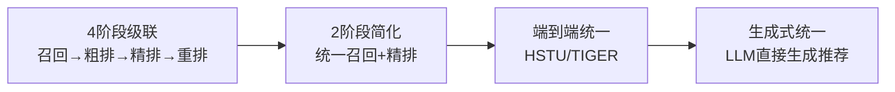

# 端到端统一架构：消除多阶段Stage Gap

> 📅 创建：2026-03-27 | 领域：跨域（推荐×广告） | 类型：深度整合
> 🔗 核心主题：Stage Gap消除 | 统一架构 | 生成式预训练

---

## 🆚 创新点 vs 之前方案

| 维度 | 传统多阶段 | 端到端统一（创新） |
|------|----------|------------------|
| 架构 | 召回→粗排→精排→重排（4阶段） | **统一模型一步到位** |
| 问题 | Stage Gap：各阶段目标不一致 | 全局优化，无信息丢失 |
| 训练 | 各阶段独立训练 | **联合训练 / 预训练+微调** |
| 代表 | 工业标准架构 | HSTU(Meta), TIGER(Google) |

---

## 📈 架构演进



---

## 📌 一句话洞察

**2026年推荐/广告系统最核心的架构演进：用"统一大模型"替代"分阶段流水线"，从根本上消除Stage Gap。**

同一天（2026-03-27），推荐和广告领域各自独立提出了同样的解法——GPR（Generative Pre-Trained Recommendation/Ranking），这不是巧合，而是工业界集体认知到多阶段系统的系统性缺陷。

---

## 📚 参考文献

> - [[GPR_generative_pretraining_ads_ranking|GPR_generative_pretraining_ads_ranking]] — 广告GPR：生成式预训练统一CTR预测/CVR预测/相关性/冷启动
> - GPR_generative_pre_trained_recommendation — 推荐GPR（微信）：统一召回+精排+出价，CTR+7.2%，GMV+5.1%
> - [[OneRanker_unified_generation_ranking|OneRanker_unified_generation_ranking]] — OneRanker：生成分支+排序分支统一，AUC+0.8%，GMV+2.3%
> - [[OneTrans_unified_feature_interaction_sequence|OneTrans_unified_feature_interaction_sequence]] — OneTrans：统一特征交叉+序列建模，参数减少30%
> - HSTU_trillion_parameter_sequential_transducers — HSTU（Meta）：万亿参数推荐，线性注意力解决超长序列

---

## 🔍 什么是Stage Gap？

传统多阶段推荐/广告系统的核心缺陷：

```
传统架构：
召回（优化Recall） → 粗排（优化精度） → 精排（优化AUC） → 出价（优化ROI）
    ↑                    ↑                    ↑                  ↑
独立目标           独立目标              独立目标           独立目标
    
Stage Gap（每个阶段切换目标时的信息损失 + 目标错位）：
- 召回截断：精排阶段永远看不到被截掉的"潜在好物"
- 目标错位：召回最优 + 精排最优 ≠ 全链路最优
- 知识孤岛：每阶段独立训练，不能共享学到的用户偏好表示
- 冷启动弱：新广告/物品历史数据少，每个子任务独立建模效果差
```

---

## 📐 核心公式与原理

### 公式1：统一生成框架（推荐/广告通用）

$$
P(a_1, a_2, ..., a_k | u, c) = \prod_{i=1}^{k} P(a_i | u, c, a_1, ..., a_{i-1})
$$

一个模型输出 = 完整的推荐列表/广告候选集，无需多阶段级联。

### 公式2：OneRanker统一损失

$$
\mathcal{L} = \lambda_1 \mathcal{L}_{gen} + \lambda_2 \mathcal{L}_{rank} + \lambda_3 \mathcal{L}_{align}
$$

- $\mathcal{L}_{gen}$：自回归生成损失（学习"生成哪些候选"）
- $\mathcal{L}_{rank}$：LambdaRank/ListNet（学习"候选内部如何排序"）
- $\mathcal{L}_{align}$：两分支表示对齐（防止生成和排序的特征空间分裂）

### 公式3：OneTrans统一注意力

$$
\text{h}}_{\text{{unified}} = \text{Transformer}(\text{token}}_{\text{{field}} \oplus \text{token}}_{\text{{sequence}})
$$

同一个Transformer处理结构化特征（Field Token）+ 行为序列（Sequence Token），消除"特征交叉模块"和"序列模块"之间的Gap。

### 公式4：HSTU线性注意力（解决超长序列Stage Gap的效率瓶颈）

$$
\text{Attn}(Q, K, V) = \phi(Q) \cdot (\phi(K)^T V), \quad O(n) \text{ vs } O(n^2)
$$

只有解决序列长度限制，才能真正实现"统一用户全历史"的端到端建模。

---

## 🎯 五大统一维度的技术演进

### 维度1：多子任务统一（GPR for Ads）
```
传统：CTR模型 ⊥ CVR模型 ⊥ 相关性模型 ⊥ 冷启动打分模型（4套独立系统）
统一：一个GPR大模型 + Task Token区分任务（[CTR]/[CVR]/[RELEVANCE]/[COLDSTART]）
效果：冷启动广告有效打分，维护成本 4套→1套
```

### 维度2：多阶段统一（GPR for Rec / OneRanker）
```
传统：双塔召回 → DNN粗排 → DCN精排 → 规则重排 → 出价（5个独立模型）
统一（GPR-rec）：一个预训练大模型，3个输出头（召回/精排/出价）
统一（OneRanker）：生成头（无ANN召回）+ 排序头（精确打分）
效果：GPR-rec CTR+7.2%，GMV+5.1%；OneRanker AUC+0.8%，GMV+2.3%
```

### 维度3：特征交叉×序列建模统一（OneTrans）
```
传统：DCN-v2（结构化特征交叉）+ SASRec（序列建模）两套网络
统一：一个Transformer处理所有Token（field-token + sequence-token）
效果：参数减少30%，两类特征互相attention带来的增益约40%
```

### 维度4：超长序列统一（HSTU）
```
传统：序列长度限制在200-500（Transformer O(n²)），远期历史被截断
统一：线性注意力O(n) + 两级结构（item-level + segment-level）
效果：支持10,000+ token用户历史，万亿参数scaling，在线CTR显著提升
```

### 维度5：多模态统一（E2E Semantic ID）
```
传统：文本特征、图片特征、用户行为各自独立，多路特征拼接
统一：内容→RQ-VAE量化→Semantic ID，文本/图片/行为统一token空间
效果：冷启动Recall@50 +40%，零样本跨域迁移成为可能
```

---

## 🏭 工程落地Gap分析

| 统一维度 | 论文效果 | 工业落地挑战 | 解决方案 |
|---------|---------|------------|---------|
| GPR多子任务统一 | 冷启动CTR+15% | 词表动态更新，新广告冷启动embedding | 内容embedding作proxy，逐渐过渡到ID embedding |
| GPR多阶段统一 | CTR+7.2%，GMV+5.1% | 生成式召回比ANN慢10-100倍 | beam search剪枝 + 知识蒸馏到轻量模型 |
| OneRanker双头 | AUC+0.8%，GMV+2.3% | 生成和排序损失的权重调优 | λ1:λ2:λ3 = 1:2:0.5（实验调优） |
| OneTrans统一 | 参数-30%，效果持平 | 结构化token和序列token的位置编码设计 | 分别用field-type embedding和相对位置编码 |
| HSTU超长序列 | 万亿参数提升 | 3D并行训练基础设施成本极高 | 仅Meta/字节/Google级别可负担 |

---

## 🎓 常见考点（12条，含深度追问）

**Q1: 什么是Stage Gap？为什么多阶段系统存在这个问题？**
A: Stage Gap = 多阶段推荐系统中，各阶段独立优化局部目标，导致全链路目标次优。根本原因：①目标不一致（召回优化Recall，精排优化AUC，出价优化ROI）；②信息截断（粗排截掉的候选精排永远看不到）；③知识不共享（各阶段独立训练，特征表示不互通）。举例：完美召回100个候选+完美精排这100个 ≠ 全局最优Top-10，因为最优Top-10可能在被截断的候选里。

**Q2: GPR同时在推荐（微信）和广告（多家公司）独立提出，说明什么？**
A: 说明Stage Gap是工业界普遍认识到的系统性问题，不是个别场景。2026年多家大厂几乎同时发布GPR，证明"生成式预训练+多任务统一"是解决Stage Gap的正确方向。从工程角度：这也是模型serving团队减负的动力——维护1套系统比4套系统成本低得多。

**Q3: OneRanker的生成头和排序头如何协同学习？**
A: 共享Transformer主干，两个头有独立投影层：①无候选集时→生成头自回归生成推荐列表（替代ANN召回）；②有候选集时→排序头对候选集做listwise排序（替代精排模型）；③训练时两头同时优化，align损失强制两头的特征空间一致。关键：生成任务学习"全局候选分布"，这个信息传递给排序头，让排序更全局化；排序任务的精确打分反过来指导生成头。

**Q4: OneTrans和"DCN + SASRec双模块"相比，40%的增益来自哪里？**
A: 来自跨类型attention。在OneTrans里，结构化特征的token可以与行为序列的token互相做attention：比如"用户年龄"（field token）可以与"最近点击的商品序列"（sequence token）交叉，学到"年轻用户更喜欢序列里的短视频类商品"这种跨类型的模式。在双模块架构里，DCN只处理结构化特征，SASRec只处理序列，两者的交叉只在最终拼接层，信息交流不充分。

**Q5: HSTU线性注意力的核心思路是什么？如何保证效果不损失？**
A: 标准softmax注意力：$\text{Attn}(Q,K,V) = \text{softmax}(QK^T/\sqrt{d})V$，先算QK^T（n×n矩阵），复杂度O(n²)。线性注意力：用核函数φ(x)近似exp，利用矩阵结合律 $\phi(Q)(\phi(K)^TV)$，先算K^TV（d×d矩阵），O(n)复杂度。效果保证：①φ通常用ELU+1（避免零值）；②双级注意力（item-level短程精确 + segment-level长程粗粒度）；③Meta在HSTU上验证：线性注意力 + 双级结构在离线NDCG和在线CTR上与标准Transformer持平，但支持10000+ token。

**Q6: 为什么GPR能解决新广告冷启动？传统CTR模型不能吗？**
A: 传统CTR模型：新广告没有历史ID embedding，随机初始化→打分随机→展示少→数据少→学习慢，恶性循环。GPR的解法：①共享预训练主干学到了通用广告语义表示（从海量老广告学习）；②Task Token [COLDSTART]让模型专门学习"用内容特征推理新广告效果"；③不依赖ID embedding，依赖内容token（文本/图片），新广告上线即有有效打分。效果：冷启动期CTR+15%。

**Q7: 端到端统一系统上线，A/B测试应如何设计？**
A: 推荐按"替换阶段"渐进式实验：①先替换召回（统一生成召回 vs 双塔），固定精排不变；②确认召回正向后，再用统一模型同时覆盖召回+精排；③最后引入出价头统一出价。不要一次性换掉全链路（风险高，出问题难以定位）。指标：召回实验看Recall@50/200；精排实验看AUC/GAUC；全链路看CTR/GMV/留存；特别关注冷启动期新物品/新广告的指标变化。

**Q8: 多阶段架构和统一架构在工程维护上的对比？**
A: 多阶段：5套代码库 × 5套监控 × 5套特征工程 × 5套serving，任何一个阶段的特征变动都要向下游同步，协同开发成本极高。统一架构：1套代码库，但需要更大算力（模型变大3-10倍），serving时延压力更大。工程取舍：大厂选统一（省人力）；中小厂选多阶段（serving成本可控）。

**Q9: 生成式推荐系统中如何防止生成"幻觉"（生成不存在的物品ID）？**
A: ①Trie约束Beam Search：构建所有合法物品ID的Trie树，生成时每步只允许选合法前缀，从算法层面保证输出在合法空间内；②Semantic ID层次化设计：高层码字粒度粗（类目），低层码字精细（具体物品），错误会被高层拦截；③后处理过滤：对生成结果做合法性校验，非法ID用最近邻替换。HSTU的做法：不生成Semantic ID，直接对用户历史建模做next-item预测，幻觉问题较小。

**Q10: 为什么"统一架构"在2025-2026年才成为主流，而不是更早？**
A: 三个前提条件在2025年同时成熟：①大规模预训练范式（LLM）的成功证明了"统一预训练+任务微调"的有效性，迁移到推荐/广告有了方法论基础；②大规模分布式训练基础设施（3D并行）让万亿参数统一模型的训练成为可能；③线性注意力（HSTU等）解决了序列推荐的计算效率瓶颈，让统一架构在serving延迟上可接受。

**Q11: GPR-ads 和 GPR-rec 的核心区别是什么？**
A: GPR-ads：多个广告ranking子任务统一（CTR/CVR/相关性/冷启动），通过Task Token区分，重点解决子任务知识孤岛问题。GPR-rec（微信）：召回→精排→出价三阶段统一，重点解决多阶段Stage Gap问题。前者是"任务维度"统一，后者是"阶段维度"统一。但两者底层思想一致：预训练学通用表示 + 多任务头处理不同子问题。

**Q12: 面试中如何展现对Stage Gap的深度理解？**
A: 建议三层回答：①定义（一句话：多阶段目标不一致导致全链路次优）；②举例（召回截断问题：精排永远看不到被截掉的最优候选）；③解法（三类：蒸馏对齐上下游目标/统一预训练GPR/生成式统一OneRanker）。加分项：提到HSTU验证了scaling law、微信GPR的线上效果数据（CTR+7.2%，GMV+5.1%），说明这不只是学术问题，已经有工业级验证。

---

## 🔮 未来预测（2026-2027）

| 趋势 | 当前状态 | 12个月预测 |
|------|---------|-----------|
| GPR工业部署 | 微信/腾讯已上线 | 阿里/字节/美团跟进 |
| 统一召排架构 | OneRanker/GPR初步验证 | 主流大厂A/B测试 |
| 万亿参数推荐 | Meta HSTU量产 | 更多公司跟进，成为标配 |
| 无ANN召回 | OneRanker生成式召回研究阶段 | 小规模灰度（延迟问题需解决） |
| 全链路联合优化 | 论文验证 | 工程实现（训练框架标准化） |

---

## 🌐 知识体系连接

- **上游依赖**：`生成式范式统一视角.md`、`rec-sys/synthesis/生成式推荐系统技术全景_2026.md`
- **下游应用**：`ads/synthesis/广告系统智能化升级路径_2026.md`
- **相关主题**：`多目标优化统一框架.md`（MTORL多任务）、`长序列处理_推荐搜索LLM共同挑战.md`（HSTU）
