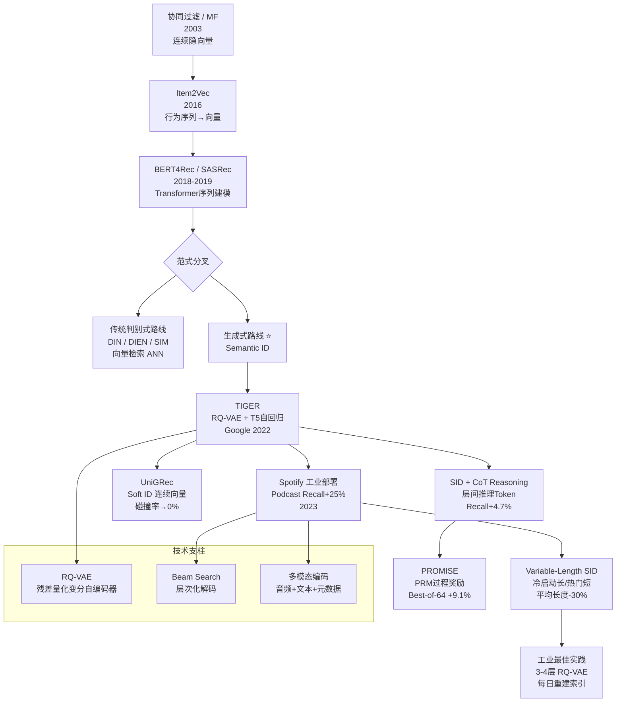

# Semantic ID 演进工作总结知识图谱

> 整理自 ai-kb 相关笔记 | 更新时间：2026-04-04  
> 覆盖：TIGER / RQ-VAE / Variable-Length / Spotify部署 / UniGRec / Reasoning SID

---

## 演进时间线

| 年份 | 工作 | 核心贡献 | 局限 |
|------|------|---------|------|
| 2003 | 协同过滤 / MF | 用户-物品矩阵分解，隐向量表示 | ID 无语义，无法处理冷启动 |
| 2013 | Word2Vec | Skip-gram 语义向量，相邻词向量相近 | 词粒度，无层次化 |
| 2016 | Item2Vec | 把商品当"词"，从会话序列学 Embedding | 连续向量，无法生成式 |
| 2018 | BERT4Rec / SASRec | Transformer 序列建模，attention 捕捉依赖 | 仍是判别式，大量 ID look-up |
| 2022 | **TIGER** (Google) | RQ-VAE 离散化物品 → Semantic ID + T5 自回归生成 | 两阶段训练，量化误差 |
| 2023 | **Spotify Generative Retrieval** | 工业级部署，Podcast 召回 Recall+25% | 固定长度 ID，新物品重建成本 |
| 2023 | **Variable-Length Semantic IDs** | 冷启动长 ID 精确区分，热门短 ID 高效；平均长度-30% | 索引复杂度增加 |
| 2024 | **Semantic ID Reasoning** (CoT) | 在 ID 生成每层前插入推理 token，Recall@10 +4.7% | 推理 token 增加延迟 |
| 2024 | **UniGRec** (Soft ID) | 连续 soft token 替代离散 ID，物品碰撞率→0% | 存储成本大（千万物品≈10-50GB）|
| 2025 | **IDProxy** | 用多模态 LLM 生成冷启动 Embedding；蒸馏方式注入 | 依赖高质量多模态内容 |
| 2026 | **Reasoning SID + PROMISE** | test-time compute scaling + PRM 过程奖励；Best-of-64 Recall+9.1% | 推理计算成本高 |

---

## 知识图谱（Mermaid）



---

## 核心技术对比

### 1. 离散 vs 连续 ID

| 维度 | 离散 Semantic ID（RQ-VAE） | 连续 Soft ID（UniGRec） |
|------|--------------------------|------------------------|
| **表示方式** | 层次化码字序列 [C1,C2,C3] | 连续向量序列（soft tokens）|
| **量化误差** | 有（RQ-VAE 重建损失） | 无（端到端可微）|
| **物品碰撞** | 有（~3.2%） | 0%（唯一向量）|
| **存储成本** | 小（整数序列） | 大（千万物品 ≈ 10-50GB）|
| **可解释性** | 层次化语义（类目→子类→SKU）| 无直接解释 |
| **端到端训练** | 两阶段（先训 VAE 再训 LM）| 可端到端（+2.4%）|
| **工业部署** | Spotify 已落地 | 存储是障碍 |

### 2. 固定 vs 可变长度 ID

```
固定长度 L=3：[C1, C2, C3]
  - 热门物品：过度精细，浪费计算
  - 冷启动物品：可能碰撞（不同物品 ID 相同）

可变长度：
  冷启动新品（少信息）→ L=5 [C1,C2,C3,C4,C5]  精确区分
  热门头部物品（丰富交互）→ L=2 [C1,C2]         高效表示
  平均长度减少 30%，索引大小减少 28%
```

### 3. RQ-VAE 核心公式

**残差量化（Residual Quantization）**：

$$
c_l = \arg\min_{k \in \mathcal{C}_l} \|z_l - e_k\|_2, \quad l = 1, \ldots, L
$$

$$
z_{l+1} = z_l - e_{c_l} \quad \text{（残差逐层消解）}
$$

其中 $z_1 = \text{Encoder}(x)$，$e_k$ 为第 $l$ 层 codebook 中第 $k$ 个向量。

**重建损失**（含 straight-through estimator）：

$$
\mathcal{L}_{RQ} = \|x - \hat{x}\|_2^2 + \sum_{l=1}^{L} \|z_l - e_{c_l}\|_2^2 + \beta \sum_{l=1}^{L} \|z_l^{\text{sg}} - e_{c_l}\|_2^2
$$

**自回归生成目标**（T5/Transformer）：

$$
P(\text{item} | \text{history}) = \prod_{l=1}^{L} P(c_l | c_1, \ldots, c_{l-1}, \text{history})
$$

### 4. 推理增强（SID + CoT）

在每层 token 生成前插入可学习的 reasoning tokens：

$$
P(c_l | c_{<l}, h) = \text{Transformer}\left([h; r_1, \ldots, r_K; c_{<l}]\right)[c_l]
$$

其中 $r_1, \ldots, r_K$ 是层间推理 token（隐式 chain-of-thought）。

---

## 工程落地要点

### Spotify 工业实践（关键数字）

| 指标 | 数值 |
|------|------|
| RQ-VAE 层数 | 3-4 层（codebook 大小 512-1024）|
| 召回延迟 | P99 < 50ms（Beam Search + Early Stop）|
| 索引更新频率 | 每日重建（防止 ID 空间漂移）|
| 冷启动提升 | Podcast Recall@K +25% vs 协同过滤 |
| 编码器服务 | 独立轻量 Encoder Service（新 item 实时 ID 生成）|

### 常见工程踩坑

1. **ID 空间漂移**：RQ-VAE 重新训练后 codebook 索引变化，下游模型要重建 → 解决：固定 codebook 定期软更新，或对 ID 空间变化做 adapter 对齐
2. **物品碰撞**：多个物品映射到同一 [C1,C2,C3] → 解决：增加 L 层数，或使用可变长度
3. **冷启动 Encoder 延迟**：新物品需实时推理 Encoder → 解决：独立部署轻量 Encoder（和召回 Decoder 分离）
4. **Beam Search 候选膨胀**：beam_size × beam_size × ... 指数爆炸 → 解决：层次化 Beam（先粗后细）+ pruning

### 部署架构

```
[用户请求]
    ↓
[历史行为序列] → [Decoder (T5/Transformer)] → [生成 Semantic ID 序列]
                                                      ↓
                              [Semantic ID → 物品 倒排索引] → [Top-K 物品]
                                                      ↓
                                           [Encoder (RQ-VAE)] ← [新物品内容]
```

---

## 面试常见考点

**Q1: Semantic ID 相比 Item Embedding 最核心的区别是什么？**

A: 三个核心区别：① **表示形式**：连续向量 vs 离散码字序列（层次化语义）② **推荐范式**：向量相似度检索（ANN）vs 自回归序列生成 ③ **冷启动**：传统 Embedding 需要历史交互，Semantic ID 只需内容（纯 Encoder 推理）。本质区别：Semantic ID 让推荐变成了「语言模型的 Next Token 预测」问题。

**Q2: RQ-VAE 的 straight-through estimator 是什么？为什么需要？**

A: 量化操作 $c_l = \arg\min_k \|z_l - e_k\|_2$ 是不可微的（离散选择）。STE 的 trick 是：前向传播用量化值，反向传播时梯度直接穿过（$\frac{\partial c_l}{\partial z_l} \approx 1$），即把量化层当恒等映射处理梯度。否则梯度无法流回 Encoder，整个 RQ-VAE 无法端到端训练。

**Q3: 为什么 Spotify 选择「每日重建索引」而不是增量更新？**

A: RQ-VAE 的 codebook 是全局优化的——添加新物品会扰动整个向量空间。增量更新会导致 ID 语义不一致（老物品 ID 不变但语义漂移）。每日全量重建虽然成本高，但保证 ID 空间的一致性。权衡：索引重建成本 vs 语义一致性。未来方向是「持续学习版 RQ-VAE」。

**Q4: Variable-Length Semantic ID 如何在 Beam Search 中处理不同长度？**

A: 用 EOS（End-of-Sequence）token 表示 ID 结束。Beam Search 时，某个分支生成 EOS 即停止扩展，其他分支继续。最终所有候选按总概率排序。实现上，短 ID 物品（L=2）在第 2 层生成 EOS 后，其 beam 概率已固定，与长 ID 物品（L=5）在第 5 层结束的 beam 公平比较。

**Q5: Soft ID（UniGRec）为什么物品碰撞率是 0%？**

A: 因为每个物品的 Soft ID 是其 Encoder 输出的唯一连续向量，不存在量化映射。离散 Semantic ID 的碰撞是 codebook 容量有限（如 codebook_size=512）导致不同物品被量化到同一码字组合。Soft ID 的向量空间是连续的，两个不同物品的 Encoder 输出几乎不可能完全相同。

**Q6: PROMISE 的 PRM（Process Reward Model）和 ORM 的区别？**

A: ORM（Outcome Reward Model）只评估最终推荐列表的质量（结果级别）；PRM 在生成每个 Semantic ID token 时实时评估中间步骤的质量（过程级别）。实验结果：PRM 比 ORM 好 2.3%，因为 PRM 能更早剪枝错误路径，引导 Beam Search 更高效探索。

---

## 关联文档

- [SemanticID从论文到Spotify部署](~/Documents/ai-kb/rec-search-ads/rec-sys/01_recall/synthesis/SemanticID从论文到Spotify部署.md)
- [生成式推荐系统技术全景_2026](~/Documents/ai-kb/rec-search-ads/rec-sys/01_recall/synthesis/生成式推荐系统技术全景_2026.md)
- [生成式推荐范式统一_20260403](~/Documents/ai-kb/rec-search-ads/rec-sys/synthesis/生成式推荐范式统一_20260403.md)
- [PDF题库第22章 LLM与生成式推荐](~/Documents/ai-kb/rec-search-ads/interview/pdf-qa/第22章_LLM与生成式推荐.md)

---

## 相关概念

- [[concepts/generative_recsys|生成式推荐统一视角]]
- [[concepts/attention_in_recsys|Attention 在搜广推中的演进]]
- [[concepts/vector_quantization_methods|向量量化方法]]
- [[concepts/sequence_modeling_evolution|序列建模演进]]
- [[concepts/embedding_everywhere|Embedding 技术全景]]
