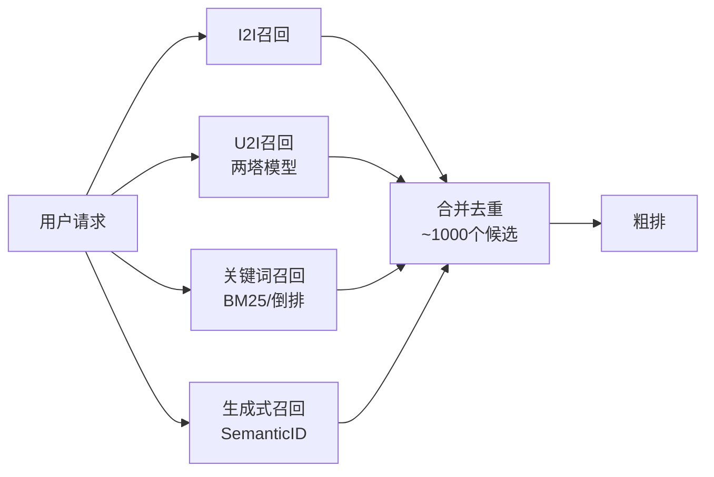

# 召回系统工业界最佳实践

> 📚 参考文献
> - [A-Unified-Language-Model-For-Large-Scale-Search...](../../04_multi-task/papers/A_Unified_Language_Model_for_Large_Scale_Search_Recommend.md) — A Unified Language Model for Large Scale Search, Recommen...
> - [Etegrec Generative Recommender With End-To-End Lea](../papers/ETEGRec_Generative_Recommender_with_End_to_End_Learnable.md) — ETEGRec: Generative Recommender with End-to-End Learnable...
> - [A Generative Re-Ranking Model For List-Level Multi](../../03_rerank/papers/A_Generative_Re_ranking_Model_for_List_level_Multi_object.md) — A Generative Re-ranking Model for List-level Multi-object...
> - [Act-With-Think Chunk Auto-Regressive Modeling For ](../papers/Act_With_Think_Chunk_Auto_Regressive_Modeling_for_Generat.md) — Act-With-Think: Chunk Auto-Regressive Modeling for Genera...
> - [Linear-Item-Item-Session-Rec](../../02_rank/papers/Linear_Item_Item_Model_with_Neural_Knowledge_for_Session.md) — Linear Item-Item Model with Neural Knowledge for Session-...
> - [Deploying-Semantic-Id-Based-Generative-Retrieva...](../papers/Deploying_Semantic_ID_based_Generative_Retrieval_for_Larg.md) — Deploying Semantic ID-based Generative Retrieval for Larg...
> - [Gems-Breaking-The-Long-Sequence-Barrier-In-Gene...](../papers/GEMs_Breaking_the_Long_Sequence_Barrier_in_Generative_Rec.md) — GEMs: Breaking the Long-Sequence Barrier in Generative Re...
> - [Din-Deep-Interest-Network](../../02_rank/papers/DINDeep_Interest_Network.md) — DIN：深度兴趣网络（Deep Interest Network）

> MelonEggLearn 整理 | 召回系统核心技术全景

## 架构总览



## 📐 核心公式与原理

### 1. 双塔相似度

$$
score(u, i) = \frac{E_u^T E_i}{\|E_u\| \|E_i\|}
$$

- 用户塔和物品塔的余弦相似度

### 2. Softmax 损失

$$
L = -\log \frac{\exp(s_{u,i^+})}{\exp(s_{u,i^+}) + \sum_{j \in Neg} \exp(s_{u,j})}
$$

- Sampled softmax 训练双塔模型

### 3. ANN 检索

$$
\text{Top-K} = \text{HNSW}(E_u, \{E_i\}_{i \in \mathcal{I}})
$$

- 近似最近邻从百万候选中检索

---

## 目录

1. [微信看一看：万亿参数双塔模型](#1-微信看一看万亿参数双塔模型)
2. [快手双塔召回：负样本采样策略](#2-快手双塔召回负样本采样策略)
3. [Pinterest PinSage：图神经网络召回](#3-pinterest-pinsage图神经网络召回)
4. [YouTube DNN：经典深度召回架构](#4-youtube-dnn经典深度召回架构)
5. [小红书MHSA：多头自注意力召回](#5-小红书mhsa多头自注意力召回)
6. [阿里EGES：Graph Embedding召回](#6-阿里eges-graph-embedding召回)
7. [字节TDM：树形深度检索](#7-字节tdm树形深度检索)
8. [多路召回分数校准](#8-多路召回分数校准序关系保持)
9. [向量数据库选型对比](#9-向量数据库选型faissmilvusproxima对比)
10. [ANN近似最近邻：HNSW原理](#10-ann近似最近邻hnsw原理)

---

## 1. 微信看一看：万亿参数双塔模型

### 核心原理

微信看一看采用**多路召回架构**，深度模型召回涵盖四类：
- **序列模型**：利用用户历史行为序列建模短期兴趣
- **双塔模型（DSSM）**：用户塔与物品塔分离，内积计算相似度
- **混合模型（DMB）**：融合语义信息、阅读历史、长短期兴趣、上下文信息
- **图模型（GraphDR）**：基于邻居相似度的无监督训练，兼顾准确率与多样性

**模型演进路径**：
```
双塔DSSM → Multi-View DNN → Attention增强 → 多塔多目标模型
```

### 工程细节

**在线服务架构**：
```
用户请求 → 实时预测User Embedding → ANN检索 → TopK物品返回
                ↓                      ↓
           在线计算               离线预计算Item Embedding
```

**关键优化点**：
| 优化方向 | 具体措施 | 效果 |
|---------|---------|------|
| 多业务融合 | Multi-View DNN结合图文、视频、小视频信息 | 冷启动用户明显提升 |
| 特征丰富度 | 增加side information（类目映射、tag映射） | 用户/物品表示更准确 |
| 训练方式 | Pair-wise形式的双塔模型 | 预测能力提高 |
| 结构增强 | 结合Attention、FM结构 | 模型表达能力增强 |
| 多目标 | 多塔多目标模型，融合点击、分享、时长等指标 | 业务指标全面提升 |

**内容试探机制**：
- 跨域用户兴趣试探
- 中长尾闭集合兴趣试探  
- 全集合试探模型
- 闭环验证体系（试探成功率、点击率、多样性）

### 优劣对比

| 维度 | 优势 | 挑战 |
|-----|------|------|
| 规模 | 支持十亿级用户/内容 | 模型参数达万亿级，训练成本高 |
| 多样性 | 多路召回+图模型保障内容多样性 | 多路融合策略复杂 |
| 冷启动 | Multi-View + 内容试探有效解决 | 新内容质量识别难度大 |
| 实时性 | User Embedding实时计算 | Item Embedding更新周期较长 |

---

## 2. 快手双塔召回：负样本采样策略

### 核心原理

双塔模型的核心思想是将召回视为**超大规模多分类问题**：
- 将物料库中所有item视为类别
- 用户Embedding与物品Embedding内积计算相似度
- 通过Softmax输出概率分布

**关键认知**：选对正负样本的作用 > 改进模型结构

### 工程细节

#### 正样本选择
- **定义**：曝光且有点击的「用户-物品」二元组
- **问题**：28法则导致正样本大多是热门物品
- **解决**：过采样冷门物品 或 降采样热门物品

#### 负样本策略（关键！）

| 负样本类型 | 来源 | 特点 |
|-----------|------|------|
| **简单负样本** | 全体物品随机采样 | 绝大多数用户根本不感兴趣 |
| **Batch内负样本** | 同Batch其他正样本 | 与正样本共享用户，计算高效 |
| **困难负样本** | 被召回但被排序淘汰 | 用户可能感兴趣但不够强 |

**⚠️ 重要禁忌**：
> **曝光但未点击的物品不能作为召回负样本！**
> 
> 原因：能通过精排曝光说明已非常匹配用户兴趣，未点击不代表不感兴趣（可能碰巧没点击或对其他更感兴趣）。这类样本适合做排序的负样本，甚至可做召回的正样本。

#### 负采样纠偏（YouTube方案）

```python
# 物品i被抽到的概率pi正比于点击次数（热门程度）
# 训练时调整相似度：
score = cos(a, b_i) - log(p_i)  # 减log(pi)纠偏

# 线上召回时恢复正常：
score = cos(a, b_i)  # 不减log(pi)
```

**采样概率公式**：抽样概率 ∝ (点击次数)^0.75

#### 训练方式对比

| 方式 | 原理 | 适用场景 |
|-----|------|---------|
| **Pointwise** | 独立二分类，正负样本1:2~1:3 | 快速迭代 baseline |
| **Pairwise** | Triplet Loss: max(0, cos(a,b⁻)+m-cos(a,b⁺)) | 强调相对顺序 |
| **Listwise** | Softmax多分类，一条正样本+n条负样本 | 精度要求高 |

### 优劣对比

| 维度 | 优势 | 挑战 |
|-----|------|------|
| 训练效率 | Batch内负采样无需额外采样 | 热门物品偏差需要纠偏 |
| 区分能力 | 困难负样本提升模型精度 | 困难样本选择增加复杂度 |
| 工程落地 | Pointwise简单易部署 | Pairwise/Listwise调参复杂 |

---

## 3. Pinterest PinSage：图神经网络召回

### 核心原理

PinSage被誉为**"GCN在工业级推荐系统的首次成功运用"**，基于GraphSAGE改进，解决三大核心问题：

1. **可扩展性**：传统GCN需要操作完整图拉普拉斯矩阵，无法处理数十亿节点
2. **特征融合**：结合图结构和节点特征（视觉、文本）
3. **高效推理**：从O(N)降低到亚线性复杂度

**核心思想**：
```
User-Item交互图 + Random Walk采样 + 局部图卷积 → Item Embedding
```

### 工程细节

#### 三大关键创新

**1. On-the-fly Convolutions（动态卷积）**
- 传统GCN：特征矩阵 × 图拉普拉斯幂次（需全图操作）
- PinSage：采样节点邻域，动态构建计算图
- 优势：无需在训练时操作全图

**2. Random Walk邻居采样**
```
传统K-hop：固定邻居，数量不可控
PinSage：Random Walk采样，按访问次数选择Top-K重要邻居
```
- 优势1：考虑邻居重要性（Importance Pooling）
- 优势2：固定邻居数量，控制内存占用
- 效果：相比K-hop提升46%离线指标

**3. MapReduce高效推理**
- 推理阶段采用MapReduce分布式计算
- 预计算所有节点Embedding
- 线上通过LSH快速检索

#### 模型架构

```
输入：Pin图像特征(VGG) + 文本特征(Word2Vec)
        ↓
   多层卷积模块（参数共享）
        ↓
   聚合邻居信息 + 非线性变换
        ↓
   输出：Pin Embedding（用于I2I召回）
```

**训练策略**：
- 使用hard negative mining（困难负样本挖掘）
- Margin-based损失函数
- 70亿样本训练，30亿节点、180亿边

### 优劣对比

| 维度 | 优势 | 挑战 |
|-----|------|------|
| 规模 | 支持30亿节点、180亿边 | 图构建和随机游走计算量大 |
| 效果 | A/B测试提升30%用户参与度 | 需要大量工程优化才能落地 |
| 冷启动 | 利用多模态特征缓解 | 新物品需要重新计算Embedding |
| 多样性 | 图结构天然捕捉高阶相似性 | 可能过度聚集热门区域 |

---

## 4. YouTube DNN：经典深度召回架构

### 核心原理

YouTube DNN（2016）是深度学习推荐系统的奠基之作，采用**经典两阶段架构**：

```
召回阶段（Candidate Generation）→ 排序阶段（Ranking）
   （百万→百级）                    （百级→十级）
```

**核心创新**：将推荐问题建模为**超大规模多分类问题**

```
P(watch=i|u,c) = exp(u·v_i) / Σ_j exp(u·v_j)

u: 用户+上下文的高维Embedding
v_j: 视频j的Embedding向量
```

### 工程细节

#### 召回模型架构

```
输入层：
├── 观看历史序列 → Embedding → Average Pooling → Watch Vector
├── 搜索历史序列 → Embedding → Average Pooling → Search Vector  
├── 人口统计学特征（年龄、性别、地域）→ Embedding
└── 上下文特征 → 归一化

隐藏层：3层ReLU全连接层（256→128→64）

输出层：
├── 训练：Softmax输出百万级分类概率
└── 服务：输出User Embedding，通过ANN检索TopK
```

#### 关键工程技巧

| 技巧 | 原理 | 效果 |
|-----|------|------|
| **Example Age** | 引入视频上传时间特征 | 解决用户对新视频的偏好 |
| **Predicting Next Watch** | 只用历史行为预测下一个观看 | 避免未来信息泄露 |
| **等数量采样** | 每个用户取相同数量样本 | 防止活跃用户主导损失 |
| **特征平方/平方根** | 数值特征的非线性变换 | 引入特征非线性表达能力 |
| **Negative Sampling** | 从全库采样负样本 | 加速训练，近似Softmax |

#### Serving阶段优化

```
训练阶段：Softmax输出概率分布
   ↓
服务阶段：
   ├── 预计算所有Video Embedding
   ├── 实时计算User Embedding  
   └── 通过LSH/ANN近似最近邻检索TopK
```

### 优劣对比

| 维度 | 优势 | 挑战 |
|-----|------|------|
| 扩展性 | 支持百万级视频库 | Softmax层计算量大 |
| 灵活性 | DNN可处理离散+连续特征 | 特征工程仍很重要 |
| 实时性 | 用户Embedding实时计算 | 模型更新周期较长 |
| 冷启动 | Example Age帮助新视频 | 长尾视频学习不充分 |

---

## 5. 小红书MHSA：多头自注意力召回

### 核心原理

MHSA（Multi-Head Self-Attention）多头自注意力机制在召回层的应用：

```
用户行为序列 → 多个注意力头并行计算 → 融合多视角兴趣表示
```

**核心思想**：
- 不同注意力头关注行为序列的不同方面
- 头1：关注品类偏好
- 头2：关注价格敏感度
- 头3：关注时效性偏好

### 工程细节

#### MHSA计算流程

```python
# 1. 线性投影生成Q、K、V
Q = W_q · x    # Query
K = W_k · x    # Key  
V = W_v · x    # Value

# 2. 分割多头（h个头）
Q → [Q_1, Q_2, ..., Q_h]
K → [K_1, K_2, ..., K_h]
V → [V_1, V_2, ..., V_h]

# 3. 缩放点积注意力（每个头）
Attention_i = softmax(Q_i · K_i^T / √d_k) · V_i

# 4. 合并多头 + 线性变换
Output = W_o · concat([head_1; head_2; ...; head_h])
```

#### 召回层应用架构

```
用户Last-N行为序列
    ↓
物品ID Embedding
    ↓
MHSA层（多头自注意力）→ 学习序列内物品间关系
    ↓
Pooling/平均 → 固定长度用户表示
    ↓
双塔结构 → User Embedding ↔ Item Embedding
```

**关键设计**：
- **位置编码**：引入可学习的位置编码，保留时序信息
- **因果掩码**：防止未来信息泄露（auto-regressive）
- **残差连接**：稳定深层网络训练

### 优劣对比

| 维度 | 优势 | 挑战 |
|-----|------|------|
| 表达能力 | 多头捕捉多维度兴趣 | 计算复杂度O(n²)，序列长度受限 |
| 长依赖 | 自注意力机制捕捉长距离依赖 | 长序列训练不稳定 |
| 可解释 | 注意力权重可视化兴趣焦点 | 多头意义不明确需要调试 |
| 效率 | 可并行计算 | 相比RNN/Pooling计算量大 |

---

## 6. 阿里EGES：Graph Embedding召回

### 核心原理

EGES（Enhanced Graph Embedding with Side Information）解决推荐系统三大挑战：
- **可扩展性（Scalability）**：支持十亿级用户和物品
- **稀疏性（Sparsity）**：用户只与少量物品交互
- **冷启动（Cold Start）**：新物品无历史行为

**演进路线**：BGE → GES → EGES

```
BGE: 基础图Embedding（仅ID特征）
GES: 引入Side Information（类别、品牌等）
EGES: 加权融合多源Side Information
```

### 工程细节

#### 构图与采样

```
1. Session划分：用户行为按30分钟间隔切分Session
2. 有向图构建：Session内连续物品建立有向边
3. 边权重计算：物品转移频次归一化
4. Random Walk：基于转移概率生成序列
```

#### Side Information融合

**GES（平均融合）**：
```
H_v = (W_self + W_category + W_brand + ...) / (n+1)
```

**EGES（注意力加权）**：
```
H_v = Σ_j [exp(a_j) · W_j] / Σ_j exp(a_j)

其中：
- a_j: 第j类side information的可学习权重
- W_j: 第j类特征的Embedding
- 指数形式保证权重为正
```

**冷启动处理**：
- 新物品无ID Embedding，但有Side Information
- 通过加权平均Side Information Embedding获得初始表示

#### 训练流程

```
用户行为序列
    ↓
构建物品共现图（有向带权图）
    ↓
Random Walk生成序列
    ↓
Skip-Gram负采样训练
    ↓
输出：物品Embedding + 各Side Info权重
```

### 优劣对比

| 维度 | 优势 | 挑战 |
|-----|------|------|
| 冷启动 | Side Information有效解决新物品问题 | 需要维护完整的属性体系 |
| 可解释 | 注意力权重反映特征重要性 | 权重矩阵存储成本高 |
| 扩展性 | 图结构天然支持大规模 | 图构建和Random Walk计算量大 |
| 精度 | 捕获高阶协同信号 | 对稀疏物品学习仍不充分 |

---

## 7. 字节TDM：树形深度检索

### 核心原理

TDM（Tree-based Deep Model）解决向量内积检索表达能力有限的问题：

```
传统双塔：User Embedding · Item Embedding（内积，线性）
TDM：复杂DNN输出用户对树节点的偏好概率（非线性）
```

**核心思想**：
- 将全库物品组织成树结构（叶子节点=物品）
- 非叶子节点是物品的抽象表示
- 利用树结构将O(N)检索降低到O(log N)
- 用户与物品提前交互（非内积形式）

### 工程细节

#### 树结构设计

```
              根节点（抽象表示）
             /              \
         节点1              节点2
        /    \             /    \
     节点3   节点4      节点5    节点6
    /  \    /  \      /  \     /  \
  物品 物品 物品 物品  物品 物品 物品 物品
  
叶子节点：具体物品
非叶子节点：语义聚类中心
```

#### 训练与检索流程

**训练阶段**：
```
1. 初始化树结构（聚类或随机）
2. 构建样本：正样本=用户交互物品的叶子节点+所有祖先
3. 每层采样负样本
4. 训练DNN预测 P(node|user)
5. 交替优化树结构和模型参数（EM算法）
```

**检索阶段（Beam Search）**：
```
1. 从根节点开始，计算所有子节点偏好分
2. 保留Top-K节点，进入下一层
3. 重复直到叶子层
4. 返回Top-K叶子节点作为召回结果
```

#### 模型结构

```
输入：用户特征 + 节点Embedding
    ↓
多层DNN（可引入Attention、交叉特征）
    ↓
输出：用户对节点的偏好概率
```

**TDM系列演进**：
| 版本 | 核心改进 |
|-----|---------|
| TDM 1.0 | 基础树模型，树结构固定 |
| JTM 2.0 | 联合训练树结构和模型参数 |
| OTM 3.0 | 解决训练-测试分布不一致问题 |

### 优劣对比

| 维度 | 优势 | 挑战 |
|-----|------|------|
| 表达能力 | 复杂DNN替代内积，表达能力更强 | 树结构学习困难 |
| 检索效率 | O(log N)复杂度 | 树不平衡影响效果 |
| 冷启动 | 非叶子节点可表示新物品 | 稀疏叶子节点学习不充分 |
| 工程落地 | 与现有DNN框架兼容 | 树结构维护成本高 |

---

## 8. 多路召回分数校准（序关系保持）

### 核心原理

多路召回面临的核心问题：**不同召回源的分数不可比**

```
向量召回：余弦相似度 [0, 1]
热门召回：热度分 [0, 10000]
协同过滤：相似度 [-1, 1]
规则召回：无分数
```

**校准目标**：在保持各路召回内部序关系的前提下，实现全局可比

### 工程细节

#### 方案一：归一化（Normalization）

```python
# Min-Max归一化
score_norm = (score - min_score) / (max_score - min_score)

# Z-Score标准化  
score_norm = (score - mean) / std
```
- **优点**：简单易实现
- **缺点**：受异常值影响，物理意义不一致

#### 方案二：渠道加权（Channel-wise Weighting）

```python
# 离线统计各路召回的CTR/CVR作为权重
final_score = α_channel × normalized_score

# 多路共识加分
if item in multiple channels:
    final_score += bonus  # 体现多路共识置信度
```
- **优点**：符合业务直觉，易于解释
- **缺点**：权重需要持续调优

#### 方案三：轻量级模型融合（推荐）

```
输入：
├── 各路召回原始分数
├── 召回来源ID
├── 物品基础特征
└── 用户基础特征

模型：LR / GBDT / 浅层NN
输出：统一排序分（预估CTR）

本质：将"召回融合"升级为"粗排"
```

#### 方案四：保序变换（Order-Preserving）

```python
# 使用各路召回的排序位次而非原始分数
# RRF (Reciprocal Rank Fusion)
score_rrf = Σ 1 / (k + rank_i)

其中rank_i是物品在第i路召回中的排序
```
- **优点**：完全消除量纲影响，严格保序
- **缺点**：丢失分数幅度信息

### 工程实践要点

| 问题 | 解决方案 |
|-----|---------|
| 去重 | 多路召回必然重复，取最大分或加权和 |
| 兜底策略 | 过滤后候选不足时，热门队列强插补足 |
| 多样性保护 | MMR（最大边缘相关）或显式多样性控制 |
| 配额分配 | 动态配额 vs 固定配额（动态更优） |

### 优劣对比

| 方案 | 优势 | 挑战 |
|-----|------|------|
| 归一化 | 简单快速 | 异常值敏感 |
| 渠道加权 | 可解释性强 | 权重调优成本高 |
| 模型融合 | 效果最优 | 增加计算延迟 |
| RRF | 严格保序 | 丢失分数信息 |

---

## 9. 向量数据库选型：Faiss/Milvus/Proxima对比

### 核心原理

向量数据库的核心能力：**近似最近邻（ANN）搜索**

```
精确KNN：O(N×d) - 遍历所有向量
ANN：O(log N) 或 O(√N) - 索引加速，牺牲少量精度
```

### 工程细节

#### 产品定位对比

| 维度 | Faiss | Milvus | Proxima |
|-----|-------|--------|---------|
| **定位** | 向量搜索库 | 云原生向量数据库 | 阿里自研向量引擎 |
| **开发方** | Meta(Facebook) | Zilliz/LF AI | 阿里巴巴 |
| **架构** | 单机库 | 分布式服务 | 分布式服务 |
| **部署** | 嵌入应用 | 独立服务 | 阿里内部服务 |

#### 功能特性对比

| 特性 | Faiss | Milvus | Proxima |
|-----|-------|--------|---------|
| **索引类型** | IVF、HNSW、PQ | IVF、HNSW、ANNOY、RNSG | IVF、HNSW、PQ |
| **相似度度量** | 欧氏、余弦、内积 | 欧氏、余弦、内积、自定义 | 欧氏、余弦、内积 |
| **数据规模** | 单机≤1亿 | 分布式≥10亿 | 分布式十亿级 |
| **GPU加速** | ✅ | ✅ | ✅ |
| **增量更新** | ⚠️需重建 | ✅支持 | ✅支持 |
| **多模态** | ❌ | ✅ | ❌ |

#### 性能对比（百万级SIFT1M）

| 指标 | Faiss | Milvus |
|-----|-------|--------|
| IVF_FLAT延迟 | 0.8ms | 1.2ms |
| IVF_PQ延迟 | 0.5ms | 0.7ms |
| 召回率 | 95% | 95% |
| 内存占用 | 300MB | 400MB |

**亿级以上数据**：
- Faiss：单机无法存储（1亿×768维≈300GB内存）
- Milvus：分布式线性扩展，10个节点支持10亿+

### 选型建议

| 场景 | 推荐选择 | 理由 |
|-----|---------|------|
| 学术研究/小规模 | Faiss | 轻量灵活，性能极致 |
| 企业级线上服务 | Milvus | 分布式、高可用、运维完善 |
| 阿里生态/国内 | Proxima | 国内优化，与PAI深度集成 |
| 离线批量处理 | Faiss GPU | GPU加速，批量查询快 |
| 实时在线服务 | Milvus | 低延迟、高并发 |

### 优劣对比

| 维度 | Faiss | Milvus | Proxima |
|-----|-------|--------|---------|
| 优势 | 单机性能极致、轻量 | 分布式扩展、企业级特性 | 阿里生态优化、国内支持 |
| 挑战 | 无服务化、需自建封装 | 部署复杂、资源占用较高 | 生态相对封闭 |

---

## 10. ANN近似最近邻：HNSW原理

### 核心原理

HNSW（Hierarchical Navigable Small World）分层可导航小世界图：

```
核心思想：构建多层图结构，上层稀疏快速定位，下层稠密精确搜索
类比：高速公路（顶层）→ 城市主干道（中层）→ 本地小路（底层）
```

**理论基础**：
- **小世界网络**：任意两节点可通过短路径到达
- **可导航性**：贪婪路由可找到最近邻
- **分层结构**：分离不同尺度连接，实现log复杂度

### 工程细节

#### 分层图结构

```
Layer 2 (顶层):  ●───────●      ← 长距离连接，快速跳跃
                │       │
Layer 1 (中层):  ●───●───●───●  ← 中等距离，区域导航
                │   │   │   │
Layer 0 (底层):  ●─●─●─●─●─●─●  ← 全量数据，精确搜索
```

**层数分配**：
- 每个节点随机分配最高层数，概率指数衰减
- 层数越高，节点越少，连接越长
- 期望层数：O(log N)

#### 构建算法

```python
# 插入新节点q
1. 随机选择层数l = -ln(uniform(0,1)) × m_L

2. 从顶层开始，找到最近入口点

3. 逐层下降：
   for layer in reversed(range(l+1)):
       # 贪婪搜索找到最近邻
       candidates = greedy_search(entry_point, q, efConstruction)
       # 选择M个邻居建立连接
       neighbors = select_neighbors(candidates, M)
       add_edges(q, neighbors)
       entry_point = q

4. 底层(Layer 0)扩展更多连接(M_max0 > M_max)
```

#### 搜索算法

```python
# 查询向量q，返回k近邻
def search(q, k, ef):
    # 从顶层开始
    entry_point = random_entry()
    
    # Zoom-in阶段：快速定位大致区域
    for layer in reversed(range(1, max_layer)):
        entry_point = greedy_search_layer(q, entry_point, 1)
    
    # 精确搜索阶段：在底层找k近邻
    candidates = greedy_search_layer(q, entry_point, ef)
    return top_k(candidates, k)

def greedy_search_layer(q, entry_point, ef):
    # 维护动态候选集W
    W = {entry_point}
    visited = {entry_point}
    
    while True:
        # 找到W中距离q最近的未访问节点
        closest = argmin([dist(q, c) for c in W - visited])
        if dist(q, closest) > max_dist(W):
            break
        visited.add(closest)
        # 扩展邻居
        for neighbor in neighbors(closest):
            if neighbor not in visited:
                W.add(neighbor)
                if len(W) > ef:
                    W.remove(farthest(W))
    return W
```

#### 关键参数

| 参数 | 含义 | 影响 |
|-----|------|------|
| **M** | 每层邻居数 | 越大图越稠密，召回率↑，内存↑ |
| **efConstruction** | 构建时搜索范围 | 越大构建越慢，图质量↑ |
| **efSearch** | 查询时搜索范围 | 越大召回率↑，延迟↑ |
| **M_max** | 非零层最大度数 | 控制上层连接数 |
| **M_max0** | 零层最大度数 | 控制底层连接数，通常更大 |

### 优劣对比

| 维度 | HNSW优势 | HNSW挑战 |
|-----|---------|---------|
| 查询速度 | O(log N)复杂度，毫秒级 | 内存占用大（需存储全图） |
| 召回率 | 95%+（参数调优后） | 高召回需要牺牲延迟 |
| 增量更新 | 支持动态插入 | 频繁更新导致图质量下降 |
| 通用性 | 支持任意距离度量 | 对高维稀疏数据效果下降 |
| 并行性 | 查询可并行 | 构建过程难并行化 |

**HNSW vs 其他ANN算法**：

| 算法 | 构建复杂度 | 查询复杂度 | 内存占用 | 适用场景 |
|-----|-----------|-----------|---------|---------|
| HNSW | O(N log N) | O(log N) | 高 | 通用，性能均衡 |
| IVF | O(N) | O(√N) | 中 | 内存受限 |
| LSH | O(N) | O(N^ρ) | 低 | 低精度要求 |
| PQ | O(N) | O(N) | 低 | 极致压缩 |

---

## 总结

| 技术方案 | 核心优势 | 适用场景 | 落地难度 |
|---------|---------|---------|---------|
| 微信双塔 | 多路融合、内容理解 | 内容推荐 | ⭐⭐⭐ |
| 快手负采样 | 样本工程精细 | 双塔模型优化 | ⭐⭐ |
| PinSage | 图神经网络、多模态 | 图结构明显的场景 | ⭐⭐⭐⭐ |
| YouTube DNN | 经典架构、工程成熟 | 视频推荐 | ⭐⭐ |
| MHSA | 序列建模能力强 | 行为序列丰富 | ⭐⭐⭐ |
| EGES | 冷启动友好 | 电商推荐 | ⭐⭐⭐ |
| TDM | 表达能力突破内积限制 | 需要复杂交互建模 | ⭐⭐⭐⭐ |
| 分数校准 | 多路融合优化 | 多路召回系统 | ⭐⭐ |
| 向量数据库 | ANN加速 | 大规模向量检索 | ⭐⭐ |
| HNSW | 高效ANN索引 | 通用ANN场景 | ⭐⭐ |

---

## 参考文献

1. Covington P, Adams J, Sargin E. Deep neural networks for youtube recommendations. RecSys'16
2. Ying R, et al. Graph convolutional neural networks for web-scale recommender systems. KDD'18
3. Wang J, et al. Billion-scale commodity embedding for e-commerce recommendation in Alibaba. KDD'18
4. Zhu H, et al. Learning tree-based deep model for recommender systems. KDD'18
5. Malkov YA, Yashunin DA. Efficient and robust approximate nearest neighbor search using hierarchical navigable small world graphs. IEEE TPAMI'20
6. Yi X, et al. Sampling-bias-corrected neural modeling for large corpus item recommendations. RecSys'19
7. 微信看一看技术团队. 微信「看一看」多模型内容策略与召回. 2020
8. 王树森. 小红书推荐系统公开课. 2023

### Q1: 推荐系统的实时性如何保证？
**30秒答案**：①用户特征实时更新（Flink 流处理）；②模型增量更新（FTRL/天级重训）；③索引实时更新（新物品上架）；④特征缓存+预计算降低延迟。

### Q2: 推荐系统的 position bias 怎么处理？
**30秒答案**：训练时：①加 position feature 推理时固定；②IPW 加权；③PAL 分解 P(click)=P(examine)×P(relevant)。推理时：设置固定 position 或用 PAL 只取 P(relevant)。

### Q3: 工业推荐系统和学术研究的差距？
**30秒答案**：①规模（亿级 vs 百万级）；②指标（商业指标 vs AUC/NDCG）；③延迟（<100ms vs 不关心）；④迭代（A/B 测试 vs 离线评估）；⑤工程（特征系统/模型服务 vs 单机实验）。

### Q4: 推荐系统面试中设计题怎么答？
**30秒答案**：按层回答：①明确场景和指标→②召回策略（多路）→③排序模型（DIN/多目标）→④重排（多样性）→⑤在线实验（A/B）→⑥工程架构（特征/模型/日志）。

### Q5: 2024-2025 推荐技术趋势？
**30秒答案**：①生成式推荐（Semantic ID+自回归）；②LLM 增强（特征/数据增广/蒸馏）；③Scaling Law（Wukong）；④端到端（OneRec 统一召排）；⑤多模态（视频/图文理解）。

### Q6: 推荐系统的 EE（Explore-Exploit）怎么做？
**30秒答案**：①ε-greedy：ε 概率随机推荐；②Thompson Sampling：从后验分布采样；③UCB：置信上界探索；④Boltzmann Exploration：按 softmax 温度控制探索度。工业实践：对新用户多探索，老用户少探索。

### Q7: 推荐系统的负反馈如何利用？
**30秒答案**：①隐式负反馈：曝光未点击（弱负样本）、快速划过（中等负样本）；②显式负反馈：「不喜欢」按钮（强负样本）。处理：加大显式负反馈的权重，用 skip 行为做弱负样本。

### Q8: 多场景推荐（Multi-Scenario）怎么做？
**30秒答案**：同一用户在首页/搜索/详情页/直播间有不同推荐需求。方法：①STAR：场景自适应 Tower；②共享底座+场景特定头；③Scenario-aware Attention。核心：共享知识避免数据孤岛，同时保留场景差异。

### Q9: 推荐系统的内容理解怎么做？
**30秒答案**：①文本理解（NLP/LLM 提取标题、标签语义）；②图片理解（CNN/ViT 提取视觉特征）；③视频理解（时序模型提取关键帧+音频）；④多模态融合（CLIP-style 对齐文本和视觉）。

### Q10: 推荐系统的公平性问题？
**30秒答案**：①供给侧公平（小创作者也有曝光机会）；②需求侧公平（不同用户群体获得同等服务质量）；③内容公平（避免信息茧房）。方法：公平约束重排、多样性保障、定期公平性审计。

## 📐 核心公式直观理解

### 双塔模型的 softmax 损失

$$
\mathcal{L} = -\log \frac{\exp(\text{sim}(u, i^+)/\tau)}{\exp(\text{sim}(u, i^+)/\tau) + \sum_{j \in \text{neg}} \exp(\text{sim}(u, j)/\tau)}
$$

- $u$：用户塔输出
- $i^+$：正样本物品
- $\tau$：温度参数

**直观理解**：让用户向量和"喜欢的物品"更近、和"不喜欢的物品"更远。温度 $\tau$ 控制"挑剔程度"——$\tau$ 小时模型只关注最难区分的负样本（hard negative mining 效果），$\tau$ 大时对所有负样本均匀惩罚。

### ANN 检索的召回率-延迟权衡

$$
\text{Recall@K}(\text{ef}) \uparrow \quad \text{as} \quad \text{ef} \uparrow, \quad \text{but} \quad \text{Latency}(\text{ef}) \propto \text{ef}
$$

**直观理解**：HNSW 的 ef 参数控制"搜索时探索多少节点"。ef 越大越精确但越慢。工业中通常 ef=200 可达 99%+ recall@100，延迟 <5ms。离线评估时用精确 KNN 做 ground truth，在线按延迟约束调 ef。

### 负采样的重要性采样

$$
P_{\text{neg}}(j) \propto \text{pop}(j)^{0.75}
$$

**直观理解**：均匀随机采样的负样本太"简单"（模型轻松就能区分），用频率加权让热门物品更容易被采为负样本。指数 0.75 是经验值——1.0 完全按频率（太多热门负样本），0.0 均匀采样（太简单）。

---
## 工程实践补充：关键数字与决策依据

### 为什么是"双塔"而不是"交叉塔"？

答案是延迟：
- 交叉塔（Cross-Encoder）需要对每个(user, item)对单独推理 → 1亿候选物品 = 1亿次推理 = 不可能
- 双塔将 user 和 item 分别编码 → user 向量固定，item 向量离线算好 → 在线只做 ANN 查找

**关键数字**：大厂召回系统通常从 10亿物品 → 1000-5000候选，整体延迟 < 50ms。

### 多路召回的"打架"问题

多路召回（协同过滤 + 语义召回 + 热门召回）合并时的问题：
- 协同过滤偏向头部热门
- 语义召回偏向相关但冷门
- 简单合并 → 热门内容淹没冷门内容

解决：**各路分配配额（Quota）**，不是简单合并，而是每路保证最少 N 条进入粗排。

### SemanticID 的工程坑

业界踩过的坑：
1. **码本更新**：新 item 上线时要更新码本，但 SemanticID 依赖已有 item 的相对位置 → 增量更新困难
2. **解码延迟**：beam search 生成 SemanticID 需要 3-10ms（每步一次大模型推理），远慢于双塔的 ANN（1ms）
3. **多样性差**：beam search 容易生成相似的 top-K，需要 diverse beam search

当前工程上的妥协：SemanticID 只作为召回的一路（而非全量替换双塔），用于捕捉语义泛化。
