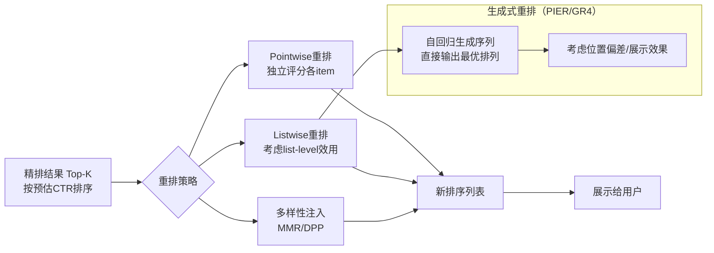

# 推荐系统重排与多样性：从 MMR 到 DPP 到上下文感知

> 📚 参考文献
> - [A Generative Re-Ranking Model For List-Level Multi](../papers/A_Generative_Re_ranking_Model_for_List_level_Multi_object.md) — A Generative Re-ranking Model for List-level Multi-object...
> - [Spotify Unified Lm Search Rec](../../04_multi-task/papers/A_Unified_Language_Model_for_Large_Scale_Search_Recommend.md) — A Unified Language Model for Large Scale Search, Recommen...
> - [Multi-Behavior-Rec-Survey](../../04_multi-task/papers/Multi_behavior_Recommender_Systems_A_Survey.md) — Multi-behavior Recommender Systems: A Survey
> - [Pantheon Personalized Multi-Objective Ensemble Sor](../papers/Pantheon_Personalized_Multi_objective_Ensemble_Sort_via_I.md) — Pantheon: Personalized Multi-objective Ensemble Sort via ...
> - [Gems-Breaking-The-Long-Sequence-Barrier-In-Gene...](../../01_recall/papers/GEMs_Breaking_the_Long_Sequence_Barrier_in_Generative_Rec.md) — GEMs: Breaking the Long-Sequence Barrier in Generative Re...
> - [A-Unified-Language-Model-For-Large-Scale-Search...](../../04_multi-task/papers/A_Unified_Language_Model_for_Large_Scale_Search_Recommend.md) — A Unified Language Model for Large Scale Search, Recommen...

> 创建：2026-03-24 | 领域：推荐系统 | 类型：综合分析
> 来源：MMR, DPP, PRM, Elasticity Framework, 工业实践系列

## 架构总览



## 📐 核心公式与原理

### 📐 1. MMR（Maximal Marginal Relevance）推导

MMR 是迭代式贪心重排，每步选择"最相关且与已选集合最不相似"的物品：

$$
\text{MMR} = \arg\max_{d_i \in R \setminus S} \left[\lambda \cdot \text{Rel}(d_i, q) - (1-\lambda) \cdot \max_{d_j \in S} \text{Sim}(d_i, d_j)\right]
$$

**推导步骤：**

1. **目标分解**：最大化两个互相矛盾的目标——相关性（$\text{Rel}(d_i, q)$，越大越好）和多样性（$\max_{d_j \in S}\text{Sim}(d_i, d_j)$，越小越好）

2. **迭代贪心选择**：初始集合 $S = \emptyset$，候选集 $R$（精排后 Top-K）；每轮将 MMR 分最高的物品从 $R$ 移入 $S$，直到选满 $N$ 个

3. **参数 $\lambda$**：$\lambda=1$ 退化为纯相关性排序（无多样性）；$\lambda=0$ 退化为纯多样性最大化（无相关性）；通常 $\lambda \in [0.5, 0.8]$

4. **Sim 的计算**：在推荐中通常用物品 Embedding 的余弦相似度：$\text{Sim}(d_i, d_j) = \frac{\mathbf{e}_i^\top \mathbf{e}_j}{\|\mathbf{e}_i\| \|\mathbf{e}_j\|}$

5. **复杂度**：每轮遍历 $|R \setminus S|$ 个物品，总复杂度 $O(N \cdot |R|)$，适合 $|R| < 1000$ 的重排场景

**符号说明：**

| 符号 | 含义 |
|------|------|
| $R$ | 候选集合（精排后 Top-K 物品）|
| $S$ | 已选集合（当前已加入重排结果的物品）|
| $\text{Rel}(d_i, q)$ | 物品 $d_i$ 对用户 $q$ 的相关性分数（精排分）|
| $\text{Sim}(d_i, d_j)$ | 物品 $d_i$ 和 $d_j$ 之间的相似度（通常为余弦相似度）|
| $\lambda$ | 相关性与多样性的权衡系数 |

**直观理解：** MMR 就是"不要选和已选物品太像的"——每次选的物品既要和用户查询相关，又要和"篮子里已有的"不重复。是一种带回顾的贪心选择，比纯贪心相关性排序多样性更好，比全局 DPP 计算更简单。

---

### 📐 2. DPP（Determinantal Point Process）推导

DPP 对集合 $Y \subseteq \mathcal{I}$ 的概率定义为：

$$
P_L(Y) \propto \det(L_Y)
$$

其中 $L$ 是半正定核矩阵，$L_Y$ 是 $Y$ 对应的子矩阵（$|Y| \times |Y|$）。

**质量-多样性分解（推荐中最常用）：**

$$
L_{ij} = q_i q_j \cdot \phi_i^\top \phi_j
$$

其中 $q_i$ 是物品 $i$ 的相关性分数（质量），$\phi_i \in \mathbb{R}^D$ 是归一化的多样性向量（如类目 Embedding）。

**推导步骤（行列式的几何意义）：**

1. **$\det(L_Y)$ 的几何含义**：等于 $Y$ 中所有物品向量在 $\mathbb{R}^D$ 中张成的超平行体积的平方，体积越大 = 物品越多样（互相正交时最大）

2. **质量-多样性分解**：令 $L_{ij} = q_i q_j \phi_i^\top \phi_j$，则：

$$
\det(L_Y) = \left(\prod_{i \in Y} q_i\right)^2 \cdot \det(\Phi_Y^\top \Phi_Y)
$$

   其中 $\Phi_Y$ 是 $Y$ 中物品的特征矩阵，第二项即多样性项（特征向量张成的体积平方）

3. **$\det(\Phi_Y^\top \Phi_Y)$ 的计算**：对 $N$ 个物品的子集，需要计算 $N \times N$ 行列式，$O(N^3)$。工业实现通常用 Fast Greedy MAP Inference（贪心近似），复杂度降至 $O(N^2 k)$

4. **与 MMR 的比较**：MMR 是贪心一阶近似，DPP 考虑全集合的联合多样性（$N$ 阶）；DPP 理论上最优但计算复杂，MMR 简单但次优。

**符号说明：**
- $L \in \mathbb{R}^{|\mathcal{I}| \times |\mathcal{I}|}$：物品集合上的 DPP 核矩阵（半正定）
- $q_i$：物品 $i$ 的质量/相关性分数（标量）
- $\phi_i \in \mathbb{R}^D$：物品 $i$ 的归一化多样性特征向量（$\|\phi_i\|=1$）
- $\det(L_Y)$：子集 $Y$ 的行列式，正比于选择该子集的概率

**直观理解：** DPP 把"选一个集合"的概率定义为该集合物品向量在空间中"撑开的体积"——向量越分散（多样）、越长（相关），体积越大，概率越高。和 MMR 一样追求多样性，但用行列式一次性考虑所有物品的联合关系，而非逐步贪心。

---

### 3. 序列推荐

$$
P(i_{t+1} | i_1, ..., i_t) = \text{softmax}(h_t^T E)
$$

- 基于历史序列预测下一次交互

---

## 🎯 核心洞察（4条）

1. **重排是推荐系统的"最后一公里"**：精排给出分数，重排考虑列表级别的多样性、新颖性、业务规则，是用户实际看到的排序
2. **MMR 是最实用的多样性方法**：`MMR(i) = α×Rel(i) - (1-α)×max_j Sim(i,j)`，贪心选择"最相关但与已选结果最不同"的物品，实现简单且效果稳定
3. **DPP（行列式点过程）理论最优但实践困难**：DPP 用核矩阵建模物品间的质量和多样性，MAP 推断是 NP-hard，通常用贪心近似
4. **多样性和准确性是永恒的 trade-off**：过度多样化导致推荐不精准，过度精准导致信息茧房。Elasticity 框架量化每个物品"让步多样性"的代价

---

## 📈 技术演进脉络

```
规则去重（2010s）→ MMR 贪心多样性（2015-2018）→ DPP 理论建模（2018-2020）
  → 上下文感知重排 PRM（2020-2022）→ 强化学习重排（2023-2025）
```

---

## 🎓 常见考点（5条）

### Q1: 重排层的作用和常见方法？
**30秒答案**：重排在精排分数基础上考虑列表级因素：①多样性（MMR/DPP，避免相似物品扎堆）；②新颖性（降权已曝光物品）；③业务规则（品牌打散、广告插入位）；④上下文（考虑位置间的相互影响）。

### Q2: MMR 的 α 参数怎么调？
**30秒答案**：α 控制相关性 vs 多样性的平衡。α=1 完全按相关性排序（无多样性），α=0.5 平衡两者。实践中通过 A/B Test 找最优 α，通常 0.5-0.7。
**追问方向**：不同位置用不同 α 可以吗？答：可以，前几位偏重相关性（用户第一眼要看到最好的），后面增大多样性。

### Q3: DPP 的核心思想？
**30秒答案**：DPP 用核矩阵 L 建模：对角线是物品质量分数，非对角线是物品间相似度。采样概率正比于子集对应的行列式值——det(L_S) 在物品质量高且互不相似时最大。
**追问方向**：DPP 为什么工业用的少？答：精确 MAP 推断是 NP-hard，贪心近似效果和 MMR 差不多但实现更复杂。

### Q4: 上下文感知重排（PRM）怎么做？
**30秒答案**：PRM 将整个候选列表作为输入，用 Transformer 建模物品之间的相互影响（"如果位置 1 是衣服，位置 2 放裤子比放另一件衣服好"），输出每个位置的最终得分。

### Q5: 信息茧房怎么度量和打破？
**30秒答案**：度量——覆盖率（推荐覆盖了多少比例的物品库）、基尼系数（推荐的不均匀程度）、ILS（Intra-List Similarity，列表内相似度）。打破——重排注入多样性 + 探索流量 + 兴趣扩展策略。

---

### Q6: 推荐系统的实时性如何保证？
**30秒答案**：①用户特征实时更新（Flink 流处理）；②模型增量更新（FTRL/天级重训）；③索引实时更新（新物品上架）；④特征缓存+预计算降低延迟。

### Q7: 推荐系统的 position bias 怎么处理？
**30秒答案**：训练时：①加 position feature 推理时固定；②IPW 加权；③PAL 分解 P(click)=P(examine)×P(relevant)。推理时：设置固定 position 或用 PAL 只取 P(relevant)。

### Q8: 工业推荐系统和学术研究的差距？
**30秒答案**：①规模（亿级 vs 百万级）；②指标（商业指标 vs AUC/NDCG）；③延迟（<100ms vs 不关心）；④迭代（A/B 测试 vs 离线评估）；⑤工程（特征系统/模型服务 vs 单机实验）。

### Q9: 推荐系统面试中设计题怎么答？
**30秒答案**：按层回答：①明确场景和指标→②召回策略（多路）→③排序模型（DIN/多目标）→④重排（多样性）→⑤在线实验（A/B）→⑥工程架构（特征/模型/日志）。

### Q10: 2024-2025 推荐技术趋势？
**30秒答案**：①生成式推荐（Semantic ID+自回归）；②LLM 增强（特征/数据增广/蒸馏）；③Scaling Law（Wukong）；④端到端（OneRec 统一召排）；⑤多模态（视频/图文理解）。
## 🌐 知识体系连接

- **上游依赖**：精排模型输出、物品相似度计算
- **下游应用**：用户体验、长期留存、内容生态健康
- **相关 synthesis**：推荐系统排序范式演进.md, 多目标优化统一框架.md
- **相关论文笔记**：rec-sys/重排与多样性.md
