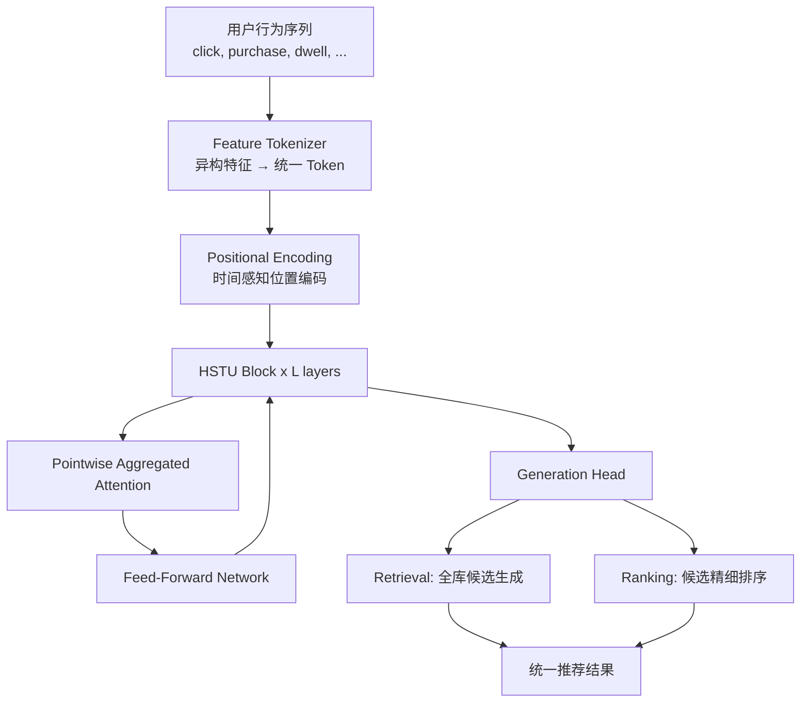

# Actions Speak Louder than Words: Trillion-Parameter Sequential Transducers for Generative Recommendations (HSTU)

> 来源：https://arxiv.org/abs/2402.17152 | 领域：rec-sys | 学习日期：20260403

## 问题定义

传统推荐系统采用多阶段 pipeline（召回 -> 粗排 -> 精排 -> 重排），每个阶段独立建模，信息在阶段间传递时存在损失。同时，推荐领域的模型规模远落后于 NLP/CV 领域，主要原因在于推荐数据的异构性（heterogeneous features）和稀疏性使得简单的 Transformer 架构难以直接套用。

Meta 提出 HSTU（Hierarchical Sequential Transduction Unit），核心思路是将推荐问题重新定义为序列生成问题：用户的历史行为（点击、购买、停留等）构成输入序列，模型通过自回归方式生成下一步推荐。论文验证了推荐系统中类似 LLM 的 scaling law 存在性，并在万亿参数规模下实现了工业级部署。

该工作的核心贡献在于：(1) 统一召回与排序为单一生成式模型；(2) 首次在推荐领域验证 scaling law；(3) 设计了适配推荐场景的高效注意力机制。

## 核心方法与创新点

HSTU 的核心架构基于 Transformer，但针对推荐场景做了关键改造。与标准 Transformer 不同，HSTU 将用户行为序列中的每个 action 编码为 token，其中每个 token 由多个异构特征（item ID、action type、timestamp 等）组合而成。

**Pointwise Aggregated Attention**：HSTU 采用了一种无 softmax 的注意力机制来提升计算效率：

$$\text{Attn}(Q, K, V) = \text{normalize}\left(\text{ReLU}(QK^T) \odot M\right) V$$

其中 $M$ 是因果掩码矩阵，$\odot$ 表示逐元素乘法。去掉 softmax 使得注意力计算可以利用更高效的核函数实现，在长序列（数千个 action）场景下显著降低延迟。

**Scaling Law 验证**：论文发现推荐模型的性能随参数量和数据量的增长遵循幂律关系：

$$L(N, D) = \alpha N^{-\beta} + \gamma D^{-\delta} + \epsilon$$

其中 $N$ 为模型参数量，$D$ 为训练数据量，$\alpha, \beta, \gamma, \delta, \epsilon$ 为拟合常数。这一发现意味着推荐模型可以像 LLM 一样通过持续扩大规模来提升效果。

**架构特点**：
- 输入层：将异构特征通过 embedding lookup + projection 统一为固定维度的 token 表示
- 序列编码：多层 HSTU block，每层包含 aggregated attention + FFN
- 输出层：自回归生成下一个 action 的概率分布
- 因果注意力掩码确保模型只能看到历史信息

**与标准 Transformer 的关键差异**：
- 去除 LayerNorm：推荐场景中 token 表示的分布与自然语言不同，HSTU 发现去除 LayerNorm 反而更好
- 相对时间编码：不使用绝对位置编码，而是基于 action 之间的时间间隔做相对编码，更适合用户行为的不规则时间分布
- 多类型 action 融合：同一个 attention 层处理不同类型的 action（click、purchase、dwell），通过 action type embedding 区分

## 系统架构

## 实验结论

- **离线实验**：在 Meta 内部数据集上，HSTU 相比传统 DLRM 模型在 Recall@K 上提升 12.4%，NDCG 提升 17.7%。
- **Scaling 验证**：模型从 1.5B 参数扩展到 1.5T 参数，性能持续提升且未出现饱和迹象。
- **在线 A/B 测试**：在 Meta 多个产品线（Facebook, Instagram）上线后，核心业务指标（engagement）获得显著提升。
- **延迟优化**：通过 pointwise aggregated attention，推理延迟相比标准 Transformer 降低 3-5x，满足在线服务的 P99 延迟要求（<10ms）。
- **统一模型优势**：单一模型同时完成召回和排序，消除了多阶段 pipeline 的信息损失。

## 工程落地要点

1. **特征工程简化**：HSTU 将传统的手工特征工程替换为端到端学习，但仍需要精心设计 action tokenization 策略（如何将不同类型的行为编码为 token）。
2. **序列长度管理**：工业场景中用户行为序列可达数千甚至数万，需要合理截断或采样策略。Meta 采用了基于时间衰减的采样。
3. **分布式训练**：万亿参数模型需要 model parallelism + data parallelism + pipeline parallelism 的混合并行策略。
4. **在线服务**：推理时使用 KV-cache 机制，新 action 到来时只需增量计算，避免全序列重新计算。
5. **冷启动处理**：对于新用户，可以使用 side information（demographics、device info）作为初始 token。
6. **渐进式迁移**：建议从排序阶段开始替换，验证效果后再扩展到召回，降低上线风险。

## 面试考点

1. **HSTU 为什么不用 softmax attention？** 因为推荐场景序列长、需要低延迟，pointwise aggregated attention 用 ReLU 替代 softmax 后可利用更高效的矩阵运算实现线性复杂度，同时在推荐任务上效果不降反升。
2. **推荐系统的 scaling law 和 LLM 的有什么区别？** 推荐的 scaling law 同样呈幂律关系，但推荐数据的异构性和稀疏性使得 scaling 的效率系数（$\beta, \delta$）不同，且推荐场景对延迟更敏感，限制了可部署的模型规模。
3. **HSTU 如何统一召回和排序？** 通过将两个任务都建模为序列生成——召回是从全库生成 top-K 候选（beam search），排序是对给定候选计算生成概率（likelihood scoring），共享同一个模型参数。
4. **生成式推荐相比传统 embedding-based 召回的优势是什么？** 生成式方法能捕捉用户行为序列中的高阶依赖关系和时序模式，而传统双塔模型只能做 point-wise 的相似度匹配，丢失了序列信息。
5. **工业部署万亿参数推荐模型的主要挑战是什么？** 主要包括推理延迟（需要 <10ms）、内存占用（需要模型并行 + 量化）、特征实时性（需要流式更新用户序列）、以及 serving 成本（GPU 资源消耗巨大，需要精细的 batch 调度）。
